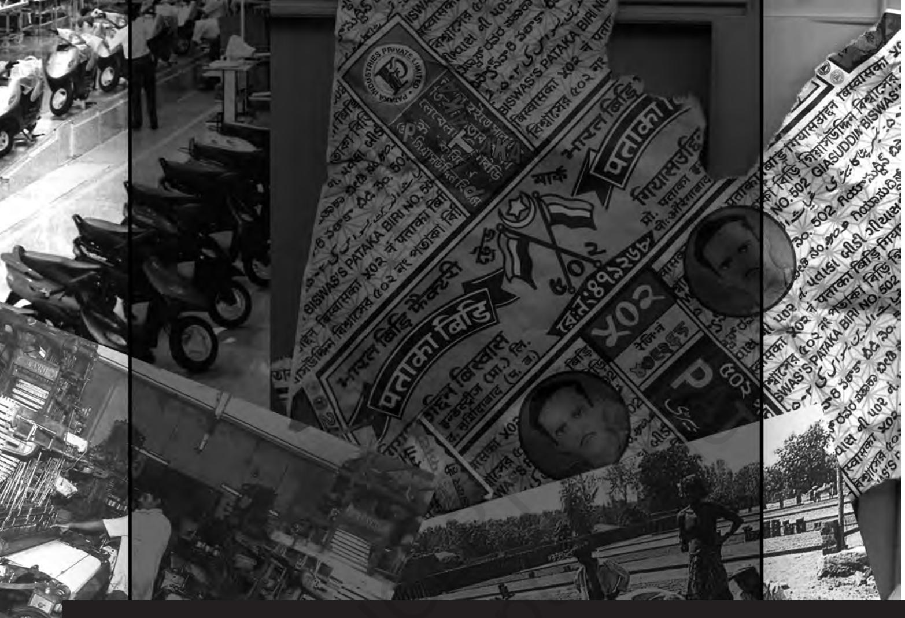
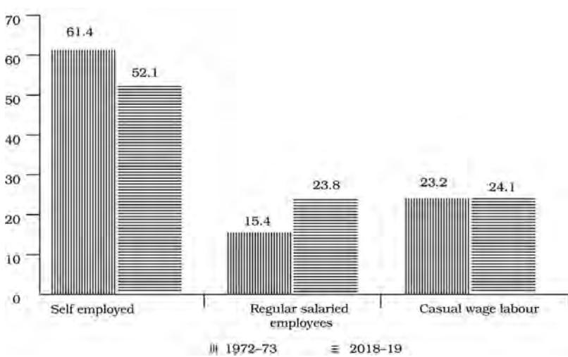
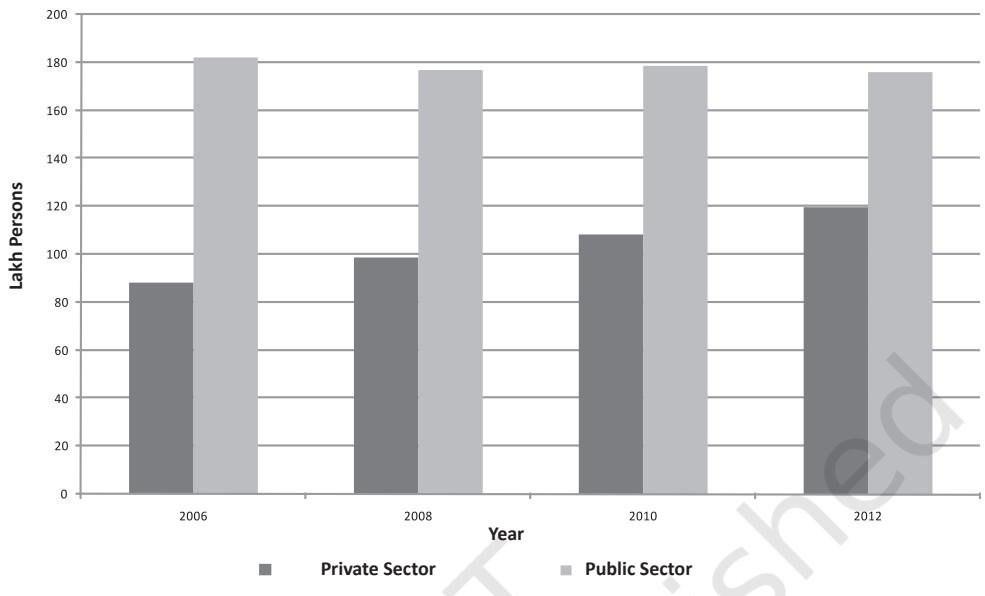
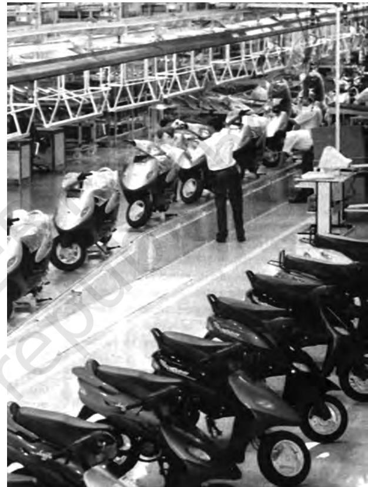
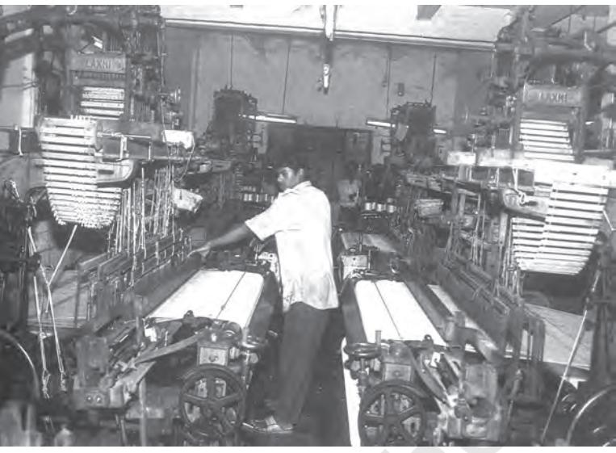
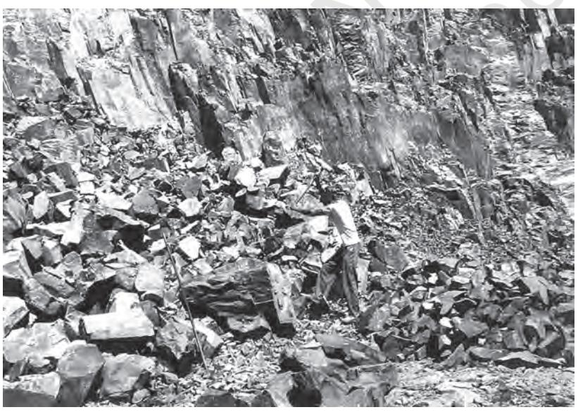

Chapter 5.indd 59 14 September 2022 12:04:14

*B*ollywood in Mumbai, Maharashtra may be a place of dreams for you and me, but for many, it is their place of work. Like any industry, the workers there are part of unions. For instance, the dancers, stunt artists and the extras are all part of a junior artists association, whose demands include 8 hours shifts, proper wages and safe working conditions. The products of this industry are advertised and marketed through film distributors and cinema hall owners or through shops in the form of music cassettes and videos. And the people who work in this industry, as in any other, live in the same city, but depending on who they are and how much they earn, they do very different things in that city. Film stars and textile mill owners live in places like Juhu, while extras and textile workers may live in places like Girangaon. Some go to five star hotels and eat Japanese sushi and some eat *vada pav* from the local handcart. The residents of Mumbai are divided by where they live, what they eat and how much their clothes cost. But they are also united by certain common things that a city provides – they watch the same films and cricket matches, they suffer from the same air pollution and they all have aspirations for their children to do well.

How and where people work and what kind of jobs they have is an important part of who they are. In this chapter, we will see how changes in technology or the kind of work that is available has changed social relations in India. On the other hand, social institutions like caste, kinship networks, gender and region also influence the way that work is organised or the way in which products are marketed. This is a major area of research for sociologists.

For instance, why do we find more women in certain jobs like nursing or teaching than in other sectors like engineering? Is this just a coincidence or is it because society thinks that women are suited for caring and nurturing work as against jobs which are seen as 'tough' and masculine? Yet nursing is physically much harder work than designing a bridge. If more women move into engineering, how will that affect the profession? Ask yourself why some coffee advertisements in India display two cups on the package whereas in America they show one cup? The answer is that for many Indians drinking coffee is not an individual wake up activity, but an occasion to socialise with others. Sociologists are interested in the questions of who produces what, who works where, who sells to whom and how. These are not individual choices, but outcomes of social patterns. In turn, the choices that people make influences how society works.

## 5.1 Images of Industrial Society

Many of the great works of sociology were written at a time when industrialisation was new and machinery was assuming great importance. Thinkers like Karl Marx, Max Weber and Emile Durkheim associated a number of social features with industry, such as urbanisation, the loss of face-to-face relationships that were found in rural areas where people worked on their own farms or

Chapter 5.indd 60 14 September 2022 12:04:15

for a landlord they knew, and their substitution by anonymous professional relationships in modern factories and workplaces. Industrialisation involves a detailed division of labour. People often do not see the end result of their work because they are producing only one small part of a product. The work is often repetitive and exhausting. Yet, even this is better than having no work at all, i.e., being unemployed. Marx called this situation alienation, when people do not enjoy work, and see it as something they have to do only in order to survive, and even that survival depends on whether the technology has room for any human labour.

Industrialisation leads to greater equality, at least in some spheres. For example, caste distinctions do not matter any more on trains, buses or in cyber cafes. On the other hand, older forms of discrimination may persist even in new factory or workplace settings.

#### **Activity 5.1**

According to the **convergence thesis** put forward by modernisation theorist Clark Kerr, an industrialised India of the 21st century shares more features with China or the United States in the 21st century than it shares with 19th century India. Do you think this is true? Do culture, language and tradition disappear with new technology or does culture influence the way people adapt to new products? Write a page of your own reflections on these issues, giving examples.

And even as social inequalities are reducing, economic or income inequality is growing in the world. Often social inequality and income inequality overlap, for example, in the domination of upper caste men in well-paying professions like medicine, law or journalism. Women often get paid less than men for similar work.

## 5.2 Industrialisation in India

#### **The Specificity of Indian Industrialisation**

The experience of industrialisation in India is in many ways similar to the western model and in many ways different. Comparative analysis of different countries suggests that there is no standard model of industrial capitalism. Let us start with one point of difference, relating to what kind of work people are doing. In developed countries, the majority of people are in the services sector, followed by industry and less than 10% are in agriculture (ILO figures). In India, in 2018–19, nearly 43% were employed in the primary sector (agriculture and mining), 17% in the secondary sector (manufacturing, construction and utilities), and 32% in the tertiary sector (trade, transport, financial services, etc.) However, if we look at the contribution of these sectors to economic growth, the share of agriculture has declined sharply, and services contribute approximately more than half. This is a very serious situation because it means that the sector where the maximum people are employed is not able to generate much income for them. In India, in 2018–19 the share of employment in agriculture was 42.5%, in mining and quarrying 0.4%, in manufacturing it was 12.1%, in trade, hotel and restaurant it was 12.6%, in transport, storage, communication it was 5.9%, in community, social and personal services it was 13.8%.

Chapter 5.indd 61 14 September 2022 12:04:15

**Distribution of workers in India by employment status, 1972–2019**

Another major difference between developing and developed countries is the number of people in regular salaried employment. In developed countries, the majority are formally employed. In India, over 52% of the workers are selfemployed, only about 24% are in regular salaried employment, while approximately 24% are in casual labour. The adjacent chart shows the changes between 1972–73 and 2018–2019.

Economists and others often

make a distinction between the organised or formal and unorganised or informal sector. There is a debate over how to define these sectors. According to one definition, the organised sector consists of all units employing ten or more people throughout the year. These have to be registered with the government to ensure that their employees get proper salaries or wages, pension and other benefits. In India, over 90% of the work, whether it is in agriculture, industry or services is in the unorganised or informal sector. What are the social implications of this small size of the organised sector?

First, it means that very few people have the experience of employment in large firms where they get to meet people from other regions and backgrounds. Urban settings do provide some corrective to this – your neighbours in a city may be from a different place – but by and large, work for most Indians is still in smallscale workplaces. Here personal relationships determine many aspects of work. If the employer likes you, you may get a salary raise, and if you have a fight with him or her, you may lose your job. This is different from a large organisation with well-defined rules, where recruitment is more transparent and there are mechanisms for complaints and redressal if you disagree with your immediate superior. Second, very few Indians have access to secure jobs with benefits. Of those who do, two-thirds work for the government. This is why people strive hard to get into government jobs. The rest are forced to depend on their children in their old age. Government employment in India has played a major role in overcoming boundaries of caste, religion and region. One sociologist has argued that the reason why there have never been communal riots in a place like Bhilai is because the public sector Bhilai Steel Plant employs people from all over India who work together. Others may question this. Third, since very few people are members of unions, a feature of the organised sector, the unorganised or informal sector workers do not have the experience of collectively fighting for proper wages and safe working conditions. The government has laws to monitor conditions in the unorganised sector, but in practice they are left to the whims and fancies of the employer or contractor.

**62**

Chapter 5.indd 62 14 September 2022 12:04:15

#### **Globalisation, Liberalisation and Changes in Indian Industry**

Since the 1990s, the government has followed a policy of liberalisation. Private companies, especially foreign firms, are encouraged to invest in sectors earlier reserved for the government, including telecom, civil aviation, power, etc. Licenses are no longer required to open industries. Foreign products are now easily available in Indian shops. As a result of liberalisation, many Indian companies small and large, have been bought over by multinationals. At the same time some Indian companies are becoming multinational companies. An instance of the first is when, Parle drinks was bought by Coca Cola. Parle's annual turnover was ` 250 crores, while Coca Cola's advertising budget alone was ` 400 crores. This level of advertising has naturally increased the consumption of coke across India replacing many traditional drinks. The next major area of liberalisation is in retail. Do you think that Indians will prefer to shop in grocery stores, small textile shops in your neighbourhood or in small towns, departmental stores, or will they go out of business?

The government is trying to sell its share in several public sector companies, a process which is known as disinvestment. Many government workers are scared that after disinvestment, they will lose their jobs. In 'Modern Foods', which was set up by the government to make healthy bread available at cheap prices, and which was the first company to be privatised, 60% of the workers were forced to retire in the first five years.

More and more companies are reducing the number of permanent employees and outsourcing their work to smaller companies or even to homes. For multinational companies, this outsourcing is done across the globe, with developing countries like India providing cheap labour. Because small companies have to compete for orders from the big companies, they keep wages low, and working conditions are often poor. It is more difficult for trade unions to organise in smaller firms. Almost all companies, even government ones, now practice some form of outsourcing and contracting. But the trend is especially visible in the private sector.

To summarise, India is still largely an agricultural country. The service sector – shops, banks, the IT industry, hotels and other services are employing more people and the urban middle class is growing, along with urban middle class values like those we see in television serials and films. But we also see that very few people in India have access to secure jobs, with even the small number in regular salaried employment becoming more insecure due to the rise in contract labour. So far, employment by the government was a major avenue for increasing the well-being of the population, but now even that is coming down. Some economists debate this, but liberalisation and privatisation worldwide appear to be associated with rising income inequality. You will be reading more about this in the next chapter on globalisation.

At the same time as secure employment in large industry is declining, the government is embarking on a policy of land acquisition for industry.

Chapter 5.indd 63 14 September 2022 12:04:15

These industries do not necessarily provide employment to the people of the surrounding areas, but they cause major pollution. Many farmers, especially adivasis, who constitute approximately 40% of those displaced, are protesting at the low rates of compensation and the fact that they will be forced to become casual labour living and working on the footpaths of India's big cities. You will recall the discussion on competing interests from Chapter 3.

In the following sections, we will look at how people find work, what they actually do in their workplaces and what kind of working conditions they face.

## 5.3 How People Find Jobs

Only a small percentage of people get jobs through advertisements or through the employment exchange. People who are self-employed, like plumbers, electricians and carpenters at one end and teachers who give private tuitions, architects and freelance photographers at the other end, all rely on personal contacts. They hope that their work will be an advertisement for them. Mobile phones have made life much easier for plumbers and others who can now cater to a wider circle of people.

Job recruitment as a factory worker takes a different pattern. In the past, many workers got their jobs through contractors or jobbers. In the Kanpur textile mills, these jobbers were known as *mistris*, and were themselves workers. They came from the same regions and communities as the workers, but because they had the owner's backing they bossed over the workers. On the other hand,

Chapter 5.indd 64 14 September 2022 12:04:15

the *mistri* also put community-related pressures on the worker. Nowadays, the importance of the jobber has come down, and both management and unions play a role in recruiting their own people. Many workers also expect that they can pass on their jobs to their children. Many factories employ *badli* workers who substitute for regular permanent workers who are on leave. Many of these *badli* workers have actually worked for many years for the same company but are not given the same status and security. This is what is called contract work in the organised sector. Employment opportunities have two important components:

- (i) job in an organisation as a casual wage labourer or regular salaried
- (ii) Self-employment

Recently the Government of India floated many schemes, such as 'MUDRA', '*Aatmanirbhar Bharat*' and 'Make in India' in order to generate employment and self-employment to support all sections including the marginalised section of the society, like SC, ST and other backward classes. These are positive signs for creating economic potential amongst the demographic dividend of India.

However, the contractor system is most visible in the hiring of casual labour for work at construction sites, brickyards, and so on. The contractor goes to villages and asks if people want work. He will loan them some money. This loan includes the cost of transport to the work site. The loaned money is treated as an advance wage and the worker works without wages until the loan is repaid. In the past, agricultural labourers were tied to their landlord by debt. Now, however, by moving to casual industrial work, while they are still in debt, they are not bound by other social obligations to the contractor. In that sense, they are more free in an industrial society. They can break the contract and find another employer. Sometimes, whole families migrate and the children help their parents.

# 5.4 How is work carried out?

In this section, we will explore how work actually takes place. How are all the products we see around us manufactured? What is the relationship between managers and workers in a factory or in an office? In India, there is a whole range of work settings from large companies where work is automated to small home-based production.

The basic task of a manager is to control workers and get more work out of them. There are two main ways of making workers produce more. One is to extend the working hours. The other is to increase the amount that is produced within a given time period. Machinery helps to increase production, but it also creates the danger that eventually machines will replace workers. Both Marx and Mahatma Gandhi saw mechanisation as a danger to employment.

Chapter 5.indd 65 14 September 2022 12:04:15

Workers in textile mills, which is one of the oldest industries in India, often described themselves as extensions of the machine. Ramcharan, a weaver who had worked in the Kanpur cotton mills since the 1940s, said:

> You need energy. The eyes move, the neck, the legs and the hands, each part moves. Weaving is done under a continuous gaze - one cannot go anywhere, the focus must be on the machine. When four machines run all four must move together, they must not stop. *(Joshi 2003)*

### **Activity 5.2**

Gandhi on Machinery, in *Hind Swaraj* 1924: "What I object to is the craze for machinery, not machinery as such. The craze is for what they call laboursaving machinery. Men go on 'saving labour' till thousands are without work and thrown on the open streets to die of starvation. I want to save time and labour, not for a fraction of mankind, but for all. I want the concentration of wealth, not in the hands of the few, but in the hands of all."

1934: "When as a nation we adopt the spinningwheel, we not only solve the question of unemployment but we declare that we have no intention of exploiting any nation, and we also end the exploitation of the poor by the rich."

Give an example of how machinery creates a problem for workers. What alternative did Gandhi have in mind? How does adopting the spinning wheel prevent exploitation?

The more mechanised an industry gets, the fewer people are employed, but they too have to work at the pace of the machine. In Maruti Udyog Ltd., two cars roll off the assembly line every minute. Workers get only 45 minutes rest in the entire day - two tea breaks of 7.5 minutes each and one lunch break of half an hour. Most of them are exhausted by the age of 40 and take voluntary retirement. While production has gone up, the number of permanent jobs in the factory has gone down. The firm has outsourced all services like cleaning, and security, as well as the manufacture of parts. The parts suppliers are located around the factory and send the parts every two hours or just-in-time. Outsourcing and just-in-time keeps costs low for the company, but the workers are very tense, because if the supplies fail to arrive, their production targets get delayed, and when they do arrive they have to run to keep up. No wonder they get exhausted.

Chapter 5.indd 66 14 September 2022 12:04:15

Now let us look at the services sector. Software professionals are middle class and well educated. Their work is supposed to be selfmotivated and creative. But, as we see from the box, their work is also subject to Taylorist labour processes.

As a result of these working hours, in places like Bengaluru, Hyderabad and Gurugram, where many IT firms or call centres are located, shops and restaurants have also changed their opening hours, and are open late. If both husband and wife work, then children have to

be put in crèches. The joint family, which was supposed to have disappeared with industrialisation, seems to have re-emerged, as grandparents are roped in to help with children.

#### **'Time Slavery' in the IT Sector**

An average work day has 10–12 hours and it is not uncommon for employees to stay overnight in the office (known as a 'night out'), when faced with a project deadline. Long working hours are central to the industry's 'work culture'. In part, this is due to the time difference between India and the client site, such that conference calls tend to take place in the evening when the working day in the U.S. begins. Another reason is that overwork is built into the structure of outsourced projects: project costs and timelines are usually underestimated in terms of mandays, and because mandays are based on an eight-hour day, engineers have to put in extra hours and days in order to meet the deadlines. Extended working hours are legitimised by the common management practice of 'flexi-time', which in theory gives an employee freedom to choose his or her working hours (within limits) but, which in practice, means that they have to work as long as necessary to finish the task at hand. But even when there is no real work pressure, they tend to stay late in office either due to peer pressure or because they want to show the boss that they are working hard.

*(Carol Upadhya, 2005)*

One important debate in sociology is whether industrialisation and the shift to services and knowledge-based work, like IT, leads to greater skills in society. We often hear the phrase 'knowledge economy' to describe the growth of IT sector in India. But how do you compare the skills of a farmer who knows how to grow many hundreds of crops relying on his or her understanding of the weather, the soil and the seeds, with the knowledge of a software professional? Both are skilled but in different ways. The famous sociologist, Harry Braverman, argues that the use of machinery actually deskills workers. For example, whereas earlier architects and engineers had to be skilled draughtsmen, now the computer does a lot of the work for them.

Chapter 5.indd 67 19/03/2024 11:17:31

# 5.5 Working conditions

We all want power, a solid house, clothes and other goods, but we should remember that these come to us because someone is working to produce them, often in very bad working conditions. The government has passed a number of laws to regulate working conditions. Let us look at mining, where a number of people are employed. Coal mines alone employ 5.5 lakh workers. The Mines Act 1952, which has now been included in the Occupational Safety, Health and Working Condition Code, 2020, specifies the maximum number of hours a person can be made to work in a week, the need to pay overtime for any extra hours worked and safety rules. These rules may be followed in big companies, but not in smaller mines and quarries. Moreover, sub-contracting is widespread. Many contractors do not maintain proper registers of workers, thus avoiding any responsibility for accidents and benefits. After mining has been finished in an area, the company is supposed to cover up the open holes and restore the area to its earlier condition. But they don't do this.

Workers in underground mines face very dangerous conditions, due to flooding, fire, the collapse of roofs and sides, the emission of gases and ventilation failures. Many workers develop breathing problems and diseases like tuberculosis and silicosis. Those working in overground mines have to work in both hot sun and rain, and face injuries due to mine blasting, falling objects, etc. The rate of mining accidents in India is very high compared to other countries.

In many industries, the workers are migrants. The fish processing plants along the coastline employ mostly single young women from Tamil Nadu, Karnataka and Kerala. Tentwelve of them are housed in small rooms, and sometimes one shift has to make way for another. Young women are seen as submissive workers. Many men also migrate singly, either unmarried or leaving their families in the village. These migrants have little time to socialise and whatever little time and money they can spend is with other migrant workers.

**68**

From a nation of interfering joint families, the nature of work in a globalised economy is taking people in the direction of loneliness and vulnerability. Yet for many young women, it also represents some independence and economic autonomy.

Chapter 5.indd 68 13/03/2024 11:29:24

# 5.6 Home-based work

Home-based work is an important part of the economy. This includes the manufacture of lace, zari or brocade, carpets, bidis, agarbattis and many such products. This work is mainly done by women and children. An agent provides raw materials and also picks up the finished product. Home workers are paid on a piece-rate basis, depending on the number of pieces they make.

Let us look at the bidi industry. The process of making bidis starts in forested villages where villagers pluck *tendu* leaves and sell it to the forest department or a private contractor who in turn sells it to the forest department. On average a person can collect 100 bundles (of 50 leaves each) a day. The government then auctions the leaves to bidi factory owners who give it to the contractors. The contractor in turn supplies tobacco and leaves to home-based

workers. These workers, mostly women, roll the bidis – first dampening the leaves, then cutting them, filling in tobacco evenly and then tying them with thread. The contractor picks up these bidis and sells them to the manufacturer who roasts them, and puts on his own brand label. The manufacturer then sells them to a distributor who distributes the packed bidis to wholesalers who in turn sell to your neighbourhood pan shops.

#### **Activity 5.3**

During 2020–21, due to the COVID-19 pandemic, hundreds and thousands of IT sector workers worked from home. Find out the differences and commonalities between home-based work and those who work from home.

## 5.7 Strikes and unions

In response to harsh working conditions, sometimes workers went on strike. In a strike, workers do not go to work. In a lockout, the management shuts the gate and prevents workers from coming. To call a strike is a difficult decision as managers may try to use substitute labour. Workers also find it hard to sustain themselves without wages.

Let us look at one famous strike, the Bombay Textile strike of 1982, which was led by the trade union leader, Dr. Datta Samant, and affected nearly a quarter of a million workers and their families. The strike lasted nearly two years. The workers wanted better wages and also wanted the right to form their own union. Slowly after two years, people started going back to work because they were desperate. Nearly one lakh workers lost their jobs and went back to their villages, or took up casual labour, others moved to smaller towns, like Bhiwandi, Malegaon and Icchalkaranji, to work in the powerloom sector. Mill owners did not invest in machinery and modernisation. Today, they are trying to sell off the mill land to real estate dealers to build luxury apartments, leading to a battle over who will define the future of Mumbai – the workers who built it or the mill owners and real estate agents.

Chapter 5.indd 69 13/03/2024 11:44:15

- Questions
- 1. Choose any occupation you see around you and describe it along the following lines: a) social composition of the work force – caste, gender, age, region; b) labour process – how the work takes place, c) wages and other benefits, d) working conditions – safety, rest times, working hours, etc.
- 2. How has liberalisation affected employment patterns in India?

#### **references**

Anant, T.C.A. 2005. 'Labour Market Reforms in India: A Review'. In Bibek Debroy and P.D. Kaushik Eds. *Reforming the Labour Market*. pp. 235–252. Academic Foundation. New Delhi.

Bhandari, Laveesh. 'Economic Efficiency of Sub-contracted Home-based Work'. In Bibek Debroy and P.D. Kaushik Eds. *Reforming the Labour Market*. pp. 397–417. Academic Foundation. New Delhi.

Breman, Jan. 2004. The Making and Unmaking of an Industrial Working Class. Oxford University Press. New Delhi.

———. 1999. 'The Study of Industrial Labour in post-colonial India – The Formal Sector: An Introductory review'. *Contributions to Indian Sociology*. Vol. 33 (1&2), January–August 1999. pp. 1–42.

———. 1999. 'The Study of Industrial Labour in post-colonial India – The Informal Sector: A concluding review'. *Contributions to Indian Sociology*. Vol. 33 (1&2), January–August 1999. pp. 407–431.

Breman, Jan and Arvind, N. Das. 2000. *Down and Out: Labouring Under Global Capitalism*. Oxford University Press. Delhi.

Datar, Chhaya. 1990. 'Bidi Workers in Nipani'. In Illina Sen, *A Space within the Struggle*. pp. 1601–81. Kali for Women. New Delhi.

Gandhi, M.K. 1909. *Hind Swaraj and other writings*. Edited by Anthony J. Parel. Cambridge University Press. Cambridge.

George, Ajitha Susan. 2003. *Laws Related to Mining in Jharkhand*. Report for UNDP.

Holmstrom, Mark. 1984. *Industry and Inequality: The Social Anthropology of Indian Labour*. Cambridge University Press. Cambridge.

Joshi, Chitra. 2003. *Lost Worlds: Indian Labour and its Forgotten Histories Delhi*. Permanent Black. New Delhi.

Kerr, Clark et al. 1973. Industrialism and Industrial Man. Penguin. Harmondsworth.

Kumar, K. 1973. *Prophecy and Progress*. Allen Lane. London.

Menon, Meena and Neera, Adarkar. 2004. *One Hundred Years, One Hundred Voices: the Millworkers of Girangaon: An Oral History*. Seagull Press. Kolkata.

PUDR. 2001. *Hard Drive: Working Conditions and Workers Struggles at Maruti*. PUDR. Delhi.

Upadhya, Carol. 2005. Culture incorporated: control over work and workers in the Indian software outsourcing industry. Presented at International Conference on New Global Workforces and Virtual Workplaces: *Connections, Culture, and Control, National Institute of Advanced Studies,* Bangalore.

Chapter 5.indd 70 19/03/2024 11:19:20

