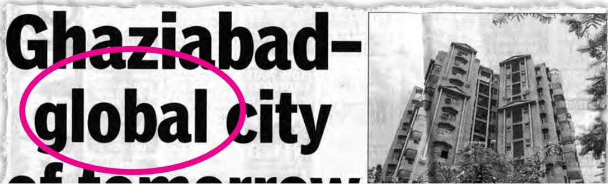
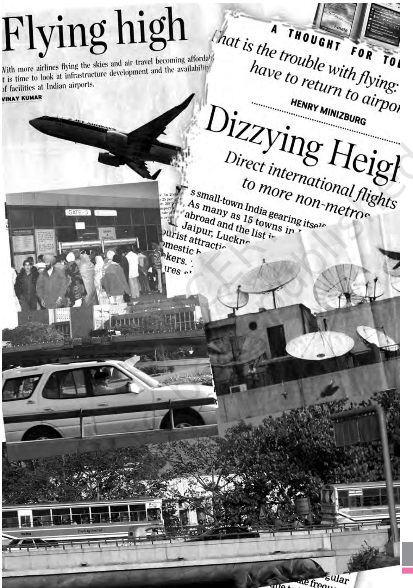
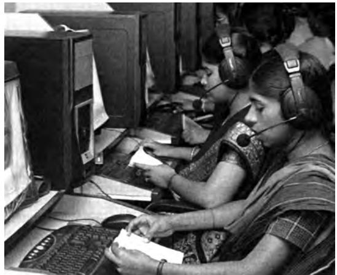
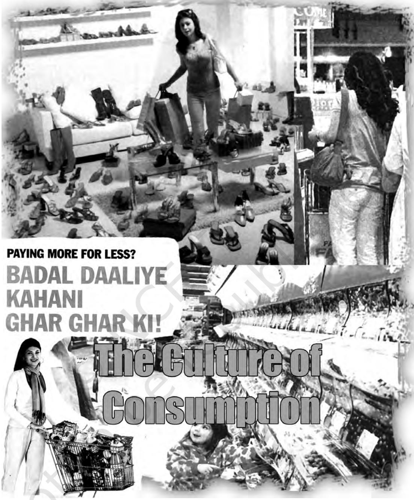

Chapter 6.indd 71 14 September 2022 12:04:33

Reprint 2024-25

*N*o discussion on social change in the twenty-first century can take place without some reference to globalisation. It is but natural that in this book on social change and development, the terms globalisation and liberalisation have already appeared in your earlier chapters. Recall the section on globalisation, liberalisation, and rural society in Chapter 4. Go back and read the section on the Indian government's policy of liberalisation and its impact on Indian industries in Chapter 5. It also came up when we discussed *Vision Mumbai* and the new visions for global cities in Chapter 3. Other than your school books, you must have come across the term globalisation in newspapers, television programmes or even in everyday conversation.

**Activity 6.1**

Read any newspaper regularly for two weeks and note down how the term 'globalisation' is used. Compare your notes with others in the class.

Note down references to the term 'globalisation' and 'global' in different kinds of television programmes. You can focus on news and discussions on political or economic or cultural matters.

Chapter 6.indd 72 14 September 2022 12:04:34

Activity 6.1 will help you notice the various ways the term is used. But we still need to be clear about what exactly does the term means. In this chapter we seek to understand the meaning of globalisation, its different dimensions and their social consequences.

However, this does not mean that there can be only one definition of globalisation and only one way of understanding it. Indeed you will find that different subjects or academic disciplines may focus on different aspects of globalisation. Economics may be dealing more with the economic dimensions such as capital flows. Political science may focus on the changing role of governments. However, the very process of globalisation is so far-reaching that disciplines have to increasingly borrow from each other to understand both the causes and consequences of globalisation. Let us see how sociology seeks to understand globalisation.

What Sociology does is use the sociological imagination to make sense of the connections between the individual and society, the micro and the macro, the local and the global. How is the peasant affected in a remote village? How is s/he connected to global changes? How has it affected the chances of employment for the middle class? How has it affected the possibilities of big Indian corporations becoming transnational corporations? What does it mean to the neighbourhood grocer if the retail sector is opened up to big transnational companies? Why are there so many shopping malls in our cities and towns today? How has it changed the way young people spend their leisure time? These are just few examples of the wide ranging and different kinds of changes that globalisation is bringing about. You will find many more instances whereby global developments are affecting the lives of people. And thereby affecting the way sociology has to study society.

With the opening up of the market and removal of restrictions to the import of many products, we have many more products from different corners of the world in our neighbourhood shops. Since April 1, 2001, all types of quantitative restrictions (QR) on imports were withdrawn. It is no surprise now to find a Chinese pear, an Australian apple vying for attention in the local fruit stall. The neighbourhood store also has Australian orange juice and ready to fry chips in frozen packets. What we eat and drink at home with our family and friends slowly changes. The same set of policy changes affects consumers and producers differently. What may mean greater choices for the urban, affluent consumer may mean a crisis of livelihood for a farmer. These changes are personal because they affect individuals' lives and lifestyles. They are obviously also linked to public policies adopted by the government and its agreement with the World Trade Organisation (WTO). Likewise macro policy changes have meant that instead of one television channel we have literally scores today. The dramatic changes in the media are perhaps the most visible effect of globalisation. We will be discussing this in greater detail in the next chapter. These are just few random examples but they may help you to appreciate the close interconnection

Chapter 6.indd 73 14 September 2022 12:04:34

that exists between your personal lives and the apparently remote policies of globalisation. As mentioned earlier, the sociological imagination enables to make this connection between the micro and the macro, between the personal and public.

The sociologist or social anthropologist cannot study society as though it was an isolated entity. The compression of space and time has changed this. Sociologists have to study villages, families, movements, child rearing practices, work and leisure, bureaucratic organisations or castes taking this global interconnection into account. Studies will have to take into account the impact of WTO rules on agriculture and therefore on the farmer.

The effect of globalisation is far reaching. It affects us all but affects us differently. Thus, while for some it may mean new opportunities, for others the loss of livelihood. Women silk spinners and twisters of Bihar lost their jobs once the Chinese and Korean silk yarn entered the market. Weavers and consumers prefer this yarn as it is somewhat cheaper and has a shine. Similar displacements have come with the entry of large fishing vessels into Indian waters. These vessels take away the fish that used to be earlier collected by Indian fishing vessels. The livelihood of women fish sorters, dryers, vendors and net makers thereby get affected. In Gujarat, women gum collectors, who were picking from the '*julifera*' (Baval trees), lost their employment due to the import of cheaper gum from Sudan. In almost all cities of India, the rag pickers lost some of their employment due to import of waste paper from developed countries. We will see later in the chapter how traditional entertainers are affected.

It is obvious that globalisation is of great social significance. But as you saw its impact on different sections of society is very different. There are, therefore, sharply divided views about the impact of globalisation regarding its effect. Some believe that it is necessary to herald a better world. Others fear that the impact of globalisation on different sections of people is vastly different. They argue that while many in the more privileged section may benefit, the condition of a large section of the already excluded population worsens. There are yet others who argue that globalisation is not a new development at all. In the next two sections we look at these issues. We find out a bit more about the kind of global inter-connections that India had in the past. We also examine whether indeed globalisation has some distinctive features and if so what is it.

# 6.1 Are Global Interconnections New to World and to India

If globalisation is about global interconnections we can ask whether this is really a new phenomenon. Was India or the different parts of the world not interacting with each other in earlier times?

Chapter 6.indd 74 14 September 2022 12:04:34

# **The Early Years**

India was not isolated from the world even two thousand years ago. We have read in our history textbooks about the famous Silk route, which centuries ago connected India to the great civilisations, which existed in China, Persia, Egypt and Rome. We also know that throughout India's long past, people from different parts came here, sometimes as *traders*, sometimes as *conquerors*, sometimes as *migrants* in search of new lands and settled down here. In remote Indian villages often people 'recall' a time when their ancestors lived elsewhere, from where they came and settled down where they now live.

**Box 6.1**

It is interesting to note that the greatest grammarian in Sanskrit namely Panini, who systematised and transformed Sanskrit grammar and phonetics around the fourth century BCE, was of Afghan origin. …The seventh-century Chinese scholar Yi Jing learned his Sanskrit in Java (in the city of Shri Vijaya) on his way from China to India. The influence of interactions is well reflected in languages and vocabularies throughout Asia from Thailand to Malaya to Indo-China, Indonesia, the Philippines, Korea and Japan. … We can find a warning against isolationism in a parable about a well-frog- the 'kupamanduka' that persistently recurs in several old Sanskrit texts…The *kupamanduka* is a frog that lives its whole life within a well, knows nothing else, and is suspicious of everything outside it. It talks to no one, and argues with no one on anything. It merely harbours the deepest suspicion of the outside world. The scientific, cultural and economic history of the world would have been very limited indeed had we lived like well-frogs. *(Sen 2005: 84–86)*

Global interactions or even a global outlook are thus not novel developments unique to the modern period or unique to modern India.

# **Colonialism and the Global Connection**

We began our story of social and economic development in modern India from the colonial period. You will recall from Chapter 1 that modern capitalism had a global dimension from its very inception. Colonialism was part of the system that required new sources of capital, raw materials, energy, markets and a global network that sustained it. Often globalisation today identifies large-scale movement of people or *migration* as a defining feature. You know, however, that perhaps the greatest movement of people was the migration of European people who settled down in the Americas and Australia. You will remember how indentured labourers were taken away in ships from India to work in distant parts of Asia, Africa and Americas. And the slave trade that carted thousands of Africans away to distant shores.

# **Independent India and the World**

Independent India retained a *global outlook*. In many senses this was inherited from the Indian nationalist movement. Commitment to liberation struggles

Chapter 6.indd 75 14 September 2022 12:04:34

throughout the world, solidarity with people from different parts of the world was very much part of this vision. Many Indians travelled overseas for education and work. *Migration* was an ongoing process. Export and import of raw material, goods and technology was very much a part of the development since independence. Foreign firms did operate in India. So we need to ask ourselves whether the current process of change is radically different from anything we have seen in the past.

# 6.2 Understanding Globalisation

We have seen that India had significant links with the global world from very early times. We are also aware that western capitalism as it emerged in Europe was both built upon and maintained by global control over resources of other countries as in colonialism. The important question is, however, whether globalisation is just about global interconnections. Or is it about some significant changes in the capitalist system of production and communication, organisation of labour and capital, technological innovations and cultural experiences, ways of governance and social movements? These changes are significant even if some of the patterns were already evident in the early stages of capitalism. Some of the changes such as those flowing from the communication revolution have in a myriad ways transformed the way we work and live.

We seek to spell out some of the distinctive features of globalisation below. As you go through them you will realise why a simple definition of global interconnection does not capture the intensity and complexity of globalisation.

Globalisation refers to the growing interdependence between different people, regions and countries in the world *as social and economic relationships come to stretch world-wide*. Although *economic forces* are an integral part of globalisation, it would be wrong to suggest that they alone produce it. It has been driven forward above all by the development of *information and communication technologies* that have intensified the speed and scope of interaction between people all over the world. Moreover, as we shall see, there was a political context within which it grew. Let us look at the different dimensions of globalisation. To facilitate our discussion we deal with the economic, political and cultural aspects separately. However, you will soon realise how closely connected and interconnected they are.

# **The Different Dimensions of Globalisation**

#### The Economic

In India we often use the terms liberalisation and globalisation. They are indeed related but not the same. In India we have seen how the state decided to bring some changes in its economic policy in 1991. These changes are termed as liberalisation policies.

**76**

Chapter 6.indd 76 14 September 2022 12:04:34

#### *a. The Economic Policy of Liberalisation*

Globalisation involves a stretching of social and economic relationships throughout the world. This stretching is pushed by certain economic policies. Very broadly this process in India is termed as liberalisation. The term liberalisation refers to a range of policy decisions that the Indian state took since 1991 to open up the Indian economy to the world market. This marked a break with an earlier stated policy of the government to have a greater control over the economy. The state after independence had put in place a large number of laws that ensured that the Indian market and Indian indigenous business were protected from competition of the wider world. The underlying assumption of such a policy was that an erstwhile colonial country would be at disadvantage in a free market situation.

Liberalisation of the economy meant the steady removal of the rules that regulated Indian trade and finance regulations. These measures are also described as *economic reforms*. What are these reforms? Since July 1991, the Indian economy has witnessed a series of reforms in all major sectors of the economy (agriculture, industry, trade, foreign investment and technology, public sector, financial institutions, etc). The basic assumption was that greater integration into the global market would be beneficial to Indian economy.

The process of liberalisation also involved the taking of loans from international institutions such as the International Monetary Fund (IMF). These loans are given on certain conditions. The government makes commitments to pursue certain kind of economic measures that involve a policy of structural adjustments. These adjustments usually mean cuts in state expenditure on the social sector such as health, education and social security. There is also a greater say by international institutions such as the World Trade Organisation (WTO).

#### *b. The transnational corporations*

Among the many economic factors driving globalisation, the role of transnational corporations (TNCs) is particularly important. TNCs are companies that produce goods or market services in more than one country. These may be relatively small firms with one or two factories outside the country in which they are based. They could also be gigantic international ones whose operations crisscross the globe. Some of the biggest MNCs are companies known all around the world: Coca Cola, General Motors, Colgate-Palmolive, Kodak, Mitsubishi and many others. They are oriented to the global markets and global profits even if they have a clear national base. Some Indian corporations are also becoming transnational. We are, however, not sure at this point of time, what this trend may mean to the people of India as a whole.

#### *c. The electronic economy*

*The* '*electronic economy*' is another factor that underpins economic globalisation. Banks, corporations, fund managers and individual investors are able to shift funds internationally with the click of a mouse. This new ability to move 'electronic money' instantaneously carries with it great risks however. In

Chapter 6.indd 77 14 September 2022 12:04:34

# **Activity 6.2**

Make a list of products that you either use or have seen in the market or seen advertised which are produced by transnational corporations. You can make a list of products such as:

- ¾ Shoes
- ¾ Cameras
- ¾ Computers
- ¾ Televisions
- ¾ Cars
- ¾ Music Systems
- ¾ Cosmetics like soaps or shampoos
- ¾ Clothes
- ¾ Processed Food
- ¾ Tea
- ¾ Coffee
- ¾ Milk Powder

India often this is discussed with reference to rising stock markets and also sudden dips because of foreign investors buying stocks, making a profit and then selling them off. Such transactions can happen only because of the communication revolution, which we discuss later.

#### *d. The Weightless Economy or Knowledge Economy*

In contrast to previous eras, the global economy is no longer primarily agricultural or industrial in its basis. The weightless economy is one in which products have their base in information, as in the case with computer software, media and entertainment products and internet-based services. A knowledge economy is one in which much of the workforce is involved not in the physical production or distribution of material goods, but in their design, development, technology, marketing, sale and servicing. It can range from the neighbourhood catering service to large organisations involved in providing a host of services for both professional meets like conferences to family events like weddings. We have a host of new occupations that was unheard of a few decades ago, for instance event managers. Have you heard of them? What do they do? Find out about other such new services.

#### e. *Globalisation of finance*

It should also be noted that for the first time, mainly due to the information technology revolution, there has been a globalisation of finance. Globally integrated financial markets undertake billions of dollars worth transactions within seconds in the electronic circuits. There is a 24-hour trading in capital and security markets. Cities such as New York, Tokyo and London are the key centres for financial trading. Within India, Mumbai is known as the financial capital of the country.

# **Activity 6.3**

- ¾ Count the number of channels on television that are business channels and provide updates on stock markets, flows of foreign direct investments, financial reports of various companies, etc. You can choose whether you wish to focus on an Indian language channel or English channels.
- ¾ Find out the names of some financial newspapers.
- ¾ Do you see any focus on global trends? Discuss.
- ¾ How do you think these trends have affected our lives?

Chapter 6.indd 78 14 September 2022 12:04:34

Chapter 6.indd 79 14 September 2022 12:04:34

# **Global Communications**

Important advances in technology and the world's telecommunications infrastructure has led to revolutionary changes in global communication. Some homes and many offices now have multiple links to the outside world, including telephones (landlines and mobiles), fax machines, digital and cable television, electronic mail and the Internet.

Some of you may find many such places. Some of you may not. This is indicative of what is often termed as the digital divide in our country. Despite this digital divide, these forms of technology do facilitate the 'compression' of time and space. Two individuals located on opposite sides of the planet – in Bengaluru and New York – not only can talk, but also send documents and images to one another with the help of satellite technology. The process of globalisation is giving rise to network and media society. To create global interconnectedness more efficiently, the Government of India has initiated an ambitious programme in the form of 'Digital India', in which every exchange will incorporate digitisation. It will transform India into a 'digitally empowered society' and a 'knowledge economy'. You have already seen how outsourcing operates in your earlier chapters.

Cellular telephony has also grown enormously and cell phones are a part of the self for most urban-based middle class youth. There has been a tremendous growth in the usage of cell phones and a marked change in how its use is seen.

- ¾ Is there an Internet café in your neighbourhood?
- ¾ Who are its users? What kind of use do they make of the Internet?
- ¾ Is it on work purpose? Is it a new form of entertainment?

Globally, the use of the Internet increased phenomenally in the 1990s. In 1998, there were 70 million Internet users worldwide. Of these, the USA and Canada accounted for 62%, while Asia had 12%. By 2000, the number of Internet users had risen to 325 million. India had 3 million Internet subscribers and 15 million users by 2000, and this has now increased to 700 million. **Box 6.2**

*(Singhal and Rogers 2001: 235)*

According to a study in 2017–18, one in ten households have a computer at home. About a quarter of all homes have internet connectivity via mobile phone or other devices. The figures themselves indicate the digital divide that continues to prevail in the country inspite of the rapid spread of computers. Cyber connectivity had largely remained an urban phenomenon but widely accessible through the cyber cafés. But the rural areas with their erratic power supply, widespread illiteracy and lack of infrastructure, like telephone connections, still remain largely unconnected.

Chapter 6.indd 80 14 September 2022 12:04:34

#### **India's Telecommunications Expansion**

#### **Box 6.3**

When India gained Independence in 1947, the new nation had 84,000 telephone lines for its population of 350 million. Thirty-three years later, by 1980, India's telephone service was still bad with only 2.5 million telephones and 12,000 public phones for a population of 700 million; only 3 per cent of India's 600,000 villages had telephones. However, in the late 1990s, a sea change occurred in the telecommunication scenario: by 1999, India had installed a network of over 25 million telephone lines, spread across 300 cities, 4,869 towns and 310, 897 villages, making India's telecommunication network the ninth largest in the world. …Between 1988 and 1998, the number of villages with some kind of telephone facility increased from 27,316 to 300,000 (half of all villages in India). By 2000, some 650,000 public call offices (PCOs) provided reliable telephone service, where people can simply walk in, make a call, and pay the metered charges, had mushroomed all over India, including remote, rural, hilly, and tribal areas. The emergence of PCOs satisfies the strong Indian sociocultural need of keeping in touch with family members. Much like train travel in India, which is often undertaken to celebrate marriages, visit relatives, or attend funerals, the telephone is also viewed as a way of maintaining close family ties. Not surprisingly, most advertisements for telephony service show mothers talking to their sons and daughters, or grandparents talking to their grandchildren. Telephone and cell phone expansion in India, thus, serves a strong sociocultural function for its users, in addition to a commercial one.

Initially in the late1980s, cell phones are being looked at with distrust (misused by criminal elements). As late as 1998, they are perceived as luxury items (only the rich can own it and so owners should be taxed). By 2006, we have become the country with the fourth largest usage of cell phones. They have become so much part of our life that students are ready to go on a strike and appeal to the President of the country when denied cell phone usage in colleges.

Try and organise a discussion in the class on the reasons for the amazing growth in cell phones usage in India.

- Has it happened because of clever marketing and media campaign? Is it still a status symbol?
- Or, is there a strong need for remaining 'connected', communicating with friends and near and dear ones?
- Are parents encouraging its usage in order to lessen their anxieties about children's whereabouts?
- Try and find out the different reasons why the youth strongly feel the need for cell phones.

In 2020–21, due to COVID-19 pandemic, lakhs and lakhs of children began using cell phone and attended online classes. How do you see this change sociologically?

Chapter 6.indd 81 14 September 2022 12:04:34

# **Globalisation and Labour**

Globalisation and a New International Division of Labour

*A Call Centre*

A new international division of labour has emerged in which more and more routine manufacturing production and employment is done in the Third World cities. You have already dealt with outsourcing in Chapter 4 and contract farming in Chapter 5. Here we simply draw upon the example of Nike company to illustrate how this works.

Nike grew enormously from its inception in the 1960s. Nike grew as an importer of shoes. The founder Phil Knight imported shoes from Japan and sold them at athletics meetings. The company grew to a multinational enterprise, a transnational corporation. Its headquarters are in Beverton, just outside Portland, Oregon. Only two US factories ever

made shoes for Nike. In the 1960s they were made in Japan. As costs increased production shifted to South Korea in mid-1970s. Labour costs grew in South Korea, so in the 1980s production widened to Thailand and Indonesia. Since the 1990s we in India produce Nike. However, if labour is cheaper elsewhere production centres will move somewhere else. This entire process makes the labouring population very vulnerable and insecure. This flexibility of labour often works in favour of the producers. Instead of mass production of goods at a centralised location (Fordism), we have moved to a system of flexible production at dispersed locations (post-Fordism).

General Motors produces an ostensibly American car such as Pontiac Le Mans. Of the showroom price of $20,000, only $7,600 goes to Americans (workers and management in Detroit, lawyers and bankers in New York, lobbyists in Washington, and General Motors shareholders all over the country).

#### **Box 6.4**

#### Of the rest:

- ¾ 48 per cent goes to South Korea for labour and assembly.
- ¾ 28 per cent to Japan for advanced components such as engines and electronics.
- ¾ 12 per cent to Germany for styling and design engineering.
- ¾ 7 per cent to Taiwan and Singapore for small components.
- ¾ 4 per cent to the United Kingdom for marketing, and about
- ¾ 1 per cent to Barbados or Ireland for data processing

*(Reich 1991)*

Chapter 6.indd 82 10 November 2022 03:28:23

# **Globalisation and Employment**

Another key issue regarding globalisation and labour is the relationship between employment and globalisation. Here too we see the uneven impact of globalisation. For the middle class youth from urban centres, globalisation and the IT revolution has opened up new career opportunities. Instead of routinely picking up B.Sc./ B.A./B.Com. degree from colleges, many young persons are learning computer languages at computer institutes, taking up jobs at call centers or Business Process Outsourcing (BPO) companies, working as sales persons in shopping malls or picking up jobs at the various restaurants that have opened up. Yet as Box 6.5 shows, broader trends of employment are disappointing.

"The largest number of poor people lives in South Asia. The poverty rate is particularly high in India, Nepal and Bangladesh," states **Box 6.5**

an ILO report "Labour and Social Trends in Asia and the Pacific 2005"… The study provides a stark analysis of a growing 'employment gap' in the Asia region. It states that the creation of new jobs has failed to keep pace with the region's impressive economic growth. Between 2003 and 2004, employment in Asia and the Pacific increased by a 'disappointing' 1.6 per cent, or by 25 million jobs, to a total of 1.588 billion jobs, compared to the strong economic growth rate of over 7 per cent.

*"Job Growth Remains Disappointing- ILO" Labour File September - October 2005 p.54.*

Find out from media on the employment situation today in Asian countries including India.

# **Globalisation and Political Changes**

In many ways it was a major political change, namely, *the collapse of the erstwhile socialist world* that hastened globalisation. And also gave a specific economic and political approach to the economic policies that underpin globalisation. These changes are often termed as neo-liberal economic measures. We have already seen what concrete steps the liberalisation policy took in India. Broadly these policies reflect a political vision of free enterprise which believes that a free reign to market forces will be both efficient and fair. It is, therefore, critical of both state regulation and state subsidies. The existing process of globalisation in this sense does have a political vision as much as an economic vision. However, the possibilities that there can be a globalisation which is different do exist. We, thus have the concept of an inclusive globalisation, that is one, which includes all the sections of society.

Another significant political development which is accompanying globalisation is the *growth of international and regional mechanisms for political collaboration*. The European Union (EU), the Association of South East Asian Nations (ASEAN), South Asian Association for Regional Corporation (SAARC) are just some of the examples that indicate the greater role of regional associations.

The other political dimension has been the rise of International Governmental Organisations (IGOs) and International Non-Governmental Organisations (INGOs). An intergovernmental organisation is a body that is established by participating governments and given responsibility for regulating, or overseeing a particular domain of activity that is transnational in scope. The World Trade Organisation (WTO), for instance, increasingly has a major say in the rules that govern trade practices.

Chapter 6.indd 83 14 September 2022 12:04:34

 As the name suggests, INGOs differ from intergovernmental organisations in that they are not affiliated with government institutions. Rather they are independent organisations, which make policy decisions and address international issues. Some of the best known INGOs are Greenpeace (see Chapter 8), The Red Cross, Amnesty International and Medecins Sans Frontieres (Doctors Without Borders). Find out more about them.

# **Globalisation and Culture**

There are many ways that globalisation affects culture. We saw earlier that over the ages India has had an open approach to cultural influences and has been enriched because of this. The last decade has seen major cultural changes leading to fears that our local cultures would be overtaken. We saw earlier that our cultural tradition has been wary of the *kupamanduka*, the frog that lives its whole life within a well, knows nothing else, and is suspicious of everything outside it. It talks to no one, and argues with no one on anything. It merely harbours the deepest suspicion of the outside world. Fortunately for us we retain our 'traditional' open-ended attitude to this day. Thus there are heated debates in our society not just about political and economic issues but also about changes in clothes, styles, music, films, languages and body language. You will recall from Chapter 1 and 2 how the 19th century reformers and early nationalists also debated on culture and tradition. The issues today are in some ways the same, in some ways different. What is perhaps different is the scale and intensity of change.

#### Homogenisation Versus Glocalisation of Culture

# **Activity 6.6**

- ¾ Identify other instances of glocalisation. Discuss.
- ¾ Have you noticed any changes in the films produced by Bollywood? While at one time there were scenes shot in foreign countries, the stories remained local. Then there were stories where characters returned to India even if part of the story was set abroad. Now there are stories set entirely outside India. Discuss.

A central contention is that all cultures will become similar, that is homogeneous. Others argue that there is an increasing tendency towards glocalisation of culture. Glocalisation refers to the mixing of the global with the local. It is not entirely spontaneous. Nor is it entirely delinked from the commercial interests of globalisation.

It is a strategy often adopted by foreign firms while dealing with local traditions in order to enhance their marketability. In India, we find that all the foreign television channels like Star, MTV, Channel V and Cartoon Network use Indian languages. Even McDonald's sells only vegetarian and chicken products in India and not its beef products, which are popular abroad. McDonald's goes vegetarian during the Navaratri festival. In the field of music, one can see the growth of popularity of 'Bhangra pop', 'Indi pop', fusion music and even remixes.

**84**

Chapter 6.indd 84 14 September 2022 12:04:35

We have already seen how the strength of Indian culture has been its open ended approach. We also saw how through the modern period our reformers and nationalists actively debated tradition and culture. Culture cannot be seen as an unchanging fixed entity that can either collapse or remain the same when faced with social change. What is more likely even today is that globalisation will lead to the creation of not just new local traditions but global ones too.

# **Gender and Culture**

Very often defenders of a fixed traditional idea of cultural identity defend undemocratic and discriminating practices against women in the name of cultural identity. These could range from a defence of sati to defence of women's exclusion from education and participation in public matters. Globalisation can then be taken as a bogey to defend unjust practices against women. Fortunately for us in India we have been able to retain and develop a democratic tradition and culture that allows us to define culture in a more inclusive and democratic fashion.

# **Culture of Consumption**

Often when we speak of culture we refer to dresses, music, dances, food. However, culture as we know refers to a whole way of life. There are two uses of culture that any chapter on globalisation should mention. They are the culture of consumption and corporate culture. Look at the crucial role that cultural consumption is playing in the process of globalisation especially in shaping the growth of cities. Till the 1970s the manufacturing industries used to play a major role in the growth of cities. Presently, cultural consumption (of art, food, fashion, music, tourism) shapes to a large extent the growth of cities. This is evident in the spurt in the growth of shopping malls, multiplex cinema halls, amusement parks and 'water world' in every major city in India. Most significantly advertisements and the media in general promote a culture where spending is important. To be careful with money is no longer a virtue. Shopping is a past time actively encouraged.

Successive successes in fashion pageants like Miss Universe and Miss World have led to a tremendous growth in industries in the fields of fashion, cosmetics and health. Young girls dream of being an Aishwarya Rai or Sushmita Sen. Popular game shows like *Kaun Banega Crorepati* actually made it seem possible that your fortunes could turn over a few games.

# **Activity 6.7**

- ¾ Compare the traditional shop and the new departmental stores that have come up.
- ¾ Compare the mall with the traditional market. Discuss how it is not just goods that change but how the meaning of shopping changes.
- ¾ Discuss the new kinds of food that is now served in eating places.
- ¾ Find out about the new fast food restaurants that are global in their menu and operation.

Chapter 6.indd 85 14 September 2022 12:04:35

# **Corporate Culture**

Corporate culture is a branch of management theory that seeks to increase productivity and competitiveness though the creation of a unique organisational culture involving all members of a firm. A dynamic corporate culture - involving company events, rituals and traditions - is thought to enhance employee loyalty and promote group solidarity. It also refers to the way of doing things, of promotion and packaging products.

Chapter 6.indd 86 14 September 2022 12:04:35

The spread of multinational companies and the opportunities opened up by the information technology revolution has created in the metropolitan cities in India a class of upwardly mobile professionals working in software companies, multinational banks, chartered accountancy firms, stock markets, travel, fashion designing, entertainment, media and other allied fields. These high-flying professionals have highly stressful work schedules, get exorbitant salaries and are the main clientele of the booming consumer industry.

#### Threat to many Indigenous Craft and Literary Traditions and Knowledge Systems

Yet another link between cultural forms and globalisation is evident from the condition of many indigenous craft and literary traditions and knowledge systems. It is, however, important to remember that modern development even prior to the stage of globalisation did make inroads into traditional cultural forms and occupations based on them. But the sheer scale and intensity of change is enormous. For instance about 30 theatre groups, which were active around the textile mills area of Parel and Girgaum of Mumbai city, have become defunct, as most of the mill workers are out of jobs in these areas. Some years back, there were reports of large number of suicides by the traditional weavers in Sircilla village of Karimnagar district and in Dubakka village in Medak district, both in Andhra Pradesh. These weavers with no means to invest in technology were unable to adapt to the changing consumer tastes and competition from power looms.

Similarly, various forms of traditional knowledge systems especially in the fields of medicine and agriculture have been preserved and passed on from one generation to the other. Recent attempts by some multinational companies to patent the use of Tulsi, Haldi (turmeric), *Rudraksha* and Basmati rice have highlighted the need for protecting the base of its indigenous knowledge systems.

#### **Box 6.6**

The condition of our *dombari* community is very bad. Television and radio have snatched away our means of livelihood. We perform acrobatics but because of the circus and the television, which have reached even in remote corners and villages, nobody is interested in our performances. We do not get even a pittance, however hard we perform. People watch our shows but just for entertainment, they never pay us anything. They never bother about the fact that we are hungry. Our profession is dying. *(More 1970)*

Chapter 6.indd 87 14 September 2022 12:04:35

It is no easy task to sum up the diverse and complex ways that globalisation is affecting our lives. One will not even attempt it. One leaves this task to you. We have not discussed the impact of globalisation on industry and agriculture in any detail here in this chapter. You have to draw from Chapter 4 and 5 to build up the story of globalisation and social change in India. In the recounting of this story, use your sociological imagination.

- 1. Choose any topic that is of interest to you and discuss how you think globalisation has affected it. You could choose cinema, work, marriage or any other topic.
- 2. What are the distinctive features of a globalised economy? Discuss.
- 3. Briefly discuss the impact of globalisation on culture.
- 4. What is glocalisation? Is it simply a market strategy adopted by multinational companies or is genuine cultural synthesis taking place? Discuss.

#### **REFERENCES**

Leadbeater, Charles. 1999. *Living on Thin Air: The New Economy.* Viking. London.

More, Vimal Dadasaheb. 1970. 'Teen Dagdachi Chul' in Sharmila Rege *Writing caste/writing gender: narrating dalit women's testimonios*. Zubaan/Kali. Delhi, 2006.

Reich, R. 1991. 'Brainpower, bridges and the nomadic corporation'. *New Perspective Quarterly*. 8:67–71.

Sen, Amartya. 2004. *The Argumentative Indian: Writings on Indian History, Culture and Identity*. Allen Lane, Penguin Group. London.

Sassen, Saskia.1991. *The Global City: New York, London, Tokyo*. Princeton University Press. Princeton.

Singhal, Arvind and E.M. Rogers. 2001. *India's Communication Revolution*. Sage. New Delhi.

Chapter 6.indd 88 14 September 2022 12:04:35

