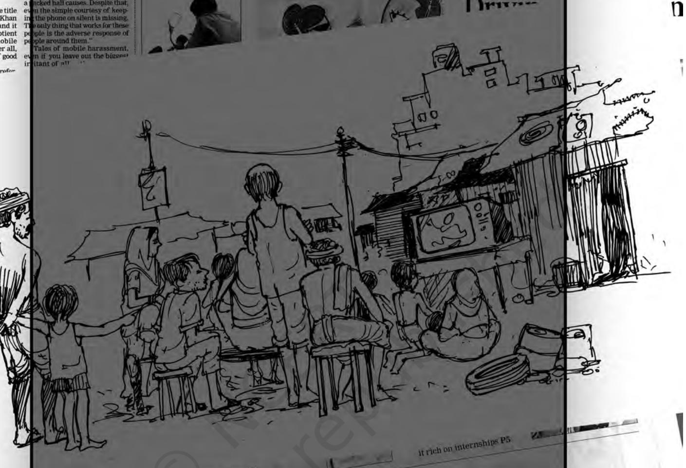
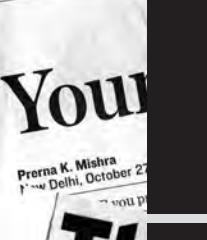
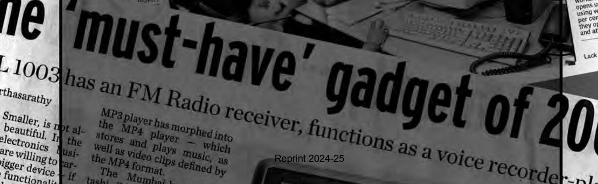
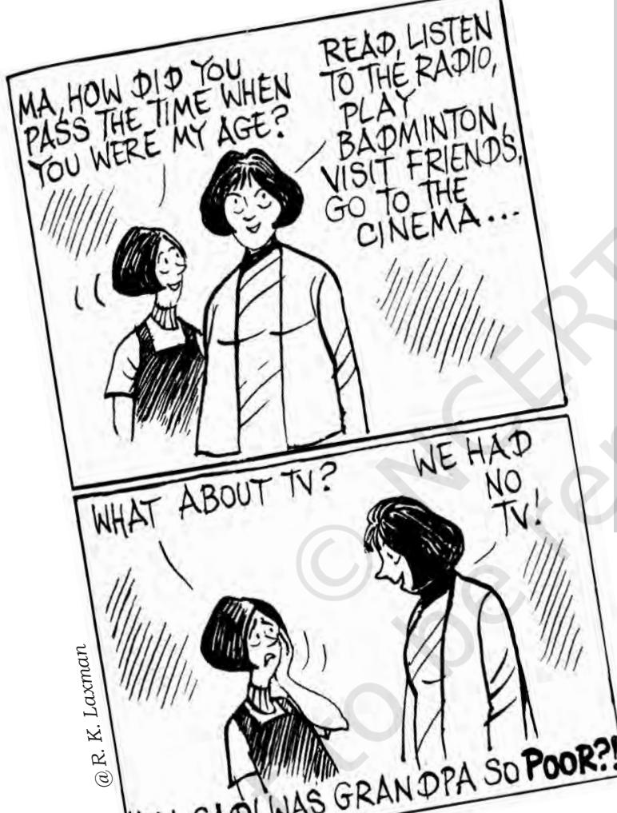
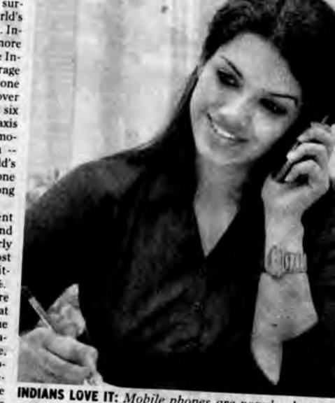
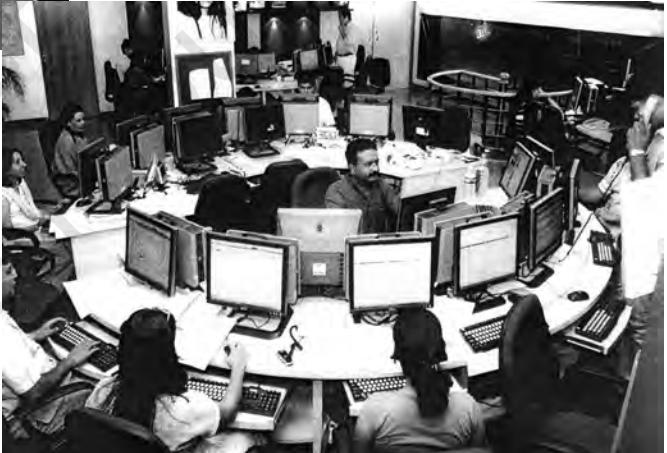
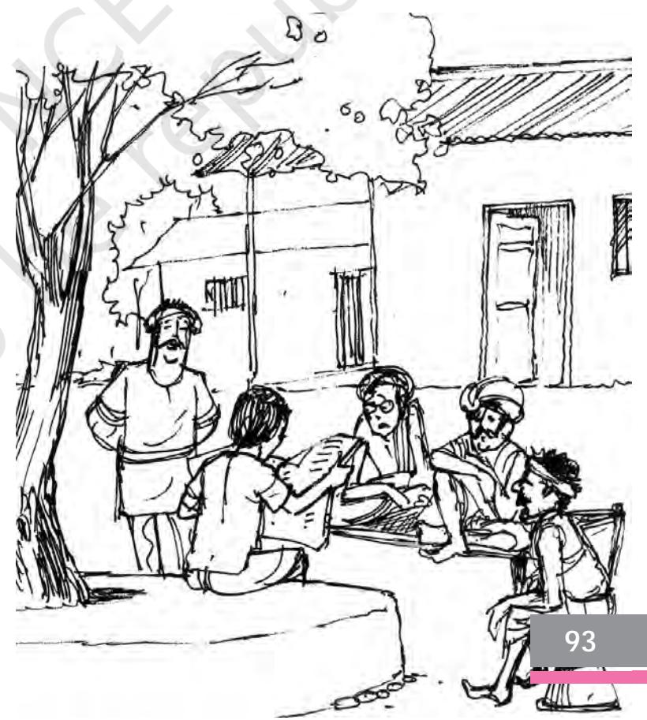
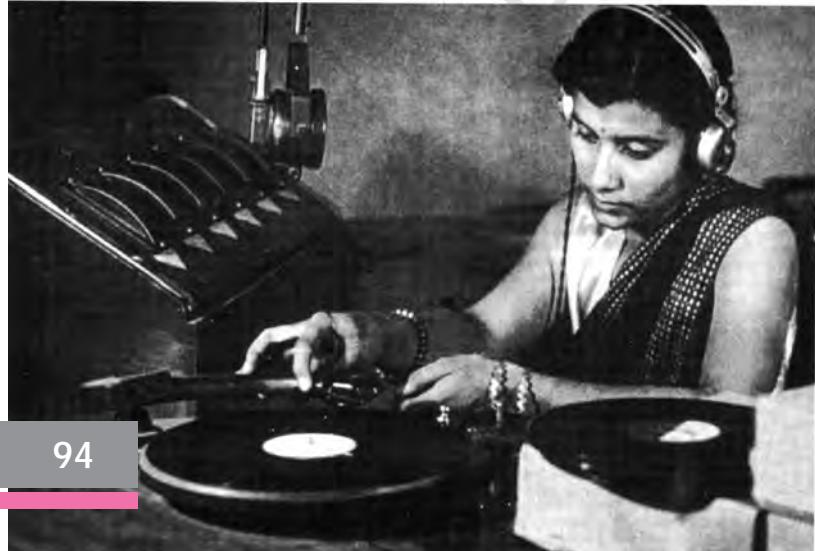
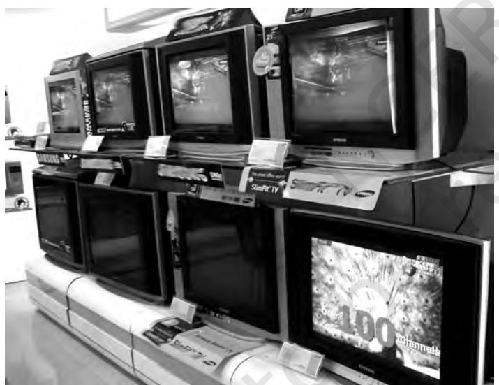
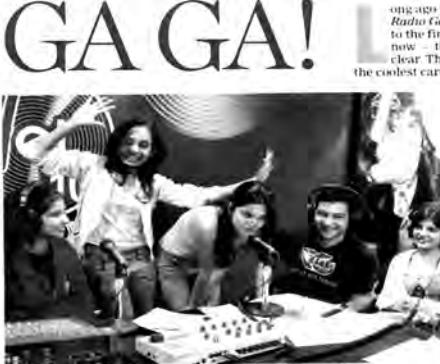

Chapter 7.indd 89 14 September 2022 12:04:52

*T*he mass media include a wide variety of forms, including television, newspapers, films, magazines, radio, advertisements, video games and CDs. They are referred to as 'mass' media because they reach mass audiences – audiences comprise very large numbers of people. They are also sometimes referred to as *mass communications*. For many in your generation, it is probably difficult to imagine a world without some form of mass media and communications.

# **Activity 7.1**

- ¾ Imagine a world where there is no television, no cinema, no newspapers, no magazines, no internet, no telephones, no mobile phones.
- ¾ Write down your daily activities in a day. Identify the occasions when you used the media in some way or the other.
- ¾ Find out from an older generation what life was like without any of these forms of communication. Compare it with your life.
- ¾ Discuss the ways work and leisure have changed with the developments in communication technologies.

Mass media is a part of our everyday life. In many middle class households across the country people wake up only to put on the radio, switch on the television, look for the morning newspaper. The younger children of the same households may first glance at their mobile phones to check their missed

calls. Plumbers, electricians, carpenters, painters and sundry other service providers in many urban centres have a mobile telephone where they can be easily contacted. Many shops in cities increasingly have a small television set. Customers who come in may exchange bits of conversation about the cricket match being telecasted or the film being shown. Indians abroad keep regular touch with friends and families back home over the Internet and telephone. Migrants from working class population in the cities are regularly in touch with their families in the villages over the phone. Have you seen the range of advertisements of mobile phones? Have you noticed the diverse social

Chapter 7.indd 90 14 September 2022 12:04:52

groups that they are catering to? The CBSE Board results are available on both the Internet and over the mobile phone. Indeed this very book is available on the Internet.

It is obvious that there has been a phenomenal expansion of mass communication of all kinds in recent years. As students of sociology, there are many aspects to this growth which is of great interest to us. *First*, while we recognise the specificity of the current communication revolution, it is important to go back a little and sketch out the growth of modern mass media in the world and in India. This helps us realise that like any other social institution the structure and content of mass media is shaped by changes in

the economic, political and socio-cultural contexts. For instance, we see how central the state and its vision of development influenced the media in the first decades after independence. And how in the post 1990 period of globalisation, the market has a key role to play. *Second*, this help us better appreciate how the relationship between mass media and communication with society is dialectical. Both influence each other. The nature and role of mass media is influenced by the society in which it is located. At the same time the far reaching influence of mass media on society cannot be over-emphasised. We shall see this dialectical relationship when we discuss in this chapter—(a) the role of media in colonial India, (b) in the first decades after independence and (c) and finally in the context of globalisation. *Third*, mass communication is different from other means of communication as it requires a formal structural organisation to meet large-scale capital, production and management demands. You will find, therefore, that the state and/or the market have a major role in the structure and functioning of mass media. Mass media functions through very large organisations with major investments and large body of employees. *Fourth*, there are sharp differences between how easily different sections of people can use mass media. You will recall the concept of digital divide from the last chapter.

Chapter 7.indd 91 14 September 2022 12:04:52

# 7.1 The Beginnings of Modern Mass Media

The first modern mass media institution began with the development of the printing press. Although the history of print in certain societies dates back to many centuries, the first attempts at printing books using modern technologies began in Europe. This technique was first developed by Johann Gutenberg in 1440. Initial attempts at printing were restricted to religious books.

*Visuals of a Printing Press and a TV Newsroom in 21st Century, India*

feel connected and develop a sense of belonging or 'we feeling'. The well known scholar Benedict Anderson has thus argued that this helped the growth of nationalism, the feeling that people who did not even know of each other's

With the Industrial Revolution, the print industry also grew. The first products of the press were restricted to an audience of literate elites. It was only in the mid 19th century, with further development in technologies, transportation and literacy that newspapers began to reach out to a mass audience. People living in different corners of the country found themselves reading or hearing the same news. It has been suggested that this was in many ways responsible for people across a country to

existence feel like members of a family. It gave people who would never meet each other a sense of togetherness. Anderson thus suggested that we could think of the nation as an 'imagined community'.

You will recall how 19th century social reformers often wrote and debated in newspapers and journals. The growth of Indian nationalism was closely linked to its struggle against colonialism. It emerged in the wake of the institutional changes brought about by the British rule in India. Anti-colonial public opinion was nurtured and channelised by the nationalist press, which was vocal in its opposition to the oppressive measures of the colonial state. This led the colonial government to clamp down on the nationalist press and impose censorship, for instance during the Ilbert Bill agitation in 1883. Association

Chapter 7.indd 92 14 September 2022 12:04:53

with the national movement led some of the nationalist newspapers like *Kesari* (Marathi), *Mathrubhumi* (Malayalam), *Amrita Bazar Patrika* (English) to suffer the displeasure of the colonial state. But that did not prevent them from advocating the nationalist cause and demand an end to the colonial rule.

- ¾ Though a few newspapers had been started by people before Raja Rammohun Roy, his *Sambad-Kaumudi* in Bengali published in 1821, and *Mirat-Ul-Akbar*  in Persian published in 1822, were the first publications in India with a distinct nationalist and democratic approach. **Box 7.1**
- ¾ Fardoonji Murzban was the pioneer of the Gujarati Press in Bombay. It was as early as 1822 that he started the *Bombay Samachar* as a daily.
- ¾ Ishwar Chandra Vidyasagar started the *Shome Prakash* in Bengali in 1858.
- ¾ *The Times of India* was founded in Bombay in 1861.
- ¾ *The Pioneer* in Allahabad in 1865.
- ¾ *The Madras Mail* in 1868.
- ¾ *The Statesman* in Calcutta in 1875.
- ¾ *The Civil and Military Gazette* in Lahore in 1876.

*(Desai 1948)*

Under British rule newspapers and magazines, films and radio comprised the range of mass media. Radio was wholly owned by the state. National views could not be, therefore, expressed. Newspapers and films though autonomous from the state were strictly monitored by the Raj. Newspapers and magazines either in English or vernacular were not very widely circulated as the literate public was limited. Yet their influence far out stripped their circulation as news and information was read and spread by word of mouth from commercial and administrative hubs, like markets and trading centres, as well as courts and towns. The print media carried a range of opinions, which expressed their ideas of a 'free India'. These variations were carried over to independent India.

Chapter 7.indd 93 14 September 2022 12:04:53

# 7.2 Mass Media in Independent India

## **The Approach**

In independent India, Jawaharlal Nehru, the first prime minister, called upon the media to function as the watchdog of democracy. The media was expected to spread the spirit of self-reliance and national development among the people.

# **Activity 7.2**

Ask anyone you know from a generation that grew up in the first two decades after independence about the documentaries that were routinely shown before the screening of films. Write down their recollections.

You will recall the general thrust of development in the early years of independence in India from your earlier chapters. The media was seen as a means to inform the people of the various developmental efforts. The media was also encouraged to fight against oppressive social practices like untouchability, child marriages, and ostracism of widows, as well as beliefs of witchcraft and faith healing. A rational, scientific ethos was to be promoted for the building of a modern industrial society. The Films Division of the government produced newsreels and documentaries. These were shown before the screening of films in every movie theatre, documenting the development process as directed by the state.

## **Radio**

Radio broadcasting which commenced in India through amateur 'ham' broadcasting clubs in Kolkata and Chennai in the 1920s matured into a public broadcasting system in the 1940s during the World War II when it became a major instrument of propaganda for Allied forces in South-east Asia. At the time of independence there were only six radio stations located in the major cities catering primarily to an urban audience. By 1950, there were 5,46,200 radio licences all over India.

Chapter 7.indd 94 14 September 2022 12:04:53

Since the media was seen as an active partner in the development of the newly free nation, the AIR's programmes consisted mainly of news, current affairs and discussions on development. Box 7.2 captures the spirit of those times.

Apart from All India Radio (AIR) broadcasts news there was Vividh Bharati, a channel for entertainment that was primarily broadcasting Hindi film songs on listeners' request. In 1957, AIR acquired the hugely popular

## **AIR's broadcasts did make a difference**

**Box 7.2**

In the 1960s, when the high yielding varieties of food crops,

as a part of the Green Revolution, were introduced for the first time in the country. It was All India Radio which undertook a major countryside campaign on these crops on a sustained day-to-day basis for over 10 years from 1967.

For this purpose, special programmes on the high yielding varieties were formed in many stations of AIR all over the country. These programme units, manned by subject specialists, undertook field visits and recorded and broadcast first hand accounts of the farmers, who started growing the new varieties of paddy and wheat.

*Source: B. R. Kumar "AIR's broadcasts did make a difference". The Hindu December 31st 2006.* 

channel *Vividh Bharati*, which soon began to carry sponsored programmes and advertisements and grew to become a money-spinning channel for AIR.

When India gained independence in 1947, All India Radio had an infrastructure of six radio stations, located in metropolitan cities. The country had 280,000 radio receiver sets for a population of 350 million people. After independence, the government gave priority to the expansion of the radio broadcasting infrastructure, especially in state capitals and in border areas. Over the years, AIR has developed a formidable infrastructure for radio broadcasting in India. It operates a three-tiered — national, regional, and local — service to cater to India's geographic, linguistic and cultural diversity.

The major constraint for the popularisation of radio initially was the cost of the radio set. The transistor revolution in the 1960s made the radio more accessible by making it mobile as battery operated sets and reducing the unit price substantially. In 2000, around 110 million households (two-thirds of all Indian households) were listening to radio broadcasts in 24 languages and 146 dialects. More than a third of them were rural households. As of today, the AIR has grown to 480 stations and 681 transmitters covering 99% of the population spread over 92% area of the country.

### **Wars, tragedies and expansion of AIR**

Interestingly, wars and tragedies have spurred AIR to expand its activities. The 1962 war with China prompted the launching of a 'talks' unit to put out a daily programme. In August 1971, with the Bangladesh crisis looming, the News Service Division introduced news on the hour, from 6 o' clock in the morning to midnight. It took another crisis, the tragic assassination of Rajeev Gandhi in 1991, for AIR to take one more step of having bulletins round the clock.

## **Box 7.3**

**95**

Chapter 7.indd 95 14 September 2022 12:04:53

## **Television**

Television programming was introduced experimentally in India to promote rural development as early as 1959. Later, the Satellite Instructional Television Experiment (SITE) broadcasted directly to community viewers in the rural areas of six states between August 1975 and July 1976. These instructional broadcasts were broadcast to 2,400 TV sets directly for four

# **Activity 7.3**

Identify a cross section of people from an older generation. Find out from them what television programmes consisted of in the 1970s and 1980s? Did many of them have access to television?

hours daily. Meanwhile, television stations were set up under Doordarshan in four cities (Delhi, Mumbai, Srinagar and Amritsar) by 1975. Three more stations in Kolkata, Chennai and Jalandhar were added within a year. Every broadcasting centre had its own mix of programmes, comprising news, children's and women's programmes, farmers' programmes as well as entertainment programmes.

As programmes become commercialised and were allowed to carry advertisements

of their sponsors, a shift in the target audience was evident. Entertainment programmes grew and were directed to the urban consuming class. The advent of colour broadcasting during the 1982 Asian Games in Delhi and the rapid

### **Hum Log: A Turning Point**

*Hum Log* was India's first long-running soap opera… This pioneering programme utilised the entertainment-education strategy by intentionally placing educational content in this entertainment message.

Some 156 episodes of *Hum Log* were broadcast in Hindi for 17 months in 1984–85. The television programme promoted social themes, such as gender equality, small family size and national integration. At the end of each 22-minute episode, a famous Indian actor, Ashok Kumar, summarised the educational lessons from the episode in an epilogue of 30 to 40 seconds. Kumar connected the drama to viewers' everyday lives. For instance, he might comment on a negative character who is drunk and beats his wife by asking; "why do you think that people, like Basesar Ram drink too much, and then behave badly? Do you know anyone like this? What can be done to reduce the incidents of alcoholism? What can you do? *(Singhal and Rogers, 1989)*.

A study of *Hum Log*'s audience showed that a high degree of parasocial interaction occurred between the audience members and their favourite *Hum Log* characters. For example, many *Hum Log* viewers reported that they routinely adjusted their daily schedules to 'meet' their favourite character 'in the privacy of their living rooms'. Many other individuals reported talking to their favourite characters through the television sets; for instance, "Don't worry, Badki. Do not give up your dream of making a career".

> *Hum Log* achieved audience ratings of 65 to 90 per cent in North India and between 20 and 45 per cent in South India. About 50 million individuals watched the average broadcast of *Hum Log*. One unusual aspect of this soap opera was the huge number of letters, over 400,000, that it attracted from viewers; so many that most of them could not be opened by *Doordarshan* officials. *(Singhal and Rogers 2001)*

## **Box 7.4**

Chapter 7.indd 96 14 September 2022 12:04:53

The advertising carried by *Hum Log* promoted a new consumer product in India, *Maggi* 2-Minute noodles. The public rapidly accepted this new consumer product, suggesting the power of television commercials. Advertisers began to line up to purchase airtime for television advertising, and the commercialisation of Doordarshan began.

**Box 7.5**

expansion of the national network led to rapid commercialisation of television broadcasting. During 1984–85, the number of television transmitters increased all over India, covering a large proportion of the population. It was also the time when indigenous soap operas, like *Hum Log* (1984–85) and *Buniyaad* (1986–87) were aired. They were hugely popular and attracted substantial advertising revenue for Doordarshan as did the broadcasting of the epics—*Ramayana* (1987–88) and *Mahabharata* (1988–90). Today, the situation of the television industry is like this — the Annual Report released by TRAI for the year 2015–16 clearly stated that India has the world's second largest TV market after China. As per industry estimates, as on March 2016, of the existing 2,841 million households, around 1,811 million have television sets, which provide services of cable TV, DTH and IPTV, in additon to a terrestrial TV network of Doordarshan.

## **Print Media**

The beginnings of the print media and its role in both the spread of the social reform movement and the nationalist movement have been noted. After Independence, the print media continued to share the general approach of being a partner in the task of nation building by taking up developmental issues, as well as, giving voice to the widest section of people. The brief extract in the following box will give you a sense of the commitment.

> Journalism in India used to be regarded as a 'calling'. Fired by the spirit of patriotic and social reforming idealism, it was able to draw in outstanding talent as the freedom struggle

## **Box 7.6**

and movements for social change intensified and as new educational and career opportunities arose in a modernising society. As is often the case with such pursuits, the calling was conspicuously underpaid. The transformation of the calling into a profession took place over a long period, mirroring the change in character of a newspaper like *The Hindu* from a purely societal and public service mission into a business enterprise framed by a societal and public service mission.

*Source: Editorial '*Yesterday, Today, Tomorrow'*, The Hindu, 13 September 2003, quoted in B.P. Sanjay (2006)*

Chapter 7.indd 97 14 September 2022 12:04:53

The gravest challenge that the media faced was with the declaration of Emergency in 1975 and censorship of the media. Fortunately, the period ended and democracy was restored in 1977. India with its many problems can be justifiably proud of a free media.

At the start of the chapter we had mentioned how mass media is different from other means of communication as it requires a formal structural organisation to meet large scale capital, production and management demands. And also like any other social institution, the mass media also varies in structure and content according to different economic, political and socio-cultural context. You will now notice how at different points in time both the content and style of media changes. At some points, the state has a greater role to play. At other times the market does. In India this shift is very visible in recent times. This change has also led to debates about what role the media ought to play in a modern democracy. We look at these new developments in the next section.

# 7.3 Globalisation and the Media

We have already read about the far reaching impact of globalisation as well as its close link with the communication revolution in the last chapter. The media have always had international dimensions – such as the gathering of new stories and the distribution of primarily western films overseas. However, until the 1970s most media companies operated within specific domestic markets in accordance with regulations from national governments. The media industry was also differentiated into distinct sectors – for the most part, cinema, print media, radio and television broadcasting all operated independently of one another.

### **Globalisation and the case of music**

## **Box 7.7**

It has been argued that the musical form is one that lends itself to globalisation more efficiently than any other. This is because music is able to reach people who may not know the written and spoken language. The growth of technology — from personal stereo systems to music television (such as the MTV) to the compact disc (CD) — have provided newer, more sophisticated ways for music to be distributed globally.

### **The fusion of forms of media**

Although the music industry is becoming ever more concentrated in the hands of a few international conglomerates, some feel that it is under a great threat. This is because the Internet allows music to be downloaded digitally, rather than purchased in the form of CDs or cassettes from local music stores. The global music industry currently comprises a complex network of factories, distribution chains, music shops and sales staff. If the Internet removes the need for all these elements by allowing music to be marketed and downloaded directly, what will be left of the music industry? How do you see the influence of mobile applications on music industry?

Chapter 7.indd 98 14 September 2022 12:04:53

In the past three decades, however, profound transformations have taken place within the media industry. National markets have given way to a fluid global market, while new technologies have led to the fusion of forms of media that were once distinct.

We began with the case of the music industry and the far reaching consequences that globalisation has had on it. The changes that have taken place in mass media is so immense that this chapter will probably be only able to give you a fragmentary understanding. As a young generation you can build up on the information provided. Let us have a look at the changes that globalisation has brought about on the print media (primarily newspapers and magazines), the electronic media (primarily television), and on the radio.

## **Print Media**

We have seen how important newspapers and magazines were for the spread of the freedom movement. It is often believed that with the growth of the television and the Internet, the print media would be sidelined. However, in India, we have seen the circulation of newspapers grow. As Box 7.8 suggests, new technologies have helped boost the production and circulation of newspapers. A large number of glossy magazines have also made their entry to the market.

As is evident, the reasons for this amazing growth in Indian language newspapers are many. *First*, there is a rise in the number of literate people who are migrating to cities. The Hindi daily *Hindustan* in 2003 printed 64,000 copies of their Delhi edition, which jumped to 425,000 by 2005. The reason

## **The Indian Language Newspaper Revolution**

The most significant happening in the last few decades has been the Indian language newspaper revolution. Hindi, Telugu and Kannada recorded the highest

growth. Print publications in the country had an increase in the average daily circulation of 23.7 million copies from 2006 to 2016. From 39.1 million in 2006, the average number of copies circulated a day grew to 62.8 million, a compound annual growth rate (CAGR) of 4.87 per cent from 2006 to 2016. Among the four main geographic zones, the north showed the highest growth at 7.83 per cent. Growth in the south, west and east was 4.95 per cent, 2.81 per cent and 2.63 per cent, respectively. The top two Hindi dailies in India are *Dainik Jagran* and *Dainik Bhaskar* with average qualifying sales of 3.92 million and 3.81 million, respectively (July–December 2016).

*Source: Audit Bureau of Circulation, 2016–17.* 

The *Eenadu* story also exemplifies the success of the Indian language press. Ramoji Rao the founder of *Eenadu*, had successfully organised a chit-fund before launching the paper in 1974. By associating with appropriate causes in rural areas, like the anti-arrack movement in the mid-1980s, the Telugu newspaper was able to reach the countryside. This prompted it to launch 'district dailies' in 1989. These were tabloid inserts or features carrying sensational news from particular districts, as well as, classified advertisements from villages and small towns of the area. By 1998, *Eenadu* was being published from 10 towns in Andhra Pradesh and its circulation accounted for 70 per cent of the audited Telugu daily circulation.

## **Box 7.8**

Chapter 7.indd 99 14 September 2022 12:04:53

was that, of Delhi's population of one crore and forty-seven lakhs, 52 per cent had come from the Hindi belt of the two states of Uttar Pradesh and Bihar. Out of this, 47 per cent have come from a rural background and 60 per cent of them are less than 40 years of age.

*Second*, the needs of the readers in the small towns and villages are different from that of the cities and the Indian language newspapers cater to those needs. Dominant Indian language newspapers such as *Malayala Manorama* and the *Eenadu* launched the concept of local news in a significant manner by introducing district and whenever necessary, block editions. *Dina Thanthi*, another leading Tamil newspaper, has always used simplified and colloquial language. The Indian language newspapers have adopted advanced printing technologies and also attempted supplements, pullouts, and literary and niche booklets. Marketing strategies have also marked the *Dainik Bhaskar* group's growth as they carry out consumer contact programmes, door-to-door surveys, and research. This also brings back the point that modern mass media has to have a formal structural organisation.

### **Shift in circulation of Newspapers in India**

**Box 7.9**

According to recently published data of Indian Readership Survey, the largest growth in readership has been in Hindi belt. Indian language dailies as a whole have grown substantially from 191 million readers to 425 million readers in 2019. The readership of English dailies on the other hand, has stagnated at around 31 million. In 2005, Hindi dailies*— Dainik Jagran* (with 74 million) and *Dainik Bhaskar* (with 51 million) are heading the list, while *The Times of India* and *The Hindu* are the English dailies with a readership of over 15.2 and 5.3 million respectively. Of the top 10 dailies which are in 'ten million club', six are in Hindi, one in Tamil, two in Malayalam and one in English (http://mruc.net).

While English newspapers, often called 'national dailies', circulate across regions, vernacular newspapers have vastly increased their circulation in the states and the rural hinterland. In order to compete with the electronic media, newspapers, especially English language newspapers have on the one hand reduced prices and on the other hand brought out editions from multiple centres.

- **Activity 7.4**
- ¾ Find out how many places do the newspaper you are most familiar with, brought out from.
- ¾ Have you noticed how there are supplements that cater to city specific or town specific interests and events?
- ¾ Have you noticed the many commercial supplements that accompany many newspapers these days?

**100**

Chapter 7.indd 100 14 September 2022 12:04:53

## **Changes in Newspaper Production: The Role of Technology**

From the late 1980s and early 1990s, newspapers have become fully automatic — from reporter's desk to final page proof. The use of paper has been completely eliminated with this automated chain. This has become possible because of two technological changes — networking of personal computers (PCs) through LANs (local area networks) and use of newsmaking softwares like Newsmaker and other customised softwares.

Changing technology has also changed the role and function of a reporter. The basic tools of a news reporter — a shorthand notebook, pen, typewriter and a plain old telephone has been replaced by new tools — a mini digital recorder, a laptop or a PC, mobile or satellite

phone, and other accessories, like modem, dish and Antenna. All these technological changes in news gathering have increased the speed of news and helped newspaper managements push their deadlines to dawn. They are also able to plan a greater number of editions and provide the latest news to readers. A number of language newspapers are using new technologies to bring out separate editions for each of the districts. While print centres are limited, the number of editions has grown manifold.

Newspaper chains like Meerut-based *Amar Ujala,* are using new technology for news gathering, as well as, for improving pictorial coverage. The newspaper has a network of nearly a hundred reporters and staffers and an equal number of photographers, feeding news to all its 13 editions spread across Uttar Pradesh and Uttarakhand. All hundred correspondents are equipped with PCs and modems for news transmission, and the photographers carry digital cameras with them. Digital images are sent to the central news desk via modems.

Many feared that the rise in electronic media would lead to a decline in the circulation of print media. This has not happened. Indeed it has expanded. This process has, however, often involved cuts in prices and increasing dependence on the sponsors of advertisements who in turn have a larger say in the content of newspapers. The following box captures the logic of this practice.

Chapter 7.indd 101 14 September 2022 12:04:54

The effort of the newspapers has been to widen their audience and reach out to different groups. It has been argued that newspaper reading habits have changed. While the older people read the newspaper in its entirety, younger readers often have specific interests like sports, entertainment or society gossip

# **Box 7.11**

and directly move to the pages earmarked for these items. Segmented interest of readers imply that a newspaper must have a plurality of 'stories' to appeal to a wide range of readers with varied interests. This has often led to newspapers advocating infotainment, a combination of information and entertainment to sustain the interest of readers. Production of newspaper is no longer related to a commitment to certain values that embody a tradition. Newspapers have become a consumer product and as long as numbers are big, everything is up for sale.

## **Exercise for Box 7.11**

Read the text carefully.

- 1. Do you think readers have changed or newspapers have changed? Discuss.
- 2. Discuss the term infotainment. Can you think of examples? What do you think the effect of infotainment will be?

*A television showroom*

## **Television**

In 1991 there was one state controlled TV channel Doordarshan in India. By 1998 there were almost 70 channels. Privately run satellite channels have multiplied rapidly since the mid-1990s. While Doordarshan broadcasts over 35 channels there were about 900 private television networks broadcasting in 2020. The staggering growth of private satellite television has been one of the defining developments of contemporary India. In 2002, 134 million individuals watched satellite TV on an average every week. This number went up to 190 million in 2005. The number of homes

with access to satellite TV has jumped from 40 million in 2002 to 61 million in 2005. Satellite subscription has now penetrated 56 percent of all TV homes.

The Gulf War of 1991 (which popularised CNN), and the launching of Star-TV in the same year by the Whampoa Hutchinson Group of Hong Kong, signalled the arrival of private satellite Channels in India. In 1992, Zee TV, a Hindi-based satellite entertainment channel, also began beaming programmes to cable television viewers in India. By 2000, 40 private cable and satellite channels were available including several that focused exclusively on regionallanguage broadcasting like Sun-TV, Eenadu-TV, Udaya-TV, Raj-TV, and Asianet. Meanwhile, Zee TV has also launched several regional networks, broadcasting in Marathi, Bengali and other languages.

Chapter 7.indd 102 14 September 2022 12:04:54

While Doordarshan was expanding rapidly in the 1980s, the cable television industry was mushrooming in major Indian cities. The VCR greatly multiplied entertainment options for Indian audiences, providing alternatives to Doordarshan's single channel programming. Video viewing at home and in community-based parlours increased rapidly. The video fare consisted mostly of film-based entertainment, both domestic and imported. By 1984, entrepreneurs in cities such as Mumbai and Ahmedabad had begun wiring apartment buildings to transmit several films a day. The number of cable operators exploded from 100 in 1984, to 1200 in 1988, to 15,000 in 1992, and to about 60,000 in 1999.

The coming in of transnational television companies like Star TV, MTV, Channel [V], Sony and others, made some people get worried on the likely impact on Indian youth and on the Indian cultural identity. But most of the transnational television channels have through research realised that the use of the familiar is more effective in procuring the diverse groups that constitute Indian audience. The early strategy of Sony International was to broadcast 10 Hindi films a week, gradually decreasing the number as the station produced its own Hindi language content. The majority of the foreign networks have now introduced either a segment of Hindi language programming (MTV India), or an entire new Hindi language channel (STAR Plus). STAR Sports and ESPN have

## **The Rescue of Prince**

**Box 7.12**

**103**

Prince, a 5-year old boy had fallen into a 55-ft borewell shaft in Aldeharhi village in Kurukshetra, Haryana, and was rescued by the army after a 50-hour ordeal, in which a parallel shaft was dug through a well. Along with food, a closed circuit television camera (CCTV) had been lowered into the shaft in which the little boy was trapped. Two news channels… suspended all other programmes and reporting of all other events and for two days continuous footage of the child bravely fighting off insects, sleeping or crying out to his mother was splashed on the TV screens. They even interviewed many people outside temples, asking them "what do you feel about Prince?" They asked people to send SMSes for Prince. (Prince ke liye aapka sandesh hamein bheje xxx pe). Thousands of people had descended at the site and several free community kitchens were run for two days. It soon created a national hysteria and concern, and people were shown praying in temples, mosques, churches and gurudwaras. There are other such instances when the TV is shown to intrude into the personal lives of people.

## **Exercise for Box 7.12**

You may have watched on television the whole rescue operation. If not you can choose from any other event. Organise a debate in class around the following points:

- 1. What is the likely impact of this competition among television channels to outdo one another in running exclusive live coverage of events for gaining higher viewership?
- 2. Can we look at this issue as a kind of voyeurism (peep into some other people's private/intimate moments) indulged in by television cameras?
- 3. Is it an example of the positive role played by television media in highlighting the plight of rural poor?

Chapter 7.indd 103 14 September 2022 12:04:54

dual commentary or an audio sound track in Hindi. The larger players have launched specific regional channels in languages such as Bengali, Punjabi, Marathi and Gujarati.

Perhaps the most dramatic adoption of localisation was carried out by STAR TV. In October 1996, STAR Plus, initially an all English general entertainment channel originating from Hong Kong, began producing a Hindi language belt of programming between 7 and 9 PM. By February 1999, the channel was converted to a solely Hindi Channel and all English serials shifted to STAR World, the network's English language international channel. Advertising to promote the change included the Hinglish slogan: 'Aapki Boli. Aapka Plus Point' (Your language/speech. Your Plus Point) (Butcher, 2003). Both STAR and Sony continued to dub US programming for younger audience as children appeared to be able to adjust to the peculiarities that arise when the language is one and the setting another. Have you watched a dubbed programme? What do you feel about it?

Most television channels are on throughout the day, 24×7. The format for news is lively and informal. News has been made far more immediate, democratic and intimate. Television has fostered public debate and is expanding its reach every passing year. This brings us to the question whether serious political and economic issues are neglected.

There is a growing number of news channels in Hindi and English, a large number of regional channels and an equally large number of reality shows, talk shows, Bollywood shows, family soaps, interactive shows, game shows and comedy shows. Entertainment television has produced a new cadre of superstars who have become familiar household names, and their private life, rivalry on sets feed the gossip columns of popular magazines and newspapers. Reality shows like *Kaun Banega Crorepati* or *Indian Idol* or *Bigg Boss* have become increasingly popular. Most of these are modelled along the lines of western programmes. Which of these programmes can be identified as interactive shows, as family soaps, talk shows and reality shows? Discuss.

## **Radio**

In 2000, AIR's programmes could be heard in two-third of all Indian households in 24 languages and 146 dialects, over some 120 million radio sets. The advent of privately owned FM radio stations in 2002 provided a boost to entertainment programmes over radio. In order to attract audiences, these

### **Soap opera**

Soap operas are stories that are serialised. They are continuous. Individual stories may come to an end, and different characters appear and disappear, but the soap

## **Box 7.13**

itself has no ending until it is taken off the air completely. Soap operas presume a history, which the regular viewer knows – he or she becomes familiar with the characters, with their personalities and their life experiences.

Chapter 7.indd 104 14 September 2022 12:04:54

privately run radio stations sought to provide entertainment to its listeners. As privately run FM channels are not permitted to broadcast any political news bulletins, many of these channels specialise in 'particular kinds' of popular music to retain their audiences. One such FM channel claims that it broadcasts 'All hits all day!' Most of the FM channels which are popular among young urban professionals and students, often belong to media conglomerates. Like 'Radio Mirchi' belongs to the *Times of India* group, *Red FM* is owned by *Living Media* and *Radio City* by the *Star Network*. But independent radio stations engaged in

public broadcastings like National Public Radio (USA) or BBC (UK) are missing from our broadcasting landscape.

In the two films: 'Rang de Basanti' and 'Lage Raho Munnai Bhai', the radio is used as an active medium of communication although both the movies are set in the contemporary period. In 'Rang de Basanti', the conscientious, angry college youth, inspired by the legend of Bhagat Singh assassinates a minister and then captures All India Radio to reach out to the people and disseminate their message. While in 'Lage Raho Munna Bhai', the heroine is a radio jockey who wakes up the country with her hearty and full-throated "Good Morning Mumbai!", the hero too takes recourse to the radio station to save a girl's life.

The potential for using FM channels is enormous. Further privatisation of radio stations and the emergence of community owned radio stations would lead to the growth of radio stations. The demand for local news is growing. The number of homes listening to FM in India has also reinforced the worldwide trend of networks getting replaced by local radio. The box below reveals not only the ingenuity of a village youth but also the need for catering to local cultures.

It may well be the only village FM radio station on the Asian sub-continent.

The transmission equipment, costing little…, may be the cheapest in the world. But the local people definitely love it. On a balmy morning in India's northern state of Bihar, young Raghav Mahato gets ready to fire up his home-grown FM radio station. Thousands of villagers, living in a 20 km (12 miles) radius of Raghav's small repair shop and radio station …tune their … radio sets to catch their favourite station. After the crackle of static, a young, confident voice floats up the radio waves. "Good morning! Welcome to Raghav FM Mansoorpur 1! Now listen to your favourite songs," announces anchor and friend Sambhu into a cellotape-plastered microphone surrounded by racks of local music tapes. For the next 12 hours, Raghav Mahato's outback FM radio station plays films songs and broadcasts public interest messages on HIV and polio, and even snappy local news, including alerts on missing children and the opening of local shops. Raghav and his friend run the indigenous radio station out of Raghav's thatched-roof Priya Electronics Shop. **105**

Chapter 7.indd 105 10 November 2022 04:34:56

## **Box 7.14**

The place is a cramped …rented shack stacked with music tapes and rusty electrical appliances which doubles up as Raghav's radio station and repair shop.

He may not be literate, but Raghav's ingenuous FM station has made him more popular than local politicians. Raghav's love affair with the radio began in 1997 when he started out as a mechanic in a local repair shop. When the shop owner left the area, Raghav, son of a cancer-ridden farm worker, took over the shack with his friend. Sometime in 2003, Raghav, who by now had learned much about radio ...In impoverished Bihar state, where many areas lack power supplies, the cheap battery-powered transistor remains the most popular source of entertainment. "It took a long time to come up with the idea and make the kit which could transmit my programmes at a fixed radio frequency. The kit cost me 50 rupees", says Raghav. The transmission kit is fitted on to an antenna attached to a bamboo pole on a neighbouring three-storey hospital. A long wire connects the contraption to a creaky, old homemade stereo cassette player in Raghav's radio shack. Three other rusty, locally made battery-powered tape recorders are connected to it with colourful wires and a cordless microphone.

The shack has some 200 tapes of local Bhojpuri, Bollywood and devotional songs, which Raghav plays for his listeners. Raghav's station is truly a labour of love - he does not earn anything from it. His electronic repair shop work brings him some two thousand rupees a month. The young man, who continues to live in a shack with his family, doesn't know that running an FM station requires a government license. "I don't know about this. I just began this out of curiosity and expanded its area of transmission every year," he says.

So when some people told him sometime ago that his station was illegal, he actually shut it down. But local villagers thronged his shack and persuaded him to resume services again. It hardly matters for the locals that Raghav FM Mansoorpur 1 does not have a government license – they just love it.

"Women listen to my station more than men", he says. "Though Bollywood and local Bhojpuri songs are staple diet, I air devotional songs at dawn and dusk for women and old people." Since there's no phone-in facility, people send their requests for songs through couriers carrying handwritten messages and phone calls to a neighbouring public telephone office. Raghav's fame as the 'promoter' of a radio station has spread far and wide in Bihar. People have written to him, wanting work at his station, and evinced interest in buying his 'technology'.

*Source: BBC NEWS: (By Amarnath Tewary) http://news.bbc.co.uk/go/pr/fr/-/2/hi/south_ asia/4735642.stm Published: 2006/02/24 11:34:36 GMT © BBC MMV*

# Conclusion

That mass media is an essential part of our personal and public life today cannot be emphasised enough. This chapter in no way can capture your life experience with the media. What it does do is attempt to understand it as an important part of contemporary society. It also seeks to focus on its many dimensions – its link with the state and the market, its social organisation and management, its relationship with readers and audience. In other words it looks at both the constraints within which media operates and the many ways that it affects our lives.

Chapter 7.indd 106 10 November 2022 04:35:12

- 1. Trace out the changes that have been occurring in the newspaper industry. What is your opinion on these changes?
- 2. Is radio as a medium of mass communication dying out? Discuss the potential that FM stations have in post-liberalisation India.
- 3. Trace the changes that have been happening in the medium of television. Discuss.

## **REFERENCES**

Bhatt, S.C. 1994. *Satellite Invasion in India*. Sage. New Delhi.

Butcher, Melissa. 2003. Transnational Television, *Cultural Identity and Change: When STAR Came to India*. Sage. New Delhi.

Chaudhuri, Maitrayee. 2005. 'A Question of Choice: Advertisements, Media and Democracy' Ed. Bernard Bel et. al. *Media and Mediation Communication Processes* pp.199–226. Sage. New Delhi.

Chatterji, P.C. 1987. *Broadcasting in India*. Sage. New Delhi.

Desai, A.R. 1948. *The Social Background of Indian Nationalism*. Popular Prakashan. Bombay.

Ghose, Sagarika 2006, 'Indian Media: A flawed yet robust public service' in B.G. Verghese (Ed.) *Tomorrow's India: Another tryst with destiny*. Viking. New Delhi.

Joshi, P.C. 1986. *Communication and Nation-Building*. Publications Divison GOI. Delhi.

Jeffrey, Roger. 2000. *India's Newspaper Revolution*. OUP. Delhi.

More, Dadasaheb Vimal. 1970. 'Teen Dagdachachi Chul" in Sharmila Rege *Writing Caste/Writing Gender: Narrating Dalit Women's Testimonies*. Zubaan/Kali. Delhi, 2006

Page, David and Willam Gawley. 2001. *Satellites Over South Asia*. Sage. New Delhi.

Singhal, Arvind and E.M. Rogers. 2001. *India's Communication Revolution*. Sage. New Delhi.

# Questions

## **107**

Chapter 7.indd 107 14 September 2022 12:04:54

Chapter 7.indd 108 14 September 2022 12:04:54

