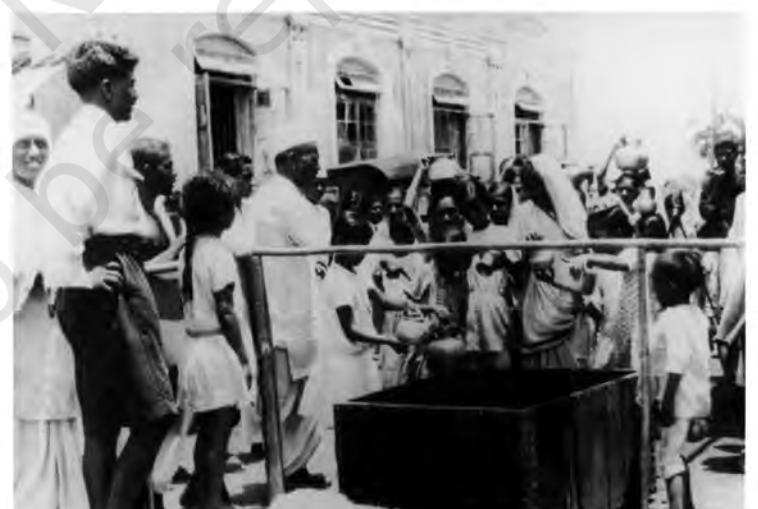
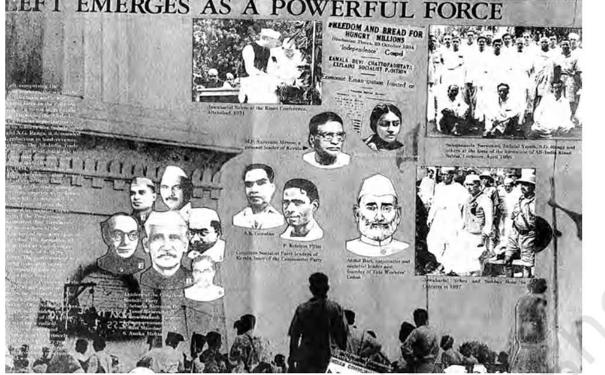
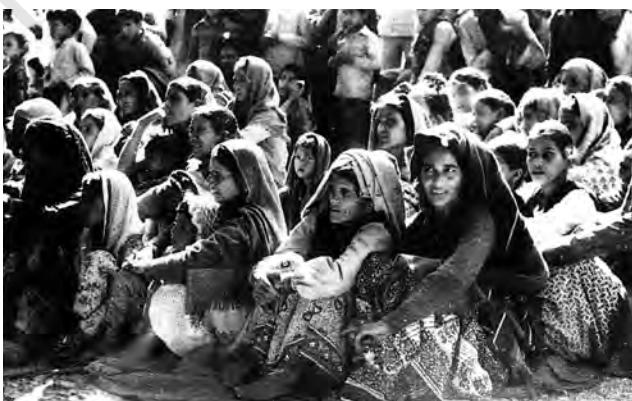
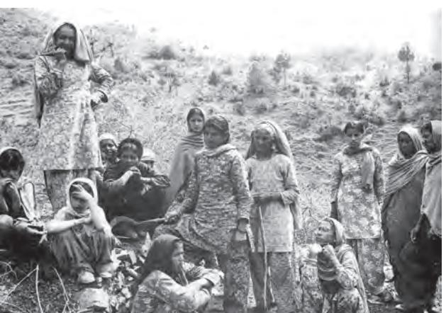
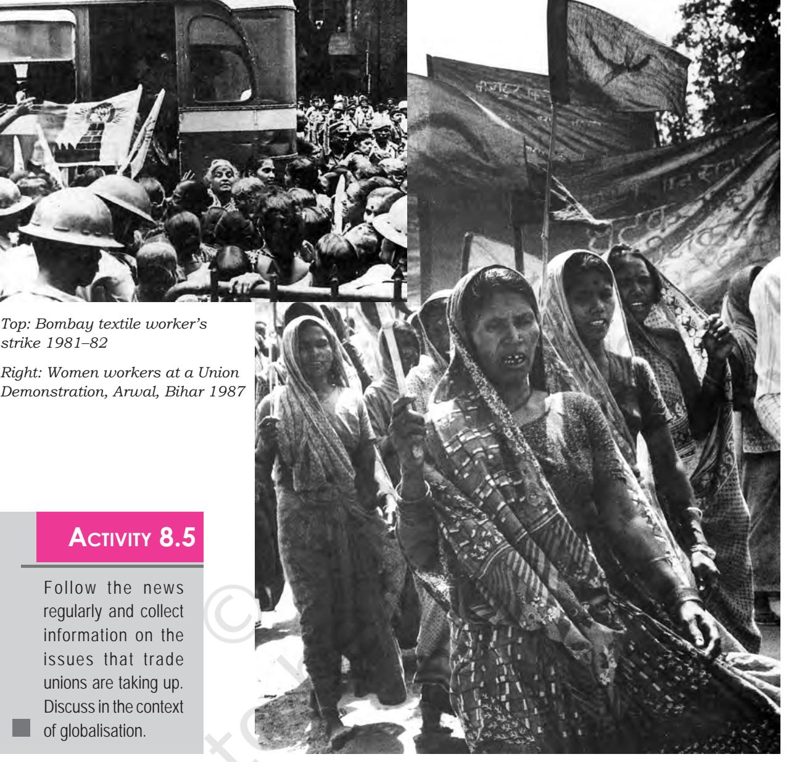
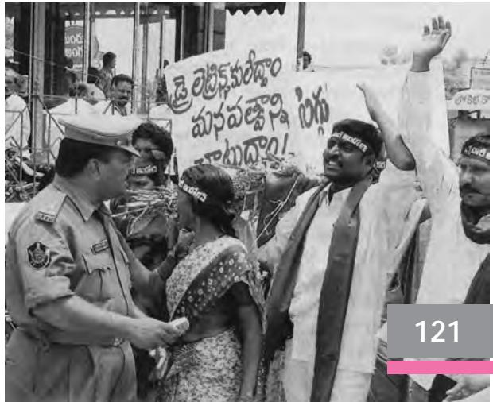
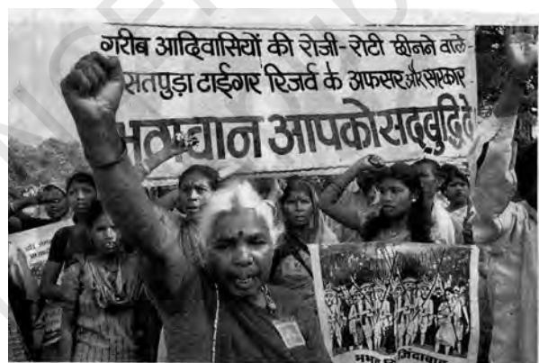
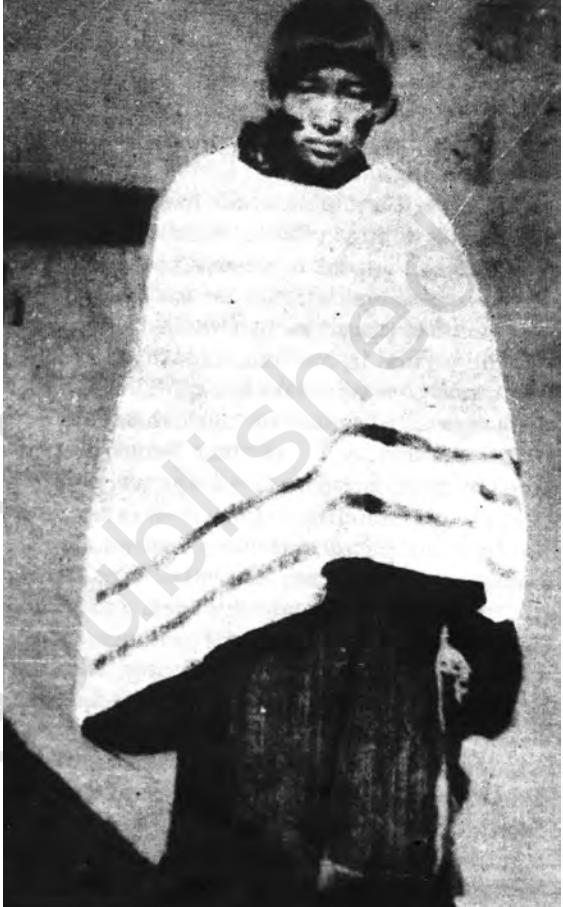
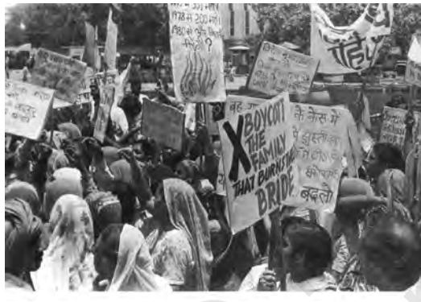
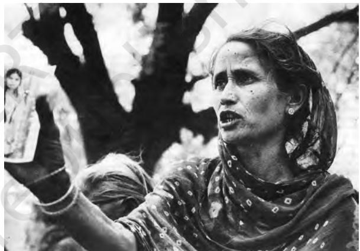

# Reprint 2024-25

Chapter 8.indd 109 14 September 2022 12:05:16

*A* great many students and office-workers around the world go to work only for five or six days and rest on the weekends. Yet, very few people who relax on their day off realise that this holiday is the outcome of a long struggle by workers. That the work-day should not exceed eight hours, that men and women should be paid equally for doing the same work, that workers are entitled to social security and pension — these and many other rights were gained through social movements. Social movements have shaped the world we live in and continue to do so.

#### **The Right to Vote**

**Box 8.1**

#### to vote, is one of the foremost rights guaranteed by the Indian Constitution. It means that we cannot be governed by anyone other than the people we have ourselves elected to represent us. This right is a radical departure from the days of colonial rule when ordinary people were forced to submit to the authority of colonial officers who represented the interests of the British Crown. However, even in Britain, not everyone was allowed to vote. Voting rights were limited to property-owning men. *Chartism* was a social movement for parliamentary representation in England. In 1839, more than 1.25 million people signed the People's Charter asking for universal male suffrage, voting by ballot, and the right to stand for elections without owning property. In 1842, the movement managed to collect 3.25 million signatures, a huge number for a tiny country. Yet, it was only after World War I, in 1918 that

all men over 21, married women, women owning houses, and women university graduates over the age of 30, got the right to vote. When the *suffragettes* (women activists) took up the cause of all adult women's right to vote, they were bitterly

opposed and their movement violently crushed.

Universal adult franchise, or the right of every adult

## **Activity 8.1**

Compare your life with your grandmother. How is it different from yours? What are the rights you take for granted in your life and which she did not have? Discuss.

> We often assume that the rights we enjoy just happened to exist. It is important to recall the struggles of the past, which made these rights possible. You have read about the 19th century social reform movements, of the struggles against caste and gender discrimination and of the nationalist movement in India that brought us independence from colonial rule in 1947. You are familiar also with the many nationalist movements around the world in Asia, Africa and Americas that put an end to colonial rule. The socialist movements world over, the civil rights movement in the United States in the 1950s and 1960s that fought for equal rights for Blacks, the anti-apartheid struggle in South Africa have all changed the world in fundamental ways. Social movements not

Chapter 8.indd 110 14 September 2022 12:05:16

only change societies; they also inspire other social movements. You saw in Chapter 3 how the Indian national movement shaped the making of the Indian Constitution. And how in turn the Indian Constitution played a major role in bringing about social change.

# **Activity 8.2**

Try and think of any example that will show you how society is changed by social movements and also how a social movement can lead to other social movements.

# 8.1 Features of a Social Movement

A social movement requires *sustained collective action* over time. Such action is often directed against the state and takes the form of demanding changes in state policy or practice. Spontaneous, disorganised protest cannot be called a social movement either. Collective action must be marked by some degree of *organisation*. This organisation may include a *leadership* and a *structure* that defines how members relate to each other, make decisions and carry them out. Those participating in a social movement also have *shared objectives* and *ideologies*. A social movement has a general orientation or way of approaching to bring about (or to prevent) change. These defining features are not constant. They may change over the course of a social movement's life.

Social movements often arise with *the aim of bringing about changes on a public issue*, such as ensuring the right of the tribal population to use the forests or the right of displaced people to settlement and compensation. Think of other issues that social movements have taken up in the past and present. While social movements seek to bring in social change, *counter movements*  sometimes arise in defence of status quo. There are many instances of such counter movements. When Raja Rammohun Roy campaigned against *sati* and formed the Brahmo Samaj, defenders of *sati* formed Dharma Sabha and petitioned the British not to legislate against *sati*. When reformers demanded education for girls, many protested that this would be disastrous for society. When reformers campaigned for widow remarriage, they were socially boycotted. When the so called 'lower caste' children enrolled in schools, some so called 'upper caste' children were withdrawn from the schools by their families. Peasant movements have often been brutally suppressed. More recently the social movements of erstwhile excluded groups, like the Dalits, have often invoked retaliatory action. Likewise proposals for extending reservation in educational institutions have led to counter movements opposing them. Social movements cannot change society easily. Since it goes against both entrenched interests and values, there is bound to be opposition and resistance. But over a period of time changes do take place.

While protest is the most visible form of collective action, a social movement also acts in other, equally important ways. Social movement **111**

Chapter 8.indd 111 14 September 2022 12:05:16

## **Activity 8.3**

Make a list of different social movements that you have heard or read of. What changes do they want to bring about? What changes do they want to prevent?

activists hold meetings to mobilise people around the issues that concern them. Such activities help *shared understanding,* and also prepare for a feeling of agreement or consensus about how to pursue the collective agenda. Social movements also chart out campaigns that include lobbying with the government, media and other important makers of public opinion. You will recall this discussion from Chapter 3. Social movements also *develop distinct modes of protest*. This

could be candle and torch light processions, use of black cloth, street theatres, songs, poetry. Gandhi adopted novel ways such as *ahimsa*, *satyagraha* and his use of the *charkha* in the freedom movement. Recall the innovative modes of protest such as picketing and defying of the colonial ban on producing salt.

#### **The repertoire of satyagraha**

#### **Box 8.2**

The fusion of foreign power and capital was the focus of social protest during India's nationalist struggle. Mahatma Gandhi wore *khadi*, hand-spun, hand-woven cloth, to support Indian cotton-growers, spinners and weavers whose livelihoods had been destroyed by the government policy of favouring mill-made cloth. The legendary *Dandi March* to make salt was a protest against British taxation policies that placed a huge burden on the consumers of basic commodities in order to benefit the empire. Gandhi took items of everyday mass consumption like cloth and salt, and transformed them into symbols of resistance.

Chapter 8.indd 112 14 September 2022 12:05:16

## **Distinguishing Social Change and Social Movements**

It is important to distinguish between *social change* in general and *social movements*. Social change is continuous and ongoing. The broad historical processes of social change are the sum total of countless individual and collective actions gathered across time and space. Social movements are directed towards some specific goals. It involves long and continuous social effort and action by people. To draw from our discussion in Chapter 2, we can view sanskritisation and westernisation as social changes and see the 19th century social reformers' efforts to change the society as social movements.

# 8.2 Sociology and Social Movements

# **Why the Study of Social Movements is Important for Sociology**

From the very beginning, the discipline of sociology has been interested in social movements. The French Revolution was the violent culmination of several movements aimed at overthrowing the monarchy and establishing 'liberty, equality and fraternity'. In Britain, the industrial revolution was marked by great social upheaval. Recall our discussion on the emergence of sociology in the west in NCERT Class XI textbook *Introducing Sociology*. Poor labourers and artisans who had left the countryside to find work in the cities protested against the inhuman living conditions into which they were forced. Food riots in England were often suppressed by the government. These protests were perceived by elites as a major threat to the established order of society. Their anxiety about maintaining social order was reflected in the work of sociologist *Emile Durkheim*. Durkheim's writings about the division of labour in society, forms of religious life, and even suicide, mirror his concern about how social structures enable social integration. Social movements were seen as forces that led to disorder.

Scholars influenced by the ideas of *Karl Marx* offered a different view of violent collective action. Historians like E. P. Thompson showed that the 'crowd' and the 'mob' were not made up of anarchic hooligans out to destroy society. Instead, they too had a 'moral economy'. In other words, they have their own shared understanding of right and wrong that informed their actions. Their research showed that poor people in urban areas had good reasons for protesting. They often resorted to public protest because they had no other way of expressing their anger and resentment against deprivation.

Chapter 8.indd 113 14 September 2022 12:05:16

# 8.3 Types of Social Movements

## **Reformist, Redemptive, Revolutionary**

There are different kinds of social movements. They can be classified as: (i) redemptive or transformatory; (ii) reformist; and (iii) revolutionary. A *redemptive* social movement aims to bring about a change in the personal consciousness and actions of its individual members. For instance, people in the Ezhava community in Kerala were led by Narayana Guru to change their social practices. *Reformist* social movements strive to change the existing social and political arrangements through gradual, incremental steps. The 1960s movement for the reorganisation of Indian states on the basis of language and the recent *Right to Information* campaign are examples of reformist movements. *Revolutionary* social movements attempt to radically transform social relations, often by capturing state power. The Bolshevik revolution in Russia that deposed the Tsar to create a communist state and the Naxalite movement in India that seeks to remove oppressive landlords and state officials can be described as revolutionary movements.

As you might discover when you try to classify a social movement in terms of this typology, most movements have a mix of redemptive, reformist and revolutionary elements. Or the orientation of a social movement may shift over time such that it starts off with, say, revolutionary objectives and becomes reformist. A movement may start from a phase of mass mobilisation and collective protest to become more institutionalised. Social scientists who study the life cycles of social movements call this a move towards '*social movement organisations'*.

How a social movement is perceived and classified is always a matter of interpretation. It differs from one section to another. For instance, what was a 'mutiny' or 'rebellion' for British colonial rulers in 1857 was 'the first war of Independence' for Indian nationalists. A mutiny is an act of defiance against supposedly legitimate authority, i.e., the British rule. A struggle for independence is a challenge to the very legitimacy of British rule. This shows how people attach different meanings to social movements.

Distinguishing the new social movement from the old social movements

Working class movements in the capitalist west were wresting better wages, better living conditions, social security, free schooling and health security from the state. That was also a period when socialist movements were establishing new kinds of states and societies. *The old social movements clearly saw reorganisation of power relations as a central goal.* 

The *old social movements functioned within the frame of political parties*. The Indian National Congress led the Indian National Movement. The Communist

Chapter 8.indd 114 14 September 2022 12:05:16

Party of China led the Chinese Revolution. Today some believe that 'old' classbased political action led by trade unions and workers' parties is on the decline. Others argued that in the affluent West with its welfare state, issues of classbased exploitation and inequality were no longer central concerns. So *the 'new' social movements were not about changing the distribution of power in society but about quality-of-life issues such as having a clean environment.* 

In the old social movements, *the role of political parties* was central. Political scientist Rajni Kothari attributes the surge of social movements in India in the 1970s to people's growing dissatisfaction with parliamentary democracy. Kothari argues that the institutions of the state have been captured by elites. Due to this, electoral representation by political parties is no longer an effective way for the poor to get their voices heard. People left out by the formal political system join social movements or *non-party political formations* in order to put pressure on the state from outside. Today, the broader term of civil society is used to refer to both old social movements represented by political parties and trade unions and to new non-governmental organisations, women's groups, environmental groups and tribal activists.

As you read about the various dimensions of social change in India, you would have been struck by the fact that *globalisation* has been re-shaping peoples' lives in industry and agriculture, culture and media. Often firms are transnational. Often legal arrangements that are binding are international such as the regulations of the World Trade Organisation (WTO). Environmental and health risks, fears of nuclear warfare are global in nature. Not surprisingly *therefore many of the new social movements are international in scope*. What is significant, however, is that the old and new movements are working together in new alliances such as the World Social Forum that have been raising awareness about the hazards of globalisation.

**115**

Chapter 8.indd 115 14 September 2022 12:05:17

New social movements are *not just about 'old' issues of economic inequality.*  Nor are they organised along class lines alone. *Identity politics*, *cultural anxieties* and *aspirations* are essential elements in creating social movements and occur in ways that are difficult to trace to class-based inequality. Often, these social movements unite participants across class boundaries. For instance, the women's movement includes urban, middle-class feminists as well as poor peasant women. The regional movements for separate statehood bring together different groups of people who do not share homogeneous class identities. In a social movement, questions of social inequality can occur alongside other, equally important, issues.

This will be clear when we discuss the Chipko movement in the next section.

# 8.4 Ecological Movements

For much of the modern period the greatest emphasis has been laid on development. Over the decades there has been a great deal of concern about the unchecked use of natural resources and a model of development that creates new needs that further demands greater exploitation of the already depleted natural resources. This model of development has also been critiqued for assuming that all sections of people will be beneficiaries of development. Thus big dams displace people from their homes and sources of livelihood. Industries displace agriculturalists from their homes and livelihood. The impact of industrial pollution is yet another story. Here we take just one example of an ecological movement to examine the many issues that are interlinked in an ecological movement.

## **Activity 8.4**

Find out some instances of environmental pollution from your region. Discuss. You can also have a poster exhibition of all your findings.

> The Chipko Movement, an example of the ecological movement, in the Himalayan foothills is a good example of such intermingled interests

*Chipko activists gather on World Enviornment Day at Saklana in 1986* 

and ideologies. According to Ramachandra Guha in his book, *Unquiet Woods*, villagers rallied together to save the oak and rhododendron forests near their villages. When government forest contractors came to cut down the trees, villagers, including large number of women, stepped forward to hug the trees to prevent their being felled. At stake was the question of villagers' subsistence. All of them relied on the forest to get firewood, fodder and other daily necessities.

#### **116**

Chapter 8.indd 116 14 September 2022 12:05:17

This conflict placed the livelihood needs of poor villagers against the government's desire to generate revenues from selling timber. The economy of subsistence was pitted against the economy of profit. Along with this issue of social inequality (villagers versus a government that represented commercial, capitalist interests), the Chipko Movement also raised the issue of ecological sustainability. Cutting down natural forests was a form of environmental destruction that had resulted in devastating floods and landslides in the region. For the villagers, these 'red' and 'green' issues were interlinked. While their survival depended on the survival of the forest, they also valued the

*Discussing deforestation, Junagadh, Himachal Pradesh*

forest for its own sake as a form of ecological wealth that benefits all. In addition, the Chipko Movement also expressed the resentment of hill villagers against a distant government headquartered in the plains that seemed indifferent and hostile to their concerns. So, concerns about economy, ecology and political representation underlay the Chipko Movement. Trees are necessary for the conservation of environment. Similarly, clean water is necessary for a healthy environment. In the light of this, the Government of India since 2014 has initiated systematic efforts to bring balance, structure and quality of India's ecology through the 'Integrated Ganga Conservation Mission' (*Namami Gange*) and '*Swachh Bharat Abhiyan'.*

#### **Chipko Movement**

#### **Box 8.3**

The unusually heavy monsoon of 1970 precipitated the most devastating flood in living memory. In the Alaknanda valley, water inundated 100 square kilometres of land, washed away 6 metal bridges and 10 kilometres of motor roads, 24 buses and several other vehicles; 366 houses collapsed and 500 acres of standing paddy crops were destroyed. The loss of human and bovine life was considerable.

…The 1970 floods mark a turning-point in the ecological history of the region. Villagers, who bore the brunt of the damage, were beginning to perceive the hitherto tenuous links between deforestation, landslides and floods. It was observed that some of the villages most affected by landslides lay directly below forests where felling operations had taken place….

…The villagers' cause was taken up by the Dashauli Gram Swaraja Sangh (DGSS), a cooperative organisation based in Chamoli district.

…Despite these early protests, the government went ahead with the yearly auction of forests in November. One of the plots scheduled to be assigned was the Reni forest….

…The contractors' men who were travelling to Reni from Joshimath stopped the bus shortly before Reni. Skirting the village, they made for the forest. A small girl who spied the workers with their implements rushed to Gaura Devi, the

head of the village Mahila Mandal (Women's Club). Gaura Devi quickly mobilised the other housewives and went to the forest. Pleading with the labourers not to start felling operations, the women initially met with abuse and threats. When the women refused to budge, the men were eventually forced to retire.

**117**

Chapter 8.indd 117 20/03/2024 09:52:56

**Box 8.4**

In our current information age, social movements around the globe are able to join together in huge regional and international networks comprising non-governmental organisations, religious and humanitarian groups, human rights association, consumer protection advocates, environmental activists and others who campaign in the public

interest. …The enormous protests against the World Trade Organisation that took place in Seattle, for example, were organised in part through internet-based network.

# 8.5 Class Based Movements

## **Peasant Movements**

Peasant movements or agrarian struggles have taken place from pre-colonial days. The movements in the period between 1858 and 1914 tended to remain localised, disjointed and confined to particular grievances. Well-known are the Bengal revolt of 1859-62 against the indigo plantation system and the 'Deccan riots' of 1857 against moneylenders. Some of these issues continued into the following period, and under the leadership of Mahatma Gandhi became partially linked to the Independence movement. For instance, the Bardoli Satyagraha (1928, Surat District) a 'non-tax' campaign as part of the nationwide non-cooperation movement, a campaign of refusal to pay land revenue and the Champaran Satyagraha (1917–18) directed against indigo plantations. In the 1920s, protest movements against the forest policies of the British government and local rulers arose in certain regions. Recall our discussion on structural changes in Chapter 1.

Between 1920 and 1940 peasant organisations arose. The first organisation to be founded was the Bihar Provincial Kisan Sabha (1929), and in 1936 the All India Kisan Sabha. The peasants organised by the Sabhas demanded freedom from economic exploitation for peasants, workers and all other exploited classes. At the time of Independence, we had the two most classical cases of peasant movements, namely the Tebhaga movement (1946–47) and the Telangana movement (1946–51). The first was a struggle of sharecroppers in Bengal in North Bihar for two thirds share of their produce instead of the customary half. It had the support of the Kisan Sabha and the Communist Party of India (CPI). The second was directed against the feudal conditions in the princely state of Hyderabad and was led by the CPI.

New farmer's movements began in the 1970s in Punjab and Tamil Nadu. These movements were regionally oganised, were non-party, and involved farmers rather than peasants (farmers are said to be market-involved as both commodity producers and purchasers). The basic ideology of the movement was strongly anti-state and anti-urban. The focus of demand were 'price and related issues' (for example, price procurement, remunerative prices, prices for agricultural inputs, taxation, non-repayment of loans). Novel methods of agitation were used: blocking of roads and railways, refusing politicians' and

Chapter 8.indd 118 14 September 2022 12:05:17

…the Siliguri subdivision peasants' conference proved to be a great success. The peasants, quickened and strengthened by their earlier militant struggles, looked forward expectantly. Faces deadened and dulled with the grinding routine of labour

#### **Box 8.5**

on the *jotedars*' fields in sun and rain glowed with hope and understanding. According to Kanu Sanyal's later claims, from March 1967 to April 1967, all the villagers were organised. From 15,000 to 20,000 peasants were enrolled as wholetime activists. Peasants' committees were formed in every village and they were transformed into armed guards. They soon occupied land in the name of peasants' committees, burnt all land records 'which had been used to cheat them of their dues', cancelled all hypothecary debts, passed death sentences on oppressive landlords, formed armed bands by looting guns from landlords, armed themselves with conventional weapons like bows, arrows and spears, and set up parallel administration to look after the villages… *Source: Sumanata Banerjee "Naxalbari and the Left Movement" in ed. Ghanshyam Shah Social Movements and the State (Sage, Delhi 2002) pp.125–192* 

### **Box 8.6**

The guerrilla movement was heralded by the forcible cutting of crops from the land of a rich landlord at Garudabhadra, near Boddapadu in the plains area on 24 November 1968. More significant was the action in the hill tracts the next day, when in Pedagottili village of the Parvatipuram Agency area, about 250 Girijans from several villages armed with bows, arrows and spears... raided the house of a …landlord cum moneylender... and took possession of his hoarded paddy, rice, other food grains and property worth about Rs. 20,000. They also seized documents.

bureaucrats' entry to villages, and so on. It has been argued that the farmers' movements have broadened their agenda and ideology and include environment and women's issues. Therefore, they can be seen as a part of the worldwide 'new social movements'.

# **Workers' Movements**

Factory production began in India in the early part of the 1860s. You will recall our discussion on the specific character of industrialisation in the colonial period. The general pattern of trade set up by the colonial regime was one under which raw materials were procured from India and goods manufactured in the United Kingdom were marketed in the colony. These factories were, thus established in the port towns of Calcutta (Kolkata) and Bombay (Mumbai). Later factories were also set up in Madras (Chennai). Tea plantations in Assam were established as early as in 1839.

In the early stages of colonialism, labour was very cheap as the colonial government did not regulate either wages or working conditions. You will remember the manner in which the colonial government ensured supply of labour in the tea plantations (Chapter 1).

Though trade unions emerged later, workers did protest. Their actions then were, however, more spontaneous than sustained. Some of the nationalist leaders also drew in the workers into the anti-colonial movement. The war led

Chapter 8.indd 119 14 September 2022 12:05:17

to the expansion of industries in the country but it also brought a great deal of misery to the poor. There were food shortage and sharp increase in prices. There were waves of strikes in the textile mills in Bombay. In September and October 1917 there were around 30 recorded strikes. Jute workers in Calcutta struck work. In Madras, the workers of Buchingham and Carnatic Mills (Binny's) struck work demanding increase in wages. Textile workers in Ahmedabad struck work for increase in wages by 50 per cent (Bhowmick 2004).

**120**

The first trade union was established in April 1918 in Madras by B.P. Wadia, a social worker and member of the Theosophical Society. During the same year, Mahatma Gandhi founded the Textile Labour Association (TLA). In 1920, the All India Trade Union Congress (AITUC) was formed in Bombay. The

Chapter 8.indd 120 23 November 2022 02:42:54

AITUC was a broad-based organisation involving diverse ideologies. The main ideological groups were the communists led by S.A. Dange and M.N. Roy, the moderates led by M. Joshi and V.V. Giri and the nationalist movements which involved people like Lala Lajpat Rai and Jawaharlal Nehru.

During the last few years of British rule the communists gained considerable control over the AITUC. The Indian National Congress chose to form another union called the Indian National Trade Union Congress (INTUC) in May 1947. The split in the AITUC in 1947 paved the way for further splits on the line of political parties. Apart from the working class movement being divided on the lines of political parties at the national level, regional parties too started to form their own unions from the late 1960s.

In 1966–67, the economy suffered a major recession which led to a decrease in production and consequently employment. There was a general unrest. In 1974 there was a major railway workers' strike. The confrontation between the state and trade unions became acute. The worker's moment was very much part of the wide struggle for civil liberties.

# 8.6 Caste Based Movements

## **The Dalit Movement**

Social movements of Dalits show a particular character. The movements cannot be explained satisfactorily by reference to economic exploitations alone or political oppression, although these dimensions are important. This is a struggle for recognition as fellow human beings. It is a struggle for self-confidence and a space for self-determination. It is a struggle for abolishment of stigmatisation, that untouchability implied. It has been called a struggle to be touched.

The word Dalit is commonly used in Marathi, Hindi, Gujarati and many other Indian languages, meaning the poor and oppressed persons. It was first used in the new context in Marathi by neo-Buddhist activists, the followers of

Babasaheb Ambedkar in the early 1970s. It refers to those who have been broken, ground down by those above them in a deliberate way. There is, in the word itself, inherent denial of pollution, karma and justified caste hierarchy.

There has not been a single, unified Dalit movement in the country now or in the past. Different movements have highlighted different issues related to Dalits, around different ideologies. However, all of them assert a Dalit identity though the meaning may not be identical or precise for everyone. Notwithstanding differences in the nature of Dalit movements and the meaning of identity,

Chapter 8.indd 121 23 November 2022 03:01:15

there has been a common quest for equality, self-dignity and eradication of untouchability (Shah 2001:194). This can be seen in the Satnami Movement of the Chamars in the Chattisgarh plains in eastern MP, Adi Dharma Movement in Punjab, the Mahar Movement in Maharashtra, the socio-political mobilisation among the Jatavas of Agra and the Anti-Brahman Movement in south India.

In the contemporary period, the Dalit movement has unquestionably acquired a place in the public sphere that cannot be ignored. This has been accompanied by a growing body of Dalit literature.

Dalit writers are insistent on using their own imageries and expressions rooted in their own experiences and perceptions. Many felt that the highflown social imageries of mainstream society would hide the truth rather than reveal it. Dalit literature gives a call for social and cultural revolt. While some emphasise the cultural struggle for dignity and identity, others also bring in the structural features of society including the economic dimensions.

Sociologists' attempts to classify Dalit movements have led them to believe that they belong to all the types, namely reformative, redemptive, revolutionary.

#### **Box 8.7**

…the anti-caste movement which began in the 19th century under the inspiration of Jotiba Phule and was carried out in the 1920s by the non-Brahmin movements in Maharashtra and Tamil Nadu and then developed under the leadership of Dr. Ambedkar had characteristics of all types. At its best it was revolutionary in terms of society and redemptive in terms of individuals. In partial context, the 'post Ambedkar Dalit movement' has had revolutionary practice. It has provided alternative ways of living, at some points limited and at some points radical and allencompassing, ranging from changes in behaviour such as giving up eating beef to religious conversion. It has focussed on changes in the entire society, from radical revolutionary goal of abolishing caste oppression and economic exploitation to the limited goals of providing scope for members of Scheduled Caste to achieve social mobility.

But on the whole…this movement has been a reformist movement. It has mobilized along caste lines, but only made half hearted efforts to destroy caste; it has attempted and achieved some real though limited societal changes with gains especially for the educated sections among Dalits, but it has failed to transform society sufficiently to raise the general mass from what is still among the most excruciating poverty in the world.

## **Backward Class Castes Movements**

The emergence of backward castes/classes as political entities has occurred both in the colonial and post-colonial contexts. The colonial state often distributed patronage on the basis of caste. It made sense, therefore, for people to stay within their caste for social and political identity in institutional life. It also influenced similarly placed caste groups to unite themselves and to form what has been termed a 'horizontal stretch'. Caste, thus, began to lose its ritual content and become more and more secularised for political mobilisation (recall the discussion on secularisation in Chapter 2).

Chapter 8.indd 122 14 September 2022 12:05:18

The term 'Backward Classes' has been in use in different parts of the country since the late 19th Century. It began to be used more widely in Madras presidency since 1872, in the princely state of Mysore since 1918, and in Bombay presidency since 1925. From the 1920s, a number of organisations united around the issue of caste sprang up in different parts of the country. These included the United Provinces Hindu Backward Classes League, All-India Backward Classes Federation, All India Backward Classes League. In 1954, 88 organisations were counted working for the Backward Classes.

# 8.7 The Tribal Movements

Different tribal groups spread across the country may share common issues. But the distinctions between them are equally significant. Many of the tribal movements have been largely located in the so called 'tribal belt' in middle India, such as the Santhals, Hos, Oraons, Mundas in Chota Nagpur and the Santhal Parganas. The region constitutes the main part of what has come to be called Jharkhand. We will not be able to go into any The following observations were made by G.B. Pant during a speech that moved the constitution of the Advisory Committee on fundamental rights, minorities, etc.:

**Box 8.8**

'We have to take particular care of the Depressed Classes, the Scheduled Castes and the Backward Classes… We must do all we can to bring them up to the general level…The strength of the chain is measured by the weakest link of it and so until every link is fully revitalised, we will not have a healthy body politic.' In 2019, the Government of India introduced 10 per cent reservation in education and government jobs for economically weaker sections among upper castes. How is it different from the above quote? Discuss.

*Struggles of the tribals continue*

detailed account of the different movements. We take Jharkhand as an example of a tribal movement with a history that goes back a hundred years. We also briefly touch on the specificity of the tribal movements in the North East but fail to deal comprehensively the many differences that exist between one tribal movement and another within the region.

## **Jharkhand**

Jharkhand is one of the newly formed states of India, carved out of south Bihar in the year 2000. Behind the formation of this state lies more than a century of resistance. The social movement for Jharkhand had a charismatic leader in Birsa Munda, an *adivasi* who led a major uprising against the British. After

**123**

Chapter 8.indd 123 14 September 2022 12:05:18

his death, Birsa became an important icon of the movement. Stories and songs about him can be found all over Jharkhand. The memory of Birsa's struggle was also kept alive by writing. Christian missionaries working in south Bihar were responsible for spreading literacy in the area. Literate adivasis began to research and write about their history and myths. They documented and disseminated information about tribal customs and cultural practices. This helped create a unified ethnic consciousness and a shared identity as *Jharkhandis*.

Literate adivasis were also in a position to get government jobs so that, over time, a middle-class adivasi intellectual leadership emerged that formulated the demand for a separate state and lobbied for it in India and abroad. Within south Bihar, adivasis shared a common hatred of *dikus* – migrant traders and moneylenders who had settled in the area and grabbed its wealth, impoverishing the original residents. Most of the benefits from the mining and industrial projects in this mineral-rich region had gone to *dikus* even as adivasi lands had been alienated. Adivasi experiences of marginalisation and their sense of injustice were mobilised to create a shared Jharkhandi identity and inspire collective action that eventually led to the formation of a separate state.

The issues against which the leaders of the movement in Jharkand agitated were:

- acquisition of land for large irrigation projects and firing ranges;
- survey and settlement operations, which were held up, camps closed down, etc.
- collection of loans, rent and cooperative dues, which were resisted;
- nationalisation of forest produce which they boycotted

## **The North East**

The process of state formation initiated by the Indian government following the attainment of independence generated disquieting trends in all the major hill districts in the region. Conscious of their distinct identity and traditional autonomy, the tribes were unsure of being incorporated within the administrative machinery of Assam.

> The rise of ethnicity in the region is thus a response to cope with the new situation which developed as a consequence of the tribe's contact with a powerful alien system. Long isolated from the Indian mainstream the tribes were able to maintain their own worldview and social and cultural institutions with little external influence. …While the earlier phase showed a tendency towards secessionism, this trend has been replaced by a search for autonomy within the framework of the Indian Constitution *(Nongbri 2003: 115).*

One of the key issues that bind tribal movements from different parts of the country is the alienation of tribals from forest lands. In this sense ecological issues are central to tribal movements. Just as cultural issues of identity and economic issues such as, inequality, are. This brings us back to the question about the blurring of old and new social movements in India.

**124**

Chapter 8.indd 124 14 September 2022 12:05:18

# 8.8 The Women's Movement

# **The 19th Century Social Reform Movements and Early Women's Organisations**

You are already familiar with the 19th century social reform movements that raised various issues concerning women. Chapter 2 had dealt with it as did the earlier book. The early 20th century saw the growth of women's organisations at the national and the local level. The Women's India Association (WIA) (1917), All India Women's Conference (AIWC) (1926) and National Council for Women in India (NCWI) (1925) are ready names of organisations that we can mention. While many of them began with a limited focus, their scope extended over time. For instance, the AIWC began with the idea that 'women's welfare' and 'politics' were mutually exclusive. Few years later in one of the Presidential addresses it was stated, "…Can the Indian man or woman be free if India be a slave? How can we remain dumb about national freedom, the very basis of all great reforms?" (Chaudhuri 1993: 149)

It can be argued that this period of activity did not constitute a social movement. It can be argued otherwise too. Let us recall some of the features that characterise social movements. It did have organisations, ideology, leadership, a shared understanding and the aim of bringing about changes on a public issue. What they succeeded together was to create an atmosphere where the women's question could not be ignored.

*In the North Cedar Hills, a woman named Gufiallo became famous for her part in the Civil Disobedience Movement.*

#### Agrarian Struggles and Revolts

It is often assumed that only middle class educated women are involved in social movements. Part of the struggle has been to remember the forgotten history of women's participation. Women participated along with men in struggles and revolts originating in tribal and rural areas in the colonial period. The Tebhaga movement in Bengal, the Telangana arms struggle from the erstwhile Nizam's rule, and the Warli tribal's revolt against bondage in Maharashtra are some examples.

#### Post 1947

An issue that is often raised is that if there was an active women's movement before 1947, what happened afterwards? One explanation has been that many **125**

Chapter 8.indd 125 14 September 2022 12:05:19

of the women activists who were also involved in the nationalist movement got involved in the nation building task. Others cite the trauma of Partition responsible for the lull.

In the mid–1970s, there was a renewal of the women's movement in India. Some call it the second phase of the Indian women's movement. While many of the concerns remained the same that there were changes both in terms of organisational strategy, as well as, ideologies.

Apart from organisational changes, there were new issues that were focussed upon. For instance, violence against women. Over the years, there have been numerous campaigns that have been taken up. You may have noticed that application for school forms have both father's and mother's names. This was not always true. Likewise, important legal changes have taken place thanks to the campaign by the women's movement. Issues of land rights, employment have been fought alongside rights against sexual harassment and dowry.

*Struggle against dowry*

*Shahjehan Begum 'Ape' with a photograph of her daughter, allegedly murdered for dowry*

There has been a recognition too that while all women are in some way disadvantaged *vis-a-vis* men, all women do not suffer the same level or kind of discrimination. The concerns of the educated middle class woman is different from the peasant woman, just as the concern of the Dalit woman is different from the 'upper caste' woman. Let us take the example of violence.

There has also been greater recognition that both men and women are constrained by the dominant gender identities. For instance, men in patriarchal societies feel they must be strong and successful. It is not, manly, to express oneself emotionally. A gender-just society would allow both men and women to be free. This of course rests on the idea that for true freedom to grow and develop, injustices of all kind have to end. The idea of gender-just society is based upon two important factors — educated women with multiple roles and improved sex ratio. The programme of the Government of India, *Beti Bachao, Beti Padhao Yojana* is an important effort in the actualisation of a gender-just society.

Chapter 8.indd 126 14 September 2022 12:05:19

# Conclusion

As we reach the end of the book, it is perhaps relevant to go back to where we began in our first sociology book in Class XI. We had begun by discussing the dialectical relationship between the individual and the society. Social movements perhaps best show this relationship. They arise because individuals and social groups seek to change their conditions. Thereby, they change both themselves and the society.

- 1. Imagine a society where there has been no social movement. Discuss. You can also describe how you imagine such a society to be.
- 2. Write short notes on:
	- Women's Movement
	- Tribal Movements
- 3. In India it is difficult to make a clear distinction between the old and new social movements. Discuss.
- 4. Environmental movements often also contain economic and identity issues. Discuss.
- 5. Distinguish between peasant and New Farmer's movements.

#### **REFERENCES**

Banerjee, Sumanta. 2002. 'Naxalbari and the Left Movement' in ed. Ghanshyam Shah, *Social Movements and the State 2002*. pp. 125–192. Sage. New Delhi.

Bhowmick, Sharit K. 2004. 'The Working Class Movement in India : Trade Unions and the State' in Manoranjan Mohanti *Class, Caste and Gender*. Sage. New Delhi.

Chaudhuri, Maitrayee. 1993. *The Indian Women's Movement: Reform and Revival. Radiant*. New Delhi.

———. 2014. Theory and Methods in Indian Sociology. In Yogendra Singh (Ed.), *Indian Sociology: Emerging Concepts, Structure and Change*. Oxford University Press, New Delhi.

Deshpande, Satish. 2003. *Contemporary India: A Sociological View*. Viking. New Delhi.

Fuchs, Martin and Antje, Linkenbach. 2003. 'Social Movements' in ed. Veena Das, *The Oxford India Companion to Sociology and Social Anthropology*. pp. 1524–1563. Oxford University Press. New Delhi.

Giddens, Anthony. 2001. *Sociology* (Fourth edition). Polity. Cambridge.

Chapter 8.indd 127 14 September 2022 12:05:19

Guha, Ramchandra. 2002. "Chipko: Social History of an Environmental Movement" in Shah Ghansyam *Social Movements and the State*. Sage. New Delhi.

Nongbri, Tiplut. 2003. *Development. Ethnicity and Gender: Select Essays on Tribes*. Rawat. Jaipur/New Delhi.

Nongbri, Tilput. 2013. Kinship Terminology and Marriage Rules: The Khasis of North-East India. *Sociological Bulletin*, September 2013. New Delhi.

Oommen, T.K. 2004. *Nation, Civil Society and Social Movements: Essays in Political Sociology*. Sage. New Delhi.

Rege, Sharmila. 2004. 'Dalit Women Talk Differently: A Critique of 'Difference' and Towards a Dalit Feminist Standpoint Position' in Maitrayee Chaudhuri Ed. *Feminism in India*. pp.211–223. Women Unlimited/Kali. Delhi.

———. 2006. *Writing Caste/Writing Gender: Narrating Dalit Women's Testimonies*. Zubaan/Kali. Delhi.

Sen, Ilina. 2004. 'Women's Politics in India' in ed. Maitrayee Chaudhuri *Feminism in India*. Women Unlimited/Kali. Delhi.

Shah, Ghansyam Ed. 2001. *Dalit Identity and Politics*. Sage. New Delhi.

———. 2002. *Social Movements and the State*. Sage. New Delhi.

**128**

Chapter 8.indd 128 14 September 2022 12:05:19

#### **Glossary**

**Body Language:** The way people dress, talk, move, gesticulate, interact, carry themselves

- **Commercialisation:** The process of transforming something into a product, service or activity that has economic value and can be traded in the market
- **Culture:** Culture was understood as that which referred to knowledge, belief, art, morals, law, custom and any other capabilities and habits acquired by man as a member of society.
- **Decentralisation:** The process of gradual devolution or transfer of functions, resources and decision-making powers to the lower-level democratically elected bodies.
- **Digitalisation:** The process, whereby information is produced as a universal binary code, and can thus be easily processed, stored and circulated at greater speed across communication technologies like Internet, satellite transmission, telephones, fiber optic lines, etc.
- **Disinvestment:** Privatisation of public sector or government companies
- **Division of labour:** Specialisation of tasks in ways that may involve exclusion from some opportunities. Hence, closure of labour opportunities exist in employment or by gender.
- **Diversification:** Spread of investment into different types of economic activities in order to reduce risks.
- **Fordism:** A system of production made popular by the American industrialist Henry Ford in the early part of 20th century. He popularised the assembly line method of mass production of a standardised product (cars). This era also led to payment of better wages to the workers and social welfare policies being implemented by both industrialists and the state.
- **Great and Little Tradition:** The ways of folks or unlettered peasants constitute the Little Traditions and that of the elite or the reflective few constitute the Great Tradition. While the Little Tradition is often localised, Great Tradition has a tendency to spread out. However, studies of festivals in India show that sanskritic rites (Great Tradition) are often getting added to non-Sanskritic rites (Little Tradition) without replacing them.
- **Identity politics:** A range of political activities that are founded in the shared experiences of a particular marginalised group such as gender, race, ethnic group, etc.
- **Import-substitution development strategy:** The import substitution substitutes externally produced goods and services, especially basic necessities such as food, water and energy. The notion of import substitution was popularised in the 1950s and 1960s to promote economic independence in developing countries.
- **Industrialisation:** The development of modern forms of industry factories, machines and large-scale production processes. Industrialisation has been one of the main sets of processes influencing the social world over the past two centuries.
- **Means of production:** The means whereby the production of material goods is carried on in a society, including not just technology but the social relations between producers.
- **Micro-electronics:** The branch of electronics dealing with the miniaturisation of components and circuits. The giant step in the field of micro-electronics came in 1971 with the invention by an Intel engineer of the microprocessor that is a computer on a chip. In 1971, 2,300 transistors (a device for controlling flow of electricity) were packed on a

**129**

Glossary.indd 129 14 September 2022 12:05:40

chip of the size of a thumbtack, in 1993, there were 35 million transistors. Compare this with the first electronic computer which weighed 30 tons, was built on metal stands 9 feet tall and occupied the area of a gymnasium.

- **Mono crop regime:** Planting a single crop or type of seed over a large area.
- **Norms:** They consist of folkways, mores, customs, conventions and laws. These are values or rules that guide social behaviour in different contexts. We most often follow social norms because we are used to doing it, as a result of socialisation. All social norms are accompanied by sanctions that promote conformity. While norms are implicit rules, laws are explicit rules.
- **Optic fiber:** A thin glass strand designed for light transmission. A single hair-thin fiber is capable of transmitting trillions of bits of information per second while a thin copper wire which was used earlier could transmit only 144,000 bits of information.
- **Outsourcing:** Giving work out to other companies.
- **Patrilineality:** A system in which one belongs to one's father's lineage or family
- **Piece rate wage:** Payment on the basis of items produced.
- **Post-Fordism:** The method of flexible production adopted by multinational companies who either off-shore their production units or outsource the whole process of production and distribution to third world countries because of the availability of cheap labour. This period also marks the growth of the financial sector and growth of the culture and leisure industry evident in the appearance in cities of shopping malls, multiplex cinema halls, amusement parks and the phenomenal growth in television channels.
- **Raiyatwari system:** A system of tax collection in colonial India in which the government settled the revenue directly with the cultivator.
- **Reference Group:** The social group which an individual or group desires to be like and therefore adopts its ways of dressing and behaving. Usually the reference group occupies a dominant position in society.
- **Sensex or Nifty index:** These are indicators of the rise or fall in the share of the major companies. Sensex is the indicator of the shares of the major companies at the Bombay Stock Exchange (BSE) while Nifty is the indicator for the companies at the National Stock Exchange (NSE) located in New Delhi.
- **Social Fact:** Those aspects of social life that shape our actions as individuals.
- **Sovereignty:** The title to supreme power of a monarch, leader or government over an area with a clear-cut border.
- **Structure:** A web of interactions, which are both regular and recurrent
- **Taylorism:** System invented by Taylor, involving break up of work under management control.
- **Values:** Ideas held by human individuals or groups about what is desirable, proper, good
	- or bad. Differing values represent key aspects of variations in human culture. What individuals value is strongly influenced by the specific culture in which they happen to live.
- **Urbanisation:** The development of towns and cities and decline in the dependency on agriculture for livelihood.
- **Zamindari system:** A system of tax collection in colonial India in which the *zamindar* was given the rights to collect all taxes on lands cultivated by tenants and then hand over the revenue to the British authorities (keeping a portion for himself).

**130**

Glossary.indd 130 14 September 2022 12:05:40

