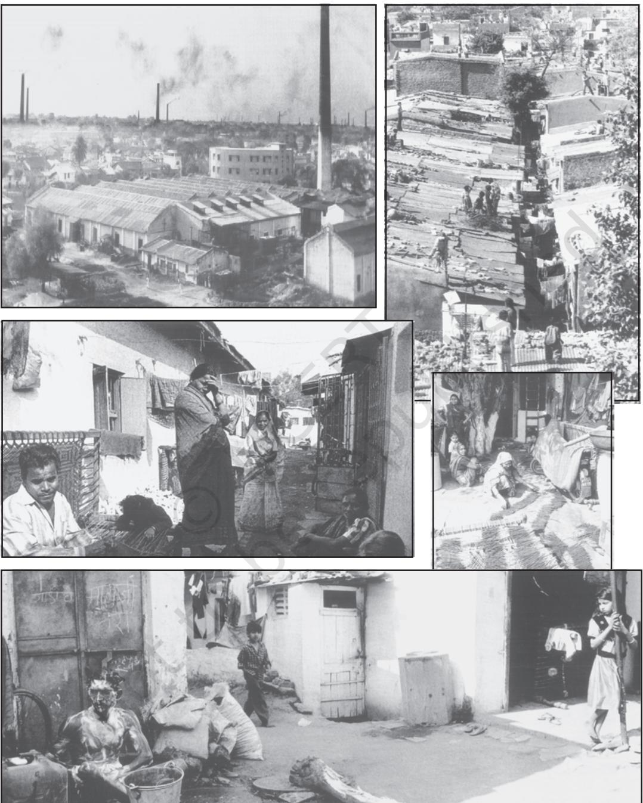

CHAPTER 1

# SOCIOLOGY AND SOCIETY

#### INTRODUCTION

Let us begin with some suggestions that are often made to young students like you. One advice often made is, "Study hard and you will do well in life." The second advice as often made is, " If you do this subject or set of subjects you will have a better chance of getting a good job in the future". The third could be, " As a boy this does not seem a correct choice of subject" or "As a girl, do you think your choice of subjects is a practical one?" The fourth, "Your family needs you to get a job soon so why choose a profession that will take a very long time" or "You will join your family business so why do you wish to do this subject?"

I

Let us examine the suggestions. Do you think the first advice contradicts the other three? For the first advice suggests that if you work very hard, you will do very well and get a good job. The onus rests upon the individual. The second advice suggests that apart from your individual effort, there is a job market that decides which subject choice may increase or decrease your chances in the job market. The third and fourth advice complicate the matter even more. It is not just our personal effort or just the job market that makes a difference — our gender and family or social background also matter.

Individual efforts matter a great deal but do not necessarily define outcomes. As we saw there are other social factors that play an important role in the final outcome. Here we have only mentioned the 'job market', the 'socioeconomic background' and 'gender'. Can you think of other factors? We could well ask, "Who decides what is a 'good job'?" Do all societies have similar notions of what is a "good job?" Is money the criteria? Or is it respect or social recognition or individual satisfaction that decides the worth of a job? Do culture and social norms have any role to play?

The individual student must study hard to do well. But how well h/she does is structured by a whole set of societal factors. The job market is defined by the needs of the economy.

The needs of the economy are again determined by the economic and political policies pursued by the government. The chances of the individual student are affected both by these broader political and economic measures as well as by the social background of her/his family. This gives us a preliminary sense of how sociology studies human society as an interconnected whole. And how society and the individual interact with each other. The problem of choosing subjects in the senior secondary school is a source of personal worry for the individual student. That this is a broader public issue, affecting students as a collective entity is self evident. One of the tasks of sociology is to unravel the connection between a personal problem and a public issue. This is the first theme of this chapter.

We have already seen that a 'good job' means different things to different societies. The social esteem that a particular kind of job has or does not have for an individual depends on the culture of his/her 'relevant society'. What do we mean by 'relevant society'? Does it mean the 'society' the individual belongs to? Which society does the individual belong to? Is it the neighbourhood? Is it the community? Is it the caste or tribe? Is it the professional circle of the parents? Is it the nation? Second, this chapter therefore looks at how the individual in modern times belongs to more than one society. And how societies are unequal.

Third, this chapter introduces sociology as a systematic study of society, distinct from philosophical and religious reflections, as well as our everyday common sense observation about society. Fourth, this distinct way of studying society can be better understood if we look back historically at the intellectual ideas and material contexts within which sociology was born and later grew. These ideas and material developments were mainly western but with global consequences. Fifth, we look at this global aspect and the manner in which sociology emerged in India. It is important to remember that just as each of us have a biography, so does a discipline. Understanding the history of a discipline helps understand the discipline. Finally the scope of sociology and its relationship to other disciplines is discussed.

# II

# THE SOCIOLOGICAL IMAGINATION: THE PERSONAL PROBLEM AND THE PUBLIC ISSUE

We began with a set of suggestions that drew our attention to how the individual and society are dialectically linked. This is a point that sociologists over several generations have been concerned with. C. Wright Mills rests his vision of the sociological imagination precisely in the unravelling of how the personal and public are related.

#### Activity 1

Read the text from Mills carefully. Then examine the visual and report below. Do you notice how the visual is of a poor and homeless couple? The sociological imagination helps to understand and explain homelessness as a public issue. Can you identify what could be the causes for homelessness? Different groups in your class can collect information on possible causes for example, employment possibilities, rural to urban migration, etc. Discuss these. Do you notice how the state considers homelessness as a public issue that requires concrete measures to be taken, for instance, the Pradhan Mantri Awas Yojna–Gramin?

The sociological imagination enables us to grasp history and biography and the relations between the two within society. That is its task and promise… Perhaps the most fruitful distinction with which the sociological imagination works is between 'the personal troubles of the milieu' and 'the public issues of social structure'... Troubles occur within the character of the individual and within the range of his immediate relations with others; they have to do with his self and with those limited areas of social life of which he is directly and personally aware... Issues have to do with matters that transcend these local environments of the individual and the range of his inner life. The facts of contemporary history are also facts about the success and the failure of individual men and women. When a society is industrialised, a peasant becomes a worker; a feudal lord is liquidated or becomes a businessman. When classes rise or fall, a man is employed or unemployed;

when the rate of investment goes up or down, a man takes new heart or goes broke. When wars happen, an insurance salesman becomes a rocket launcher; a store clerk, a radar man; a wife lives alone; a child grows up without a father. Neither the life of an individual nor the history of a society can be understood without understanding both... (Mills 1959).

The Pradhan Mantri Awas Yojna–Gramin, operationalised from 2016 is a major scheme by the Ministry of Rural Development (MORD) provides financial and labour support to houseless families and those living in dilapidated kutcha houses to build pucca houses. Can you think of other issues that show the connection between personal problems and public issues?

# III

#### PLURALITIES AND INEQUALITIES AMONG SOCIETIES

In the contemporary world we belong, in a sense, to more than one 'society'. When amidst foreigners reference to 'our society' may mean 'Indian society', but when amongst fellow Indians we may use the term 'our society' to denote a linguistic or ethnic community, a religious or caste or tribal society.

This diversity makes deciding which 'society' we are talking about difficult. But perhaps this difficulty of mapping society is not confined to sociologists alone as the comment below will show.

While reflecting on what to focus on in his films, the great Indian film maker Satyajit Ray wondered:

> What should you put in your films? What can you leave out? Would you leave the city behind and go to the village where cows graze in the endless fields and the shepherd plays the flute? You can make a film here that would be pure and fresh and have the delicate rhythm of a boatman's song.

> Or would you rather go back in time-way back to the Epics, where the gods and demons took sides in the great battle where brothers killed brothers…

> Or would you rather stay where you are, right in the present, in the heart of this monstrous, teeming, bewildering city, and try to orchestrate its dizzying contrasts of sight and sound and milieu?

This question of what to focus in society is indeed central to sociology. We can take Satyajit Ray's comments further and wonder whether his depiction of the village is romantic. It would be interesting to contrast this with a sociologist's account of the Dalit in the village below.

> The first time I saw him, he was sitting on the dusty road in front of one of the small thatchroofed tea shops in the village with his glass and saucer placed conspicuously beside him a silent signal to the shopkeeper that an Untouchable wanted to buy some tea. Muli was a gaunt fortyyear-old with betel-blackened teeth who wore his long hair swept back (Freeman 1978).

A quote from Amartya Sen perhaps illustrates well how inequality is central to differences among societies.

> Some Indians are rich; most are not. Some are very well educated; others are illiterate. Some lead easy lives of luxury; others toil hard for little reward. Some are politically powerful; others cannot influence anything. Some have great opportunities for advancement in life: others lack them altogether. Some are treated with respect by the police; others are treated like dirt. These are different kinds of inequality, and each of them requires serious attention (Sen 2005:210-11).

Discuss the visuals What kind of pluralities and inequalities do they show?

#### Activity 2

The recent National Family Health Survey of the Government of India suggests that access to sanitation facilities is more than 60 per cent. Find out about other indicators of social inequality, for instance education, health, employment etc.

### IV

#### INTRODUCING SOCIOLOGY

You have already been acquainted with the sociological imagination and the central concern of sociology to study society as an interconnected whole. Our discussion on the individual's choices and the job market showed how the economic, political, familial, cultural, educational institutions are interconnected. And how the individual is both constrained by it and yet can change it to an extent. The next few chapters will elaborate on different institutions as well as on culture. It will also focus on some key terms and concepts in sociology that will enable you to understand society. For sociology is the study of human social life, groups and societies. Its subject matter is our own behaviour as social beings.

Sociology is not the first subject to do so. People have always observed and reflected upon societies and groups in which they live. This is evident in the writings of philosophers, religious teachers, and legislators of all civilisations and epochs. This human trait to think about our lives and about society is by no means confined to philosophers and social thinkers. All of us do have ideas about our own everyday life and also about others' lives, about our own 'society' and also about others' 'society'. These are our everyday notions, our common sense in terms of which we live our lives. However the observations and ideas that sociology as a discipline makes about 'society' is different from both that of philosophical reflections and common sense.

Observations of philosophical and religious thinkers are often about what is moral or immoral in human behaviour, about the desirable way of living and about a good society. Sociology too concerns itself with norms and values. But its focus is not on norms and values as they ought to be, as goals that people should pursue. Its concern is with the way they function in actual societies. (In Chapter 3, you will see how sociology of religion is different from a theological study). Empirical study of societies is an important part of what sociologists do. This however does not mean that sociology is not concerned with values. It only means that when a sociologist studies a society, the sociologist is willing to observe and collect findings, even if they are not to her/his personal liking.

Peter Berger makes an unusual but effective comparison to make the point. In any political or military conflict it is of advantage to capture the information used by the intelligence organs of the opposing side. But this is so only because good intelligence consists of information free of bias. If a spy does his/her reporting in terms of the ideology and ambitions of his/her superiors, his/her reports are useless not only to the enemy, if the latter should capture them, but also to the spy's own side... The sociologist is a spy in very much the same way. His/her job is to report as accurately as he/she can about a certain terrain (Berger 1963:16-17).

Does this mean that the sociologist has no social responsibility to ask about the goals of his/her study or the work to which the sociological findings will be applied. He/she has such a responsibility, just like any other citizen of society. But this asking is not sociological asking. This is like the biologist whose biological knowledge can be employed to heal or kill. This does not mean the biologist is free of responsibility as to which use s/he serves. But this is not a biological question.

Sociology has from its beginnings understood itself as a science. Unlike commonsensical observations or philosophical reflections or theological commentaries, sociology is bound by scientific canons of procedure. It means that the statements that the sociologist arrives at must be arrived at through the observations of certain rules of evidence that allow others to check on or to repeat to develop his/her findings further. There has been considerable debate within sociology about the differences between natural science and human science, between quantitative and qualitative research. We need not enter this here. But what is relevant here is that sociology in its observation and analysis has to follow certain rules that can be checked upon by others. In the next section, we compare sociological knowledge to common sense knowledge which will once again emphasise the role of methods, procedures and rules in the manner in which sociology conducts its observation of society. Chapter 5 of this book will provide you with a sense of what sociologists do and how they go about studying society. An elaboration of the differences between sociology and common sense knowledge will help towards a clearer idea of the sociological approach and method.

#### SOCIOLOGY AND COMMON SENSE KNOWLEDGE

We have seen how sociological knowledge is different from theological and philosophical observations. Likewise sociology is different from common sense observations. The common sense explanations are generally based on what may be called 'naturalistic' and/or individualistic explanation. A naturalistic explanation for behaviour rests on the assumption that one can really identify 'natural' reasons for behaviour.

V

## Activity 3

An example of poverty has been given below and we also touched upon it in our discussion on the homeless. Think of other issues and how they could be explained in a naturalistic and sociological way.

Sociology thus breaks away from both common sense observations and ideas as well as from philosophical thought. It does not always or even generally lead to spectacular results. But meaningful and unsuspected connections can be reached only by sifting through masses of connections. Great advances in sociological knowledge have been made, generally incrementally and only rarely by a dramatic breakthrough.

Sociology has a body of concepts, methods and data, no matter how loosely coordinated. This cannot be substituted by common sense. Common sense is unreflective since it does not question its own origins. Or in other words it does not ask itself: "Why do I hold this view?" The sociologist must be ready to ask of any of our beliefs, about ourselves — no matter how cherished — "is this really so?" Both the systematic and questioning approach of sociology is derived from a broader tradition of scientific investigation. This emphasis on

| Explanation of | Naturalistic | Sociological |
| --- | --- | --- |
| Poverty | People are poor because they are | Contemporary poverty is caused |
|  | afraid of work, come from | by the structure of inequality in |
|  | 'problem families', are unable to | class society and is experienced |
|  | budget properly, suffer from low | by those who suffer from chronic |
|  | intelligence and shiftlessness. | irregularity of work and low |
|  |  | wages (Jayaram 1987:3). |

#### Unsuspected Connections?

In many societies, including in many parts of India, the line of descent and inheritance passes from father to son. This is understood as a patrilineal system. Keeping in mind that women tend not to get property rights, the Government of India in the aftermath of the Kargil War decided that financial compensation for the death of Indian soldiers should go to their widows so that they were provided for.

The government had certainly not anticipated the unintended consequence of this decision. It led to many forced marriages of the widows with their brotherin-law (husband's brother or *dewar*). In some cases the brother-in-law (then husband) was a young child and the sister-in-law (then wife) a young woman. This was to ensure that the compensation remained with the deceased man's patrilineal family. Can you think of other such unintended consequences of a social action or a state measure?

scientific procedures can be understood only if we go back in time and understand the context or social situation within which the sociological perspective emerged as sociology was greatly influenced by the great developments in modern science. Let us have a very brief look at what intellectual ideas went into the making of sociology.

### VI

### THE INTELLECTUAL IDEAS THAT WENT INTO THE MAKING OF SOCIOLOGY

Influenced by scientific theories of natural evolution and findings about pre-modern societies made by early travellers, colonial administrators, sociologists and social anthropologists sought to categorise societies into types and to distinguish stages in social development. These features reappear in the 19th century in works of early sociologists, Auguste Comte, Karl Marx and Herbert Spencer*.* Efforts were therefore made to classify different types of societies on that basis, for instance:

- Types of pre-modern societies such as hunters and gatherers, pastoral and agrarian, agrarian and nonindustrial civilisations.
- Types of modern societies such as the industrialised societies.

Such an evolutionary vision assumed that the west was necessarily the most advanced and civilised. Non- western societies were often seen as barbaric and less developed. The Indian colonial experience has to be seen in this light. Indian sociology reflects this tension which "go far back to the history of British colonialism and the intellectual and ideological response to it…" (Singh 2004:19). Perhaps because of this backdrop, Indian sociology has been particularly thoughtful and reflexive of its practice (Chaudhuri 2003). You will be engaging with Indian sociological thought, its concerns and practice in greater detail in the book, *Understanding Society*.

Darwin's ideas about organic evolution were a dominant influence on early sociological thought. Society was often compared with living organisms and efforts were made to trace its growth through stages comparable to those of organic life. This way of looking at society as a system of parts, each part playing a given function influenced the study of social institutions like the family or the school and structures such as stratification. We mention this here because the intellectual ideas that went into the making of sociology have a direct bearing on how sociology studies empirical reality.

The Enlightenment, an European intellectual movement of the late 17th and 18th centuries, emphasised reason and individualism. There was also great advancement of scientific knowledge and a growing conviction that the methods of the natural sciences should and could be extended to the study of human affairs. For example poverty, so far seen as a 'natural phenomenon', began to be seen as a 'social problem' caused by human ignorance or exploitation. Poverty therefore could be studied and redressed. One way of studying this was through the social survey that was based on the belief that human phenomena can be classified and measured. You will be discussing social survey in chapter 5.

Thinkers of the early modern era were convinced that progress in knowledge promised the solution to all social ills. For example, Auguste Comte, the French scholar (1789–1857), considered to be the founder of sociology, believed that sociology would contribute to the welfare of humanity.

#### VII

# THE MATERIAL ISSUES THAT WENT INTO THE MAKING OF SOCIOLOGY

The Industrial Revolution was based upon a new, dynamic form of economic activity — capitalism. This system of capitalism became the driving force behind the growth of industrial manufacturing. Capitalism involved new attitudes and institutions. Entrepreneurs now engaged in the sustained, systematic pursuit of profit. The markets acted as the key instrument of productive life. And goods, services and labour became commodities whose use was determined by rational calculation.

The new economy was completely different from what it replaced. England was the centre of the Industrial Revolution. In order to understand how far–reaching change industrialisation brought about was, we take a quick look at what life in preindustrial England was like. Before industrialisation, agriculture and textiles were the chief occupations of the British. Most people lived in villages. Like in our own Indian villages, there were peasants and landlords, the blacksmith and leather worker, the weaver and the potter, the shepherd and the brewer. Society was small. It was hierarchical, i.e. the status and class positions of different people were clearly defined. Like all traditional societies it was also characterised by close interaction. With industrialisation each of these features changed.

One of the most fundamental aspects of the new order was the degradation of labour, the wrenching of work from the protective contexts of guild, village, and family. Both the radical and conservative thinkers were appalled at the decline of the status of the common labourer, not to mention the skilled craftsman.

Urban centres expanded and grew. It was not that there were no cities earlier. But their character prior to industrialisation was different. The industrial cities gave birth to a completely new kind of urban world. It was marked by the soot and grime of factories, by overcrowded slums of the new industrial working class, bad sanitation and general squalor. It was also marked by new kinds of social interactions.

The Hindi film song on the next page captures both the material as well

From working class neighbourhoods to slum localitites

as the experiential aspects of city life. From the film *C.I.D.* 1956

> *Aye dil hai mushkil jeena yahan Zara hat ke, zara bach ke, yeh hai Bombay meri jaan Kahin building kahin traame, kahin motor kahin mill Milta hai yahan sab kuchh ik milta nahin dil Insaan ka nahin kahin naam-onishaan Kahin satta, kahin patta kahin chori kahin res Kahin daaka, kahin phaaka kahin thokar kahin thes Bekaaro ke hain kai kaam yahan Beghar ko aawara yahan kehte has has Khud kaate gale sabke kahe isko business Ik cheez ke hain kai naam yahan Geeta Bura duniya woh hai kehta aisa bhola tu na ban Jo hai karta woh hai bharta hai yahan ka yeh chalan*

PARAPHRASE: Dear heart, life is hard here, you must watch where you're going if you want to save yourself, this is Bombay my dear! You'll find buildings, you'll find trams, you'll find motors, you'll find mills, you'll find everything here except a human heart, there's no trace of humanity here. So much of what is done here is meaningless, it's either power, or it's money, or it's theft, or it's cheating. The rich mock the homeless as vagabonds, but when they cut each other's throats themselves, it's called business! The same action is given various names in this place.

#### Activity 4

Note how quickly Britain, the seat of the Industrial Revolution became an urban from a predominantly rural society. Was this process identical in India?

1810: 20 per cent of the population lived in towns and cities.

1910: 80 per cent of the population lived in towns and cities.

Significantly the impact of the same process was different in India, Urban centres did grow. But with the entry of British manufactured goods, more people moved into agriculture.

The mass of Indian handicraftsmen ruined as a result of the influx of manufactured machine-made goods of British industries were not absorbed in any extensively developed indigenous industries. The ruined mass of these handicraftsmen, in the main, took to agriculture for subsistence (Desai 1975:70).

The factory and its mechanical division of labour were often seen as a deliberate attempt to destroy the peasant, the artisan, as well as family and local community. The factory was perceived as an archetype of an economic regimentation hitherto known only in barracks and prisons. According to Karl Marx the factory was oppressive. Yet potentially liberating. Here workers learnt both collective

functioning as well as concerted efforts for better conditions.

Another indicator of the emergence of modern societies was the new significance of clock-time as a basis of social organisation. A crucial aspect of this was the way in which, in the 18th and 19th centuries, the tempo of agricultural and manufacturing labour increasingly came to be set by the clock and calendar in a way very different from pre-modern forms of work. Prior to the development of industrial capitalism, work-rhythms were set by factors such as the period of daylight, the break between tasks and the constraints of deadlines or other social duties. Factory production implied the synchronisation of labour — it began punctually, had a steady pace and took place for set hours and on particular days of the week. In addition, the clock injected a new urgency to work. For both employer and employee 'time is now money: it is not passed but spent.'

#### Activity 5

Find out how work is organised in a traditional village, a factory and a call centre.

#### Activity 6

Find out how industrial capitalism changed Indian lives in villages and cities.

#### VIII

# WHY SHOULD WE STUDY THE BEGINNING AND GROWTH OF SOCIOLOGY IN EUROPE?

Most of the issues and concerns of sociology also date back to a time when European society was undergoing tumultuous changes in the 18th and 19th centuries with the advent of capitalism and industrialisation. Many of the issues that were raised then, for example, urbanisation or factory production, are pertinent to all modern societies, even though their specific features may vary. Indeed, Indian society with its colonial past and incredible diversity is distinct. The sociology of India reflects this.

If this is so, why focus on Europe of that time? Why is it relevant to start there? The answer is relatively simple. For our past, as Indians are closely linked to the history of British capitalism and colonialism. Capitalism in the west entailed a world-wide expansion. The passages in the box on next page represent but two strands in the manner that western capitalism impacted the world.

R.K. Laxman's travelogue of Mauritius brings home the presence of this colonial and global past.

> Here Africans and Chinese, Biharis and Dutch, Persians and Tamils, Arabs, French and English all rub merrily with one another... A Tamil, for instance, bears a deceptively south Indian face and a name to go with it to boot; Radha Krishna

#### Capitalism and its global but uneven transformation of societies

Between the 17th and 19th centuries an estimated 24 million Africans were enslaved. 11 million of them survived the journey to the Americas in one of a number of great movements of population that feature in modern history. They were plucked from their existing homes and cultures, transported around the world in appalling conditions, and put to work in the service of capitalism. Enslavement is a graphic example of how people were caught up in the development of modernity against their will. The institution of slavery declined in the 1800s. But for us in India it was in the 1800s that indentured labour was taken in ships by the British for running their cotton and sugar plantations in distant lands such as Surinam in South America or in the West Indies or the Fiji Islands. V.S. Naipaul the great English writer who won the Nobel prize is a descendant of one of these thousands who were taken to lands they had never seen and who died without being able to return.

Govindan is indeed from Madras. I speak to him in Tamil. He surprises me by responding in a frightfully mangled English with a heavy French accent. Mr Govindan has no knowledge of Tamil and his tongue has ceased curling to produce Tamil sounds centuries ago (Laxman 2003) !

#### IX

#### THE GROWTH OF SOCIOLOGY IN INDIA

Colonialism was an essential part of modern capitalism and industrialisation. The writings of Western sociologists on capitalism and other aspects of modern society are therefore relevant for understanding social change in India. Yet as we saw with reference to urbanisation, colonialism implied that the impact of industrialisation in India was not necessarily the same as in the west. Karl Marx's comments on the impact of the East India Company bring out the contrast.

India, the great workshop of cotton manufacture for the world, since immemorial times, now became inundated with English twists and cotton stuffs. After its own produce had been excluded from England, or only admitted on the most cruel terms, British manufactures were poured into it at a small and merely nominal duty, to the ruin of the native cotton fabrics once so celebrated (Marx 1853 cited in Desai 1975).

Sociology in India also had to deal with western writings and ideas about Indian society that were not always correct. These ideas were expressed both in the accounts of colonial officials as well western scholars. For many of them Indian society was a contrast to western society. We take just one example here, the way the Indian village was understood and portrayed as unchanging.

In keeping with contemporary-Victorian-evolutionary ideas, western writers saw in the Indian village a remnant or survival from what was called "the infancy of society". They saw in nineteenth-century India the past of the European society.

Yet another evidence of the colonial heritage of countries like India is the distinction often made between sociology and social anthropology. A standard western textbook definition of sociology is "the study of human groups and societies, giving particular emphasis to the analysis of the industrialised world" (Giddens 2001: 699). A standard western definition of social anthropology would be the study of simple societies of non-western and therefore "other" cultures. In India the story is quite different. M.N. Srinivas maps the trajectory:

> In a country such as India, with its size and diversity, regional, linguistic, religious, sectarian, ethnic (including caste), and between rural and urban areas, there are a myriad 'others'... In a culture and society such as India's, 'the other' can be encountered literally next door... (Srinivas 1966:205).

Furthermore social anthropology in India moved gradually from a preoccupation with the study of 'primitive people' to the study of peasants, ethnic groups, social classes, aspects and features of ancient civilisations, and modern industrial societies. No rigid divide exists between sociology and social anthropology in India, a characteristic feature of the two subjects in many western countries. Perhaps the very diversity of the modern and traditional, of the village and the metropolitan in India accounts for this.

# THE SCOPE OF SOCIOLOGY AND ITS RELATIONSHIP TO OTHER SOCIAL SCIENCE DISCIPLINES

X

The scope of sociological study is extremely wide. It can focus its analysis of meaningful interactions between individuals such as that of a shopkeeper with a customer, between teachers and students, between two friends or family members. It can likewise focus on national issues such as unemployment or caste conflict or the effect of state policies on forest rights of the tribal population or rural indebtedness. Or examine global social processes such as: the impact of new flexible labour regulations on the working class; or that of the electronic media on the young; or the entry of foreign universities on the education system of the country. What defines the discipline of sociology is therefore not just what it studies (i.e. family or trade unions or villages) but how it studies a chosen field.

Sociology is one of a group of social sciences, which also includes anthropology, economics, political science and history. The divisions among the various social sciences are not clearcut, and all share a certain range of common interests, concepts

Discuss how you think history, sociology, political science, economics will study fashion/clothes, market places and city streets

and methods. It is therefore very important to understand that the distinctions of the disciplines are to some extent arbitrary and should not be seen in a straitjacket fashion. To differentiate the social sciences would be to exaggerate the differences and gloss over the similarities. Furthermore feminist theories have also shown the greater need of interdisciplinary approach. For instance how would a political scientist or economist study gender roles and their implications for politics or the economy without a sociology of the family or gender division of labour.

#### Sociology and Economics

Economics is the study of production and distribution of goods and services. The classical economic approach dealt almost exclusively with the inter relations of pure economic variables: the relations of price, demand and supply; money flows; output and input ratios, and the like. The focus of traditional economics has been on a narrow understanding of 'economic activity', namely the allocation of scarce goods and services within a society. Economists who are influenced by a political economy approach seek to understand economic activity in a broader framework of ownership of and relationship to means of production. The objective of the dominant trend in economic analysis was however to formulate precise laws of economic behaviour.

The sociological approach looks at economic behaviour in a broader

#### Activity 7

- Do you think advertisements actually influence people's consumption patterns?
- Do you think the idea of what defines 'good life' is only economically defined?
- Do you think 'spending' and 'saving' habits are culturally formed?

context of social norms, values, practices and interests. The corporate sector managers are aware of this. The large investment in the advertisement industry is directly linked to the need to reshape lifestyles and consumption patterns. Trends within economics such as feminist economics seek to broaden the focus, drawing in gender as a central organising principle of society. For instance they would look at how work in the home is linked to productivity outside.

The defined scope of economics has helped in facilitating its development as a highly focused, coherent discipline. Sociologists often envy the economists for the precision of their terminology and the exactness of their measures. And the ability to translate the results of their theoretical work into practical suggestions having major implications for public policy. Yet economists' predictive abilities often suffer precisely because of their neglect of individual behaviour, cultural norms and institutional resistance which sociologists study.

Pierre Bourdieu wrote in 1998.

A true economic science would look at all the costs of the economy-not only at the costs that corporations are concerned with, but also at crimes, suicides, and so on.

We need to put forward an economics of happiness, which would take note of all the profits, individual and collective, material and symbolic, associated with activity (such as security), and also the material and symbolic costs associated with inactivity or precarious employment (for example consumption of medicines: France holds the world record for the use of tranquilisers), (cited in Swedberg 2003).

Sociology unlike economics usually does not provide technical solutions. But it encourages a questioning and critical perspective. This helps questioning of basic assumptions. And thereby facilitates a discussion of not just the technical means towards a given goal, but also about the social desirability of a goal itself. Recent trends have seen a resurgence of economic sociology perhaps because of both this wider and critical perspective of sociology.

Sociology provides clearer or more adequate understanding of a social situation than existed before. This can be either on the level of factual knowledge, or through gaining an improved grasp of why something is happening (in other words, by means of theoretical understanding).

# Sociology and Political Science

As in the case of economics, there is an increased interaction of methods and approaches between sociology and political science. Conventional political science was focused primarily on two elements: political theory and government administration. Neither branch involves extensive contact with political behaviour. The theory part usually focuses on the ideas about government from Plato to Marx while courses on administration generally deal with the formal structure of government rather than its actual operation.

Sociology is devoted to the study of all aspects of society, whereas conventional political science restricted itself mainly to the study of power as embodied in formal organisation. Sociology stresses the interrelationships between sets of institutions including government, whereas political science tends to turn attention towards the processes within the government.

However, sociology long shared similar interests of research with

# Activity 8

Find out the kind of studies that were conducted during the last general elections. You will probably find both features of political science and sociology in them. Discuss how disciplines interact and mutually influence each other.

political science. Sociologists like Max Weber worked in what can be termed as political sociology. The focus of political sociology has been increasingly on the actual study of political behaviour. Even in the recent Indian elections one has seen the extensive study of political patterns of voting. Studies have also been conducted in membership of political organisations, process of decisionmaking in organisations, sociological reasons for support of political parties, the role of gender in politics, etc.

#### Sociology and History

Historians almost as a rule study the past, sociologists are more interested in the contemporary or recent past. Historians earlier were content to delineate the actual events, to establish how things actually happened, while in sociology the focus was to seek to establish causal relationships.

History studies concrete details while the sociologist is more likely to abstract from concrete reality, categorise and generalise. Historians today are equally involved in doing sociological methods and concepts in their analysis.

Conventional history has been about the history of kings and war. The

#### Activity 9

Find out how historians have written about the history of art, of cricket, of clothes and fashion, of architecture and housing styles.

history of less glamorous or exciting events as changes in land relations or gender relations within the family have traditionally been less studied by historians but formed the core area of the sociologist's interest. Today, however history is far more sociological and social history is the stuff of history. It looks at social patterns, gender relations, mores, customs and important institutions other than the acts of rulers, wars and monarchy.

#### Sociology and Psychology

Psychology is often defined as the science of behaviour. It involves itself primarily with the individual. It is interested in her/his intelligence and learning, motivations and memory, nervous system and reaction time, hopes and fears. Social psychology, which serves as a bridge between psychology and sociology, maintains a primary interest in the individual but concerns itself with the way in which the individual behaves in social groups, collectively with other individuals.

Sociology attempts to understand behaviour as it is organised in society, that is the way in which personality is shaped by different aspects of society. For instance, economic and political system, their family and kinship structure, their culture, norms and values. It is interesting to recall that Durkheim who sought to establish a clear scope and method for sociology in his well-known study of suicide left out individual intentions of those who commit or try to commit suicide in favour of statistics concerning various social characteristics of these individuals.

# Sociology and Social Anthropology

Anthropology in most countries incorporates archaeology, physical anthropology, cultural history, many branches of linguistics and the study of all aspects of life in "simple societies". Our concern here is with social anthropology and cultural anthropology for it is that which is close to the study of sociology. Sociology is deemed to be the study of modern, complex societies while social anthropology was deemed to be the study of simple societies.

As we saw earlier, each discipline has its own history or biography. Social anthropology developed in the west at a time when it meant that western-trained social anthropologists studied non-European societies often thought of as exotic, barbaric and uncivilised. This unequal relationship between those who studied and those who were studied as not remarked upon too often earlier. But times have changed and we have the erstwhile 'natives' be they Indians or Sudanese, Nagas or Santhals, who now speak and write about their own societies. The anthropologists of the past documented the details of simple societies apparently in a neutral scientific fashion. In practice they were constantly comparing those societies with the model of the western modern societies as a benchmark.

Other changes have also redefined the nature of sociology and social anthropology. Modernity as we saw led to a process whereby the smallest village was impacted by global processes. The most obvious example is colonialism. The most remote village of India under British colonialism saw its land laws and administration change, its revenue extraction alter, its manufacturing industries collapse.

Tea pickers in Assam

#### Activity 10

- Find out where in India did ancestors of the community of Santhal workers who have been working in the tea plantations in Assam come from.
- When was tea cultivation started in Assam?
- Did the British drink tea before colonialism?

Contemporary global processes have further accentuated this 'shrinking of the globe'. The assumption of studying a simple society was that it was bounded. We know this is not so today.

The traditional study of simple, non-literate societies by social anthropology had a pervasive influence on the content and the subject matter of the discipline. Social anthropology tended to study society (simple societies) in all their aspects, as wholes. In so far as they specialised, it was on the basis of area as for example the Andaman Islands, the Nuers or Melanesia. Sociologists study complex societies and would therefore often focus on parts of society like the bureaucracy or religion or caste or a process such as social mobility.

Social anthropology was characterised by long field work tradition, living in the community studied and using ethnographic research methods. Sociologists have often relied on survey method and quantitative data using statistics and the questionnaire mode. Chapter 5 will give you a more comprehensive account of these two traditions.

Today the distinction between a simple society and a complex one itself needs major rethinking. India itself is a complex mix of tradition and modernity, of the village and the city, of caste and tribe, of class and community. Villages nestle right in the heart of the capital city of Delhi. Call centres serve European and American clients from different towns of the country.

Indian sociology has been far more eclectic in borrowing from both traditions. Indian sociologists often studied Indian societies that were both part of and not of one's own culture. It could also be dealing with both complex differentiated societies of urban modern India as well as the study of tribes in a holistic fashion.

It had been feared that with the decline of simple societies, social anthropology would lose its specificity and merge with sociology. However there have been fruitful interchanges between the two disciplines and today often methods and techniques are drawn from both. There have been anthropological studies of the state and globalisation, which are very different from the traditional subject matter of social anthropology. On the other hand, sociology too has been using quantitative and qualitative techniques, macro and micro approaches for studying the complexities of modern societies. As mentioned before we will in a sense carry on this discussion in Chapter 5 . For in India, sociology and social anthropology have had a very close relationship.

# GLOSSARY

Capitalism : A system of economic enterprise based on market exchange. "Capital" refers to any asset, including money, property and machines, which can be used to produce commodities for sale or invested in a market with the hope of achieving a profit. This system rests on the private ownership of assets and the means of production.

Dialectic : The existence or action of opposing social forces, for instance, social constraint and individual will.

Empirical Investigation : A factual enquiry carried out in any given area of sociological study.

Feminist Theories : A sociological perspective which emphasises the centrality of gender in analysing the social world. There are many strands of feminist theory, but they all share in common the desire to explain gender inequalities in society and to work to overcome them.

Social Constraint : A term referring to the fact that the groups and societies of which we are a part exert a conditioning influence on our behaviour.

Values : Ideas held by human individual or groups about what is desirable, proper, good or bad. Differing values represent key aspects of variations in human culture.

# EXERCISES

- 1. Why is the study of the origin and growth of sociology important?
- 2. Discuss the different aspects of the term 'society'. How is it different from your common sense understanding?
- 3. Discuss how there is greater give and take among disciplines today.
- 4. Identify any personal problem that you or your friends or relatives are facing. Attempt a sociological understanding.

#### READINGS

- BERGER , PETER L. 1963. *Invitation to Sociology : A Humanistic Perspective*. Penguin, Harmondsworth.
- BIERSTEDT, ROBERT. 1970. *Social Order*. Tata Mc. Graw-Hill Publishing Co. Ltd, Mumbai.
- BOTTOMORE, TOM. 1962. *Sociology* : *A Guide to Problems and Literature.* George, Allen and Unwin, London.
- CHAUDHURI, MAITRAYEE. 2003. *The Practice of Sociology.* Orient Longman, New Delhi.
- DESAI, A.R. 1975. *Social Background of Indian Nationalism.* Popular Prakashan, Mumbai.
- DUBE, S.C. 1977. *Understanding Society : Sociology : The Discipline and its Significance :* Part I. NCERT, New Delhi.
- FREEMAN, JAMES M. 1978. *'*Collecting the Life History of an Indian Untouchable'*,* from VATUK, SYLVIA. ed., *American Studies in the Anthropology of India.* Manohar Publishers, Delhi.
- GIDDENS, ANTHONY. 2001. *Sociology.* Fourth Edition, Polity Press, Cambridge.
- INKELES, ALEX. 1964. *What is Sociology? An Introduction to the Discipline and Profession.* Prentice Hall, New Jersey.
- JAYARAM, N. 1987. *Introductory Sociology*. Macmillan India Ltd, Delhi.
- LAXMAN, R.K. 2003. *The Distorted Mirror*. Penguin, Delhi.
- MILLS, C. WRIGHT. 1959. *The Sociological Imagination.* Penguin, Harmondsworth.
- SINGH, YOGENDRA. 2004. *Ideology and Theory in Indian Sociology.* Rawat Publications, New Delhi.
- SRINIVAS, M.N. 2002. *Village, Caste. Gender and Method : Essays in Indian Social Anthropology.* Oxford University Press, New Delhi.
- SWEDBERG, RICHARD. 2003. *Principles of Economic Sociology.* Princeton University Press, Princeton and Oxford.

