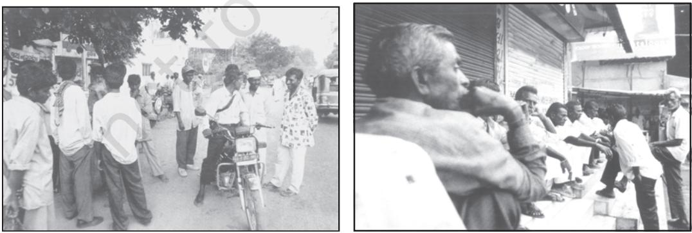

CHAPTER 2

# TERMS, CONCEPTS AND THEIR USE IN SOCIOLOGY

# INTRODUCTION

The previous chapter introduced us to an idea both about society as well as sociology. We saw that a central task of sociology is to explore the interplay of society and the individual. We also saw that individuals do not float freely in society but are part of collective bodies like the family, tribe, caste, class, clan, nation. In this chapter, we move further to understand the kinds of groups individuals form, the kinds of unequal orders, stratification systems within which, individuals and groups are placed, the way social control operates, the roles that individuals have and play, and the status they occupy.

I

In other words we start exploring how society itself functions. Is it harmonious or conflict ridden? Are status and roles fixed? How is social control exercised? What kinds of inequalities exist? The question however remains as to why do we need specific terms and concepts to understand this. Why does sociology need to have a special set of terms when we use terms like status and roles or social control anyway in our everyday life?

For a discipline such as, say, nuclear physics that deals with matters unknown to most people and for which no word exists in common speech, it seems obvious that a discipline must develop a terminology. However, terminology is possibly even more important for sociology, just because its subject matter is familiar and just because words do exist to denote it. We are so well acquainted with the social institutions that surround us that we cannot see them clearly and precisely (Berger 1976:25).

For example we may feel that since we live in families we know all about families. This would be conflating or equating sociological knowledge with common sense knowledge or naturalistic explanation, which we have discussed in Chapter 1.

We also found in the previous chapter how sociology as a discipline has a biography or history. We saw how certain material and intellectual developments shaped the sociological perspective as well as its concerns. Likewise sociological concepts too have a story to tell. Many of the concepts reflect the concern of social thinkers to understand and map the social changes that the shift from pre-modern to modern entailed. For instance sociologists observed that simple, small scale and traditional societies were more marked by close, often face-toface interaction. And modern, large scale societies by formal interaction. They therefore distinguished primary from secondary groups, community from society or association. Other concepts like stratification reflect the concern that sociologists had in understanding the structured inequalities between groups in society.

Concepts arise in society. However just as there are different kinds of individuals and groups in society so there are different kinds of concepts and ideas. And sociology itself is marked by different ways of understanding society and looking at dramatic social changes that the modern period brought about.

We have seen how even in the early stage of sociology's emergence there were contrary and contesting understandings of society. If for Karl Marx class and conflict were key concepts to understand society, social solidarity and collective conscience were key terms for Emile Durkheim. In the Post-World War II period sociology was greatly influenced by the structural functionalists who found society essentially harmonious. They found it useful to compare society to an organism where different parts have a function to play for the maintenance of the whole. Others, in particular the conflict theorists influenced by Marxism saw society as essentially conflict ridden.

Within sociology some tried to understand human behaviour by starting with the individual, i.e. micro interaction. Others began with macro structures such as class, caste, market, state or even community. Concepts such as status and role begin with the individual. Concepts such as social control or stratification begin from a larger context within which individuals are already placed.

The important point is that these classifications and types that we discuss in sociology help us as the tools through which we can understand reality. They are keys to open locks to understand society. They are entry points in our understanding, not the final answer. But what if the key becomes rusted or bent or does not fit the lock, or fits in with effort? In such situations we need to change or modify the key. In sociology we both use and also constantly interrogate or question the concepts and categories.

Very often there is considerable unease about the coexistence of different kinds of definitions or concepts or even just different views about the same social entity. For example conflict theory versus the functionalist theory. This multiplicity of approaches is particularly acute in sociology. And it

cannot but be otherwise for society itself is diverse.

### Activity 1

Choose any one of the following topics for class discussion :

- democracy is a help or hindrance to development
- gender equality makes for a more harmonious or more divisive society
- punishments or greater discussion are the best way to resolve conflicts.

Think of other topics.

What kind of differences emerged? Do they reflect different visions of what a good society ought to be like? Do they reflect different notions of the human being?

In our discussion on the various terms you will notice how there exists divergence of views. And how this very debate and discussion of differences helps us understand society.

### II

### SOCIAL GROUPS AND SOCIETY

Sociology is the study of human social life. A defining feature of human life is that humans interact, communicate and construct social collectivities. The comparative and historical perspective of sociology brings home two apparently innocuous facts. The first that in every society whether ancient or feudal or modern, Asian or European or African human groups and collectivities exist. The second that the types of groups and collectivities are different in different societies.

Any gathering of people does not necessarily constitute a social group. Aggregates are simply collections of people who are in the same place at the same time, but share no definite connection with one another. Passengers waiting at a railway station or airport or bus stop or a cinema audience are examples of aggregates. Such aggregates are often termed as quasi groups.

What kind of groups are these?

A quasi group is an aggregate or combination, which lacks structure or organisation, and whose members may be unaware, or less aware, of the existence of groupings. Social classes, status groups, age and gender groups, crowds can be seen as examples of quasi groups. As these examples suggest quasi groups may well become social groups in time and in specific circumstances. For example, individuals belonging to a particular social class or caste or community may not be organised as a collective body. They may be yet to be infused with a sense of "we" feeling. But class and caste have over a period of time given rise to political parties. Likewise people of different communities in India have over the long anti-colonial struggle developed an identity as a collectivity and group — a nation with a shared past and a common future. The women's movement brought about the idea of women's groups and organisation. All these examples draw attention to how social groups emerge, change and get modified.

A social group can be said to have at least the following characteristics :

- (i) persistent interaction to provide continuity;
- (ii) a stable pattern of these interactions;
- (iii) a sense of belonging to identify with other members, i.e. each individual is conscious of the group itself and its own set of rules, rituals and symbols;
- (iv) shared interest;
- (v) acceptance of common norms and values; and
- (vi) a definable structure.

Social structure here refers to patterns of regular and repetitive interaction between individuals or groups. A social group thus refers to a collection of continuously interacting persons who share common interest, culture, values and norms within a given society.

### Activity 2

Find out a name that is relevant under each heading.

| Caste | An anti – caste movement | A caste based political party |
| --- | --- | --- |
| Class | A class based movement | A class based political party |
| Women | A women's movement | A women's organisation |
| Tribe | A tribal movement | A tribe/tribes based political party |
| Villagers | An environmental movement | An environmental organisation |

Discuss whether they were all social groups to start with and if some were not, then at what point can one apply the term 'social group' to them, using the term as sociologically understood.

### Activity 3

Discuss the age group of teenagers. Is it a quasi group or social group? Were ideas about 'teenage' and 'teenagers' as a special phase in life always there? In traditional societies how was the entry of children into adulthood marked? In contemporary times do marketing strategies and advertisement have anything to do with the strengthening or weakening of this group/quasi group? Identify an advertisement that targets teenagers or pre-teens. Read the section on stratification and discuss how teenage may mean very different life experiences for the poor and rich, for the upper and lower class, for the discriminated and privileged caste.

# TYPES OF GROUPS

As you read through this section on groups you will find that different sociologists and social anthropologists have categorised groups into different types. What you will be struck with however is that there is a pattern in the typology. In most cases they contrast the manner in which people form groups in traditional and small scale societies to that of modern and large scale societies. As mentioned earlier, they were struck by the difference between close, intimate, face-to-face interaction in traditional societies and impersonal, detached, distant interaction in modern societies. However a complete contrast is probably not an accurate description of reality.

### Primary and Secondary Social Groups

The groups to which we belong are not all of equal importance to us. Some groups tend to influence many aspects of our lives and bring us into personal association with others. The term primary group is used to refer to a small group of people connected by intimate and face-to-face association and co-operation. The members of primary groups have a sense of belonging. Family, village and groups

Contrast the two types of groups.

of friends are examples of primary groups.

Secondary groups are relatively large in size, maintain formal and impersonal relationships. The primary groups are person-oriented, whereas the secondary groups are goal oriented. Schools, government offices, hospitals, students' associations etc. are examples of secondary groups.

# Community and Society or Association

The idea of comparing and contrasting the old traditional and agrarian way of life with the new modern and urban one in terms of their different and contrasting social relationships and lifestyles, dates back to the writings of classical sociologists.

The term 'community' refers to human relationships that are highly personal, intimate and enduring, those where a person's involvement is considerable if not total, as in the family, with real friends or a close-knit group.

'Society' or 'association' refers to everything opposite of 'community', in particular the apparently impersonal, superficial and transitory relationships of modern urban life. Commerce and industry require a more calculating, rational and self-interesting approach to one's dealings with others. We make contracts or agreements rather than getting to know one another. You may draw a parallel between the community with the primary group and the association with the secondary group.

# Activity 4

Collect a copy of a memorandum of any association that you know of or can find out about for example a Residents Welfare Association, a women's association (Mahila Samiti), a Sports Club. You will find clear information about its goals, objectives, membership and other rules that govern it. Contrast this with a large family gathering.

You may find that many a time that interaction among members of a formal group over time becomes closes and 'just like family and friends.' This brings home the point that concepts are not fixed and frozen entities. They are indeed keys or tools for understanding society and its changes.

#### In-Groups and Out-Groups

A sense of belonging marks an ingroup. This feeling separates 'us' or 'we' from 'them' or 'they'. Children belonging to a particular school may form an 'in-group' as against those who do not belong to the school. Can you think of other such groups?

An out-group on the other hand is one to which the members of an ingroup do not belong. The members of an out-group can face hostile reactions from the members of the in-group. Migrants are often considered as an out-group. However, even here the actual definition of who belongs and who does not, changes with time and social contexts.

The well known sociologist M.N. Srinivas observed while he was carrying out a census in Rampura in 1948 how distinctions were made between recent and later migrants. He writes:

> I heard villagers use two expressions which I came to realise were significant: the recent immigrants were almost contemptuously described as *nenne monne bandavartu* ('came yesterday or the day before') while old immigrants were described as *arsheyinda bandavaru* ('came long ago') or *khadeem kulagalu* ('old lineages'), (Srinivas 1996:33).

# Activity 5

Find out about the experience of immigrants in other countries. Or may be even from different parts of our own country.

You will find that relationships between groups change and modify. People once considered members of an out-group become in-group members. Can you find out about such processes in history?

# Reference Group

For any group of people there are always other groups whom they look up to and aspire to be like. The groups whose lifestyles are emulated are known as reference groups. We do not belong to our reference groups but we do identify ourselves with that group. Reference groups are important sources of information about culture, lifestyle, aspiration and goal attainments.

In the colonial period many middle class Indians aspired to behave like proper Englishman. In that sense they could be seen as a reference group for the aspiring section. But this process was gendered, i.e. it had different implications for men and women. Often Indian men wanted to dress and dine like the British men but wanted the Indian women to remain 'Indian' in their ways. Or aspire to be a bit like the proper English woman but also not quite like her. Do you still find this valid today?

### Peer Groups

This is a kind of primary group, usually formed between individuals who are either of similar age or who are in a common professional group. Peer pressure refers to the social pressure exerted by one's peers on what one ought to do or not.

### Activity 6

Do your friends or others of your age group influence you? Are you concerned with their approval or disapproval about the way you dress, behave, the kind of music you like to listen to or the kind of films you prefer? Do you consider it to be social pressure? Discuss.

# SOCIAL STRATIFICATION

Social stratification refers to the existence of structured inequalities between groups in society, in terms of their access to material or symbolic rewards. Thus stratification can most simply be defined as structural inequalities between different groupings of people. Often social stratification is compared to the geological layering of rock in the earth's surface. Society can be seen as consisting of 'strata' in a hierarchy, with the more favoured at the top and the less privileged near the bottom.

Inequality of power and advantage is central for sociology, because of the crucial place of stratification in the organisation of society. Every aspect of the life of every individual and household is affected by stratification. Opportunities for health, longevity, security, educational success, fulfillment in work and political influence are all unequally distributed in systematic ways.

Historically four basic systems of stratification have existed in human societies: slavery, caste, estate and class. Slavery is an extreme form of inequality in which some individuals are literally owned by others. It has existed sporadically at many times and places, but there are two major examples of a system of slavery; ancient Greece and Rome and the Southern States of the USA in the 18th and 19th centuries. As a formal institution, slavery has gradually been eradicated. But we do continue to have bonded labour, often even of children. Estates characterised feudal Europe. We do not enter into details about estates here but very briefly touch upon caste and class as systems of social stratification. We shall be dealing in greater detail with class, caste, gender as bases of social stratification in the book, *Understanding Society* .

# Caste

In a caste stratification system an individual's position totally depends on the status attributes ascribed by birth rather than on any which are achieved during the course of one's life. This is not to say that in a class society there is no systematic constraint on achievement imposed by status attributes such as race and gender. However, status attributes ascribed by birth in a caste society define an individual's position more completely than they do in class society.

In traditional India different castes formed a hierarchy of social precedence. Each position in the caste structure was defined in terms of its purity or pollution relative to others. The underlying belief was that those who are most pure, the *Brahmin* priestly castes, are superior to all others and the *Panchamas*, sometimes called the 'outcastes' are inferior to all other castes. The traditional system is generally conceptualised in terms of the four fold varna of *Brahmins*, *Kshatriyas*, *Vaishyas* and *Shudras*. In reality there are innumerable occupation-based caste groups, called *jatis*.

The caste system in India has undergone considerable changes over the years. Endogamy and ritual avoidance of contact with members of so-called lower castes were considered critical for maintaining purity by the socalled upper castes. Changes brought in by urbanisation inevitably challenged this. Read well known sociologist A.R. Desai's observations below.

Other social consequences of urbanisation in India are commented upon by sociologist A.R. Desai as:

> Modern industries brought into being modern cities honeycombed with cosmopolitan hotels, restaurants, theatres, trams, buses, railways. The modest hotels and restaurants catered for the workers and middle classes became crowded in cities with persons belonging to all castes and even creeds... In trains and buses one occasionally rubbed shoulders with members of the depressed classes... should not, however be supposed that caste had vanished (Desai 1975:248).

While change did take place, discrimination was not so easy to do away with, as a first person narrative suggests.

In the mill there may be no open discrimination of the kind that exists in the villages, but experience of private interactions tells another story. Parmar observed…

> They will not even drink water from our hands and they sometimes use abusive language when dealing

with us. This is because they feel and believe they are superior. It has been like that for years. No matter how well we dress they are not prepared to accept certain things (Franco et. al. 2004:150).

Even today acute caste discrimination exists. At the same time the working of democracy has affected the caste system. Castes as interest groups have gained strength. We have also seen discriminated castes asserting their democratic rights in society.

# Class

There have been many attempts to explain class. We mention here, very briefly just the central ideas of Marx, Weber and that of, functionalism. In the Marxist theory social classes are defined by what relation they have to the means of production. Questions could be asked as to whether groups are owners of means of production such as land or factories? Or whether they are owners of nothing but their own labour? Weber used the term lifechances, which refers to the rewards and advantages afforded by market capacity. Inequality, Weber argued might be based on economic relations. But it could also be based on prestige or on political power.

The functionalist theory of social stratification begins from the general presupposition or belief of functionalism that no society is "classless" or unstratified. The main functional necessity explains the universal presence of social stratification in requirements faced by a society of placing and motivating individuals in the social structure. Social inequality or stratification is thus an unconsciously evolved device by which societies ensure that the most important positions are deliberately filled by the most qualified persons. Is this true?

In a traditional caste system social hierarchy is fixed, rigid and transmitted across generations. Modern class system in contrast is open and achievement-based. In democratic societies there is nothing to legally stop a person from the most deprived class and caste from reaching the highest position.

# Activity 7

Find out more about the life of the late President K. R. Narayanan. Discuss the concept of ascription and achieved status, caste and class in this context.

Such stories of achievement do exist and are sources of immense inspiration. Yet for the most part the structure of the class system persists. Sociological studies of social mobility, even in western societies are far removed from the ideal model of perfect mobility. Sociology has to be sensitive to both the challenges to the caste system as well as the persistence of discrimination. Significantly those, at the lower levels of the system, are not just disadvantaged socially but also economically.

# Status and Role

The two concepts 'status' and 'role' are often seen as twin concepts. A status is simply a position in society or in a group. Every society and every group has many such positions and every individual occupies many such positions.

Status thus refers to the social position with defined rights and duties assigned to these positions. To illustrate, mother occupies a status, which has many norms of conduct as well as certain responsibilities and prerogatives.

A role is the dynamic or the behavioural aspect of status. Status is occupied, but roles are played. We may say that a status is an institutionalised role. It is a role that has become regularised, standardised and formalised in the society at large or in any of the specific associations of society.

It must be apparent that each individual in a modern complex society such as ours occupies many different kinds of status during the course of his/her life. You as a school student may be a student to your teacher, a customer to your grocer, a passenger to the bus driver, a brother or sister to your sibling and a patient to the doctor. Needless to say, we could keep adding to the list. The smaller and simpler the society, the fewer the kinds of status that an individual can have.

In a modern society an individual as we saw occupies multiple status which is sociologically termed as status set. Individuals acquire different status at various stages of life. A son becomes a father, a grandfather, and then great grandfather and so on. This is called a status sequence for it refers to the status, which is attained in succession or sequence at various stages of life.

An ascribed status is a social position, which a person occupies because of birth, or assumes involuntarily. The most common bases for ascribed status are age, caste, race and kinship. Simple and traditional societies are marked by ascribed status. An achieved status on the other hand refers to a social position that a person occupies voluntarily by personal ability, achievements, virtues and choices. The most common bases for achieved status are educational qualifications, income, and professional expertise. Modern societies are characterised by achievements. Its members are accorded prestige on the basis of their achievements. How often you would have heard the phrase "you have to prove yourself". In traditional societies your status was defined and ascribed at birth. However, as discussed above, even in modern achievement-based societies, ascribed status matters.

Status and prestige are interconnected terms. Every status is accorded certain rights and values. Values are attached to the social position, rather than to the person who occupies it or to his/her performance or to his/her actions. The kind of value attached to the status or to the office is called prestige. People can rank status in terms of their high or low prestige. The prestige of a doctor may be high in comparison to a shopkeeper, even if the doctor may earn less. It is important to keep in mind that ideas of what occupation is considered prestigious varies across societies and across periods.

### Activity 8

What kinds of jobs are considered prestigious in your society? Compare these with your friends. Discuss the similarities and differences. Try and understand the causes for the same.

People perform their roles according to social expectations, i.e. role taking and role playing. A child learns to behave in accordance with how her behaviour will be seen and judged by others.

Role conflict is the incompatibility among roles corresponding to one or more status. It occurs when contrary expectations arise from two or more roles. A common example is that of the

### Activity 9

Find out how a domestic worker or a construction labourer faces role conflict.

middle class working woman who has to juggle her role as mother and wife at home and that of a professional at work.

It is a common place assumption that men do not face role conflict. Sociology being both an empirical and comparative discipline suggests otherwise.

> Khasi matriliny generates intense role conflict for men. They are torn between their responsibilities to their natal house on the one hand and to their wife and children on the other. They feel deprived of sufficient authority to command their children's loyalty and lack the freedom to pass on after death, even their self-acquired property to their children…

> The strain affects Khasi women, in a way more intensely. A woman can never be fully assured that her husband does not find his sister's house more congenial place than her own house (Nongbri 2003:190).

Role stereotyping is a process of reinforcing some specific role for some member of the society. For example men and women are often socialised in stereotypical roles, as breadwinner and homemaker respectively. Social roles and status are often wrongly seen as fixed and unchanging. It is felt that individuals learn the expectations that surround social positions in their particular culture and perform these roles largely as they have been defined. Through socialisation, individuals internalise social roles and learn how to carry them out. This view, however, is mistaken. It suggests that individuals simply take on roles, rather than creating or negotiating them. In fact, socialisation is a process in which humans can exercise agency; they are not simply passive subjects waiting to be instructed or programmed. Individuals come to understand and assume social roles through an ongoing process of social interaction. This discussion perhaps will make you reflect upon the relationship between the individual and society, which we had studied in Chapter 1.

Roles and status are not given and fixed. People make efforts to fight against discrimination roles and status for example those based on caste, race or gender. At the same time there are sections in society who oppose such changes. Likewise individual violation of roles are often punished. Society thus functions not just with roles and status but also with social control.

### Activity 10

Collect newspaper reports where dominant sections of society seek to impose control and punish those whom they consider to have transgressed or violated socially prescribed roles.

## SOCIETY AND SOCIAL CONTROL

Social control is one of the most generally used concepts in sociology. It refers to the various means used by a society to bring its recalcitrant or unruly members back into line.

You will recall how sociology has different perspectives and debates about the meaning of concepts. You will also recall how functionalist sociologists understood society as essentially harmonious and conflict theorists saw society as essentially unequal, unjust and exploitative. We also saw how some sociologists focussed more on the individual and society, others on collectivities like classes, races and castes.

For a functionalist perspective social control refers to: (i) the use of force to regulate the behaviour of the individual and groups and also refers to the (ii) enforcing of values and patterns for maintaining order in society. Social control here is directed to restrain deviant behaviour of individuals or groups on the one hand, and on the other, to mitigate tensions and conflicts among individuals and groups to maintain social order and social cohesion. In this way social control is seen as necessary to stability in society.

Conflict theorists usually would see social control more as a mechanism to impose the social control of dominant social classes on the rest of society. Stability would be seen as the writ of one section over the other. Likewise, law would be seen as the formal writ of the powerful and their interests on society.

Social control refers to the social process, techniques and strategies by which behaviours of individual or a group are regulated. It refers both to the use of force to regulate the behaviour of the individual and groups

The ultimate and, no doubt, the oldest means of social control is physical violence... even in the politely operated societies of modern democracies the ultimate argument is violence. No state can exist without a police force or its equivalent in armed might... In any functioning society violence is used economically and as a last resort, with the mere threat of this ultimate violence sufficing for the day-to-day exercise of social control... Where human beings live or work in compact groups, in which they are personally known and to which they are tied by feelings of personal loyalty (the kind that sociologists call primary groups), very potent and simultaneously very subtle mechanisms of control are constantly brought to bear upon the actual or potent deviant... One aspect of social control that ought to be stressed is the fact that it is frequently based on fraudulent claims... A little boy can exercise considerable control over his peer group by having a big brother who, if need be, can be called upon to beat up any opponents. In the absence of such a brother, however it is possible to invent one. It will then be a question of the public-relations talents of the little boy as to whether he will succeed in translating his invention into actual control (Berger 84-90).

Have you ever seen or heard a young child threaten another with " I will tell my elder brother."

Can you think of other examples?

and also refers to the enforcing of values and patterns for maintaining order in society.

Social control may be informal or formal. When the codified, systematic, and other formal mechanism of control is used, it is known as formal social control. There are agencies and mechanism of formal social control, for example, law and the state. In a modern society formal mechanisms and agencies of social control are emphasised.

In every society there is another type of social control that is known as informal social control. It is personal, unofficial and uncodified. They include smiles, making faces, body language, frowns, criticism, ridicule, laughter etc. There can be great variations in their use within the same society. In dayto-day life they are quite effective.

However, in some cases informal methods of social control may not be adequate in enforcing conformity or obedience. There are various agencies of informal social control e.g. family, religion, kinship, etc. Have you heard about honour killing? Read the

### Activity 11

Can you think of examples drawn from your life how this 'unofficial' social control operates? Have you in class or in your peer group noticed how a child who behaves a bit differently from the rest is treated? Have you witnessed incidents where children are bullied by their peer group to be more like the other children?

newspaper report which is given below and identify the different agencies of social control involved.

A sanction is a mode of reward or punishment that reinforces socially expected forms of behaviour. Social control can be positive or negative. Members of societies can be rewarded for good and expected behaviour. On the other hand, negative sanctions are also used to enforce rules and to restrain deviance.

Deviance refers to modes of action, which do not conform to the norms or

#### Man kills sister for marrying from outside the caste

... The elder brother of a 19-year-old girl here carried out an apparent 'honour killing' by allegedly beheading her while she was asleep at a hospital ... police said on Monday.

The girl... was undergoing treatment at ... Hospital for stab wounds after her brother... attacked her on December 16 for marrying outside the caste, they said. She and her lover eloped on December 10 and returned to their houses here on December 16 after getting married, which was opposed by her parents, they said.

The *Panchayat* also tried to pressurise the couple but they refused to be swayed.

values held by most of the members of a group or society. What is regarded as 'deviant' is as widely variable as the norms and values that distinguish different cultures and subcultures. Likewise ideas of deviance are challenged and change from one period to another. For example, a woman choosing to become an astronaut may be considered deviant at one time, and be applauded at another time even in the same society. You are already familiar with how sociology is different from common sense. The specific terms and concepts discussed in this chapter will help you further to move towards a sociological understanding of society.

### GLOSSARY

Conflict Theories : A sociological perspective that focuses on the tensions, divisions and competing interests present in human societies. Conflict theorists believe that the scarcity and value of resources in society produces conflict as groups struggle to gain access to and control those resources. Many conflict theorists have been strongly influenced by the writings of Marx.

Functionalism : A theoretical perspective based on the notion that social events can best be explained in terms of the function they perform — that is the contribution they make to the continuity of a society. And on a view of society as a complex system whose various parts work in relationship to each other in a way that needs to be understood.

Identity : The distinctive characteristic of a person's character or the character of a group which relate to who they are and what is meaningful to them. Some of the main sources of identity include gender, nationality or ethnicity, social class.

Means of Production : The means whereby the production of material goods is carried on in a society, including not just technology but the social relations between producers.

Microsociology and Macrosociology : The study of everyday behaviour in situations of face-to-face interaction is usually called microsociology. In microsociology, analysis occurs at the level of individuals or small groups. It differs from macrosociology, which concerns itself with large-scale social systems, like the political system or the economic order. Though they appear to be distinct, they are closely connected.

Natal : It relates to the place or time of one's birth. R

Norms : Rules of behaviour which reflect or embody a culture's values, either prescribing a given type of behaviour, or forbidding it. Norms are always backed by sanctions of one kind or another, varying from informal disapproval to physical punishment or execution.

Sanctions : A mode of reward or punishment that reinforce socially expected forms of behaviour.

### EXERCISES

- 1. Why do we need to use special terms and concepts in sociology?
- 2. As a member of society you must be interacting with and in different groups. How do you see these groups from a sociological perspective?
- 3. What have you observed about the stratification system existing in your society? How are individual lives affected by stratification?
- 4. What is social control? Do you think the modes of social control in different spheres of society are different? Discuss.
- 5. Identify the different roles and status that you play and are located in. Do you think roles and status change? Discuss when and how they change.

### READINGS

- BERGER, L. PETER. 1976. *Invitation to Sociology : A Humanistic Perspective.* Penguin, Harmondsworth.
- BOTTOMORE, TOM. and ROBERT, NISBET. 1978. *A History of Sociological Analysis.* Basic Books, New York.
- BOTTOMORE, TOM. 1972. *Sociology*. Vintage Books, New York.
- DESHPANDE, SATISH. 2003. *Contemporary India : A Sociological View*. Viking, Delhi.
- FERNANDO, FRANCO. MACWAN, JYOTSNA. and RAMANATHAN, SUGUNA. 2004. *Journeys to Freedom Dalit Narratives*. Samya, Kolkata.
- GIDDENS, ANTHONY. 2001. *Sociology*. Fourth Edition, Polity Press, Cambridge.
- JAYARAM, N. 1987. *Introductory Sociology.* Macmillan India Ltd, Delhi.
- NONGBRI, TIPLUT. 2003. 'Gender and the Khasi Family Structure : The Meghalaya Succession to Self-Acquired Property Act,*1984',* in ed. REGE, SHARMILA. *Sociology of Gender The Challenge of Feminist Sociological Knowledge.* Sage Publications, New Delhi, pp.182-194.
- SRINIVAS, M.N. 1996. *Village, Caste, Gender and Method.* Oxford University Press, New Delhi.

