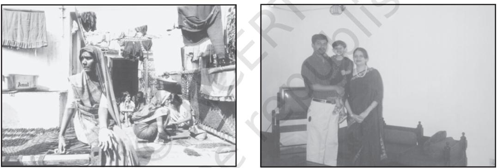
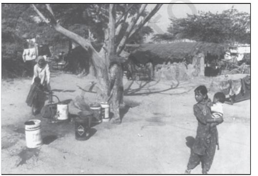
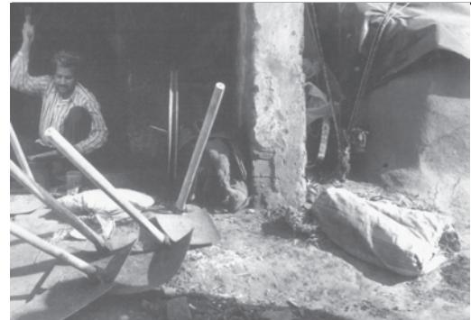
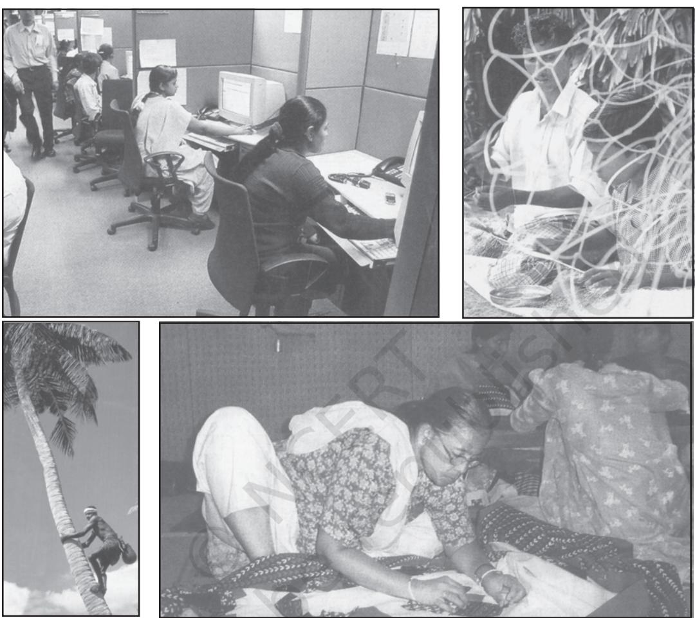
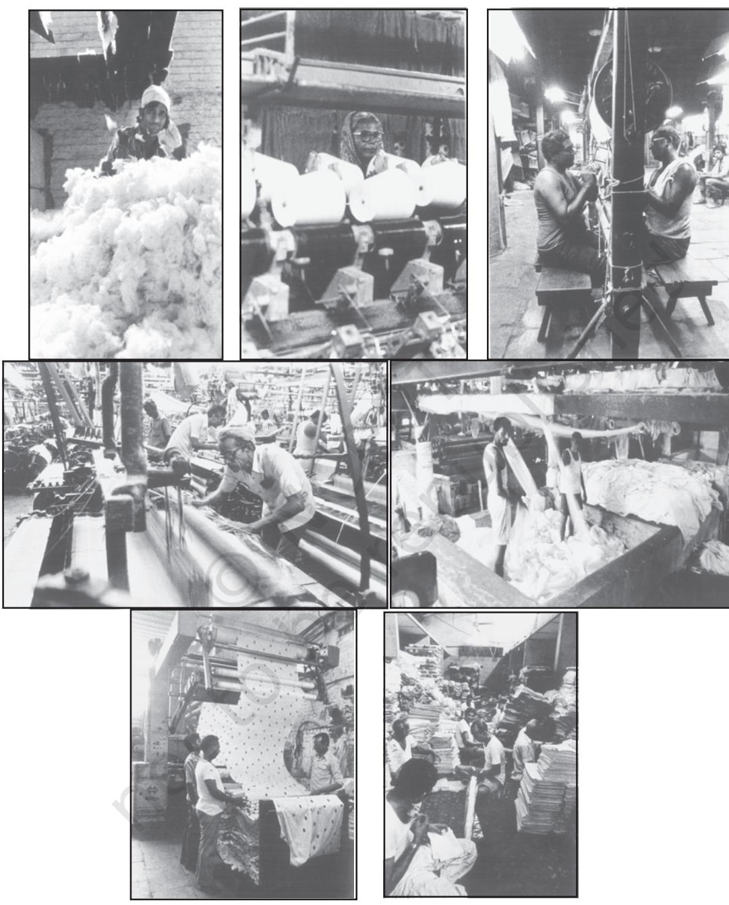
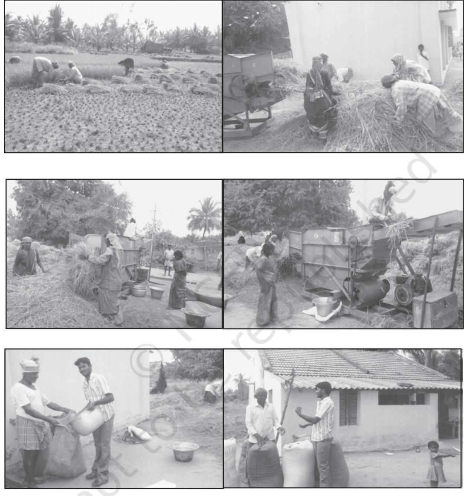
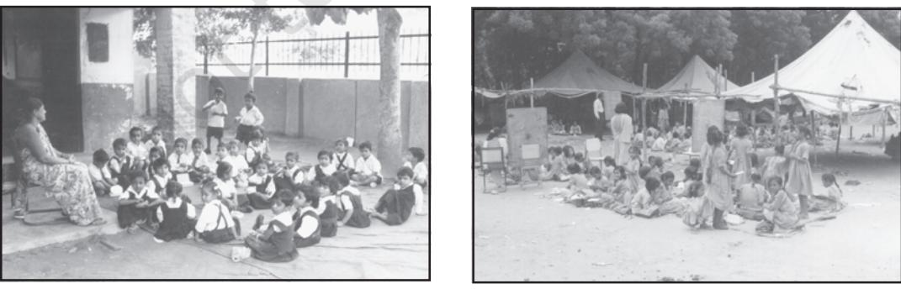
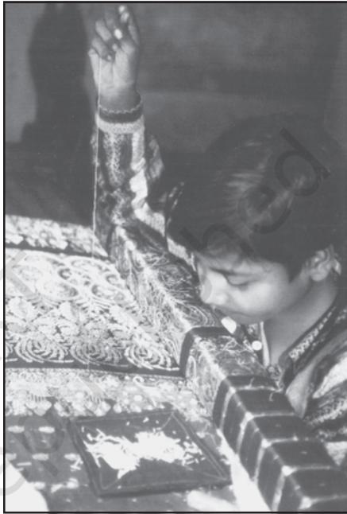

CHAPTER 3

# UNDERSTANDING SOCIAL INSTITUTIONS

# INTRODUCTION

This book began with a discussion about the interaction of the individual and society. We saw that each of us as individuals, occupies a place or location in society. Each one of us has a status and a role or roles, but these are not simply what we as individuals choose. They are not like roles a film actor may or may not opt to do. There are social institutions that constrain and control, punish and reward. They could be 'macro' social institutions like the state or 'micro' ones like the family. Here in this chapter we are introduced to social institutions, and also to how sociology/social anthropology studies them. This chapter puts forth a very brief idea of some of the central areas where important social institutions are located namely: (i) family, marriage and kinship; (ii) politics; (iii) economics; (iv) religion; and (v) education.

I

In the broadest sense, an institution is something that works according to rules established or at least acknowledged by law or by custom. And whose regular and continuous operation cannot be understood without taking those rules into account. Institutions impose constraints on individuals. They also provide him/her with opportunities.

An institution can also be viewed as an end in itself. Indeed people have viewed family, religion, state or even education as an end in itself.

### Activity 1

Think of examples of how people sacrifice for family, for religion or for the state.

We have already seen that there are conflicting and different understandings of concepts within sociology. We have also been introduced to the functionalist and conflict perspective, and seen how differently they saw the same thing, for instance, stratification or social control. Not surprisingly, therefore, there are different forms of understanding of social institutions as well.

A functionalist view understands social institutions as a complex set of social norms, beliefs, values and role relationship that arise in response to the needs of society. Social institutions exist to satisfy social needs. Accordingly we find informal and formal social institutions in societies. Institutions such as family and religion are examples of informal social institutions while law and (formal) education are formal social institutions.

A conflict view holds that all individuals are not placed equally in society. All social institutions whether familial, religious, political, economic, legal or educational will operate in the interest of the dominant sections of society be it class, caste, tribe or gender. The dominant social section not only dominates political and economic institutions but also ensures that the ruling class ideas become the ruling ideas of a society. This is very different from the idea that there are general needs of a society.

As you go about reading this chapter, see whether you can think of examples to show how social institutions constrain and also offer opportunities to individuals. Notice whether they impact different sections of society unequally. For instance, we could ask, "How does the family constrain as well provide opportunities to men and women?" Or "How do political or legal institutions affect the privileged and dispossessed?"

### FAMILY, MARRIAGE AND KINSHIP

Perhaps no other social entity appears more 'natural' than the family. Often we are prone to assume that all families are like the ones we live in. No other social institution appears more universal and unchanging. Sociology and social anthropology have over many decades, conducted field research across cultures to show how the institutions of family, marriage and kinship are important in all societies and yet their character is different in different societies. They have also shown how the family (the private sphere) is linked to economic, political, cultural and educational (the public) spheres. This may remind you of why there is a need to share and borrow from different disciplines, which we have discussed in Chapter 1.

According to the functionalists the family performs important tasks, which contribute to society's basic needs and helps perpetuate social order. The functionalist perspective argues that modern industrial societies function best if women look after the family and men earn the family livelihood. In India studies however suggest that families need not become nuclear in an industrial pattern of economy (Singh 1993: 83). This is but one example to show how trends based on experiences of one society cannot necessarily be generalised.

The nuclear family is seen as the unit best equipped to handle the demands of industrial society by the functionalists. In such a family one adult can work outside home while the second adult cares for the home and children. In practical terms, this specialisation of roles within the nuclear family involves the husband adopting the 'instrumental' role as breadwinner, and the wife assuming the 'affective', emotional role in domestic settings (Giddens 2001). This vision is questionable not just because it is

gender unjust but because empirical studies across cultures and history show that it is untrue. Indeed, as you will see in the discussion on work and economy how in contemporary industries like the garment export, women form a large part of the labour force. Such a separation also suggests that men are necessarily the heads of households. This is not necessarily true as the box which is given below shows.

# Variation in Family Forms

A central debate in India has been about the shift from nuclear family to joint families. We have already seen how sociology questions common sense impressions. The fact is that nuclear families have always existed in India particularly among deprived castes and classes.

The sociologist A.M. Shah remarks that in post-independent India the joint family has steadily increased. The contributing factor is the increasing life expectancy in India according to him. It has increased from 32.5 – 55.4 years for men and from 31.7– 55.7 years for women during the period 1941– 50 to 1981 - 85. Consequently, the proportion of aged people (60 years and above) in the total population has increased. "We have to ask" writes Shah:

> "in what kind of household do these elderly people live? I submit, most of them live in joint household" (Shah 1998).

This again is a broad generalisation. But in the spirit of the sociological perspective, it cautions us against blindly believing a common sense impression that the joint family is fast eroding. And alerts us to the need for careful comparative and empirical studies.

Studies have shown how diverse family forms are found in different

### Female headed households

When men migrate to urban areas, women have to plough and manage the agricultural fields. Many a time they become the sole providers of their families. Such households are known as female headed households. Widowhood too might create such familial arrangement. Or it may happen when men get remarried and stop sending remittance to their wives, children and other dependents. In such a situation, women have to ensure the maintenance of the family. Among the Kolams, a tribal community in south-eastern Maharashtra and northern Andhra Pradesh, a female headed household is an accepted norm. societies. With regard to the rule of residence*,* some societies are matrilocal in their marriage and family customs while others are patrilocal*.* In the first case, the newly married couple stays with the woman's parents, whereas in the second case the couple lives with the man's parents. A patriarchal family structure exists where the men exercise authority and dominance, and matriarchy where the women play a major role in decision-making in the family. While matrilineal societies exist, the same cannot be claimed about matriarchal societies.

### Families are Linked to other Social Spheres and Families Change

Often in our everyday life we look at the family as distinct and separate from other spheres such as the economic or political. However, as you will see for yourself the family, the household, its structure and norms are closely linked to the rest of society. An interesting example is that of the unintended consequences of the German unification. During the post-unification period in the 1990s Germany witnessed a rapid decline in marriage

Notice how families and residences are different

Work and Home

because the new German state withdrew all the protection and welfare schemes which were provided to the families prior to the unification. With growing sense of economic insecurity people responded by refusing to marry. This can also be understood as a case of unintended consequence

(Chapter 1). Family and kinship are thus subject to change and transformation due to macro economic processes but the direction of change need not always be similar for all countries and regions. Moreover, change does not mean the complete erosion of previous norms and structure. Change and continuity co-exist.

# How gendered is the family?

The belief is that the male child will support the parents in the old age and the female child will leave on marriage results in families investing more in a male child. Despite the biological fact that a female baby has better chances of survival than a male baby the rate of infant mortality among female children is higher in comparison to male children in lower age group in India.

# The Institution of Marriage

Historically marriage has been found to exist in a wide variety of forms in

### Activity 2

A Telegu expression states: 'Bringing up a daughter is like watering a plant in another's courtyard'. Find out other such sayings that are contrary. Discuss how popular sayings reflect the social arrangement of a society,

| Year | Sex Ratio | Year | Sex Ratio |
| --- | --- | --- | --- |
| 1901 | 972 | 1961 | 941 |
| 1911 | 964 | 1971 | 930 |
| 1921 | 955 | 1981 | 934 |
| 1931 | 950 | 1991 | 926 |
| 1941 | 945 | 2001 | 933 |
| 1951 | 946 | 2011 | 940 |

Sex Ratio in India between 1901-2011

The incidence of female foeticide has led to a sudden decline in the sex ratio. The child sex ratio has declined from 934 per thousand males in 1991 to 919 in 2011. The percentage of decline in the child sex ratio is more alarming. The situation of prosperous states like Punjab, Haryana, Maharashtra and Utter Pradesh is all the more grave. In Punjab the child sex ratio has declined to 846 girls per 1,000 boys. In some of the districts of Haryana it has fallen below 800.

different societies. It has also been found to perform differing functions. Indeed, the manner in which marriage partners are arranged reveals an astonishing variety of modes and customs.

### Activiy 3

Find out about the different ways that different societies go about finding marriage partners.

### Forms of Marriage

Marriage has a large variety of forms. These forms can be identified on the basis of the number of partners and rules governing who can marry whom. In terms of the number of partners that can legitimately enter into matrimony, we have two forms of marriage, namely, monogamy and polygamy. Monogamy restricts the individual to one spouse at a time. Under this system, at any given time a man can have only one wife and a woman can have only one husband. Even where polygamy is permitted, in actual practice, monogamy is more widely prevalent.

In many societies, individuals are permitted to marry again, often on the death of the first spouse or after divorce. But they cannot have more than one spouse at one and the same time. Such monogamous marriages are termed serial monogamy. Remarriages on the death of a wife have been a norm for men for the most part. But as all of you are aware that the right for upper caste Hindu widows was denied and that the campaign for widow remarriage was a major issue in the 19th century reform movements. What you are probably less aware is that today in modern India nearly 10 per cent of all women and 55 per cent of women over fifty years are widows (Chen 2000:353).

Polygamy denotes marriage to more than one mate at one time and takes the form of either: Polygyny (one husband with two or more wives) or Polyandry (one wife with two or more husbands). Usually where economic conditions are harsh, polyandry may be one response of society, since in such situations a single male cannot adequately support a wife and children. Also, extreme poverty conditions pressurise a group to limit its population.

### The Matter of Arranging Marriages: Rules and Prescriptions

In some societies, the decisions regarding mate selection are made by parents/relatives; in some other societies individuals are relatively free to choose their own mates.

#### Rules of Endogamy and Exogamy

In some societies these restrictions are subtle, while in some others, individuals who can or cannot be married, are more explicitly and specifically defined. Forms of marriage based on rules governing eligibility/ ineligibility of mates is classified as endogamy and exogamy.

Endogamy requires an individual to marry within a culturally defined group of which he or she is already a member, as for example, caste. Exogamy, the reverse of endogamy, requires the individual to marry outside of his/her own group. Endogamy and exogamy are in reference to certain kinship units, such as, clan, caste and racial, ethnic or religious groupings. In India, village exogamy is practised in certain parts of north India. Village exogamy ensured that daughters were married into families from villages far away from home. This arrangement ensured smooth transition and adjustment of the bride into the affinal home without interference of her kinsmen. The geographical distance plus the unequal relationship in the patrilineal system ensured that married daughters did not get to see their parents too often. Thus parting from natal home was a sad occasion and is the theme of folk songs, which depict the pain of departure.

> *Father, we are like flocks of bird We shall fly away; Our flight will be long, We know not to which, Region we will go. Father, my palanquin cannot Pass through your palace, (because the door is too small) Daughter, I shall remove a brick (to enlarge the passage for your palanquin),*

*You must go to your home.*

(Chanana 1993:WS26)

*Rock-a-bye-baby, combs in your pretty hair,*

*The bridegroom will come soon and take you away*

*The drums beat loudly, the shehnai is playing softly*

*A stranger's son has come to fetch me Come my playmates, come with our toys*

*Let us play, for I shall never play again*

*When I go off to the strangers' house.*

(Dube 2001: 94)

#### Activity 4

Collect different wedding songs and discuss how they reflect the social dynamics of marriages and of gender relations.

#### Activity 5

Have you ever seen matrimonial advertisements? Divide your class into groups and look at different newspapers, magazines and the internet. Discuss your findings. Do you think endogamy is still the prevalent norm? How does it help you to understand choice in marriage? More importantly, what kind of changes in society does it reflect?

### Defining Some Basic Concepts, Particularly those of Family, Kinship and Marriage

A family is a group of persons directly linked by kin connections,

the adult members of which assume responsibility for caring for children. Kinship ties are connections between individuals, established either through marriage or through the lines of descent that connect blood relatives (mothers, fathers, siblings, offspring, etc.) Marriage can be defined as a socially acknowledged and approved sexual union between two adult individuals. When two people marry, they become *kin* to one another. The marriage bond also, however, connects together a wider range of people. Parents, brothers, sisters and other blood relatives become relatives of the partner through marriage. The family of birth is called family of orientation and the family in which a person is married is called the family of procreation. The kin who are related through "blood" are called consanguineous kin while the kin who are related through marriage are called affines. As we move on to the next section on work and economic institutions, you will notice how the family and economic life are closely interconnected.

### III

### WORK AND ECONOMIC LIFE

#### What is Work?

As children and young students we imagine what kind of 'work' we will do when we grow up. 'Work' here quite clearly refers to paid employment. This is the most widely understood sense of 'work' in modern times.

This in fact is an oversimplified view. Many types of work do not conform to the idea of paid employment. Much of the work done in the informal economy, for example, is not recorded in any direct way in the official employment statistics. The term 'informal economy' refers to transactions outside the sphere of regular employment, sometimes involving the exchange of cash for services provided, but also often involving the direct exchange of goods or services.

We can define work, whether paid or unpaid, as the carrying out of tasks requiring the expenditure of mental and

There was no occupation, which Tiny's Granny had not tried at some stage of her life. From the time she was old enough to hold her own cup she had started working at odd jobs in people's houses in return for her two meals a day and cast-off clothes. Exactly what the words 'odd jobs' mean, only those know who have been kept at them at an age when they ought to have been laughing and playing with other children. Anything from the uninteresting duty of shaking the baby's rattle to massaging the master's head comes under the category of 'odd jobs' (Chugtai 2004:125).

Find out more about the various kinds of 'work' done from your own observation or literature or even films. Discuss.

Different Types of Work

physical effort, which has as its objective the production of goods and services that cater to human needs.

# Modern Forms of Work and Division of Labour

In pre-modern forms of society most people worked in the field or cared for the livestock. In the industrially developed society only a tiny proportion of the population works in

# Activity 6

Find out the proportion of Indians who are in rural based occupations. Make a list of these occupations.

agriculture, and farming itself has become industrialised — it is carried on largely by means of machines rather than by human hand. In a country like India, the larger share of the population continues to be involved in rural agricultural or other rural based occupations.

There are other trends in India too, for instance an expansion of the service sector.

One of the most distinctive characteristics of the economic system of modern societies is the existence of a highly complex division of labour. Work has been divided into an enormous number of different occupations in which people specialise. In traditional societies, non-agricultural work entailed the mastery of a craft. Craft skills were learned through a lengthy period of apprenticeship, and the worker normally carried out all aspects of the production process from beginning to end.

#### Activity 7

Find out whether there has been a shift to the service sector in India in recent times. Which are these sectors?

Modern society also witnesses a shift in the location of work. Before industrialisation, most work took place at home and was completed collectively by all members of the household. Advances in industrial technology, such as machinery operating on electricity and coal, contributed to the separation of work and home. Factories owned by capitalist entrepreneurs became the focal point of industrial development.

#### Activity 8

Have you seen a master weaver at work? Find out how long one piece of shawl may take to make?

People seeking jobs in factories were trained to perform a specialised task and receive a wage for this work. Managers supervised the work, for their task was to enhance worker productivity and discipline.

One of the main features of modern societies is an enormous expansion of economic interdependence. We are all dependent on an immense number of other workers-stretching right across the world- for the products and services that sustain our lives. With few exceptions, the vast majority of people in modern societies do not produce the food they eat, the houses they live in or the material goods they consume.

#### Activity 9

Make a list of the food that you eat, the materials that were used to make the houses you live in, the clothes you wear. Find out how and who made them.

#### Transformation of Work

Industrial processes were broken down into simple operations that could be precisely timed, organised and monitored. Mass production demands mass markets. One of the most significant innovations was the

Discuss the two forms of production in the two sets of visuals Cloth production in a factory

Threshing of paddy in a village

construction of a moving assembly line. Modern industrial production needed expensive equipment and continuous monitoring of employees through monitoring or surveillance systems.

Over the last decades there has been a shift to what is often called 'flexible production' and 'decentralisation of work'. It is argued that in this period of globalisation, it is the growing competition between firms and countries that makes it essential for firms to organise production suiting the changing market conditions. To illustrate how this new system operates and what the implications may be for the workers, read the quote from a study of the garment industry in Bangalore.

> The industry is essentially part of a long supply chain, and the freedom of manufacturers is to that extent extremely limited. There are, in fact more than a hundred operations between the designer and the final consumer. In this chain, only 15 are in the hands of the manufacturer. Any serious agitation for a rise in wages would lead manufacturers to shift their operations to other localities, beyond the reach of unionists... whether it is the payment of the existing minimum wage, or its substantial revision upwards, what is important is to enlist the support of the retailer in order to create the necessary pressure upon the government and local agencies for a higher wage structure and its effective implementation. Thus the

vision here is that of the creation of an international opinion forum (Roy Choudhury 2005:2254).

Read the above given report carefully. Notice how the new organisation of production and a body of customers outside the country have altered the economics and the politics of production.

IV

# POLITICS

Political institutions are concerned with the distribution of power in society. Two concepts, which are critical to the understanding of political institutions, are power and authority. Power is the ability of individuals or groups to carry out their will even when opposed by others. It implies that those who hold power do so at the cost of others. There is a fixed amount of power in a society and if some wield power others do not. In other words, an individual or group does not hold power in isolation, they hold it in relation to others.

This notion of power is fairly inclusive and extends from family elders assigning domestic duties to their children to principals enforcing discipline in school; from the General Manager of a factory distributing work among the executives to political leaders regulating programmes of their parties. The principal has power to maintain discipline in school. The president of a political party possesses power to expel a member from the party. In each case, an individual or group has power to the extent to which others abide by their will. In this sense, political activities or politics is concerned with 'power'.

But how is this 'power' applied to achieve its aim? Why do people comply with others' commands? Answers to these questions could be found with reference to a related concept of 'authority'. Power is exercised through authority. Authority is that form of power, which is accepted as legitimate, that is, as right and just. It is institutionalised because it is based on legitimacy. People in general accept the power of those in authority as they consider their control to be fair and justified. Often ideologies exist that help this process of legitimation.

### Stateless Societies

Empirical studies of stateless societies by social anthropologists over sixty years ago demonstrated how order is maintained without a modern governmental apparatus. There was instead the balanced opposition between parts; cross-cutting alliances, based on kinship, marriage and residence; rites and ceremonies involving the participation of friends and foes.

As we all know, the modern state has a fixed structure and formal procedures. Yet are not some of the informal mechanisms mentioned above as features of stateless societies present also in state societies?

### The Concept of the State

A state exists where there is a political apparatus of government (institutions like a parliament or congress, plus civil service officials) ruling over a given territory. Government authority is backed by a legal system and by the capacity to use military force to implement its policies. The functionalist perspective sees the state as representing the interests of all sections of society. The conflict perspective sees the state as representing the dominant sections of society.

Modern states are very different from traditional states. These states are defined by sovereignty, citizenship and, most often, ideas of nationalism. Sovereignty refers to the undisputed political rule of a state over a given territorial area.

The sovereign state was not, at first, one in which citizenship carried with it rights of political participation. These were achieved largely through struggles, which limited the power of monarchs, or actively overthrew them. The French Revolution and our own Indian independence struggle are two instances of such movements.

Citizenship rights include civil, political and social rights. Civil rights involve the freedom of individuals to live where they choose; freedom of speech and religion; the right to own property; and the right to equal justice before the law. Political rights include the right to participate in elections and to stand for public office. In most countries governments were reluctant to admit the principle of universal franchise. In the early years not only women, but a large section of the male population was excluded as holding a certain amount of property was an eligibility criterion. Women had to wait longer for the vote.

The third type of citizenship rights are social rights. These concern the

#### Activity 10

Find out when women got voting rights in different countries. Why do you think that despite the right to vote and the right to stand for public office, women are so inadequately represented? Will power in its wider sense be a useful concept to understand this under-representation in the Parliament and other bodies? Does the existing division of labour within families and households impact women's participation in political life? Find out why there is a demand for 33 per cent reservation for women in the Parliament.

prerogative of every individual to enjoy a certain minimum standard of economic welfare and security. They include such rights as health benefits, unemployment allowance, setting of minimum level of wages. The broadening of social or welfare rights led to the welfare state, which was established in Western societies since the Second World War. States of the erstwhile socialist countries had far-reaching provision in this sector. In most developing countries, this was virtually non-existent. All over the world today these social rights are being attacked as liabilities on the state and hindrances to economic growth.

Nationalism can be defined as a set of symbols and beliefs providing the sense of being part of a single political

#### Activity 11

Collect information about different states doing away with social rights. Find out what explanation is given for this. Discuss and see whether you can see the relationship between the economic, political and social spheres.

community. Thus, individuals feel a sense of pride and belonging, in being 'British', 'Indian', 'Indonesian' or 'French'. Probably people have always felt some kind of identity with social groups of one form or another — for example, their family, clan or religious community. Nationalism, however, only made its appearance with the development of the modern state. Contemporary world is marked both by a rapid expansion of the global market as well as intense nationalist feelings and conflicts.

Sociologists are interested in the broader study of power, not just with the formal apparatus of government. They are interested in the distribution of power between parties, between classes, between castes, and

#### Activity 12

Collect information of events that show the growth of global interconnectedness as well as instances of divisions along ethnic, religious, national conflicts. Discuss how politics and economics may have a part to play in them.

between communities based on race, language and religion. Its focus is not just on what may be called specifically political association, such as state legislatures, town councils and political parties but also associations such as schools, banks and religious institutions whose aims are not primarily political. The scope of sociology has been wide. Its range has extended from the study of international movements (such as women or environmental) to village factions.

V

### RELIGION

Religion has been a subject of study and reflection for a very long time. In Chapter 1, we have seen how sociological findings about society are different from religious reflections. The sociological study of religion is different from a religious or theological study of religion in many ways. One, it conducts empirical studies of how religions actually function in society and its relationship to other institutions. Two, it uses a comparative method. Three, it investigates religious beliefs, practices and institutions in relation to other aspects of society and culture.

The empirical method means that the sociologist does not have a judgemental approach to religious phenomena. The comparative method is important because in a sense it brings all societies on level with each other. It helps to study without bias and prejudice. The sociological perspective means that religious life can be made intelligible only by relating it to domestic life, economic life and political life.

Religion exists in all known societies, although religious beliefs and practices vary from culture to culture. Characteristics that all religions seem to share are:

- set of symbols, invoking feelings of reverence or awe;
- rituals or ceremonies;
- a community of believers.

The rituals associated with religion are very diverse. Ritual acts may include praying, chanting, singing, eating certain kinds of food (or refraining from doing so), fasting on certain days, and so on. Since ritual acts are oriented towards religious symbols, they are usually seen as quite distinct from the habits and procedures of ordinary life. Lighting a candle or *diya* to honour the divine differs completely in its significance from doing so simply to light a room. Religious rituals are often carried out by an individual in his/her personal everyday life. But all religions also involve ceremonials practised collectively by believers. Regular ceremonials normally occur in special places — churches, mosques, temples, shrines.

Religion is about the sacred realm. Think of what members of different religions do before entering a sacred realm. For example covering one's head, or not covering one's head, taking off shoes, or wearing particular kind of clothes, etc. What is common to them all is the feeling of awe, recognition and respect for sacred places or situations.

Sociologists of religion, following Emile Durkheim, are interested in understanding this sacred realm which every society distinguishes from the profane. In most cases, the sacred includes an element of the supernatural. Often the sacred quality of a tree or a temple comes with the belief that it is sacred precisely because there is some supernatural force behind it. However, it is important to keep in mind that some religions like early Buddhism and Confucianism had no conception of the supernatural, but did allow sufficient reverence for things and persons which they considered sacred.

Studying religion sociologically lets us ask questions about the relationship of religion with other social institutions. Religion has had a very close relationship with power and politics. For instance, periodically in history there have been religious movements for social change, like various anti-caste movements or movements against gender discrimination. Religion is not just a matter of the private belief of an individual but it also has a public character. And it is this public character of religion, which has an important bearing on other institutions of society.

We have seen how sociology looks at power in a wide sense. It is, therefore, of sociological interest to look at the relationship between political and religious spheres. Classical sociologists believed that as societies modernised, religion would become less influential over various spheres of life. The concept secularisation describes this process. Contemporary events suggest a persisting role of religion in various aspects of society. Why do you think this is so?

A pioneering work by Max Weber (1864-1920) demonstrates how sociology looks at religion in its relationship to other aspects of social and economic behaviour. Weber argues that Calvinism (a branch of Protestant Christianity) exerted an important influence on the emergence and growth of capitalism as a mode of economic organisation. The Calvinists believed that the world was created for the glory of God, meaning that any work in this world had to be done for His glory, making even mundane works acts of worship. More importantly, however, the Calvinists also believed in the concept of predestination, which meant that whether one will go to heaven or hell was pre-ordained. Since there was no way of knowing whether one has been assigned heaven or hell, people sought to look for signs of God's will in this world, in their own occupations. Thus if a person in whatever profession, was consistent and successful in his or her work, it was interpreted as a sign of God's happiness. The money earned was not to be used for worldly consumption; rather the ethics of Calvinism was to live frugally. This meant that investment became something like a holy creed. At the heart of capitalism is the concept of investment, which is about investing capital to make more goods, which create more profit, which in turn creates more capital. Thus Weber was able to argue that religion, in this case Calvinism, does have an influence on economic development.

Religion cannot be studied as a separate entity. Social forces always and invariably influence religious institutions. Political debates, economic situations and gender norms will always influence religious behaviour. Conversely, religious norms influence and sometimes even determine social understanding. Women constitute half of the world's population. Sociologically therefore it becomes important to ask what relationship this vast segment of human population has with religion. Religion is an important part of society and is inextricably tied to other parts. The task of sociologists is to unravel these various interconnections. In traditional societies, religion usually plays a central part in social life. Religious symbols and rituals are often integrated with the material and artistic culture of society. Read the extract which is given below in the box to get a sense of how sociology studies religion.

### VI

### EDUCATION

Education is a life–long process, involving both formal and informal institutions of learning. Here we are however confining ourselves only to school education. We are all aware how important getting admission into a school is. We also know, for many of us, school is a step towards higher education and finally employment. For some of us it may mean acquiring some necessary social skills. What is common in all cases is that there is a felt need for education.

Sociology understands this need as a process of transmission/communication of group heritage that is common to all societies. There is a qualitative distinction between simple societies and complex, modern societies. In the case of the former there was no need for formal schooling.

Many extraneous factors have affected the traditional lives of the religious specialists. The most important of these are the growth of new employment and educational opportunities in Nasik... after Independence, the way of life of the priests has been changing fast. Now the sons and daughters are sent to school, and are trained for jobs other than traditional ones… Like all places of pilgrimage, Nasik also gave rise to supplementary centres around religious activities. It was a normal routine for a pilgrim to take home the sacred water of the Godavari in a copper pot. The coppersmiths provided these wares. The pilgrims also bought wares, which they took home to be distributed as gifts among their relatives and friends. For long Nasik was known for its proficient craftsmen in brass, copper and silver... Since the demand for their wares is intermittent and uncertain, not all the adult males can be supported by this occupation... Many craftsmen have entered industry and business-both small and large scale (Acharya 1974:399-401).

Children learnt customs and the broader way of life by participating in activities with their adults. In complex societies, we saw there is an increasing economic division of labour, separation of work from home, need for specialised learning and skill attainment, rise of state systems, nations and complex sets of symbols and ideas. How do you get educated informally in such context? How would parents or other adults informally communicate all that has to be known to the next generation? Education in such social context has to be formal and explicit.

Furthermore modern complex societies, in contrast to simple societies, rest on abstract universalistic values. This is what distinguishes it from a simple society that depends on particularistic values, based on family, kin, tribe, caste or religion. Schools in modern societies are designed to promote uniformity, standardised aspirations and universalistic values. There are many ways of doing this. For example one can speak of 'uniform dress for school children'. Can you think of other features that promote standardisation?

For Emile Durkheim, no society can survive without a 'common base-a certain number of ideas, sentiments and practices which education must inculcate in all children indiscriminately, to whatever social category they belong' (Durkheim 1956:69). Education should prepare the child for a special occupation, and enable the child to internalise the core values of society.

The functionalist sociologist thus speaks in terms of general social needs and social norms. For the functionalists, education maintains and renews the social structure, transmits and develops culture. The educational system is an important mechanism for the selection and allocation of individuals in their future roles in the society. It is also regarded as the ground for proving one's ability and hence selective agency for different status according to their abilities. Recall our discussion on the functionalist understanding of roles and stratification in Chapter 2.

For the sociologists who perceive society as unequally differentiated, education functions as a main

Discuss the visuals (Two types of schools)

stratifying agent. And at the same time the inequality of educational opportunity is also a product of social stratification. In other words, we go to different kinds of schools depending on our socio-economic background. And because we go to some kind of schools, we acquire different kind of privileges and finally opportunities.

For instance some argue that schooling 'intensifies the existing divide between the elite and the masses.' Children going to privileged schools learn to be confident while children deprived of that may feel the opposite (Pathak 2002:151). However, there are many more children who simply cannot attend school or drop out. For instance a study reports :

> You are seeing some children in the school now. If you come during the cultivation season you may see almost zero attendance from the SC and ST children. They all take some household responsibilities while the parents are out to work. And the girl children of these communities seldom attend school as they do various kinds of work both domestic and income generating. A 10-yearold girl picks dry cow dung to sell, for example (Pratichi 2002:60).

The report indicates how gender and caste discrimination impinge upon the chances of education. Recall how we began this book in Chapter 1 about a child's chances for a good job

Discuss the visual

being shaped by a host of social factors. Your understanding of the way social institutions function should help you analyse the process better now.

#### Activity 13

A study of a kindergarten suggested that children learn that:

- 'work activities are more important than play activities'.
- 'work includes any and all teacher-directed activities.'
- 'work is compulsory and free time activities are called play' (Apple 1979:102).

What do you think? Discuss.

# GLOSSARY

Citizen : A member of a political community, having both rights and duties associated with that membership.

Division of Labour : The specialisation of work tasks, by means of which different occupations are combined within a production system. All societies have at least some rudimentary form of division of labour. With the development of industrialism, however, the division of labour becomes vastly more complex than in any prior type of production system. In the modern world, the division of labour is international in scope.

Gender : Social expectations about behaviour regarded as appropriate for the members of each sex. Gender is seen as a basic organising principle of society.

Empirical Investigation : Factual enquiry carried out in any given area of sociological study.

Endogamy : When marriage is within a specific caste, class or tribal group.

Exogamy : When marriage occurs outside a certain group of relations.

Ideology : Shared ideas or beliefs, which serve to justify the interests of dominant groups. Ideologies are found in all societies in which there are systematic and engrained inequalities between groups. The concept of ideology connects closely with that of power, since ideological systems serve to legitimise the differential power which groups hold.

Legitimacy : The belief that a particular political order is just and valid.

Monogamy : When marriage involves one husband and one wife alone.

Polygamy : When marriage involves more than one mate at one time.

Polyandry : When more than one man is married to a woman.

Polygyny : When more than one woman is married to a man.

Service Industries : Industries concerned with the production of services rather than manufactured goods, such as the travel industry.

State Society : A society which possesses a formal apparatus of government.

Stateless Society : A society which lacks formal institutions of government.

Social Mobility : Movement from one status or occupation to another.

Sovereignty : The undisputed political rule of a state over a given territorial area.

### EXERCISES

- 1. Note the marriage rules that are followed in your society. Compare your observations with these made by other students in the class. Discuss.
- 2. Find out how membership, residence pattern and the mode of interaction changes in the family with broader economic, political and cultural changes, for instance migration.
- 3. Write an essay on 'work'. Focus on both the range of occupations, which exist and how they change.
- 4. Discuss the kind of rights that exist in your society. How do they affect your life?
- 5. How does sociology study religion?
- 6. Write an essay on school as a social institution. Draw from both your reading as well as your personal observations.
- 7. Discuss how these social institutions interact with each other. You can start the discussion from yourself as a senior school student. And move on to how you are shaped by different social institutions. Are you entirely controlled or can you also resist and redefine social institutions?

### READINGS

- ACHARYA, HEMLATA. 1974. *'*Changing Role of Religious Specialists in Nasik The Pilgrim City*',* in ed. RAO, M.S.A., *An Urban Sociology in India : Reader and Source Book.* Orient Longman, New Delhi, pp. 391-403.
- APPLE, MICHAEL W. 1979. *Ideology and Curriculum.* Routledge and Kegan Paul, LONDON.
- CHUGTAI, ISMAT. 2004. *Tiny's Granny* in *Contemporary Indian Short Stories; Series* 1. Sahitya Akademi, New Delhi.
- DUBE, LEELA. 2001. *Anthropological Explorations in Gender : Intersecting Fields.* Sage Publications, New Delhi.
- DURKHEIM, EMILE. 1956. *Education and Sociology.* The Free Press, New York.
- PATHAK, AVIJIT. 2002. *Social Implications of Schooling* : *Knowledge, Pedagogy and Consciousness.* Rainbow Publishers, Delhi.

PRATICHI. 2002. *The Pratichi Education Report.* Pratichi Trust, Delhi.

- ROY CHOUDHURY, SUPRIYA. 2005. *'*Labour Activism and Women in the Unorganised Sector : Garment Export Industry in Bangalore', *Economic and Political Weekly*. May 28-June 4. pp. 2250-2255.
- SHAH, A.M. 1998. *Family in India : Critical Essays*. Orient Longman, Hyderabad.
- SINGH, YOGENDRA. 1993. *Social Change in India : Crisis and Resilience.* Har-Anand Publications, New Delhi.
- UBEROI, PATRICIA. 2002. 'Family, Kinship and Marriage in India', in *Student's Britannica*, *India*. Vol.6, Encyclopedia Britannica Private Ltd, New Delhi, pp.145-155.

