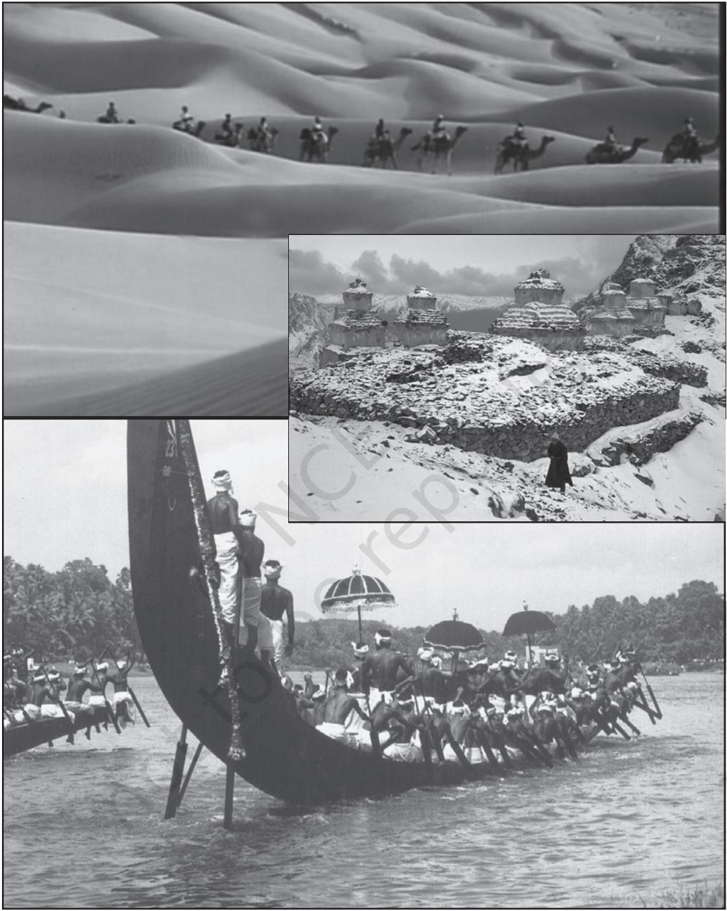
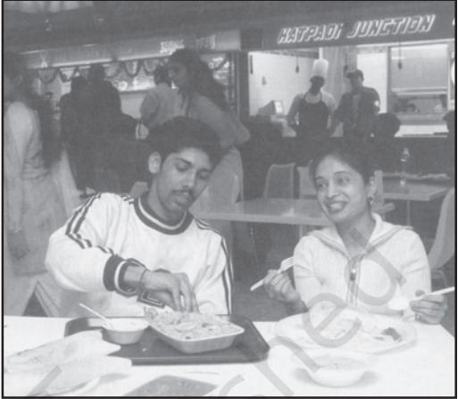

CHAPTER 4

# CULTURE AND SOCIALISATION

I

# INTRODUCTION

'Culture', like 'society', is a term used frequently and sometimes vaguely. This chapter is meant to help us define it more precisely and to appreciate its different aspects. In everyday conversation, culture is confined to the arts, or alludes to the way of life of certain classes or even countries. Sociologists and anthropologists study the social contexts within which culture exists. They take culture apart to try and understand the relations between its various aspects.

Just like you need a map to navigate over unknown space or territory, you need culture to conduct or behave yourself in society. Culture is the common understanding, which is learnt and developed through social interaction with others in society. A common understanding within a group demarcates it from others and gives it an identity. But cultures are never finished products. They are always changing and evolving. Elements are

# Activity 1

How do you greet another person in your 'culture'? Do you greet different kinds of persons (friends, older relatives, the other gender, people from other groups) differently? Discuss any awkward experience you may have had when you did not know how you should greet a person. Is that because you did not share a common 'culture'? But next time round you will know what to do. Your cultural knowledge thereby expands and rearranges itself.

constantly being added, deleted, expanded, shrunk and rearranged. This makes cultures dynamic as functioning units.

The capacity of individuals to develop a common understanding with others and to draw the same meanings from signs and symbols is what distinguishes humans from other animals. Creating meaning is a social virtue as we learn it in the company of others in families, groups and communities. We learn the use of tools and techniques as well as the nonmaterial signs and symbols through interaction with family members, friends and colleagues in different social settings. Much of this knowledge is systematically described and conveyed either orally or through books.

For example, notice the interaction below. Notice how words and facial expressions convey meaning in a conversation.

social set up like in villages, towns and cities. In different environments, people adapt different strategies to cope with the natural and social conditions. This leads to the emergence of diverse ways of life or cultures.

Disparities in coping mechanisms were evident during the devastating tsunami of 26 December 2004, which affected some parts of the Tamil Nadu and Kerala coast as well as the Andaman and Nicobar Islands in India. People on the mainland and islands are integrated into a relatively modern way of life. The

Commuter asks autodriver: "Indiranagar?" The verb that conveys the question — "*Bartheera*?" or "Will you come?" — is implied in the arch of the eyebrow. Driver jerks his head in the direction of the back seat if the answer is "Yes". If it is "No" (which is more likely the case as every Bangalorean knows) he might just drive away or grimace as if he has heard a bad word or shake his head with a smile that seems to suggest a "Sorry", all depending on the mood of the moment.

This learning prepares us for carrying out our roles and responsibilities in society. You have already dealt with status and roles. What we learn in the family is primary socialisation, while that which happens in school and other institutions are secondary socialisation. We shall discuss this in greater detail later in this chapter.

# II DIVERSE SETTINGS, DIFFERENT CULTURES

Humans live in a variety of natural settings like in the mountains and plains, in forests and clear lands, in deserts and river valleys, in islands and main lands. They also inhabit different fisherfolk and the service personnel in the islands were caught unaware and suffered large scale devastation and much loss of life. On the other hand, the 'primitive' tribal communities in the islands like the Onges, Jarawas, Great Andamanese or Shompens who had no access to modern science and technology, foresaw the calamity based on their experiential knowledge and saved themselves by moving on to higher ground. This shows that having access to modern science and technology does not make modern cultures superior to the tribal cultures of the islands. Hence, cultures cannot be ranked but can be judged adequate or inadequate in terms of their ability to cope with the strains imposed by nature.

Discuss how natural settings affect culture

# Activity 2

Find out from at least one region other than your own how natural environment affects food habits, patterns of dwelling, clothing and the ways in which God or gods are worshipped.

# Defining Culture

Often the term 'culture' is used to refer to the acquiring of refined taste in classical music, dance forms or painting. This refined taste was thought to distinguish people from the 'uncultured' masses, even concerning something we would today see as individual, like the preference for coffee over tea!

By contrast, the sociologist looks at culture not as something that distinguishes individuals, but as a way of life in which all members of society

#### Activity 3

Identify equivalents in Indian languages for the word culture. What associations do these carry?

participate. Every social organisation develops a culture of its own. One early anthropological definition of culture comes from the British scholar Edward Tylor: "Culture or civilisation taken in its wide ethnographic sense, is that complex whole which includes knowledge, belief, art, morals, law, custom and any other capabilities and habits acquired by man as a member of society" (Tylor 1871).

Discuss how the visual captures a way of life

Two generations later, the founder of the "functional school" of anthropology, Bronislaw Malinowski of Poland (1884-1942) wrote: "Culture comprises inherited artifacts, goods, technical process, ideas, habits and values" (Malinowski 1931:621-46).

Clifford Geertz suggested that we look at human actions in the same way as we look at words in a book, and see them as conveying a message. "… Man is an animal suspended in webs of significance he himself has spun. I take culture to be those webs…".The search is not for a causal explanation, but for an interpretative one, that is in search for meaning (Geertz 1973:5). Likewise Leslie White had placed a comparable emphasis on culture as a means of adding meaning to objective reality, using the example of people regarding water from a particular source as holy.

- Do you notice anything in Malinowski's definition that is missing in Tylor's?
Apart from his mention of art, all the things listed by Tylor are non-material. This is not because Tylor himself never looked at material culture. He was in fact a museum curator, and most of his anthropological writing was based on the examination of artifacts and tools from societies across the world, which he had never visited. We can now see his definition of culture as an attempt to take into account its intangible and abstract dimensions, so as to acquire a comprehensive understanding of the societies he was studying. Malinowski happened to be stranded on an island in the Western Pacific during the First World War, and discovered thereby the value of remaining for an extended period with the society one was studying. This led to the establishment of the tradition of "field work" you will read about it in Chapter 5.

The multiple definitions of culture in anthropological studies led Alfred Kroeber and Clyde Kluckhohn (anthropologists from the United States) to publish a comprehensive survey entitled *Culture: A Critical Review of Concepts and Definitions* in 1952. A sample of the various definitions is presented below.

- Try comparing these definitions to see which of these or which combination of these you find most satisfactory.
You may first find yourself noticing words which recur–'way', 'learn' and 'behaviour'. However, if you then look at how each is used, you may be struck by the shifts in emphasis. The first phrase refers to mental ways but the second to the total way of life. Definitions (d), (e) and (f) lay stress on culture as what is shared and passed on among a group and down the generations. The last two phrases are the first to refer to culture as a means of directing behaviour.

| Culture is… |  |
| --- | --- |
| (a) | a way of thinking, feeling, believing. |
| (b) | the total way of life of a people. |
| (c) | an abstraction from behaviour. |
| (d) | learned behaviour. |
| (e) | a storehouse of pooled learning. |
| (f) | the social legacy the individual acquires from his group. |
| (g) | a set of standardised orientations to recurrent problems. |
| (h) | a mechanism for the normative regulation of behaviour. |

Make a list of phrases you have heard containing the word 'culture'. Ask your friends and family what they mean by culture. What criteria do they use to distinguish among cultures?

#### Activity 4

Compare these definitions to see which of these (or combination of these) you find most satisfactory. You could do this by listing familiar uses of the word 'culture' (the culture of eighteenth century Lucknow, the culture of hospitality or the much used term 'Western culture'...). Which of the definitions best captures the impressions conveyed by each?

# Dimensions of Culture

Three dimensions of culture have been distinguished :

- (i) Cognitive: This refers to how we learn to process what we hear or see, so as to give it meaning (identifying the ring of a cell-phone as ours, recognising the cartoon of a politician).
- (ii) Normative: This refers to rules of conduct (not opening other people's letters, performing rituals at death).
- (iii) Material: This includes any activity made possible by means of materials. Materials also include tools or machines. Examples include internet 'chatting', using rice-flour paste to design *kolam* on floors.

It may have occurred to you that our understanding of material culture, especially art, is incomplete without knowledge acquired from the cognitive and normative areas. It is true that our developing understanding of social process would draw upon all these areas. But we might find that in a community where few have acquired the cognitive skill of literacy, it in fact becomes the norm for private letters to be read out by a third party. But as we see below, to focus on each of these areas separately provides many important insights.

# Cognitive Aspects of Culture

The cognitive aspects of one's own culture are harder to recognise than its material aspects (which are tangible or visible or audible) and its normative aspects (which are explicitly stated). Cognition refers to understanding, how we make sense of all the information coming to us from our environment. In literate societies ideas are transcribed in books and documents and preserved in libraries, instititutions or archives. But in non-literate societies legend or lore is committed to memory and transmitted orally. There are specialist practitioners of oral tradition who are trained to remember and narrate during ritual or festive occasions.

Let us think about how writing may affect the production and consumption of art. In his influential book, *Orality and Literacy* Walter Ong cites a study of 1971 that states that only 78 of the approximately 3,000 existing languages possess a literature. Ong suggests that material that is not written down has certain specific characteristics. There is a lot of repetition of words, to make it simpler to remember. The audience of an oral performance is likely to be more receptive and involved than would be readers of a written text from an unfamiliar culture. Texts become more elaborate when they are written.

In societies like ours historically literacy has been made available only to the more privileged. Sociological studies are often concerned with investigating how literacy can be made relevant to the lives of people whose families have never gone to school. This can lead to unexpected responses, like a vegetable-seller who asked why he needed to know the alphabet when he could mentally calculate what his customers owed him?

The contemporary world allows us to rely far more on written, audio and visual records. Yet students of Indian classical music are still discouraged from writing down what they learn rather than carrying it in their memory. We still do not know enough about the impact of the electronic media, of multiple channels, of instant accessing and surfing. Do you think these new forms impact our attention span and cognitive culture?

# Normative Aspects of Culture

The normative dimension consists of folkways, mores, customs, conventions and laws. These are values or rules that guide social behaviour in different contexts. We most often follow social norms because we are used to doing it, as a result of socialisation. All social norms are accompanied by sanctions that promote conformity. We have already discussed social control in Chapter 2 .

While norms are implicit rules, laws are explicit rules. Pierre Bourdieu, the French sociologist has reminded us that when we try to understand another culture's norms, we must remember that there are certain implicit understandings. For example, if a person wants to show gratitude for something s/he has been given, s/he should not offer a returngift too quickly, or it seems like an attempt to get rid of a debt, not a friendly gesture.

A law is a formal sanction defined by government as a rule or principle that its citizens must follow. Laws are explicit. They are applicable to the whole society. And a violation of the law attracts penalties and punishment. If in your home children are not allowed to stay outdoors after sundown, that is a norm. It is specific to your family and may not be applicable to all families. However, if you are caught stealing a gold necklace from someone else's home, you have violated the universally accepted law of private property and can be sent to jail after trial as punishment.

Laws, which derive from the authority of the State are the most formal definitions of acceptable behaviour. While different schools may establish different norms for students, laws would apply to all those accepting the authority of the State. Unlike laws, norms can vary according to status. Dominant sections of society apply dominant norms. Often these norms are discriminating. For example norms that did not allow dalits from drinking water from the same vessel or even source. Or women from moving freely in the public sphere.

# Material Aspects of Culture

The material aspect refers to tools, technologies, machines, buildings and modes of transportation, as well as instruments of production and communication. In urban areas the widespread use of mobile phones, music systems, cars and buses, ATMs (automated teller machines), refrigerators and computers in everyday life indicates the dependence on technology. Even in rural areas the use of transistor radios or electric motor pumps for lifting water from below the surface for irrigation demonstrates the adoption of technological devices for increasing production.

In sum there are two principal dimensions of culture: material and non-material. While the cognitive and normative aspects are non-material, the material dimension is crucial to increase production and enhance the quality of life. For integrated functioning of a culture the material and non-material dimensions must work together. But when the material or technological dimensions change rapidly, the non-material aspects can lag behind in terms of values and norms. This can give rise to a situation of culture lag when the non-material dimensions are unable to match the advances of technology.

# Culture and Identity

Identities are not inherited but fashioned both by the individual and the group through their relationship with others. For the individual the social roles that s/he plays imparts identity. Every person in modern society plays multiple roles. For instance within the family s/he may be a parent or a child but for each of the specific roles there are particular responsibilities and powers.

It is not sufficient to enact roles. They also have to be recognised and acknowledged. This can often be done through the recognition of the particular language that is used among role players. Students in schools have their own way of referring to their teachers, other students, class performances. By creating this language which also serves as a code, they create their own world of meanings and significances. Similarly, women are also known to create their own language and through it their own private space beyond the control of men especially when they congregate at the pond to bathe in rural areas or across washing lines on rooftops in urban areas.

In a culture there can be many subcultures, like that of the elite and working class youth. Sub-cultures are marked by style, taste and association. Particular sub-cultures are identifiable by their speech, dress codes, preference for particular kind of music or the manner in which they interact with their group members.

Sub-cultural groups can also function as cohesive units which impart an identity to all group members. Within such groups there can be leaders and followers but group members are bound by the purpose of the group and work together to achieve their objectives. For instance young members of a neighbourhood can form a club to engage themselves in sports and other constructive activities. Such activities create a positive image of the members in the locality and this gives the members not only a positive selfimage but also inspires them to perform better in their activities. The orientation of their identity as a group undergoes a transformation. The group is able to differentiate itself from other groups and thereby create its own identity through the acceptance and recognition of the neighbourhood.

#### Activity 5

Are you aware of any sub-cultural group in your locality? How are you able to identify them?

#### Ethnocentrism

It is only when cultures come into contact with one another that the question of ethnocentrism arises. Ethnocentrism is the application of one's own cultural values in evaluating the behaviour and beliefs of people from other cultures. This means that the cultural values projected as the standard or norm are considered superior to that of the beliefs and values of other cultures. We have seen in Chapter 1 and in Chapter 3 (particularly in the discussion on religion) how sociology is an empirical and not a normative discipline.

Underlying ethnocentric comparisons is a sense of cultural superiority clearly demonstrated in colonial situations. Thomas Babbington Macaulay's famous Minute on Education (1835) to the East India Company in India exemplifies ethnocentrism when he says, 'We must at present do our best to form a class who may be interpreters between us and the millions whom we govern, a class of persons Indian in blood and colour but English in tastes, in opinions, morals and intellect' (quoted in Mukherji 1948/ 1979:87), (emphasis added).

Ethnocentrism is the opposite of cosmopolitanism, which values other cultures for their difference. A cosmopolitan outlook does not seek to evaluate the values and beliefs of other people according to one's own. It celebrates and accommodates different cultural propensities within its fold and promotes cultural exchange and borrowings to enrich one's own culture. The English language has emerged as a leading vehicle of international communication through its constant inclusion of foreign words into its vocabulary. Again the popularity of Hindi film music can be attributed to its borrowings from western pop music as well as from different traditions of Indian folk and semi-classical forms like the *bhangra* and *ghazal*.

A modern society is appreciative of cultural difference and does not close its doors to cultural influences from abroad. But such influences are always incorporated in a distinctive way, which can combine with elements of indigenous culture. The English language despite its foreign inclusions does not become a separate language, nor does Hindi film music lose its character through borrowings. The absorption of diverse styles, forms, sounds and artifacts provides an identity to a cosmopolitan culture. In a global world where modern means of communication are shrinking distances between cultures, a cosmopolitan outlook allows diverse influences to enrich one's own culture.

#### Cultural Change

Cultural change is the way in which societies change their patterns of culture. The impetus for change can be internal or external. In regard to internal causes, for instance, new methods of farming or agriculture can boost agricultural production, which can transform the nature of food consumption and quality of life of an agrarian community. On the other hand external intervention in the form of conquest or colonisation can also affect deep seated changes in the cultural practices and behaviour of a society.

Cultural change can occur through changes in the natural environment, contact with other cultures or processes of adaptation. Changes in the natural environment or ecology can

Notice the words in the box. Have you heard or used these words in your conversations?

#### 'Hinglish' may soon conquer the world

Some of the Hinglish words in vogue include airdash (travel by air), *chaddis* (underpants), *chai* (Indian tea), crore (10 million), dacoit (thief), *desi* (local), *dicky* (boot), *gora* (white person), *jungli* (uncouth), lakh (100,000), *lampat* (thug), optical (spectacles), prepone (bring forward), stepney (spare tyre) and would-be (fiancé or fiancée). Hinglish contains many words and phrases that Britons or Americans may not easily understand, according to a report... Some are archaic, relics of the Raj, such as 'pukka'. Others are newly coined, such as 'time-pass', meaning an activity that helps kill time. India's success in attracting business has recently produced a new verb. Those whose jobs are outsourced to India are said to have been 'Bangalored'.

drastically alter the way of life of a people. When forest dwelling communities are deprived of access to the forest and its produce either because of legal restrictions or due to its decimation, it can have disastrous effects on the dwellers and their way of life. Tribal communities in North East India as well as in middle India have been the worst affected by the loss of forest resources.

Along with evolutionary change there can also be revolutionary change. When a culture is transformed rapidly and its values and meaning systems undergo a radical change then revolutionary change takes place. Revolutionary change can be initiated through political intervention, technological innovation or ecological transformation. The French Revolution (1789) transformed French society by destroying the estate system of ranking, abolishing the monarchy, and inculcating the values of liberty, equality and fraternity among its citizens. When a different understanding comes to prevail, culture change occurs. Recent years have seen an amazing expansion of the media, both electronic and print. Do you think the media has brought about an evolutionary or revolutionary change? We are familiar with the various dimensions of culture now. To return to the point we started with in Chapter 1 about the interplay between the individual and society, we now move on to the concept of socialisation.

# III

#### SOCIALISATION

I believe that a complete life is inclusive of everything around us : plants, cattle, guests, feasts, festivals, quarrels, friendship, companionship, discrimination, scorn. All these and more were present in one single place, my home. Although life sometimes appeared complicated then, I now understand how consummate it was. It is thanks to such a childhood, perhaps, that if I get just a glimpse of someone's suffering, I feel I can comprehend the whole of it (Vaidehi 1945).

At the time of birth, the human infant knows nothing about what we call society or social behaviour. Yet as the child grows up, s/he keeps learning not just about the physical world, but about what it means to be a good or bad girl/boy. S/he knows what kind of behaviour will be applauded and, what kind will be disapproved. Socialisation can be defined as the process whereby the helpless infant gradually becomes a self-aware, knowledgeable person, skilled in the ways of the culture into which s/he is born. Indeed without socialisation an individual would not behave like a human being. Many of you will be familiar with the story of the 'Wolf-children of Midnapore'. Two small girls were reportedly found in a wolf den in Bengal in 1920. They walked on all four like animals, preferred a diet of raw meat, howled like wolves and lacked any form of speech. Interestingly

such incidents have been reported from other parts of the world too.

We have so far been talking about socialisation and the new-born infant. But the birth of a child also alters the lives of those who are responsible for its upbringing. They too undergo new learning experiences. Becoming grandparents and parenting involves a whole set of activities and experiences. Older people still remain parents when they become grandparents, of course, thus forging another set of relationships connecting different generations with each other. Likewise the life of a young child changes with the birth of a sibling. Socialisation is a life-long process even though the most critical process happens in the early years, the stage of primary socialisation. Secondary socialisation as we saw extends over the entire life of a person.

While socialisation has an important impact on individuals it is not a kind of *'*cultural programming', in which the child absorbs passively the influences with which he or she comes into contact. Even the most recent newborn can assert her/his will. S/he will cry when hungry. And keep crying until those responsible for the infant's care respond. You may have seen how normal, everyday schedules of the family get completely reorganised with the birth of a child.

You have already been introduced to the concepts of status/role, social control, groups and social stratification. You are also acquainted with what culture, norms and values are. All these concepts will help us understand how the process of socialisation takes place. A child, in the first instance, is a member of a family. But s/he is also a member of a larger kin-group (*biradari*, *khaandaan*, a clan etc.) consisting of brothers, sisters and other relatives of the parents. The family into which s/he is born may be a nuclear or extended family. It is also a member of a larger society such as a tribe or subcaste, a clan or a *biradari,* a religious and linguistic group. Membership of these groups and institutions imposes certain behavioural norms and values on each member. Corresponding to these memberships there are roles that are performed, e.g. that of a son, a daughter, a grandchild or a student. These are multiple roles, which are performed simultaneously. The process of learning the norms, attitudes, values or behavioural patterns of these groups begins early in life and continues throughout one's life.

The norms and values may differ within a society in different families belonging to different castes, regions or social classes or religious groups according to whether one lives in a village or a city or one belongs to a tribe and if to a tribe, to which tribe. Indeed the very language that one speaks depends on the region one comes from. Whether the language is closer to a spoken dialect or to a standardised written form depends on the family and the socio-economic and cultural profile of the family.

#### Agencies of Socialisation

The child is socialised by several agencies and institutions in which

s/he participates, viz. family, school, peer group, neighbourhood, occupational group and by social class/caste, region, religion.

#### Family

Since family systems vary widely, the infants' experiences are by no means standard across cultures. While many of you may be living in what is termed a nuclear family with your parents and siblings, others may be living with extended family members. In the first case, parents may be key socialising agents but in the others grandparents, an uncle or a cousin may be more significant.

Families have varying 'locations' within the overall institutions of a society. In most traditional societies, the family into which a person is born largely determines the individual's social position for the rest of his/her life. Even when social position is not inherited at birth in this way the region and social class of the family into which an individual is born affect patterns of socialisation quite sharply. Children pick up ways of behaviour characteristic of their parents or others in their neighbourhood or community.

Of course, few children simply take over in an unquestioning way the outlook of their parents. This

#### Activity 6

Suggest ways in which the child of a domestic worker would feel herself different from the child whose family her mother works for. Also, what are the things they might share or exchange?

To start with the obvious, one would have more money spent on clothes, the other might wear more bangles…

They might have watched the same serials, heard the same film songs… they might pick up different kinds of slang from each other…

Now you are left to follow up the difficult areas, like the sense of security within the family, the neighbourhood and on the street...

#### Activity 7

The presence or absence of which of the items below do you think would affect you most as an individual?

> (possessions) television set/music system … (space) a room of your own… (time) having to balance school with household or other work… (opportunities) travel, music classes… (people around you)

is especially true in the contemporary world, in which change is so pervasive. Moreover, the very existence of a diversity of socialising agencies leads to many differences between the outlooks of children, adolescents and the parental generation. Can you identify any instance where you felt that what you learnt from the family was at variance from your peer group or may be media or even school?

# Peer Groups

Another socialising agency is the peer group. Peer groups are friendship groups of children of a similar age. In some cultures, particularly small traditional societies, peer groups are formalised as age-grades. Even without formal age-grades, children over four or five usually spend a great deal of time in the company of friends of the same age. The word 'peer' means 'equal', and friendly relations established between young children do tend to be reasonably egalitarian. A forceful or physically strong child may to some extent try to dominate others. Yet there is a greater amount of give and take compared to the dependence inherent in the family situation. Because of their power, parents are able (in varying degrees) to enforce codes of conduct upon their children. In peer groups, by contrast, a child discovers a different kind of interaction, within which rules of behaviour can be tested out and explored.

Peer relationships often remain important throughout a person's life. Informal groups of people of similar

# Activity 8

Reflect on your own experience. Compare your interaction with friends to that of your parents and other elders. What is different? Does the earlier discussion on roles and status help you understand the difference?

ages at work, and in other contexts, are usually of enduring importance in shaping individuals' attitudes and behaviour.

# Schools

Schooling is a formal organisation: there is a definite number of subjects studied. Yet schools are agencies of socialisation in more subtle respects too. Alongside the formal curriculum there is what some sociologists have called a hidden curriculum conditioning children's learning. There are schools in India and in many other countries where girls, but rarely boys, are expected to sweep their classroom. In some schools efforts are made to counter this by making boys and girls do those tasks that are normally not expected of them. Can you think of examples that reflect both trends?

# Mass Media

Mass media has increasingly become an essential part of our everyday life. While today the electronic media like the television is expanding, the print media continues to be of great importance. Even in the early print media in nineteenth century India, 'conduct-books' instructing women on how to be better house-keepers and more attentive wives were popular in many languages. The media can make the access to information more democratic. Electronic communication is something that can reach a village not connected by road and where no literacy centres have been set up.

There has been much research on the influence of television upon children and adults. A study in Britain showed that the time spent by children watching television is the equivalent of almost a hundred school days a year, and that adults are not far behind them. Apart from such quantitative aspects, what emerges from such research is not always conclusive in its implications. The link between on-screen violence and aggressive behaviour among children is still debated.

If one cannot predict how media influences people, what is certain is the extent of the influence, in terms of both information and exposure to areas of experience distant from one's own. There is a sizeable audience for Indian television serials and films in countries like Nigeria, Afghanistan and among émigrés from Tibet. The televised Mahabharat was aired after dubbing in Tashkent, but even without dubbing

#### Activity 9

You might want to explore how people relate to serials set in surroundings unlike their own. Or if children are watching television with their grandparents, are there disagreements about which programmes are worth watching, and if so, what differences in viewpoint emerge? Are these differences gradually modified?

was watched in London by children who spoke only English!

In recent years, non-print digital media through internet is receiving considerable attention particularly in urban areas.

#### Other Socialising Agencies

Besides the socialising agencies mentioned, there are other groups, or social contexts, in which individuals spend large parts of their lives. Work is, in all cultures, an important setting within which socialisation processes operate, although it is only in industrial societies that large numbers of people "go out to work" — that is, go each day to places of work quite separate from the home. In traditional communities many people tilled the land close to where they lived or had

#### Look at the report and discuss how mass media influences children

The Shaktimaan serial telecast a few years ago had children trying to dive down buildings resulting in fatal accidents. "Learning by imitation is a method followed frequently by people and children are no different," says clinical psychologist.

workshops in their dwellings (see visuals on page 43).

# Socialisation and Individual Freedom

It is perhaps evident that socialisation in normal circumstances can never completely reduce people to conformity. Many factors encourage conflict. There may be conflicts between socialising agencies, between school and home, between home and peer groups. However, since the cultural settings in which we are born and come to maturity so influence our behaviour, it might appear that we are robbed of any individuality or free will. Such a view is fundamentally mistaken. The fact that from birth to death we are involved in interaction with others certainly conditions our personalities, the values we hold, and the behaviour in which we engage. Yet socialisation is also at the origin of our very individuality and freedom. In the course of socialisation each of us develops a sense of self-identity, and the capacity for independent thought and action.

#### How Gendered is Socialisation?

We boys used the streets for so many different things — as a place to stand around watching, to run around and play, try out the manoeuvrability of our bikes. Not so for girls. As we noticed all the time, for girls the street was simply a means to get straight home from school. And even for this limited use of the street they always went in clusters, perhaps because behind their purposeful demeanour they carried the worst fears of being assaulted (Kumar 1986).

#### Activity 11

We have completed four chapters. Read the text of the next page carefully and discuss the following themes :

- The relation between individual and society in the girl's rebellion against grown-ups.
- How the normative dimensions of culture are different in town and village?
- The question of ascribed status in that the priest's daughter is permitted to touch.
- Conflict between socialising agencies for example in the text note: "thankful none of her school friends could see her like this". Can you find any other sentence that illustrates this?
- Gendered = combing hair + escort + not playing football
- Punishment = "tight-lipped silence" + conspicuous absence of *pappadams*

An unusual sense of excitement pervaded her visit to the temple this evening. There had been an argument over lunch, between her and the grown-ups, when she had announced her decision to ring the bell in front of the sanctuary.

'If Thangam can ring it, so can I,' she debated hotly.

They protested in shocked voices. 'Thangam is the daughter of the temple priest, she is permitted to touch the bell.'

She responded angrily that Thangam came over to play hide-and-seek every afternoon and behaved no differently from any of them. 'Besides,' she added, goading them deliberately, 'we are equal in the eyes of god.' She was not quite sure whether they had heard this bit, for they had already turned away in disgust. But, after lunch, she caught them whispering about 'that horrid English school she goes to,' which meant that they had heard…

She was sure they had not taken her seriously. That was the trouble with grown-ups: they always presumed that if they told her that she would understand everything when she was older, she would accept their wisdom and authority unquestioningly and not dream of going against them. Oh well, she would show them, this time... Back again at the house, she had to endure the intensely uncomfortable ritual of hairdressing. Her grandmother soothed her hair with what felt like a whole jar of oil, separated each shining strand till it hung limp and straight and lifeless down her back, then tied it up in a tight, skin stretching knot on the top of her head. She was thankful none of her school friends could see her like this.…

Why wouldn't they understand how ridiculous she felt, being escorted…She had reminded her mother many times that she walked alone to school everyday when they were back in town… [S]he noticed that the football game had already begun on the courtyard beside the temple of Krishna. She enjoyed watching the players, particularly since her obvious delight in the vigour of the game, and in the raucously voiced comments irritated Kelu Nair profoundly.…

She came hurriedly upon the crowded main sanctuary... Before she could regret her decision or go back upon it, she elbowed herself quickly through the circle of women, nearly floundering on the slippery steps. The sight of the big bell above her touched her with a heady excitement. She could distinguish Kelu Nair's frantically whispered threats, but she reached up, rang the bell with one resounding clang and was down the steps before she realised what was happening.

Dimly she was aware of dark looks and subdued murmurs pursuing her as she permitted Kelu Nair to drag her away... She was in dire disgrace. Their tight-lipped silence was infinitely more eloquent than speech, as was the conspicuous absence of her favourite tiny *pappadams* at dinner...

*(*From *The Bell,* by Gita Krishnakutty*)*

# GLOSSARY

Cultural Evolutionism : It is a theory of culture, which argues that just like natural species, culture also evolves through variation and natural selection.

Estates System : This was a system in feudal Europe of ranking according to occupation. The three estates were the nobility, clergy and the 'third estate'. The last were chiefly professional and middle class people. Each estate elected its own representatives. Peasants and labourers did not have the vote.

Great Tradition : It comprises of the cultural traits or traditions which are written and widely accepted by the elites of a society who are educated and learned.

Little Tradition : It comprises of the cultural traits or traditions which are oral and operates at the village level.

Self Image : An image of a person as reflected in the eyes of others.

Social Roles : These are rights and responsibilities associated with a person's social position or status.

Socialisation : This is the process by which we learn to become members of society.

Subculture : It marks a group of people within a larger culture who borrow from and often distort, exaggerate or invert the symbols, values and beliefs of the larger culture to distinguish themselves.

# EXERCISES

- 1. How does the understanding of culture in social science differ from the everyday use of the word 'culture'?
- 2. How can we demonstrate that the different dimensions of culture comprise a whole?
- 3. Compare two cultures with which you are familiar. Is it difficult not to be ethnocentric?
- 4. Discuss two different approaches to studying cultural change.
- 5. Is cosmopolitanism something you associate with modernity? Observe and give examples of ethnocentrism.
- 6. What in your mind is the most effective agent of socialisation for your generation? How do you think it was different before?

# READINGS

- ARMILLAS, PEDRO. 1968. 'The concept of civilisation', in SILLS, DAVID. ed. *The International Encyclopedia of Social Science*. Free Press-Macmillan, New York.
- BERGER, P.L. 1963. *Invitation to Sociology : A Humanistic Perspective*. Penguin, Harmondsworth.
- GEERTZ, CLIFFORD. 1973. *The Interpretation of Cultures*. Basic Books, New York.
- GIDDENS, ANTHONY. 2001. *Sociology.* Polity Press, Cambridge.
- Indira Gandhi National Open University (IGNOU), Unit 9, *Agencies of Socialisation.*
- Indira Gandhi National Open University (IGNOU), Unit 8, *Nature of Socialisation.*
- KOTTAK, CONRAD P. 1994. *Anthropology : The Exploration of Human Diversity*. Sixth Edition, McGraw-Hill, New York.
- KUMAR, KRISHNA. 1986. 'Growing up Male', in *Seminar*. No. 318, February.
- LARKIN, BRIAN. 2002. 'Indian Films and Nigeria Lovers, Media and the Creation of Parallel Modernities'*,* in ed. XAVIER, JONATHAN. and ROSALDO, RENATO. *The Anthropology of Globalisation : A Reader.* Blackwell, Malden.
- MALINOWSKI, BRONISLAW. 1931. 'Culture'*,* in SELIGMAN*.* ed. *Encyclopedia of the Social Sciences*. Macmillan, New York.
- MUKHERJI, D.P. 1948/1979. *Sociology of Indian Culture*. Rawat Publications, Jaipur.
- TYLOR, EDWARD B. 1871/1958. *Primitive Culture : Researches onto the Development of Mythology, Philosophy Religion, Art and Custom.* 2 volumes. Volume 1: *Origins of Culture*. Volume 2. *Religion in Primitive Culture*. Gloucester, Mass, Smith.
- VOGT, EVON Z. 1968. 'Culture Change', in SILLS, DAVID. ed. *The International Encyclopedia of Social Science*. Free Press-Macmillan, New York.
- WILLIAMS, RAYMOND. 1976. *Keywords : A Vocabulary of Culture and Society*. Fontana/Croom Helm, London.

