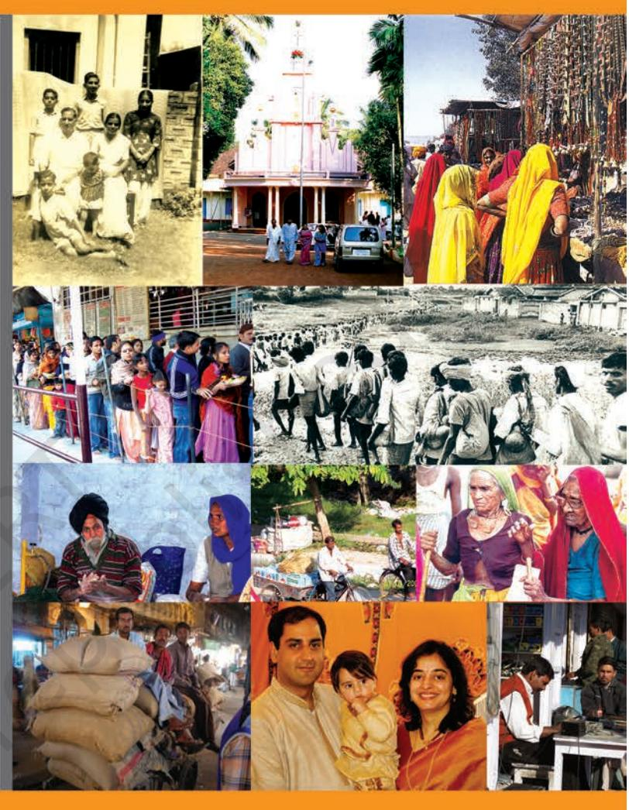

Introducing Indian Society

**1**

Chapter 1.indd 1 6/17/2022 3:29:50 PM

*I*n one important sense, Sociology is unlike any other subject that you may have studied. It is a subject in which no one starts from zero – everyone already knows something about society. Other subjects are learnt because they are taught (at school, at home, or elsewhere); but much of our knowledge about society is acquired without explicit teaching. Because it is such an integral part of the process of growing up, knowledge about society seems to be acquired "naturally" or "automatically". No child is expected to already know something about History, Geography, Psychology or Economics when they come to school. But even a six year old already knows something about society and social relationships. It is all the more true then, that, as young eighteen year old adults, you know a lot about the society you live in without ever having studied it.

This prior knowledge or familiarity with society is both an advantage and a disadvantage for sociology, the discipline that studies society. The advantage is that students are generally not afraid of Sociology – they feel that it can't be a very hard subject to learn. The disadvantage is that this prior knowledge can be a problem – in order to learn Sociology, we need to "unlearn" what we already know about society. In fact, the initial stage of learning Sociology consists mainly of such unlearning. This is necessary because our prior knowledge about society – our common sense – is acquired from a particular viewpoint. This is the viewpoint of the social group and the social environment that we are socialised into. Our social context shapes our opinions, beliefs and expectations about society and social relations. These beliefs are not necessarily wrong, though they can be. The problem is that they are 'partial'. The word partial is being used here in two different senses – incomplete (the opposite of whole), and biased (the opposite of impartial). So our 'unlearnt' knowledge or common sense usually allows us to see only a part of social reality; moreover, it is liable to be tilted towards the viewpoints and interests of our own social group.

What may be of even more interest to you is that sociology can show you what you look like to others; it can teach you how to look at yourself 'from the outside', so to speak. This is called 'self-reflexivity', or sometimes just **reflexivity**. This is the ability to reflect upon yourself, to turn back your gaze (which is usually directed outward) back towards yourself. But this self-inspection must be critical – i.e., it should be quick to criticise and slow to praise oneself.

A comparable social map would tell you where you are located in society. For example, as a seventeen or eighteen year old, you belong to the social group called "young people". People your age or younger account for about forty per cent of India's population. You might belong to a particular regional or linguistic community, such as a Gujarati speaker from Gujarat or a Telugu speaker from Andhra Pradesh. Depending on your parent's occupation and your family income, you would also be a member of an economic class, such as lower middle class or upper class. You could be a member of a particular religious community, a caste or tribe, or other such social group. Each of

**2**

Chapter 1.indd 2 6/17/2022 3:29:50 PM

## Introducing Indian Society

these identities would locate you on a social map, and among a web of social relationships. Sociology tells you about what kinds of groups or groupings there are in society, what their relationships are to each other, and what this might mean in terms of your own life.

But sociology can do more than simply help to locate you or others in this simple sense of describing the places of different social groups. As C.Wright Mills, a well-known American sociologist has written, sociology can help you to map the links and connections between "personal troubles" and "social issues". By personal troubles Mills means the kinds of individual worries, problems or concerns that everyone has. So, for example, you may be unhappy about the way elders in your family treat you or how your brothers, sisters or friends treat you. You may be worried about your future and what sort of job you might get. Other aspects of your individual identity may be sources of pride, tension, confidence or embarrassment in different ways. But all of these are about one person and derive meaning from this personalised perspective. A social issue, on the other hand, is about large groups and not about the individuals who make them up.

This entire book is meant to introduce you to Indian society from a sociological rather than common sense point of view. What can be said by way of an introduction to this introduction? Perhaps it would be appropriate at this point to indicate in advance the larger processes that were at work in shaping Indian society, processes that you will encounter in detail in the pages to follow.

## 1.2 A Preview of this Book

In this, the first of two textbooks on sociology, you will be introduced to the basic structure of Indian society. (The second textbook will be focussed on the specifics of social change and development in India.)

We begin with a discussion of the demographic structure of the Indian population (Chapter 2). As you know, India is currently the second most populous country in the world, and in a few decades is projected to overtake China and become the most populous country in the world. What are the ways in which sociologists and demographers study a population? Which aspects of the population are socially significant, and what has been happening on these fronts in the Indian case? Is our population simply an obstacle to development, or can it also be seen as helping development in some ways? These are some of the questions that this chapter tries to tackle.

In Chapter 3, we revisit the basic building blocks of Indian society in the form of the institutions of caste, tribe and family. As a unique feature of the Indian subcontinent, caste has always attracted a lot of scholarly attention. How has this institution been changing over the centuries, and what does caste really mean today? What is the context in which the concept of 'tribe'

**3**

Chapter 1.indd 3 6/17/2022 3:29:50 PM

was introduced into India? What sorts of communities are tribes supposed to be, and what is at stake in defining them as such? How do tribal communities define themselves in contemporary India? Finally, the family as an institution has also been subjected to tremendous pressure in these times of rapid and intense social change. What changes do we see in the diverse forms of the family that exist in India? By addressing questions like these, Chapter 3 builds the base for looking at further aspects of Indian society which would pre-suppose caste, tribe and family.

Chapter 4 explores the socio-cultural dimensions of the market as a powerful institution that has been the vehicle of change throughout world history. Given that the most sweeping and rapid economic changes were brought about first by colonialism and then by developmental policies, this chapter looks at how markets of different kinds have evolved in India, and the chain reactions they set in motion.

Among the features of our society that have been the cause of greatest concern are its seemingly unlimited capacity for generating inequality and exclusion. Chapter 5 is devoted to this important subject. Chapter 5 looks at inequality and exclusion in the context of caste, tribe, gender and the 'disabled'. Notorious as an instrument of division and injustice, the caste system has been the object of concerted attempts by the state and by the oppressed castes to reform or even abolish it. What are the concrete problems and issues that this attempt faced? How successful have movements to resist caste exclusion been in our recent past? What have been the special problems of tribal movements? In what context are tribal identities reasserting themselves today? Similar questions are dealt with in the context of gender relations, and the 'disabled'. To what extent is our society responsive to the needs of the disabled? How much of an impact has the women's movement had on the social institutions that have oppressed women?

Chapter 6 deals with the difficult challenges posed by the immense diversity of Indian society. This chapter invites us to step outside our normal, comfortable ways of thinking. The familiar cliches and slogans about India being a land of unity in diversity have a hard and complex side to them. Despite all the failures and inadequacies, India has not done too badly on this front. What have been our strengths and our weaknesses? How may young adults face issues like communal conflict, regional or linguistic chauvinism, and casteism without either wishing them away or being overwhelmed by them? Why is it important for our collective future as a nation that every minority in India not feel that it is insecure or at risk?

Finally, in Chapter 7, some suggestions are provided for you and your teachers to think about the practical component of your course. This can be quite interesting and enjoyable, as you will discover.

Chapter 1.indd 4 6/17/2022 3:29:50 PM

