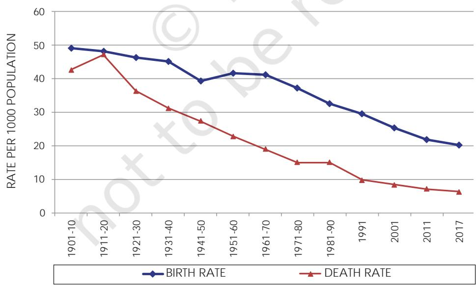
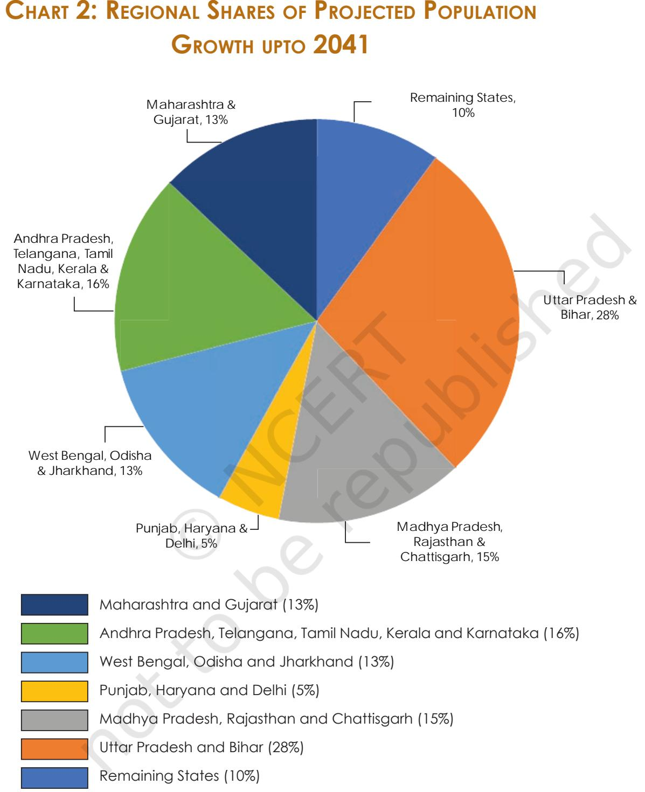

**5**

Chapter 2.indd 5 9/1/2022 12:35:34 PM

*D*emography is the systematic study of population. The term is of Greek origin and is composed of the two words, *demos* (people) and *graphein* (describe), implying the description of people. Demography studies the trends and processes associated with population including – changes in population size; patterns of births, deaths, and migration; and the structure and composition of the population, such as the relative proportions of women, men and different age groups. There are different varieties of demography, including formal demography which is a largely quantitative field, and social demography which focuses on the social, economic or political aspects of populations. All demographic studies are based on processes of counting or enumeration – such as the census or the survey – which involve the systematic collection of data on the people residing within a specified territory.

Demography is a field that is of special importance to sociology – in fact, the emergence of sociology and its successful establishment as an academic discipline owed a lot to demography. Two different processes happened to take place at roughly the same time in Europe during the latter half of the eighteenth century – the formation of nation-states as the principal form of political organisation, and the beginnings of the modern science of statistics. The modern state had begun to expand its role and functions. It had, for instance, begun to take an active interest in the development of early forms of public health management, policing and maintenance of law and order, economic policies relating to agriculture and industry, taxation and revenue generation and the governance of cities.

This new and constantly expanding sphere of state activity required the systematic and regular collection of *social statistics* – or quantitative data on various aspects of the population and economy. The practice of the collection of social statistics by the state is in itself much older, but it acquired its modern form towards the end of the eighteenth century. The American census of 1790 was probably the first modern census, and the practice was soon taken up in Europe as well in the early 1800s. In India, censuses began to be conducted by the British Indian government between 1867–72, and regular ten yearly (or decennial) censuses have been conducted since 1881. Independent India continued the practice, and seven decennial censuses have been conducted since 1951, the most recent being in 2011. The Indian census is the largest such exercise in the world (since China, which has a slightly larger population, does not conduct regular censuses).

Demographic data are important for the planning and implementation of state policies, specially those for economic development and general public welfare. But when they first emerged, social statistics also provided a strong justification for the new discipline of sociology. Aggregate statistics – or the numerical characteristics that refer to a large collectivity consisting of millions of people – offer a concrete and strong argument for the existence of *social* phenomena. Even though country-level or state-level statistics like the number

Chapter 2.indd 6 9/1/2022 12:35:34 PM

Chapter 2.indd 7 9/1/2022 12:35:34 PM

of deaths per 1,000 population – or the death rate – are made up by aggregating (or adding up) individual deaths, the death rate itself is a social phenomenon and must be explained at the social level. Emile Durkheim's famous study explaining the variation in suicide rates across different countries was a good example of this. Durkheim argued that the rate of suicide (i.e., number of suicides per 100,000 population) had to be explained by social causes even though each particular instance of suicide may have involved reasons specific to that individual or her/his circumstances.

Sometimes a distinction is made between formal demography and a broader field of population studies. Formal demography is primarily concerned with the measurement and analysis of the components of population change. Its focus is on quantitative analysis for which it has a highly developed mathematical methodology suitable for forecasting population growth and changes in the composition of population. Population studies or social demography, on the other hand, enquires into the wider causes and consequences of population structures and change. Social demographers believe that social processes and structures regulate demographic processes; like sociologists, they seek to trace the social reasons that account for population trends.

### 2.1 Some Theories and Concepts in Demography

### **The Malthusian Theory of Population Growth**

Among the most famous theories of demography is the one associated with the English political economist Thomas Robert Malthus (1766–1834). Malthus's theory of population growth – outlined in his *Essay on Population* (1798) – was a rather pessimistic one. He argued that human populations tend to grow at a much faster rate than the rate at which the means of human subsistence (specially food, but also clothing and other agriculture-based products) can grow. Therefore humanity is condemned to live in poverty forever because the growth of agricultural production will always be overtaken by population growth. While population rises in **geometric progression** (i.e., like 2, 4, 8, 16, 32, etc.), agricultural production can only grow in **arithmetic progression** (i.e., like 2, 4, 6, 8, 10, etc.). Because population growth always outstrips growth in production of subsistence resources, the only way to increase prosperity is by controlling the growth of population. Unfortunately, humanity has only a limited ability to voluntarily reduce the growth of its population (through '**preventive checks**' such as postponing marriage or practicing sexual abstinence or celibacy). Malthus believed therefore that '**positive checks**' to population growth – in the form of famines and diseases – were inevitable because they were nature's way of dealing with the imbalance between food supply and increasing population.

Malthus's theory was influential for a long time. But it was also challenged by theorists who claimed that economic growth could outstrip population

Chapter 2.indd 8 9/8/2022 12:06:09 PM

"The power of population is so superior to the power of the earth to produce subsistence for man, that premature death must in some shape or other visit the human race.

The vices of mankind are active and able ministers of depopulation. They are the precursors in the great army of destruction, and often finish the dreadful work themselves. But should they fail in this war of extermination, sickly seasons, epidemics, pestilence, and plague advance in terrific array, and sweep off their thousands and tens of thousands? Should success be still incomplete, gigantic inevitable famine stalks in the rear, and with one mighty blow levels the population with the food of the world?"

> – Thomas Robert Malthus, *An Essay on the Principle of Population, 1798.*

growth. However, the most effective refutation of his theory was provided by the historical experience of European countries. The pattern of population growth began to change in the latter half of nineteenth century, and by the end of the first quarter of the twentieth century these changes were quite dramatic. Birth rates had declined, and outbreaks of epidemic diseases were being controlled. Malthus's predictions were proved false because both food production and standards of living continued to rise despite the rapid growth of population.

Malthus was also criticised by liberal and Marxist scholars for asserting that poverty was caused by population

growth. The critics argued that problems like poverty and starvation were caused by the unequal distribution of economic resources rather than by population growth. An unjust social system allowed a wealthy and privileged minority to live in luxury while the vast majority of the people were forced to live in poverty.

### **The Theory of Demographic Transition**

Another significant theory in demography is the theory of demographic transition. This suggests that population growth is linked to overall levels of economic development and that every society follows a typical pattern of development-related population growth. There are three basic stages of population growth. The first stage is that of low population growth in a society that is underdeveloped and technologically backward. Growth rates are low because both the death rate and the birth rate are very high, so that

### **Box 2.1 Thomas Robert Malthus (1766–1834)**

Malthus studied at Cambridge and trained to become a Christian priest. Later he was appointed Professor of History and Political Economy at the East India Company College at Haileybury near London, which was a training centre for the officers recruited to the Indian Civil Service.

**9**

Chapter 2.indd 9 9/8/2022 12:06:09 PM

### **ACTIVITY 2.1**

Read the section on the previous page and the quotation from Malthus in Box 2.1. One reason why Malthus was proved wrong is the substantial increases in the **productivity of agriculture**. Can you fi nd out how these productivity increases occurred – i.e., what were the factors that made agriculture more productive? What could be some of the other reasons why Malthus was wrong? Discuss with your classmates and make a list with the help of your teacher.

the difference between the two (or the net growth rate) is low. The third (and last) stage is also one of low growth in a developed society where both death rate and birth rate have been reduced considerably and the difference between them is again small. Between these two stages is a transitional stage of movement from a backward to an advanced stage, and this stage is characterised by very high rates of growth of population.

This 'population explosion' happens because death rates are brought down relatively quickly through advanced methods of disease control, public health, and better nutrition. However, it takes longer for society to adjust to change and alter its reproductive behaviour (which was evolved during the period of poverty and high death rates) to suit the new situation of relative prosperity and longer life spans. This kind of transition was effected in Western Europe during the late nineteenth and early twentieth century. More or less similar patterns are followed in the less developed countries that are struggling to reduce the birth rate in keeping with the falling mortality rate. In India too, the demographic transition is not yet complete as the

mortality rate has been reduced but the birth rate has not been brought down to the same extent.

### **COMMON CONCEPTS AND INDICATORS**

Most demographic concepts are expressed as rates or ratios – they involve two numbers. One of these numbers is the particular statistic that has been calculated for a specific geographical-administrative unit; the other number provides a standard for comparison. For example, the *birth rate* is the total number of live births in a particular area (an entire country, a state, a district or other territorial unit) during a specified period (usually a year) divided by the total population of that area in thousands. In other words, the birth rate is the number of live births per 1000 population. The *death rate* is a similar statistic, expressed as the number of deaths in a given area during a given time per 1000 population. These statistics depend on the reporting of births and deaths by the families in which they occur.

The *rate of natural increase* or the growth rate of population refers to the difference between the birth rate and the death rate. When this difference is zero (or, in practice, very small) then we say that the population has 'stabilised', or has reached the 'replacement level', which is the rate of growth required for new generations to replace the older ones that are dying out. Sometimes, societies can experience a negative growth rate, that is, their fertility levels are

Chapter 2.indd 10 25-01-2024 09:29:10

below the replacement rate. This is true of many countries and regions in the world today, such as Japan, Russia, Italy and Eastern Europe.

The *fertility rate* refers to the number of live births per 1000 women in the child-bearing age group, usually taken to be 15 to 49 years. But like the other rates discussed on the previous page (the birth and death rates) this is a 'crude' rate – it is a rough average for an entire population and does not take into account the differences across agegroups. Differences across age groups can sometimes be very significant in affecting the meaning of indicators. That is why demographers also calculate age-specific rates.

The *infant mortality* rate is the number of deaths of babies before the age of one year per 1000 live births. Likewise, the *maternal mortality* rate is the number of women who die in childbirth per 1,00,000 live births. High rates of infant and maternal mortality are an unambiguous indicator of

### **Activity 2.2**

Try to find out why the birth rate is slow to decline but the death rate can fall relatively fast. What are some of the factors that might influence a family or couple's decision about the number of children they should have? Ask older people in your family or neighbourhood about the possible reasons why people in the past tended to have more children.

backwardness and poverty; development is accompanied by sharp falls in these rates as medical facilities and levels of education, awareness and prosperity increase. One concept which is somewhat complicated is that of *life expectancy.* This refers to the estimated number of years that an average person is expected to survive. It is calculated on the basis of data on age-specific death rates in a given area over a period of time.

The *sex ratio* refers to the number of females per 1000 males in a given area at a specified time period. Historically, all over the world it has been found that there are slightly more females than males in most countries. This is despite the fact that, slightly more male babies are born than female ones; nature seems to produce roughly 943 to 952 female babies for every 1000 males. If despite this fact the sex ratio is somewhat in favour of females, this seems to be due to two reasons. First, girl babies appear to have an advantage over boy babies in terms of resistance to disease in infancy. At the other end of the life cycle, women have tended to outlive men in most societies, so that there are more older women than men. The combination of these two factors leads to a sex ratio of roughly 1050 females per 1000 males in most contexts. However, it has been found that the sex ratio has been declining in some countries like China, South Korea and specially India. This phenomenon has been linked to prevailing social norms that tend to value males much more than females, which leads to 'son preference' and the relative neglect of girl babies.

The *age structure of the population* refers to the proportion of persons in different age groups relative to the total population. The age structure changes in response to changes in levels of development and the average life expectancy. Initially, poor medical facilities, prevalence of disease and other factors make for a relatively short life span. Moreover, high infant and maternal mortality

**11**

Chapter 2.indd 11 9/1/2022 12:35:35 PM

rates also have an impact on the age structure. With development, quality of life improves and with it the life expectancy also improves. This changes the age structure: relatively smaller proportions of the population are found in the younger age groups and larger proportions in the older age groups. This is also referred to as the ageing of the population.

The *dependency ratio* is a measure comparing the portion of a population which is composed of dependents (i.e., elderly people who are too old to work, and children who are too young to work) with the portion that is in the working age group, generally defined as 15 to 64 years. The dependency ratio is equal to the population below 15 or above 64, divided by population in the 15-64 age group. This is usually expressed as a percentage. A rising dependency ratio is a cause for worry in countries that are facing an ageing population, since it becomes difficult for a relatively smaller proportion of working-age people to carry the burden of providing for a relatively larger proportion of dependents. On the other hand, a falling dependency ratio can be a source of economic growth and prosperity due to the larger proportion of workers relative to non-workers. This is sometimes refered to as the 'demographic dividend', or benefit flowing from the changing age structure. However, this benefit is temporary because the larger pool of working age people will eventually turn into non-working old people.

### 2.2 Size and Growth of India's Population

India is the second most populous country in the world after China, with a total population of 121 crores (or 1.21 billion) according to the Census of India 2011. As can be seen from Table 1, the growth rate of India's population has not always been very high. Between 1901–1951 the average annual growth rate did not exceed 1.33%, a modest rate of growth. In fact between 1911 and 1921 there was a negative rate of growth of – 0.03%. This was because of the influenza epidemic during 1918–19 which killed about 12.5 million persons or 5% of the total population of the country (Visaria and Visaria 2003: 191). The growth rate of population substantially increased after independence from British rule going up to 2.2% during 1961-1981. Since then although the annual growth rate has decreased it remains one of the highest in the developing world. Chart 1 shows the comparative movement of the crude birth and death rates. The impact of the demographic transition phase is clearly seen in the graph where they begin to diverge from each other after the decade of 1921 to 1931.

Before 1931, both death rates and birth rates were high, whereas, after this transitional moment the death rates fell sharply but the birth rate only fell slightly.

The principal reasons for the decline in the death rate after 1921 were increased levels of control over famines and **epidemic** diseases. The latter

Chapter 2.indd 12 9/1/2022 12:35:35 PM

| Table 1: The Population | of Ind | ia and | its Growth During |
| --- | --- | --- | --- |
|  | the 20th Century |  |  |
| Year | Total Population | Average Annual | Decadal |
|  | (in millions) | Growth Rate (%) | Growth Rate (%) |
| 1901 | 238 | – | - |
| 1911 | 252 | 0.56 | 5.8 |
| 1921 | 251 | -0.03 | -0.3 |
| 1931 | 279 | 1.04 | 11.0 |
| 1941 | 319 | 1.33 | 14.2 |
| 1951 | 361 | 1.25 | 13.3 |
| 1961 | 439 | 1.96 | 21.6 |
| 1971 | 548 | 2.22 | 24.8 |
| 1981 | 683 | 2.20 | 24.7 |
| 1991 | 846 | 2.14 | 23.9 |
| 2001 | 1028 | 1.95 | 21.5 |
| 2011 Source: website: http://ayush.gov.in | 1210 | 1.63 | 17.7 |

### **Chart 1: Birth and Death Rate in India 1901-2017**

<i>Source: *National Commission on Population, Government of India. website: http://populationcommission.nic.in/facts1.htm# National Health Profile 2018, Ministry of Health and Family Welfare, Government of India; Economic Survey 2018–19, Government of India.*

Chapter 2.indd 13 9/1/2022 12:35:35 PM

cause was perhaps the most important. The major epidemic diseases in the past were fevers of various sorts, plague, smallpox and cholera. But the single biggest epidemic was the influenza epidemic of 1918-19, which killed as many as 170 lakh people, or about 5% of the total population of India at that time. (Estimates of deaths vary, and some are much higher. Also known as 'Spanish Flu', the influenza pandemic was a global phenomenon – see the box below. A pandemic is an epidemic that affects a very wide geographical area – see the glossary).

#### **The Global Influenza Pandemic of 1918–19**

**Box 2.2**

Influenza is caused by a virus that attacks mainly the upper respiratory tract – the nose, throat and bronchi and rarely also the lungs. The genetic makeup of influenza viruses allows for both major and minor genetic changes, making them immune to existing vaccines. Three times in the last century, the influenza viruses have undergone major genetic changes, resulting in global pandemics and large tolls in terms of both disease and deaths. The most infamous pandemic was "Spanish Flu" which affected large parts of the world population and is thought to have killed at least 40 million people in 1918-1919. More recently, two other influenza pandemics occurred in 1957 ("Asian influenza") and 1968 ("Hong Kong influenza") and caused significant morbidity and mortality globally. The global mortality rate from the 1918/1919 Spanish flu pandemic is not known, but is estimated at 2.5 – 5% of the human population, with 20% of the world population suffering from the disease to some extent. Influenza may have killed as many as 25 million in its first 25 weeks; in contrast, AIDS killed 25 million in its first 25 years. Influenza spread across the world, killing more than 25 million in six months; some estimates put the total killed at over twice that number, possibly even 100 million. In the United States, about 28% of the population suffered, and 500,000 to 675,000 died. In Britain 200,000 died; in France more than 400,000. Entire villages perished in Alaska and southern Africa. In Australia an estimated 10,000 people died and in the Fiji Islands, 14% of the population died during only two weeks, and in Western Samoa 22%. An estimated 17 million died in India, about 5% of India's population at the time. In the British Indian Army, almost 22% of troops who caught the disease died of it.

While World War I did not cause the flu, the close quarters and mass movement of troops quickened its spread. It has been speculated that the soldiers' immune systems were weakened by the stresses of combat and chemical attacks, increasing their susceptibility to the disease.

*Source: Compiled from Wikipedia, and World Health Organisation; Webpages:*  http://en.wikipedia.org/wiki/Spanish_flu http://www.who.int/mediacentre/factsheets/fs211/en/

In 2020–21, the whole world met with COVID–19 pandemic. Collect details from media sources and compare with what is given in the box.

Chapter 2.indd 14 9/1/2022 12:35:35 PM

Improvements in medical cures for these diseases, programmes for mass vaccination, and efforts to improve sanitation helped to control epidemics. However, diseases like malaria, tuberculosis, diarrhoea and dysentery continue to kill people even today, although the numbers are nowhere as high as they used to be in the epidemics of the past. Surat witnessed a small epidemic of plague in September 1994, while dengue and chikungunya epidemics are since reported in various parts of the country.

Famines were also a major and recurring source of increased mortality. Famines were caused by high levels of continuing poverty and malnutrition in an agroclimatic environment that was very vulnerable to variations in rainfall. Lack of adequate means of transportation and communication as well as inadequate efforts on the part of the state were some of the factors responsible for famines. However, as scholars like Amartya Sen and others have shown, famines were not necessarily due to fall in foodgrains production; they were also caused by a 'failure of entitlements', or the inability of people to buy or otherwise obtain food. Substantial improvements in the productivity of Indian agriculture (specially through the expansion of irrigation); improved means of communication; and more vigorous relief and preventive measures by the state have all helped to drastically reduce deaths from famine. Nevertheless, starvation deaths are still reported from some backward regions of the country. The Mahatma Gandhi National Rural Employment Guarantee Act is the latest state initiative to tackle the problem of hunger and starvation in rural areas.

Unlike the death rate, the birth rate has not registered a sharp fall. This is because the birth rate is a sociocultural phenomenon that is relatively slow to change. By and large, increased levels of prosperity exert a strong downward pull on the birth rate. Once infant mortality rates decline, and there is an overall increase in the levels of education and awareness, family size begins to fall. There are very wide variations in fertility rates across the States of India, as can be seen in Chart 1 (on page no. 13). Some states, like Andhra Pradesh, Himachal Pradesh, Punjab, Tamil Nadu and West Bengal have managed to bring down their total fertility rates (TFR) to 1.7 each (2016). This means that the average woman in these states produces only 1.7 children, which is below the 'replacement level' and Kerala's TFR is also below the replacement level, which means that the population is going to decline in future. But there are some states, notably Bihar, Madhya Pradesh, Rajasthan and Uttar Pradesh, which still have very high TFRs. In 2016, the TFRs of these states were 3.3, 2.8, 2.7 and 3.1, respectively. According to Sample Registration System, Statistical report 2020, India's crude birth rate was 19.5. The rural birth rate was 21.1 and urban birth rate was 16.1. As per this statistics, Bihar with 25.5 and Uttar Pradesh with 25.1 account for the highest birth rate in India. Furthermore, as per economic survey 2018-19, these two states will also account for almost half (50%) of the additions to the Indian population up to the year 2041. Uttar Pradesh alone is expected to account for a little less than one-quarter (22%) of this increase. Chart 2 (on page

Chapter 2.indd 15 28-03-2024 11:56:17

**16** *Source: https://censusindia.gov.in/nada/index.php/catalog/44376*

Chapter 2.indd 16 26-03-2024 13:43:34

*Source: Economic Survey 2018–19, Vol.1, P.137, Ministry of Finance, Government of India.*

### **17**

Chapter 2.indd 17 9/1/2022 12:35:37 PM

no.17) shows the relative contribution to population growth from different regional groupings of States.

### 2.3 Age Structure of the Indian Population

India has a very young population — that is, the majority of Indians tend to be young, and the average age is also less than that for most other countries. Table 2 shows that the share of the under 15 age group in the total population has come down from its highest level of 42% in 1971 to 29% in 2011. The share of the 15–59 age group has increased slightly from 53% to 63%, while the share of the 60+ age group is very small but it has begun to increase (from 5% to 7%) over the same period. But the age composition of the Indian population is expected to change significantly in the next two decades. Most of this change will be at the two ends of the age spectrum – as Table 2 shows, the 0 -14 age group will reduce its share by about 11% (from 34% in 2001 to 23% in 2026) while the 60 plus age group will increase its share by about 5% (from 7% in 2001 to about 12% in 2026.) Chart 3 shows a graphical picture of the 'population pyramid' from 1961 to its projected shape in 2026.

|  | Table 2: Age Composition | of the Population |  | of India, 1961–2026 |
| --- | --- | --- | --- | --- |
| Year |  | Age Group |  | Total |
|  | 0–14 Year | 15–59 Year | 60+ Years |  |
| 1961 | 41 | 53 | 6 | 100 |
| 1971 | 42 | 53 | 5 | 100 |
| 1981 | 40 | 54 | 6 | 100 |
| 1991 | 38 | 56 | 7 | 100 |
| 2001 | 34 | 59 | 7 | 100 |
| 2011 | 29 | 63 | 8 | 100 |
| 2026 | 23 | 64 | 12 | 100 |

Age Group columns show percentage shares; rows may not add up to 100 because of rounding

*Source: Based on data from the Technical Group on Population Projections (1996 and 2006) of the National Commission on Population. Webpage for 1996 Report: http://populationcommission.nic.in/facts1.htm*

Chapter 2.indd 18 9/8/2022 12:07:37 PM

# **Chart 3: Age Group Pyramids, 1961, 1981, 2001 and 2026**

Chapter 2.indd 19 9/1/2022 12:35:39 PM

**20** *Source: Based on data from relevant volumes of the Census of India (1961, 1981 & 2001) and the Report of the Technical Group on Population Projections (2006) of the National Commission on Population.*

Chapter 2.indd 20 9/1/2022 12:35:41 PM

#### **Exercise for Chart 3**

The Age Group 'pyramid' shown in Chart 3 provides a much more detailed version of the kind of age grouped data presented in Table 2. Here, data are shown separately for males (on the left side) and females (on the right side) with the relevant five-year age group in the middle. Looking at the horizontal bars (including both males and females in a particular age group) gives you a visual sense of the age structure of the population. The age groups begin from the 0-4 years group at the bottom of the pyramid and go on to the 80 years and above age group at the top. There are four different pyramids for the decennial census years of 1961, 1981, 2001 and the estimates for 2026. The pyramid for 2026 shows the estimated future size of the relevant age groups based on data on the past rates of growth of each age group. Such estimates are also called 'projections'.

These pyramids show you the effect of a gradual fall in the birth rate and rise in the life expectancy. As more and more people begin to live to an older age, the top of the pyramid grows wider. As relatively fewer new births take place, the bottom of the pyramid grows narrower. But the birth rate is slow to fall, so the bottom doesn't change much between 1961 and 1981. The middle of the pyramid grows wider and wider as its share of the total population increases. This creates a 'bulge' in the middle age groups that is clearly visible in the pyramid for 2026. This is what is refered to as the 'demographic dividend' which will be discussed later in this chapter.

Study this chart carefully. With the help of your teacher, try to trace what happens to the new-born generation of 1961 (the 0–4 age group) as it moves up the pyramid in succesive years.

- Where will the 0–4 age group of 1961 be located in the pyramids for the later years?
- Where in which age group is the widest part of the pyramid as you move from 1961 to 2026?
- What do you think the shape of the pyramid might be in the year 2051 and 3001?

As with fertility rates, there are wide regional variations in the age structure as well. While a state like Kerala is beginning to acquire an age structure like that of the developed countries, Uttar Pradesh presents a very different picture with high proportions in the younger age groups and relatively low proportions among the aged. India as a whole is somewhere in the middle, because it includes states like Uttar Pradesh as well as states that are more like Kerala. Chart 4 shows the estimated population pyramids for Uttar Pradesh and Kerala in the year 2026. Note the difference in the location of the widest parts of the pyramid for Kerala and Uttar Pradesh.

**21**

Chapter 2.indd 21 9/1/2022 12:35:41 PM

# **Chart 4: Age Structure Pyramids, Kerala and Uttar Pradesh, 2026**

**22**

*Source: Report of the Technical Group on Population Projections (2006) of the National Commission on Population.*

Chapter 2.indd 22 9/1/2022 12:35:43 PM

The bias towards younger age groups in the age structure is believed to be an advantage for India. Like the East Asian economies in the past decade and like Ireland today, India is supposed to be benefi tting from a 'demographic dividend'. This dividend arises from the fact that the current generation of working-age people is a relatively large one, and it has only a relatively small preceding generation of old people to support. But there is nothing automatic about this advantage – it needs to be consciously exploited through appropriate policies as is explained in Box 2.3 below.

#### **Does the changing age structure offer a 'demographic dividend' for India?**

**BOX 2.3**

The demographic advantage or 'dividend' to be derived from the age structure of the population is due to the fact that India is (and will remain for some time) one of the youngest countries in the world. A third of India's population was below 15 years of age in 2011. In 2020, the average Indian was only 29 years old, compared with an average age of 37 in China and the United States, 45 in Western Europe, and 48 in Japan. This implies a large and growing labour force, which can deliver unexpected benefi ts in terms of growth and prosperity.

The 'demographic dividend' results from an increase in the proportion of workers relative to non-workers in the population. In terms of age, the working population is roughly that between 15 to 64 years of age. This working age group must support itself as well as those outside this age group (i.e., children and elderly people) who are unable to work and are therefore dependents. Changes in the age structure due to the demographic transition lower the 'dependency ratio', or the ratio of non-working age to working-age population, thus creating the potential for generating growth.

But this potential can be converted into actual growth only if the rise in the working age group is accompanied by increasing levels of education and employment. If the new entrants to the labour force are not educated then their productivity remains low. If they remain unemployed, then they are unable to earn at all and become dependents rather than earners. Thus, changing age structure by itself cannot guarantee any benefi ts unless it is properly utilised through planned development. The real problem is in defi ning the dependency ratio as the ratio of the non-working age to working-age population, rather than the ratio of non-workers to workers. The difference between the two is determined by the extent of unemployment and underemployment, which keep a part of the labour force out of productive work. This difference explains why some countries are able to exploit the demographic advantage while others are not.

India is indeed facing a window of opportunity created by the demographic dividend. The effect of demographic trends on the dependency ratio defi ned in terms of age groups is quite visible. The total dependency ratio fell from 79 in 1970 to 64 in 2005. But the process is likely to extend well into this century with the age-based dependency ratio projected to fall to 48 in 2025 because of continued fall in the proportion of children and then rise to 50 by 2050 because of an increase in the proportion of the aged.

**23**

Chapter 2.indd 23 25-01-2024 09:32:41

### **Activity 2.3**

What impact do you think the age structure has on inter - generational relationships? For instance, could a high dependency ratio create conditions for increasing tension b e t w e e n o l d e r a n d younger generations? Or would it make for closer relationships and stronger bonds between young and old? Discuss this in class and try to come up with a list of possible outcomes and the reasons why they happen.

The problem, however, is employment. Data from the Government of India sources reveal a sharp fall in the rate of employment generation (creation of new jobs) across both rural and urban areas. This is true for the young as well. The rate of growth of employment in the 15–30 age group, which stood at around 2.4 per cent a year between 1987 and 1994 for both rural and urban men, fell to 0.7 for rural men and 0.3 per cent for urban men during 1994 to 2004. This suggests that the advantage offered by a young labour force is not being exploited.

Strategies exist to exploit the demographic window of opportunity that India has today. But India's recent experience suggests that market forces by themselves do not ensure that such strategies would be implemented. Unless a way forward is found, we may miss out on the potential benefits that the country's changing age structure temporarily offers.

*[Source: Adapted from an article by C.P. Chandrashekhar in Frontline Volume 23 - Issue 01, January 14–27, 2006]*

### 2.4 The Declining Sex-ratio in India

The sex ratio is an important indicator of gender balance in the population. As mentioned in the section on concepts earlier, historically, the sex ratio has been slightly in favour of females, that is, the number of females per 1000 males has generally been somewhat higher than 1000. However, India has had a declining sex-ratio for more than a century, as is clear from Table 3. From 972 females per 1000 males at the turn of the twentieth century, the sex ratio has declined to 933 at the turn of the twenty-first century. The trends of the last four decades have been particularly worrying – from 941 in 1961 the sex ratio had fallen to an all-time low of 927 in 1991 before posting a modest increase in 2001. According to Census of India 2011 sex ratio has increased and now it is 943 females per 1000 males.

But what has really alarmed demographers, policy makers, social activists and concerned citizens is the drastic fall in the child sex ratio. Age specific sex ratios began to be computed in 1961. As is shown in Table 3, the sex ratio for the 0–6 years age group (known as the juvenile or child sex ratio) has generally been substantially higher than the overall sex ratio for all age groups, but it has been falling very sharply. In fact the decade 1991–2001 represents an anomaly in that the overall sex ratio has posted its highest ever increase of 6 points from the all time low of 927 to 933, but the child sex ratio has dropped from 945 to 927, a plunge of 18 points taking it below the overall sex ratio for the first time. In 2011 Census (provisional) the child sex ratio again decreased by 13 points and now it is 919.

Chapter 2.indd 24 9/1/2022 12:35:43 PM

|  | Table 3: The Declining | Sex Ratio | in Ind ia, 1901–2011 |  |
| --- | --- | --- | --- | --- |
| Year | Sex ratio (all age groups) | Variation over previous decade | Child Sex ratio (0–6 years) | Variation over previous decade |
| 1901 | 972 | – | – | – |
| 1911 | 964 | –8 | – | – |
| 1921 | 955 | –9 | – | – |
| 1931 | 950 | –5 | – | – |
| 1941 | 945 | –5 | – | – |
| 1951 | 946 | +1 | – | – |
| 1961 | 941 | –5 | 976 | – |
| 1971 | 930 | –11 | 964 | –12 |
| 1981 | 934 | +4 | 962 | –2 |
| 1991 | 927 | –7 | 945 | –17 |
| 2001 | 933 | +6 | 927 | –18 |
| 2011 | 943 | +10 | 919 | –8 |
|  | Note: The sex ratio is defined as the number of females per 1000 males; |  |  |  |
|  | Data on age-specific sex ratios is not available before 1961 Source: Census of India 2011, Government of India. |  |  |  |

The state-level child sex ratios offer even greater cause for worry. As many as nine States and Union Territories have a child sex ratio of under 900 females per 1000 males. Haryana is the worst state with an incredibly low child sex ratio of 793 (the only state below 800), followed by Punjab, Jammu & Kashmir, Delhi, Chandigarh, Uttarakhand and Himachal Pradesh. As Map 2 shows, Uttar Pradesh, Daman & Diu, Himachal Pradesh, Lakhshadweep and Madya Pradesh are all under 925, while large states such as West Bengal, Assam, Bihar, Tamil Nadu, Andhra Pradesh, Karnataka are above the national average of 919 but below the 970-mark. Even Kerala, the state with the better overall sex ratio does not do too well at 964, while the highest child sex ratio of 972 is found in Arunachal Pradesh.

Demographers and sociologists have offered several reasons for the decline in the sex ratio in India. The main health factor that affects women differently from men is childbearing. It is relevant to ask if the fall in the sex ratio may be partly due to the increased risk of death in childbirth that only women face. However, maternal mortality is supposed to decline with development, as levels of nutrition, general education and awareness, as well as, the availability of medical and communication facilities improves. Indeed, maternal mortality rates have been coming down in India even though they remain high by international standards. So, it is difficult to see how maternal mortality could have been responsible for the worsening of the sex ratio over time. Combined

**25**

Chapter 2.indd 25 9/1/2022 12:35:43 PM

# **Map 2: Map of Child Sex Ratios (0-6 Years) Across States, 2011**

Chapter 2.indd 26 9/1/2022 12:35:44 PM

with the fact that the decline in the child sex ratio has been much steeper than the overall figure, social scientists believe that the cause has to be sought in the differential treatment of girl babies.

Several factors may be held responsible for the decline in the child sex ratio, including severe neglect of girl babies in infancy, leading to higher death rates; sex-specific abortions that prevent girl babies from being born; and female

infanticide (or the killing of girl babies due to religious or cultural beliefs). Each of these reasons point to a serious social problem, and there is some evidence that all of these have been at work in India. Practices of female infanticide have been known to exist in many regions, while increasing importance is being attached to modern medical techniques by which the sex of the baby can be determined in the very early stages of pregnancy. The availability of the sonogram (an x-ray like diagnostic device based on ultra-sound technology), originally developed to identify genetic or other disorders in the foetus, are misused to identify and selectively abort female foetuses.

The regional pattern of low child sex ratios seems to support this argument. It is striking that the lowest child sex ratios are found in the most prosperous regions of India. According to the Economic Survey for a recent year, Maharashtra, Punjab, Haryana, Chandigarh and Delhi are having high per capita income and the child sex ratio of these states is still low. So the problem of selective abortions is not due to poverty or ignorance or lack of resources.

*Women's Agitation*

Sometimes economically prosperous families decide to have fewer children – often only one or two now – they may also wish to choose the sex of their child. This becomes possible with the availablity of ultra-sound technology, although the government has passed strict laws banning this practice and imposing heavy fines and imprisonment as punishment. Known as the Prenatal Diagnostic Techniques (Regulation and Prevention of Misuse) Act, this law has been in force since 1996, and has been further strengthened in 2003. However, in the long run, the solution to problems, like bias against girl children, depends more on how social attitudes evolve, even though laws and rules can also help. Recently, the Government of India has introduced the programme, '*Beti-Bachao, Beti-Padhao*'. It can prove to be an important policy to increase the child sex ratio in the country.

Chapter 2.indd 27 9/1/2022 12:35:44 PM

### 2.5 Literacy

Literacy as a prerequisite to education is an instrument of empowerment. The more literate the population the greater the consciousness of career options, as well as participation in the knowledge economy. Further, literacy can lead to health awareness and fuller participation in the cultural and economic well being of the community. Literacy levels have improved considerably after independence, and almost two-thirds of our population is now literate. But improvements in the literacy rate have to struggle to keep up with the rate of growth of the Indian population, which is still quite high.

Literacy varies considerably across gender, across regions, and across social groups. As can be seen from Table 4, the literacy rate for women is 16.3% less than the literacy rate for men. However, female literacy has been rising faster than male literacy, partly because it started from relatively low levels. Female literacy rose by about 10.4 per cent between 2001 and 2011 compared to the rise in male literacy of 7.6 per cent in the same period. Literacy increased approximately 8% in total. Male literacy rose about 5% whereas female literacy rose about 10%. Again female literacy has been rising faster than male literacy. Literacy rates also vary by social group – historically disadvantaged communities like the Scheduled Castes and Scheduled Tribes have lower rates of literacy, and rates of female literacy within these groups are even lower. Regional variations are still very wide, with states like Kerala approaching universal literacy, while states like Bihar are lagging far behind. The inequalities in the literacy rate are specially important because they tend to reproduce inequality across generations. Illiterate parents are at a severe disadvantage in ensuring that their children are well educated, thus perpetuating existing inequalities.

|  |  | Table 4: Literacy | Rate in Ind ia |  |
| --- | --- | --- | --- | --- |
|  |  | (Percentage of population 7 years of age and above) |  |  |
| Year | Persons | Males | Females | Male-Female gap in literacy rate |
| 1951 | 18.3 | 27.2 | 8.9 | 18.3 |
| 1961 | 28.3 | 40.4 | 15.4 | 25.1 |
| 1971 | 34.5 | 46.0 | 22.0 | 24.0 |
| 1981 | 43.6 | 56.4 | 29.8 | 26.6 |
| 1991 | 52.2 | 64.1 | 39.3 | 24.8 |
| 2001 | 65.4 | 75.9 | 54.2 | 21.7 |
| 2011 | 73.0 Source: Bose (2001:22); Census of India 2011. | 80.9 | 64.6 | 16.3 |

**28**

Chapter 2.indd 28 9/1/2022 12:35:44 PM

## **2.6 Rural-Urban Differences**

The vast majority of the population of India has always lived in the rural areas, and that continues to be true. According to Census of India 2011 still more people are living in rural areas but the population of urban areas has increased. Now 68.8% population lives in rural areas while 31.2% people live in urban areas. However, as Table 5 shows, the urban population has been increasing its share steadily, from about 11% at the beginning of the twentieth century to about 28% at the beginning of the twenty-first century, an increase of about two-and-a-half times. It is not a question of numbers alone; processes of modern development ensure that the economic and social significance of the agrarian-rural way of life declines relative to the significance of the industrialurban way of life. This has been broadly true all over the world, and it is true in India as well.

|  |  | Table 5: Rural and | Urban Population |  |
| --- | --- | --- | --- | --- |
| Year | Population (Millions) |  | Percentage of Total Population |  |
|  | Rural | Urban | Rural | Urban |
| 1901 | 213 | 26 | 89.2 | 10.8 |
| 1911 | 226 | 26 | 89.7 | 10.3 |
| 1921 | 223 | 28 | 88.8 | 11.2 |
| 1931 | 246 | 33 | 88.0 | 12.0 |
| 1941 | 275 | 44 | 86.1 | 13.9 |
|  | 299 | 62 | 82.7 | 17.3 |
| 1961 | 360 | 79 | 82.0 | 18.0 |
| 1971 | 439 | 109 | 80.1 | 19.9 |
| 1981 | 524 | 159 | 76.7 | 23.3 |
| 1991 | 629 | 218 | 74.3 | 25.7 |
| 2001 | 743 | 286 | 72.2 | 27.8 |
| 2011 | 833 | 377 | 68.8 | 31.2 |
| 1951 |  |  |  |  |
|  | Source: http://ayush.gov.in |  |  |  |

Agriculture used to be by far the largest contributor to the country, but today it only contributes about one-sixth of the gross domestic product. While the majority of our people live in the rural areas and make their living out of agriculture, the relative economic value of what they produce has fallen drastically. Moreover, more and more people who live in villages may no longer work in agriculture or even in the village. Rural people are increasingly engaged in non-farm rural occupations like transport services, business enterprises or

**29**

Chapter 2.indd 29 9/8/2022 12:09:00 PM

### **Activity 2.4**

Do a small survey in your school to find out when (i.e., how many generations ago) the families of your fellow students came to live in your area or place where the school is located. Tabulate the results and discuss them in class. What does your survey tell you about rural-urban migrations?

craft manufacturing. If they are close enough, then they may travel daily to the nearest urban centre to work while continuing to live in the village.

Mass media and communication channels are now bringing images of urban life styles and patterns of consumption into the rural areas. Consequently, urban norms and standards are becoming well known even in the remote villages, creating new desires and aspirations for consumption. Mass transit and mass communication are bridging the gap between the rural and urban areas. Even in the past, the rural areas were never really beyond the reach of market forces and today they are being more closely integrated into the consumer market (The social role of markets will be discussed in Chapter 4).

Considered from an urban point of view, the rapid growth in urbanisation shows that the town or city has been acting as a magnet for the rural population. Those who

cannot find work (or sufficient work) in the rural areas go to the city in search of work. This flow of rural-to-urban migration has also been accelerated by the continuous decline of common property resources like ponds, forests and grazing lands. These common resources enabled poor people to survive in the villages although they owned little or no land. Now, these resources have been turned into private property, or they are exhausted (Ponds may run dry or no longer provide enough fish; forests may have been cut down and have vanished…). If people no longer have access to these resources, but on the other hand have to buy many things in the market that they used to get free (like fuel, fodder or supplementary food items), then their hardship increases. This hardship is worsened by the fact that opportunities for earning cash income are limited in the villages.

Sometimes the city may also be preferred for social reasons, specially the relative anonymity it offers. The fact that urban life involves interaction with strangers can be an advantage for different reasons. For the socially oppressed groups like the Scheduled Castes and Scheduled Tribes, this may offer some partial protection from the daily humiliation they may suffer in the village where everyone knows their caste identity. The anonymity of the city also allows the poorer sections of the socially dominant rural groups to engage in low status work that they would not be able to do in the village. All these reasons make the city an attractive destination for the villagers. The swelling cities bear testimony to this flow of population. This is evident from the rapid rate of urbanisation in the post-Independence period.

While urbanisation has been occurring at a rapid pace, it is the biggest cities – the metropolises – that have been growing the fastest. These metros attract migrants from the rural areas as well as from small towns. There are

Chapter 2.indd 30 9/1/2022 12:35:44 PM

now 5,161 towns and cities in India, where 286 million people live. What is striking, however, is that more than two-thirds of the urban population lives in 27 big cities with million-plus populations. Clearly the larger cities in India are growing at such a rapid rate that the urban infrastructure can hardly keep pace. With the mass media's primary focus on these cities, the public face of India is becoming more and more urban rather than rural. Yet in terms of the political power dynamics in the country, the rural areas remain a decisive force.

# 2.7 Population Policy in India

It will be clear from the discussion in this chapter that population dynamics is an important matter and that it crucially affects the developmental prospects of a nation as well as the health and well being of its people. This is particularly true of developing countries who have to face special challenges in this regard. It is hardly surprising therefore that India has had an official population policy for more than a half century. In fact, India was perhaps the first country to explicitly announce such a policy in 1952.

The population policy took the concrete form of the National Family Planning Programme. The broad objectives of this programme have remained the same – to try to influence the rate and pattern of population growth in socially desirable directions. In the early days, the most important objective was to slow down the rate of population growth through the promotion of various birth control methods, improve public health standards, and increase public awareness

**31**

Chapter 2.indd 31 9/1/2022 12:35:44 PM

#### **India's Demographic Transition**

Census data from India (i.e., Registrar of India) suggests that population growth is on the decline since 1991. The average number of children a woman expected to give birth during her life was 3.8 in 1990, and this has fallen to 2.7 children per woman today (Bloom, 2011). Even though the fertility and population growth rates are declining, India's population is projected to increase from 1.2 billion today to an estimated 1.6 billion by 2050 due to **population momentum.** Population momentum refers to a situation, where a large cohort of women of reproductive age will fuel population growth over the next generation, even if each woman has fewer children than previous generations did. Additionally, the drop in Crude Death (CDR) and Birth Rates (CBR) for the past four decades indicates that India is progressing towards a post-transitional phase. From 1950 to 1990, the drop in CBR was less steep than the drop in the CDR. However, during 1990s, the decline in CBR has been steeper than the decline in CDR, which has resulted in reduced annual population growth rate of 1.6% today. (Planning Commission 2008) **Box 2.4**

#### **Important Goals of National Health Policy 2017**

- Increase health expenditure by Government as a percentage of GDP from the existing 1.15% to 2.5 % by 2025.
**Box 2.5**

- Increase Life Expectancy at birth from 67.5 to 70 by 2025.
- Establish regular tracking of Disability Adjusted Life Years (DALY) Index as a measure of burden of disease and its trends by major categories by 2022.
- Reduction of TFR to 2.1 at national and sub-national level by 2025.
- Reduce Under Five Mortality to 23 by 2025 and Maternal Mortality Rate from current levels to100 by 2020.
- Reduce neo-natal mortality to 16 and still birth rate to "single digit" by 2025.
- Achieve global target of 2020 which is also termed as target of 90:90:90, for HIV/AIDS, i.e., 90% of all people living with HIV know their HIV status, 90% of all people diagnosed with HIV infection receive sustained antiretroviral therapy, and 90% of all people receiving antiretroviral therapy will have viral suppression.
- Achieve and maintain a cure rate of >85% in new sputum positive patients for TB and reduce incidence of new cases, to reach elimination status by 2025.
- Reduce the prevalence of blindness to 0.25/ 1000 by 2025 and disease burden by one third from current levels.
- Reduce premature mortality from cardiovascular diseases, cancer, diabetes or chronic respiratory diseases by 25% by 2025.
- Increase utilization of public health facilities by 50% from current levels by 2025
- Antenatal care coverage to be sustained above 90% and skilled attendance at birth above 90% by 2025.
- More than 90% of the newborn are fully immunized by one year of age by 2025.
- Meet need of family planning above 90% at national and sub national level by 2025 .
- 80% of known hypertensive and diabetic individuals at household level maintain "controlled disease status" by 2025.
- Relative reduction in prevalence of current tobacco use by 15% by 2020 and 30% by 2025.
- Reduction of 40% in prevalence of stunting of under-five children by 2025.

**32**

Chapter 2.indd 32 9/1/2022 12:35:44 PM

- Access to safe water and sanitation to all by 2020.
- Reduction of occupational injury by half from current levels of 334 per lakh agricultural workers by 2020.
- Increase State sector health spending to > 8% of their budget by 2020.
- Decrease in proportion of households facing catastrophic health expenditure from the current levels by 25% by 2025.
- Ensure availability of paramedics and doctors as per Indian Public Health Standard (IPHS) norm in high priority districts by 2020.
- Increase community health volunteers to population ratio as per IPHS norm, in high priority districts by 2025.
- Establish primary and secondary care facility as per norms in high priority districts (population as well as time to reach norms) by 2025. Ensure district–level electronic database of information on health system components by 2020.

about population and health issues. Over the past half-century or so, India has many significant achievements to her credit in the field of population, as summarised in Box 2.4.

**Box 5** The Family Planning Programme suffered a setback during the years of the National Emergency (1975–76). Normal parliamentary and legal procedures were suspended during this time and special laws and ordinances issued directly by the government (without being passed by Parliament) were in force. During this time the government tried to intensify the effort to bring down the growth rate of population by introducing a coercive programme of mass sterilisation. Here sterilisation refers to medical procedures like vasectomy (for men) and tubectomy (for women) which prevent conception and childbirth. Vast numbers of mostly poor and powerless people were forcibly sterilised and there was massive pressure on lower level government officials (like school teachers or office workers) to bring people for sterilisation in the camps that were organised for this purpose. There was widespread popular opposition to this programme, and the new government elected after the Emergency abandoned it.

The National Family Planning Programme was renamed as the National Family Welfare Programme after the Emergency, and coercive methods were no longer used. The programme now has a broad-based set of socio-demographic objectives. A new set of guidelines were formulated as part of the National Population Policy of the year 2000. In 2017, Government of India came out with National Health Policy 2017 in which most of these socio–demographic goals were incorporated with new targets (Box 2.5). Read these policy goals and discuss their implications in the class.

The history of India's National Family Welfare Programme teaches us that while the state can do a lot to try and create the conditions for demographic change, most demographic variables (specially those related to human fertility) are ultimately matters of economic, social and cultural change.

Chapter 2.indd 33 9/1/2022 12:35:44 PM

- 1. Explain the basic argument of the theory of demographic transition. Why is the transition period associated with a 'population explosion'?
- 2. Why did Malthus believe that catastrophic events like famines and epidemics that cause mass deaths were inevitable?
- 3. What is meant by 'birth rate' and 'death rate'? Explain why the birth rate is relatively slow to fall while the death rate declines much faster.
- 4. Which states in India have reached or are very near the 'replacement levels' of population growth? Which ones still have very high rates of population growth? In your opinion, what could be some of the reasons for these regional differences?
- 5. What is meant by the 'age structure' of the population? Why is it relevant for economic development and growth?
- 6. What is meant by the 'sex ratio'? What are some of the implications of a declining sex ratio? Do you feel that parents still prefer to have sons rather than daughters? What, in your opinion, could be some of the reasons for this preference?

#### **References**

Bloom, David. 2011. '7 Billion and Counting', *Science*, Vol. 333, No.562. doi:10.1126/science.1209290 (accessed on 8 December, 2017)

Bose, Ashish. 2001. *Population of India, 2001 Census Results and Methodology.*  B.R. Publishing Corporation. Delhi.

Davis, Kingsley. 1951. *The Population of India and Pakistan.* Russel and Russel. New York.

India, 2006. *A Reference Annual*. Publications Division, Government of India. New Delhi.

Kirk, Dudley. 1968. 'The Field of Demography', in Sills, David. ed. *International Encyclopedia of the Social Sciences*. The Free Press and Macmillan. New York.

#### **Websites**

*http://populationcommission.nic.in/facts1.htm*

*http://en.wikipedia.org/wiki/spanish_flu*

*http://www.who.int/mediacenter/factsheets/fs211/en/*

*http://censusindia.gov.in*

*https://censusindia.gov.in/nada/index.php/catalog/44376*

Chapter 2.indd 34 25-04-2024 16:11:02

