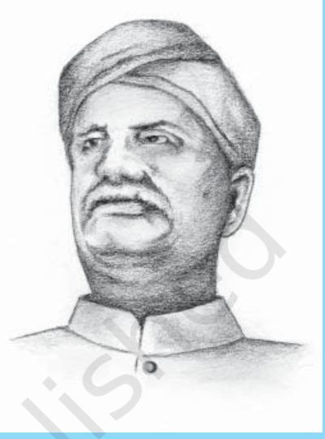
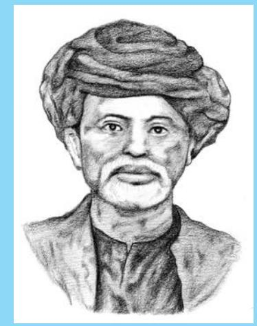
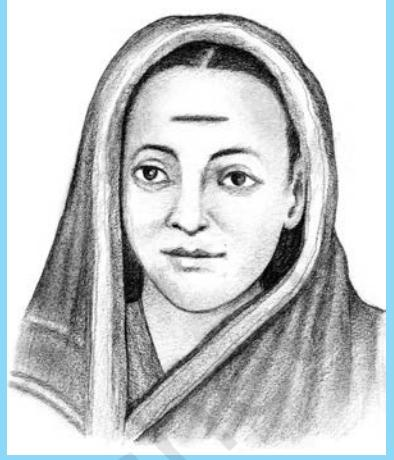
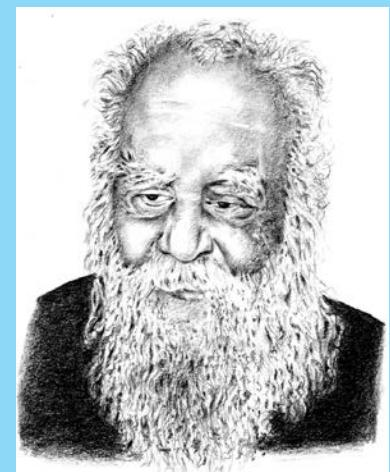
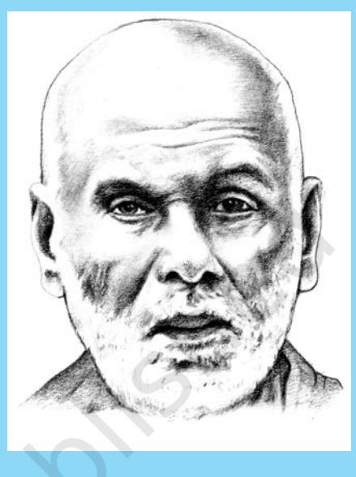
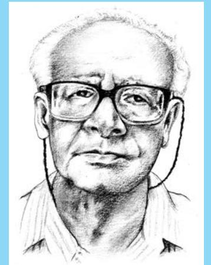
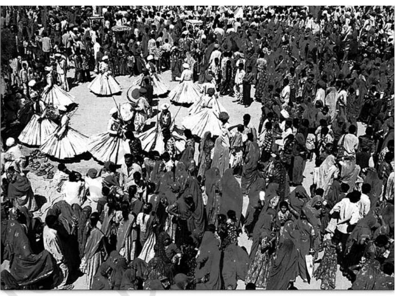
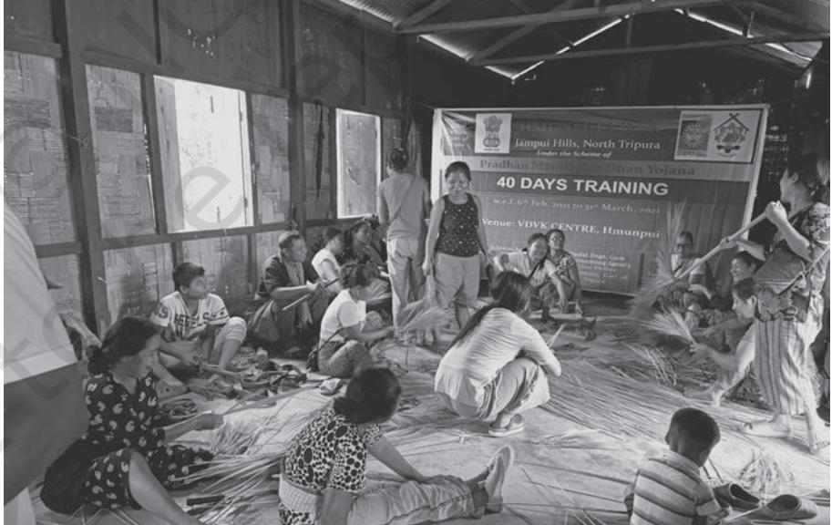

**35**

Chapter 3.indd 35 9/1/2022 2:07:50 PM

*H*aving studied the structure and dynamics of the population of India in Chapter 2, we turn now to the study of social institutions. A population is not just a collection of separate, unrelated individuals, it is a society made up of distinct but interlinked classes and communities of various kinds. These communities are sustained and regulated by social institutions and social relationships. In this chapter we will be looking at three institutions that are central to Indian society, namely caste, tribe and family.

# 3.1 Caste and the Caste System

Like any Indian, you already know that 'caste' is the name of an ancient social institution that has been part of Indian history and culture for thousands of years. But like any Indian living in the twenty-first century, you also know that something called 'caste' is definitely a part of Indian society today. To what extent are these two 'castes' – the one that is supposed to be part of India's past, and the one that is part of its present – the same thing? This is the question that we will try to answer in this section.

# **Caste in the Past**

Caste is an institution uniquely associated with the Indian sub-continent. While social arrangements producing similar effects have existed in other parts of the world, the exact form has not been found elsewhere. Although it is an institution characteristic of Hindu society, caste has spread to the major non-Hindu communities of the Indian sub-continent. This is specially true of Muslims, Christians and Sikhs.

As is well-known, the English word 'caste' is actually a borrowing from the Portuguese *casta,* meaning pure breed. The word refers to a broad institutional arrangement that in Indian languages (beginning with the ancient Sanskrit) is referred to by two distinct terms, *varna* and *jati. Varna,* literally 'colour', is the name given to a four-fold division of society into *brahmana, kshatriya, vaishya* and *shudra,* though this excludes a significant section of the population composed of the 'outcastes', foreigners, slaves, conquered peoples and others, sometimes refered to as the *panchamas* or fifth category. *Jati* is a generic term referring to species or kinds of anything, ranging from inanimate objects to plants, animals and human beings. *Jati* is the word most commonly used to refer to the institution of caste in Indian languages, though it is interesting to note that, increasingly, Indian language speakers are beginning to use the English word 'caste'.

The precise relationship between varna and jati has been the subject of much speculation and debate among scholars. The most common interpretation is to treat varna as a broad all-India aggregative classification, while jati is taken to be a regional or local sub-classification involving a much more complex system

Chapter 3.indd 36 9/1/2022 2:07:50 PM

consisting of hundreds or even thousands of castes and sub-castes. This means that while the four varna classification is common to all of India, the jati hierarchy has more local classifications that vary from region to region.

Opinions also differ on the exact age of the caste system. It is generally agreed though, that the four varna classification is roughly three thousand years old. However, the 'caste system' stood for different things in different time periods, so that it is misleading to think of the same system continuing for three thousand years. In its earliest phase, in the late Vedic period roughly between 900 — 500 BC, the caste system was really a varna system and consisted of only four major divisions. These divisions were not very elaborate or very rigid, and they were not determined by birth. Movement across the categories seems to have been not only possible but quite common. It is only in the post-Vedic period that caste became the rigid institution that is familiar to us from well known definitions.

The most commonly cited defining features of caste are the following:

- 1. Caste is determined by birth a child is "born into" the caste of its parents. Caste is never a matter of choice. One can never change one's caste, leave it, or choose not to join it, although there are instances where a person may be expelled from their caste.
#### 2. Membership in a caste involves strict rules about marriage. Caste groups are "endogamous", i.e. marriage is restricted to members of the group.

- 3. Caste membership also involves rules about food and food-sharing. What kinds of food may or may not be eaten is prescribed and who one may share food with is also specified.
- 4. Caste involves a system consisting of many castes arranged in a hierarchy of rank and status. In theory, every person has a caste, and every caste has a specified place in the hierarchy of all castes. While the hierarchical position of many castes, particularly in the middle ranks, may vary from region to region, there is always a hierarchy.
- 5. Castes also involve sub-divisions within themselves, i.e., castes almost always have sub-castes and sometimes sub-castes may also have sub-castes. This is referred to as a segmental organisation.
- 6. Castes were traditionally linked to occupations. A person born into a caste could only practice the occupation associated with that caste, so that occupations were hereditary, i.e. passed on from generation to generation.

Ayyankali, born in Kerala, was a leader of the lower castes and Dalits. With his efforts, Dalits got the freedom to walk on public roads, and Dalit children were allowed to join schools.

Chapter 3.indd 37 25-01-2024 09:36:02

**Jotirao Govindrao Phule (1827–1890)**

Jotirao Govindrao Phule denounced the injustice of the caste system and scorned its rules of purity and pollution. In 1873 he founded the Satyashodhak Samaj (Truth Seekers Society), which was devoted to securing human rights and social justice for low-caste people.

On the other hand, a particular occupation could only be pursued by the caste associated with it – members of other castes could not enter the occupation.

These features are the prescribed rules found in ancient scriptural texts. Since these prescriptions were not always practiced, we cannot say to what extent these rules actually determined the empirical reality of caste – its concrete meaning for the people living at that time. As you can see, most of the prescriptions involved prohibitions or restrictions of various sorts. It is also clear from the historical evidence that caste was a very unequal institution – some castes benefitted greatly from the system, while others were condemned to a life of endless labour and subordination. Most important, once caste became rigidly determined by birth, it was in principle impossible for a person to ever change their life circumstances. Whether they deserved it or not, an upper caste person would always have high status, while a lower caste person would always be of low status.

Theoretically, the caste system can be understood as the combination of two sets of principles, one based on difference and separation and the other on wholism and hierarchy. Each caste is supposed to be different from – and is therefore strictly separated from – every other caste. Many of the scriptural rules of caste are thus designed to prevent the mixing of castes – rules ranging from marriage, food sharing and social interaction to occupation. On the other

hand, these different and separated castes do not have an individual existence – they can only exist in relation to a larger whole, the totality of society consisting of all castes. Further, this societal whole or system is a hierarchical rather than egalitarian system. Each individual caste occupies not just a distinct place, but also an ordered rank – a particular position in a ladder-like arrangement going from highest to lowest.

The hierarchical ordering of castes is based on the distinction between 'purity' and 'pollution'. This is a division between something believed to be closer to the sacred (thus connoting ritual purity), and something believed to be distant from or opposed to the sacred, therefore considered ritually polluting. Castes that are considered ritually pure have high status, while those considered less pure or impure have low status. As in all societies, material power (i.e., economic or military power) is closely associated with social status, so that those in power tend to be of high status, and vice versa. Historians believe that those who were defeated in wars were often assigned low caste status.

Finally, castes are not only unequal to each other in ritual terms, they are also supposed to be complementary and non-competing groups. In other words,

Chapter 3.indd 38 9/8/2022 1:59:27 PM

each caste has its own place in the system which cannot be taken by any other caste. Since caste is also linked with occupation, the system functions as the social division of labour, except that, in principle, it allows no mobility.

# **Colonialism and Caste**

Compared to the ancient past, we know a lot more about caste in our recent history. If modern history is taken to begin with the nineteenth century, then Indian Independence in 1947 offers a natural dividing line between the colonial period (roughly 150 years from around 1800 to 1947) and the post-Independence or post-colonial period (the seven decades from 1947 to the present day). The present form of caste as a social institution has been shaped very strongly by both the colonial period as well as the rapid changes that have come about in independent India.

Scholars have agreed that all major social institutions and specially the institution of caste underwent major changes during the colonial period. In fact, some scholars argue that what we know today as caste is more a product of colonialism than of ancient Indian tradition. Not all of the changes brought about were intended or deliberate. Initially, the British administrators began by trying to understand the complexities of caste in an effort to learn how to govern the country efficiently. Some of these efforts took the shape of very methodical and intensive surveys and reports on the 'customs and manners' of various tribes and castes all over **Savitri Bai Phule (1831–1897)**

Savitri Bai Phule was the first headmistress of the country's first school for girls in Pune. She devoted her life to educating Shudras and Ati-Shudras. She started a night school for agriculturists and labourers. She died while serving plague patients.

the country. Many British administrative officials were also amateur ethnologists and took great interest in pursuing such surveys and studies.

**38 39** But by far the most important official effort to collect information on caste was through the census. First begun in the 1860s, the census became a regular ten-yearly exercise conducted by the British Indian government from 1881 onwards. The 1901 Census under the direction of Herbert Risley was particularly important as it sought to collect information on the social hierarchy of caste – i.e., the social order of precedence in particular regions, as to the position of each caste in the rank order. This effort had a huge impact on social perceptions of caste and hundreds of petitions were addressed to the Census Commissioner by representatives of different castes claiming a higher position in the social scale and offering historical and scriptural evidence for their claims. Overall, scholars feel that this kind of direct attempt to count caste and to officially record caste status changed the institution itself. Before this kind of intervention, caste identities had been much more fluid and less rigid; once they began to be counted and recorded, caste began to take on a new life.

Chapter 3.indd 39 9/1/2022 2:07:51 PM

**Periyar (E.V. Ramasami Naickar) (1879–1973)**

Periyar (E.V. Ramasami Naickar) is known as a rationalist and the leader of the lower caste movement in South India. He aroused people to realise that all men are equal, and that it is the birthright of every individual to enjoy liberty and equality.

The administration also took an interest in the welfare of downtrodden castes, referred to as the 'depressed classes' at that time. It was as part of these efforts that the Government of India Act of 1935 was passed which gave legal recognition to the lists or 'schedules' of castes and tribes marked out for special treatment by the state. This is how the terms 'Scheduled Tribes' and the 'Scheduled Castes' came into being. Castes at the bottom of the hierarchy that suffered severe discrimination, including all the so-called 'untouchable' castes, were included among the Scheduled Castes. (You will read more on untouchability and the struggles against it in Chapter 5 on social exclusion.)

Thus colonialism brought about major changes in the institution of caste. Perhaps it would be more accurate to say that the institution of caste underwent fundamental changes during the colonial period. Not just India, but the whole world was undergoing rapid change during this period due to the spread of capitalism and modernity.

# **Caste in the Present**

Indian independence in 1947 marked a big, but ultimately only partial break with the colonial past. Caste considerations had inevitably played a role in the mass mobilisations of the nationalist movement. Efforts to organise the "depressed classes" and particularly the untouchable castes predated the nationalist movement, having begun in the second half

of the nineteenth century. This was an initiative taken from both ends of the caste spectrum – by upper caste progressive reformers as well as by members of the lower castes such as Mahatma Jotiba Phule and Babasaheb Ambedkar in western India, Ayyankali, Sri Narayana Guru, Iyotheedass and Periyar (E.V. Ramaswamy Naickar) in the South. Both Mahatma Gandhi and Babasaheb Ambedkar began organising protests against untouchability from the 1920s onwards. Anti-untouchability programmes became a significant part of the Congress agenda so that, by the time Independence was on the horizon, there was a broad agreement across the spectrum of the nationalist movement to abolish caste distinctions. The dominant view in the nationalist movement was to treat caste as a social evil and as a colonial ploy to divide Indians. But the nationalist leaders, above all, Mahatma Gandhi, were able to simultaneously work for the upliftment of the lower castes, advocate the abolition of untouchability and other caste restrictions, and, at the same time, reassure the landowning upper castes that their interests, too, would be looked after.

The post-Independence Indian state inherited and reflected these contradictions. On the one hand, the state was committed to the abolition of

Chapter 3.indd 40 9/1/2022 2:07:51 PM

caste and explicitly wrote this into the Constitution. On the other hand, the state was both unable and unwilling to push through radical reforms which would have undermined the economic basis for caste inequality. At yet another level, the state assumed that if it operated in a caste-blind manner, this would automatically lead to the undermining of caste based privileges and the eventual abolition of the institution. For example, appointments to government jobs took no account of caste, thus leaving the well-educated upper castes and the ill-educated or often illiterate lower castes to compete on "equal" terms. The only exception to this was in the form of reservations for the Scheduled Castes and Scheduled Tribes.

The development activity of the state and the growth of private industry also affected caste indirectly through the speeding up and intensification of economic change. Modern industry created all kinds of new jobs for which there were no caste rules. Urbanisation and the conditions of collective living in the cities made it difficult for the caste-segregated patterns of social interaction to survive. At a different level, modern educated Indians attracted to the liberal ideas of individualism and meritocracy, began to abandon the more extreme caste practices. On the other hand, it was remarkable how resilient caste proved to be. Recruitment to industrial jobs, whether in the textile mills of Mumbai (then Bombay), the jute mills of Kolkata (then Calcutta), or elsewhere, continued to be organised along caste and kinship-

### **Sri Narayana Guru (1856–1928)**

Sri Narayana Guru, born in Kerala, preached brother-hood for all and fought against the ill effects of the caste system. He led a quiet but significant social revolution and gave the watchwords 'One Caste, One Religion, One God for all men'.

based lines. The middle men who recruited labour for factories tended to recruit them from their own caste and region so that particular departments or shop floors were often dominated by specific castes. Prejudice against the untouchables remained quite strong and was not absent from the city, though not as extreme as it could be in the village.

**40 41** Not surprisingly, it was in the cultural and domestic spheres that caste has proved strongest. Endogamy, or the practice of marrying within the caste, remained largely unaffected by modernisation and change. Even today, most marriages take place within caste boundaries, although there are more intercaste marriages. While some boundaries may have become more flexible or porous, the borders between groups of castes of similar socio-economic status are still heavily patrolled.

> Perhaps, the most eventful and important sphere of change has been that of politics. From its very beginnings in independent India, democratic politics

Chapter 3.indd 41 9/8/2022 4:48:20 PM

### **M. N. Srinivas (1916–1999)**

M y s o r e N a r a s i m h a c h a r Srinivas was one of India's foremost sociologists and social anthropologists. He was known for his works on the caste system and terms such as 'sanskritisation' and 'dominant caste'. His book *The Remembered Village* is one of the best known village studies in Social Anthropology.

has been deeply conditioned by caste. While its functioning has become more and more complex and hard to predict, it cannot be denied that caste remains central to electoral politics. Since the 1980s we have also seen the emergence of explicitly caste-based political parties. In the early general elections, it seemed as though caste solidarities were decisive in winning elections. But the situation soon got very complicated as parties competed with each other in utilising the same kind of caste calculus.

Sociologists and social anthropologists coined many new concepts to try and understand these processes of change. Perhaps the most common of these are 'sanskritisation' and 'dominant caste', both contributed by M.N. Srinivas, but discussed extensively and criticised by other scholars.

'Sanskritisation' refers to a process whereby members of a (usually middle or lower) caste attempt to raise their own social status by adopting the ritual, domestic and social practices of a caste (or castes) of higher status.

'Dominant caste' is a term used to refer to those castes which had a large population and were granted landrights by the partial land reforms effected after Independence. The land reforms took away rights from the erstwhile claimants, the upper castes who were 'absentee landlords' in the sense that they played no part in the agricultural economy other than claiming their rent. They frequently did not live in the village either, but were based in towns and cities. These land rights now came to be vested in the next layer of

claimants, those who were involved in the management of agriculture but were not themselves the cultivators. These intermediate castes in turn depended on the labour of the lower castes including specially the 'untouchable' castes for tilling and tending the land. However, once they got land rights, they acquired considerable economic power. Their large numbers also gave them political power in the era of electoral democracy based on universal adult franchise. Thus, these intermediate castes became the 'dominant' castes in the country side and played a decisive role in regional politics and the agrarian economy. Examples of such dominant castes include the Yadavs of Bihar and Uttar Pradesh, the Vokkaligas of Karnataka, the Reddys and Khammas of Andhra Pradesh, the Marathas of Maharashtra, the Jats of Punjab, Haryana and Western Uttar Pradesh and the Patidars of Gujarat.

One of the most significant yet paradoxical changes in the caste system in the contemporary period is that it has tended to become 'invisible' for the upper caste, urban middle and upper classes. For these groups, who have benefited the most from the developmental policies of the post-colonial era, caste has appeared to decline in significance precisely because it has done its

Chapter 3.indd 42 9/1/2022 2:07:51 PM

job so well. Their caste status had been crucial in ensuring that these groups had the necessary economic and educational resources to take full advantage of the opportunities offered by rapid development. In particular, the upper caste elite were able to benefit from subsidised public education, specially professional education in science, technology, medicine and management. At the same time, they were also able to take advantage of the expansion of public sector jobs in the early decades after independence. In this initial period, their lead over the rest of society (in terms of education) ensured that they did not face any serious competition. As their privileged status got consolidated in the second and third generations, these groups began to believe that their advancement had little to do with caste. Certainly for the third generations from these groups their economic and educational capital alone is quite sufficient to ensure that they will continue to get the best in terms of life chances. For this group, it now seems that caste plays no part in their public lives, being limited to the personal sphere of religious practice or marriage and kinship. However, a further complication is introduced by the fact that this is a differentiated group. Although the privileged as a group are overwhelmingly upper caste, not all upper caste people are privileged, some being poor.

For the scheduled castes and tribes and the backward castes – the opposite has happened. For them, caste has become all too visible, indeed their caste has tended to eclipse the other dimensions of their identities. Because they have no inherited educational and social capital, and because they must compete with an already entrenched upper caste group, they cannot afford to abandon their caste identity for it is one of the few collective assets they have. Moreover, they continue to suffer from discrimination of various kinds. The policies of reservation and other forms of protective discrimination instituted by the state in response to political pressure serve as their lifelines. But using this lifeline tends to make their caste the all-important and often the only aspect of their identity that the world recognises.

# 3.2 Tribal Communities

'Tribe' is a modern term for communities that are very old, being among the oldest inhabitants of the sub-continent. Tribes in India have generally been defined in terms of what they were *not*. Tribes were communities that did not practice a religion with a written text; did not have a state or political form of the normal kind and did not have sharp class divisions.

# **Classifications of Tribal Societies**

**42 43** In terms of positive characteristics, tribes have been classified according to their 'permanent' and 'acquired' traits. Permanent traits include region, language, physical characteristics and ecological habitat.

Chapter 3.indd 43 9/1/2022 2:07:51 PM

### **Permanent Traits**

The tribal population of India is widely dispersed, but there are also concentrations in certain regions. About 85% of the tribal population lives in 'middle India', a wide band stretching from Gujarat and Rajasthan in the west to West Bengal and Odisha in the east, with Madhya Pradesh, Jharkhand, Chattisgarh and parts of Maharashtra and Andhra Pradesh forming the heart of this region. Of the remaining 15%, over 11% is in the North Eastern states, leaving only a little over 3% living in the rest of India. If we look at the share of tribals in the state population, then the North Eastern states have the highest concentrations, with all states, except Assam, having concentrations of more than 30%, and some, like Arunachal Pradesh, Meghalaya, Mizoram and Nagaland with more than 60% and upto 95% of tribal population. In the rest of the country, however, the tribal population is very small, being less than 12% in all states except Odisha and Madhya Pradesh. The ecological habitats covered includes hills, forests, rural plains and urban industrial areas.

In terms of language, tribes are categorised into four categories. Two of them, Indo-Aryan and Dravidian, are shared by the rest of the Indian population as well, and tribes account for only about 1% of the former and about 3% of the latter. The other two language groups, the Austric and Tibeto-Burman, are primarily spoken by tribals, who account for all of the first and over 80% of the second group. In physical-racial terms, tribes are classified under the Negrito, Australoid, Mongoloid, Dravidian and Aryan categories. The last two are again shared with the rest of the population of India.

In terms of size, tribes vary a great deal, ranging from about seven million to some Andamanese islanders who may number less than a hundred persons. The biggest tribes are the Gonds, Bhils, Santhals, Oraons, Minas, Bodos and Mundas, all of whom are at least a million strong. The total population of tribes amounts to about 8.2% of the population of India, or about 84 million persons according to the 2001 Census. According to Census Report 2011, it is 8.6% of the population of India, or about 104 million tribal persons in the country.

#### **Acquired Traits**

Classifications based on acquired traits use two main criteria – mode of livelihood, and extent of incorporation into Hindu society – or a combination of the two.

On the basis of livelihood, tribes can be categorised into fishermen, food gatherers and hunters, shifting cultivators, peasants and plantation and industrial workers. However, the dominant classification both in academic sociology as well as in politics and public affairs is the degree of assimilation into Hindu society. Assimilation can be seen either from the point of view of the tribes, or (as has been most often the case) from the point of view of the dominant Hindu mainstream. From the tribes' point of view, apart from the

Chapter 3.indd 44 9/1/2022 2:07:51 PM

extent of assimilation, attitude towards Hindu society is also a major criterion, with differentiation between tribes that are positively inclined towards Hinduism and those who resist or oppose it. From the mainstream point of view, tribes may be viewed in terms of the status accorded to them in Hindu society, ranging from the high status given to some, to the generally low status accorded to most.

# **Tribe – The Career of a Concept**

During the 1960s scholars debated whether tribes should be seen as one end of a continuum with castebased (Hindu) peasant society, or whether they were an altogether different kind of community. Those who argued for the continuum saw tribes as not being fundamentally different from caste-peasant society, but merely less stratified (fewer levels of hierarchy) and with a more community-based rather than individual notion of resource ownership. However, opponents argued that tribes were wholly different from castes because they had no notion of purity and pollution which is central to the caste system.

*A tribal village fair*

In short, the argument for a tribe-caste distinction was founded on an assumed cultural difference between Hindu castes, with their beliefs in purity and pollution and hierarchical integration, and 'animist' tribals with their more egalitarian and kinship based modes of social organisation.

By the 1970s all the major definitions of tribe were shown to be faulty. It was pointed out that the tribe-peasantry distinction did not hold in terms of any of the commonly advanced criteria: size, isolation, religion, and means of livelihood. Some Indian "tribes" like Santhal, Gonds, and Bhils are very large and spread over extensive territory. Certain tribes like Munda, Hos and others have long since turned to settled agriculture, and even hunting gathering tribes, like the Birhors of Bihar employ specialised households to make baskets, press oil etc. It has also been pointed out in a number of cases, that in the absence of other alternatives, "castes" (or non-tribals) have turned to hunting and gathering.

**44 45** The discussion on caste-tribe differences was accompanied by a large body of literature on the mechanisms through which tribes were absorbed into Hindu society, throughout the ages – through Sanskritisation, acceptance into the

Chapter 3.indd 45 9/1/2022 2:07:52 PM

Shudra fold following conquest by caste Hindus, through acculturation and so on. The whole span of Indian history is often seen as an absorption of different tribal groups into caste Hindu society at varying levels of the hierarchy, as their lands were colonised and the forests cut down. This is seen as either natural, parallel to the process by which all groups are assimiliated into Hinduism as sects; or it is seen as exploitative. The early school of anthropologists tended to emphasise the cultural aspects of tribal absorption into the mainstream, while the later writers have concentrated on the exploitative and political nature of the incorporation.

Some scholars have also argued that there is no coherent basis for treating tribes as "pristine" – i.e., original or pure – societies uncontaminated by civilisation. They propose instead that tribes should really be seen as "secondary" phenomena arising out of the exploitative and colonialist contact between preexisting states and non-state groups like the tribals. This contact itself creates an ideology of "tribalism" – the tribal groups begin to define themselves as tribals in order to distinguish themselves from the newly encountered others.

Nevertheless, the idea that tribes are like stone age hunting and gathering societies that have remained untouched by time is still common, even though this has not been true for a long time. To begin with, adivasis were not always the oppressed groups they are now – there were several Gond kingdoms in Central India such as that of Garha Mandla, or Chanda. Many of the so-called Rajput kingdoms of central and western India actually emerged through a process of stratification among adivasi communities themselves. Adivasis often exercised dominance over the plains people through their capacity to raid them, and through their services as local militias. They also occupied a special trade niche, trading forest produce, salt and elephants. Moreover, the capitalist economy's drive to exploit forest resources and minerals and to recruit cheap labour has brought tribal societies in contact with mainstream society a long time ago.

#### **National Development versus Tribal Development**

The imperatives of 'development' have governed attitudes towards tribes and shaped the policies of the state. National development, particularly in the Nehruvian era, involved the building of large dams, factories and mines. Because the tribal areas were located in mineral rich and forest covered parts of the country, tribals have paid a disproportionate price for the development of the rest of Indian society. This kind of development has benefited the mainstream at the expense of the tribes. The process of dispossessing tribals of their land has occurred as a necessary byproduct of the exploitation of minerals and the utilisation of favourable sites for setting up hydroelectric power plants, many of which were in tribal areas.

The loss of the forests on which most tribal communities depended has been a major blow. Forests started to be systematically exploited in British times and the trend continued after independence. The coming of private property

Chapter 3.indd 46 9/1/2022 2:07:52 PM

in land has also adversely affected tribals, whose community-based forms of collective ownership were placed at a disadvantage.

Many tribal concentration regions and states have also been experiencing the problem of heavy in-migration of non-tribals in response to the pressures of development. This threatens to disrupt and overwhelm tribal communities and cultures, besides accelerating the process of exploitation of tribals. The industrial areas of Jharkhand for example have suffered a dilution of the tribal share of population. But the most dramatic cases are probably in the North-East. A state like Tripura had the tribal share of its population halved within a single decade, reducing them to a minority. Similar pressure is being felt by Arunachal Pradesh.

# **Tribal Identity Today**

Forced incorporation of tribal communities into mainstream processes has had its impact on tribal culture and society as much as its economy. Tribal identities today are formed by this interactional process rather than any primordial (orginal, ancient) characteristics peculiar to tribes. Because the interaction with the mainstream has generally been on terms unfavourable to the tribal communities, many tribal identities today are centred on ideas of resistance and opposition to the overwhelming force of

the non-tribal world.

The positive impact of successes – such as the achievement of statehood for Jharkhand and Chattisgarh after a long struggle – is moderated by continuing problems. Many of the states of the North-East, for example, have been living for decades under special laws that limit the civil liberties of citizens.

Another significant development is the gradual emergence of

*Tribal empowerment* Source: *https://trifed.tribal.gov.in/*

**46 47** an educated middle class among tribal communities. Most visible in the North-eastern states, this is now a segment beginning to be seen in the rest of the country as well, particularly among members of the larger tribal communities. In conjunction with policies of reservation (about which you

Chapter 3.indd 47 26-03-2024 11:54:28

will learn more in Chapter 5), education is creating an urbanised professional class. As tribal societies get more differntiated – i.e., develop class and other divisions within themselves – different bases are growing for the assertion of tribal identity.

Two broad sets of issues have been most important in giving rise to tribal movements. These are issues relating to control over vital economic resources like land and specially forests, and issues relating to matters of ethnic-cultural identity. The two can often go together, but with differentiation of tribal society they may also diverge. The reasons why the middle classes within tribal societies may assert their tribal identity may be different from the reasons why poor and uneducated tribals join tribal movements. As with any other community, it is the relationship between these kinds of internal dynamics and external forces that will shape the future.

Assertions of tribal identity are on the rise. This can be laid at the door of the emergence of a middle class within the tribal society. With the emergence of this class in particular, issues of culture, tradition, livelihood, even control over land and resources, as well as demands for a share in the benefits of the projects of modernity, have become an integral part of the articulation of identity among the tribes. There is, therefore, a new consciousness among tribes now, coming from its middle classes. The middle classes themselves are a consequence of modern education and modern occupations, aided in turn by the reservation policies… **Box 3.1**

*(Source: Virginius Xaxa, 'Culture, Politics and Identity: The Case of the Tribes in India', in John et al 2006)*

# 3.3 Family and Kinship

Each one of us is born into a family, and most of us spend long years within it. Usually we feel very strongly about our family. Sometimes we feel very good about our parents, grandparents, siblings, uncles, aunts and cousins, whereas at others we don't. On the one hand, we resent their interference, and yet we miss their overbearing ways when we are away from them. The family is a space of great warmth and care. It has also been a site of bitter conflicts, injustice and violence. Female infanticide, violent conflicts between brothers over property and ugly legal disputes are as much part of family and kinship as are stories of compassion, sacrifice and care.

The structure of the family can be studied both as a social institution in itself and also in its relationship to other social institutions of society. In itself a family can be defined as nuclear or extended. It can be male-headed

Chapter 3.indd 48 9/1/2022 2:07:52 PM

or female-headed. The line of descent can be matrilineal or patrilineal. This internal structure of the family is usually related to other structures of society, namely political, economic, cultural etc. Thus the migration of men from the villages of the Himalayan region can lead to an unusual proportion of women-headed families in the village. Or the work schedules of young parents in the software industry in India may lead to increasing number of grandparents moving in as care-givers to young grandchildren. The composition of the family and its structure thereby changes and these changes can be understood in relation to other changes in society. The family (the private sphere) is linked to the economic, political, cultural, and educational (the public) spheres.

The family is an integral part of our lives. We take it for granted. We also assume that other people's families must be like our own. As we saw however, families have different structures and these structures change. Sometimes these changes occur accidentally, as when a war takes place or people migrate in search of work. Sometimes these changes are purposely brought about, as when young people decide to choose their spouses instead of letting elders decide. Or when same sex love is expressed openly in society.

It is evident from the kind of changes that take place that not only have family structures changed, but cultural ideas, norms and values also change. These changes are however not so easy to bring about. Both history and contemporary times suggest that often change in family and marriage norms are resisted violently. The family has many dimensions to it. In India however discussions on the family have often revolved around the nuclear and extended family.

# **NUCLEAR AND EXTENDED FAMILY**

A nuclear family consists of only one set of parents and their children. An extended family (commonly known as the 'joint family') can take different forms, but has more than one couple, and often more than two generations, living together. This could be a set of brothers with their individual families, or an elderly couple with their sons and grandsons and their respective families. The extended family often is seen as symptomatic of India. Yet this is by no means the dominant form now or earlier. It was confined to certain sections and certain regions of the community. Indeed the term 'joint family' itself is not a native category. As I.P. Desai observes, "The expression 'joint family' is not the translation of any Indian word like that. It is interesting to note that the words used for joint family in most of the Indian languages are the equivalents of translations of the English word 'joint family'." (Desai 1964:40)

Chapter 3.indd 49 25-01-2024 09:37:33

# **The Diverse Forms of the Family**

Studies have shown how diverse family forms are found in different societies. With regard to the rule of *residence*, some societies are *matrilocal* in their marriage and family customs while others are *patrilocal*. In the first case, the newly married couple stays with the woman's parents, whereas in the second case the couple lives with the man's parents. With regard to the rules of inheritance, *matrilineal* societies pass on property from mother to daughter while *patrilineal* societies do so from father to son. A *patriarchal* family structure exists where the men exercise authority and dominance, and *matriarchy* where the women play a similarly dominant role. However, matriarchy – unlike patriarchy – has been a theoretical rather than an empirical concept. There is no historical or anthropological evidence of matriarchy – i.e., societies where women exercise dominance. However, there do exist *matrilineal* societies, i.e., societies where women inherit property from their mothers but do not exercise control over it, nor are they the decision makers in public affairs.

- 1. What is the role of the ideas of separation and hierarchy in the caste system?
- 2. What are some of the rules that the caste system imposes?
- 3. What changes did colonialism bring about in the caste system?
- 4. In what sense has caste become relatively 'invisible' for the urban upper castes?
- 5. How have tribes been classified in India?
- 6. What evidence would you offer against the view that 'tribes are primitive communities living isolated lives untouched by civilisation'?
- 7. What are the factors behind the assertion of tribal identities today?
- 8. What are some of the different forms that the family can take?
- 9. In what ways can changes in social structure lead to changes in the family structure?
- 10. Explain the difference between matriliny and matriarchy.

Chapter 3.indd 50 9/1/2022 2:07:52 PM

#### **REFERENCES**

Deshpande, Satish. 2003. *Contemporary India: A Sociological View.* Penguin Books. New Delhi.

Gupta, Dipankar. 2000. *Interrogating Caste.* Penguin Books. New Delhi.

Sharma, K.L. ed. 1999. Social Inequality in India: *Profites of Caste, Class and Social Mobility.* 2nd edition, Rawat Publications. Jaipur.

Sharma, Ursula. 1999. *Caste.* Open University Press. Buckingham & Philadelphia.

Beteille, Andre. 1991. 'The reproduction of inequality: Occupation, caste and family', in *Contributions to Indian Sociology.* N.S., Vol. 25, No.1, pp3-28.

Srinivas, M.N. 1994. *The Dominant Caste and Other Essays.* Oxford University Press. New Delhi.

Dumont, Louis. 1981. *Homo Hierarchicus: The Caste System and its Implications.*  2nd editon, University of Chicago Press. Chicago.

Ghurye, G.S. 1969. *Caste and Race in India.* 5th edition, Popular Prakashan. Mumbai.

John, Mary E., Jha, Pravin Kumar. and Jodhka, Surinder S. ed. 2006. *Contested Transformations: Changing Economies and Identities in Contemporary India.* Tulika. New Delhi.

Dirks, Nicholas. 2001. *Castes of Mind: Colonialism and the Making of Modern India.* Princeton University Press. Princeton.

Uberoi, Patricia. ed. 1994. *Family, Kinship and Marriage in India.* Oxford University Press. Delhi.

Xaxa, Virginius. 2003. 'Tribes in India' in Das, Veena. ed. *The Oxford India Companion to Sociology and Social Anthropology.* Oxford University Press. Delhi.

Chapter 3.indd 51 9/1/2022 2:07:52 PM

**52**

Chapter 3.indd 52 9/1/2022 2:07:52 PM

