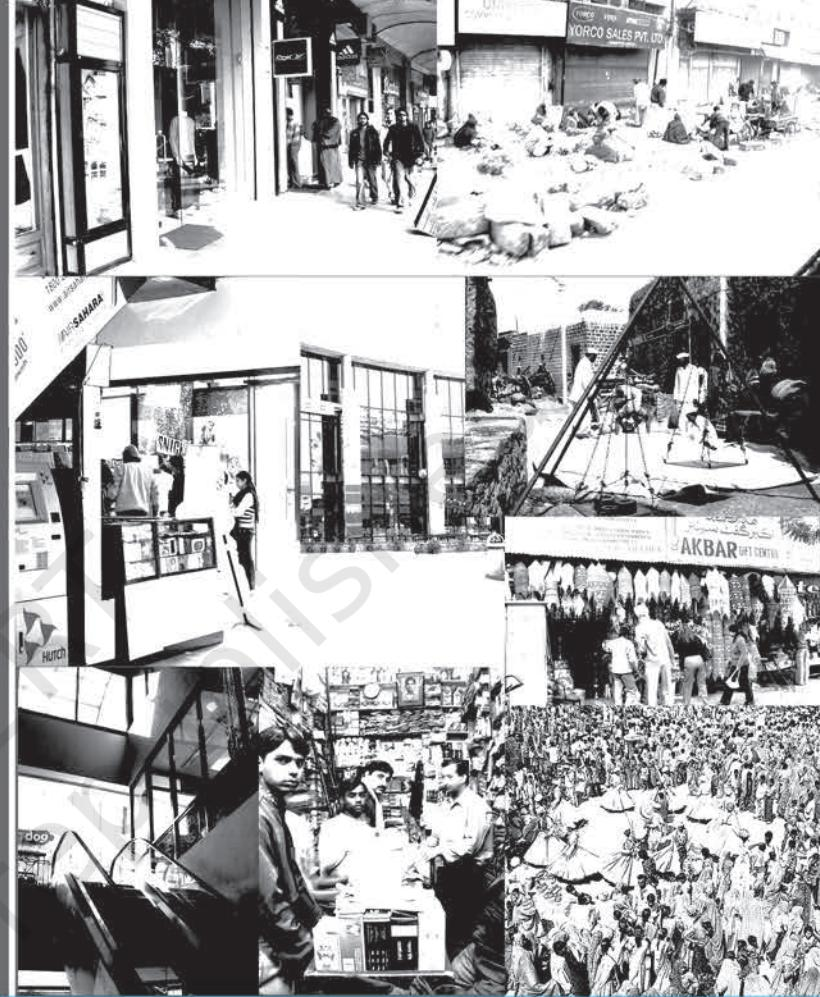
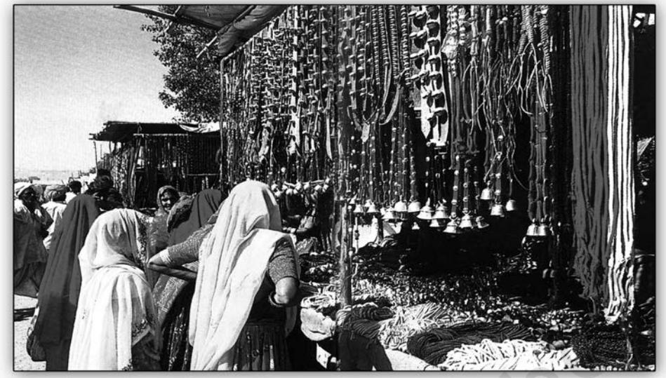
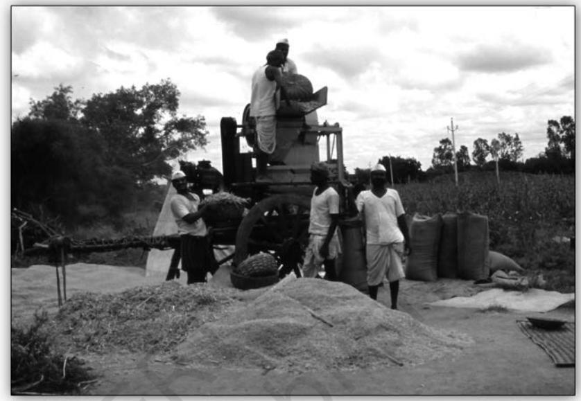
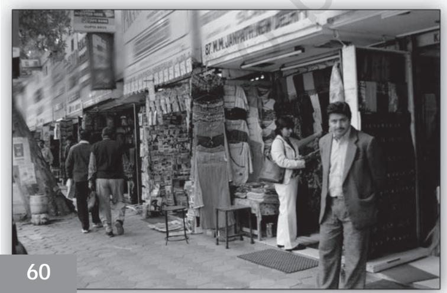
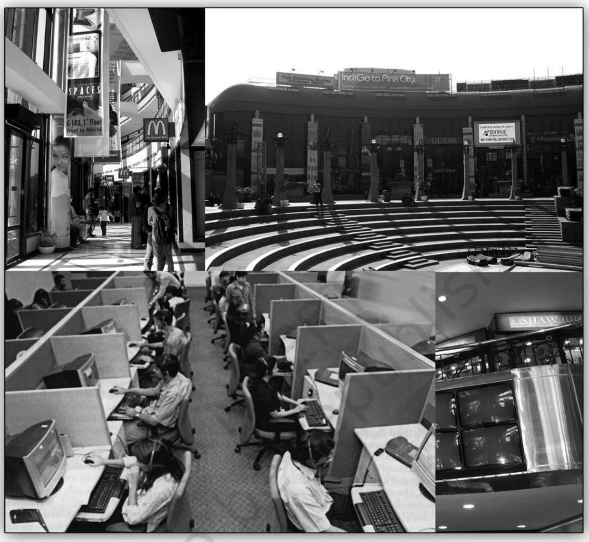
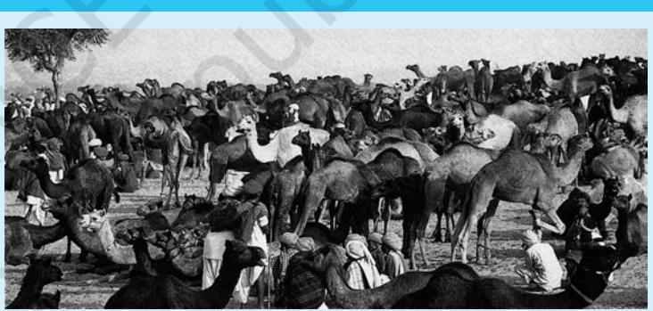

Chapter 4.indd 53 9/1/2022 2:56:19 PM

*W*e usually think of markets as places where things are bought and sold. In this common everyday usage, the word 'market' may refer to particular markets that we may know of, such as the market next to the railway station, the fruit market, or the wholesale market. Sometimes we refer not to the physical place, but to the gathering of people – buyers and sellers – who constitute the market. Thus, for example, a weekly vegetable market may be found in different places on different days of the week in neighbouring villages or urban neighbourhoods. In yet another sense, 'market' refers to an area or category of trade or business, such as the market for cars or the market for readymade clothes. A related sense refers to the demand for a particular product or service, such as the market for computer professionals.

What all of these meanings have in common is that they refer to a specific market, whose meaning is readily understandable from the context. But what does it mean to speak of 'the market' in a general way without refering to any particular place, gathering of people, or field of commercial activity? This usage includes not only all of the specific senses mentioned above, but also the entire spectrum of economic activities and institutions. In this very broad sense, then, 'the market' is almost equivalent to 'the economy'. We are used to thinking of the market as an economic institution, but this chapter will show you that the market is also a *social* institution. In its own way, the market is comparable to more obviously social institutions like caste, tribe or family discussed in Chapter 3.

# 4.1 Sociological Perspectives on Markets and the Economy

The discipline of economics is aimed at understanding and explaining how markets work in modern capitalist economies – for instance, how prices are determined, the probable impact of specific kinds of investment, or the factors that influence people to save or spend. So what does sociology have to contribute to the study of markets that goes beyond what economics can tell us?

To answer this question, we need to go back briefly to eighteenth century England and the beginnings of modern economics, which at that time was called 'political economy'. The most famous of the early political economists was Adam Smith, who in his book, *The Wealth of Nations*, attempted to understand the market economy that was just emerging at that time. Smith argued that the market economy is made up of a series of individual exchanges or transactions, which automatically create a functioning and ordered system. This happens even though none of the individuals involved in the millions of transactions had intended to create a system.

Modern economics developed from the ideas of early thinkers such as Adam Smith, and is based on the idea that the *economy* can be studied as a separate

Chapter 4.indd 54 9/1/2022 2:56:19 PM

part of society that operates according to its own laws, leaving out the larger social or political context in which markets operate. In contrast to this approach, sociologists have attempted to develop an alternative way of studying economic institutions and processes within the larger social framework.

Sociologists view markets as social institutions that are constructed in culturally specific ways. For example, markets are often controlled or organised by particular social groups or classes, and have specific connections to other institutions, social processes and structures. Sociologists often express this idea by saying that economies are socially 'embedded'. This is illustrated by two examples, one of a weekly tribal *haat*, and the other of a 'traditional business community' and its trading networks in colonial India.

#### **A weekly 'tribal market' in Dhorai village, Bastar, Chattisgarh**

In most agrarian or 'peasant' societies around the world, periodic markets are a central feature of social and economic organisation. Weekly markets bring together people from surrounding villages, who come to sell their agricultural or other produce and to buy manufactured goods and other items that are not available in their villages. They attract traders from outside the local area, as well as moneylenders, entertainers, astrologers, and a host of

other specialists offering their services and wares. In rural India there are also specialised markets that take place at less frequent intervals, for instance, cattle markets. These periodic markets link different regional and local economies together, and link them to the wider national economy and to towns and metropolitan centres.

The weekly *haat* is a common sight in rural and even urban India. In hilly and forested areas (especially those inhabited by adivasis), where settlements are far-flung, roads and communications poor, and the economy relatively undeveloped, the weekly market is the major institution for the exchange of goods as well as for social intercourse. Local people come to the market to sell their agricultural or forest produce to traders, who carry it to the towns for resale, and they buy essentials such as salt and agricultural implements, and consumption items such as bangles and jewellery. But for many visitors, the primary reason to come to the market is social – to meet kin, to arrange marriages, exchange gossip, and so on.

While the weekly market in tribal areas may be a very old institution, its character has changed over time. After these remote areas were brought

### **Adam Smith (1723-90)**

Adam Smith is known as the fountainhead of contemporary economic thought. Smith's reputation rests on his five-book series 'The Wealth of Nations' which explained how rational self-interest in a free-market economy leads to economic well being.

Chapter 4.indd 55 9/1/2022 2:56:20 PM

*A weekly market in tribal area*

under the control of the colonial state, they were gradually incorporated into the wider regional and national economies. Tribal areas were 'opened up' by building roads and 'pacifying' the local people (many of whom resisted colonial rule through their so-called 'tribal rebellions'), so that the rich forest and mineral resources of these areas could be exploited. This led to the influx of traders, moneylenders, and other non-tribal people from the plains into these areas. The local tribal economy was transformed as forest produce was sold to outsiders, and money and new kinds of goods entered the system. Tribals were also recruited as labourers to work on plantations and mines that were established under colonialism. A 'market' for tribal labour developed during the colonial period. Due to all these changes, local tribal economies became linked into wider markets, usually with very negative consequences for local people. For example, the entry of traders and moneylenders from outside the local area led to the impoverishment of adivasis, many of whom lost their land to outsiders.

The weekly market as a social institution, the links between the local tribal economy and the outside, and the exploitative economic relationships between adivasis and others, are illustrated by a study of a weekly market in Bastar district. This district is populated mainly by Gonds, an adivasi group. At the weekly market, you find local people, including tribals and non-tribals (mostly Hindus), as well as outsiders – mainly Hindu traders of various castes. Forest officials also come to the market to conduct business with adivasis who work for the Forest Department, and the market attracts a variety of specialists selling their goods and services. The major goods that are exchanged in the market are manufactured goods (such as jewellery and trinkets, pots and knives), non-local foods (such as salt and *haldi* (turmeric)), local food and agricultural produce and manufactured items (such as bamboo baskets), and forest produce (such as tamarind and oil-seeds). The forest produce that is brought by the

**56**

Chapter 4.indd 56 9/1/2022 2:56:20 PM

adivasis is purchased by traders who carry it to towns. In the market, the buyers are mostly adivasis while the sellers are mainly caste Hindus. Adivasis earn cash from the sale of forest and agricultural produce and from wage labour, which they spend in the market mainly on low-value trinkets and jewellery, and consumption items such as manufactured cloth.

## **Caste-based markets and trading networks in precolonial and colonial India**

In some traditional accounts of Indian economic history, India's economy and society are seen as unchanging. Economic transformation was thought to have begun only with the advent of colonialism. It was assumed that India consisted of ancient village communities that were relatively self-sufficient, and that their economies were organised primarily on the basis of non-market exchange. Under colonialism and in the early post-independence period, the penetration of the commercial money economy into local agrarian economies,

#### **An Adivasi Village Market in Bastar**

Dhorai is the name of a market village located deep in the hinterland of North Bastar district, Chattisgarh … On non-market days Dhorai is a sleepy, tree-shaded hamlet straddling an unscaled road which winds it's way through the forest … Social life in Dhorai revolves around two primitive teashops with a clientele of low-ranking employees of the State Forest service, whose misfortune it has been to be stationed in such a distant and insignificant spot … Dhorai on non-market days – every day except Friday, that is – hardly exists at all; but Dhorai on a market day might be a totally different place. Parked trucks jam the road … The lowly Forest Guards bustle about in smart, newly-pressed uniforms, while the more important officials of the Forest service, down for the day, oversee operations from the verandah of the Forest Rest House. They disburse payments to the tribal labourers …

While the officials hold court in the Rest House, files of tribals continue to pour in from all directions, laden with the produce of the forest, of their fields, and of their own manufacture. They are joined by Hindu vegetable sellers, and by specialised craftsmen, potters, weavers and blacksmiths. The general impression is one of richness and confusion, compounded by the fact that a religious ceremony, as well as a market, is in process … The whole world, it seems, is at the market, men and their Divinities alike. The marketplace is a roughly quadrangular patch of ground, about 100 yards square, at the centre of which there grows a magnificent banyan tree. The thatched market stalls are arranged in a concentric pattern, and are divided by narrow streets or defiles, along which customers manoeuvre themselves as best they can in the crush, trying to avoid treading on the goods of less established traders, who make use of every nook and cranny between the permanent stalls to display their wares.

*Source: Gell 1982:470-71.*

#### **Box 4.1**

Chapter 4.indd 57 9/8/2022 2:38:53 PM

and their incorporation into wider networks of exchange, was thought to have brought about radical social and economic changes in rural and urban society. While colonialism certainly brought about major economic transformations, for example due to the demand that land revenue be paid in cash, recent historical research has shown that much of India's economy was already extensively monetised (trade was carried out using money) in the late pre-colonial period. And while various kinds of non-market exchange systems (such as the '**jajmani system**') did exist in many villages and regions, even during the precolonial period villages were incorporated into wider networks of exchange through which agricultural products and other goods circulated (Bayly 1983, Stein and Subrahmanyam 1996). It now seems that the sharp line that was often drawn between the 'traditional' and the 'modern' (or the pre-capitalist and capitalist) economy is actually rather fuzzy. Recent historical research has also highlighted the extensive and sophisticated trading networks that existed in pre-colonial India. Of course, we know that for centuries India was a major manufacturer and exporter of handloom cloth (both ordinary cotton and luxury silks), as well as the source of many other goods (such as spices) that were in great demand in the global market, especially in Europe. So it is not surprising that precolonial India had well-organised manufacturing centres as well as indigenous merchant groups, trading networks, and banking systems that enabled trade to take place within India, and between India and the rest of the world. These traditional trading communities or castes had their own systems of banking and credit. For instance, an important instrument of exchange and credit was the *hundi*, or bill of exchange (like a credit note), which allowed merchants to engage in long-distance trade. Because trade took place primarily within the caste and kinship networks of these communities, a merchant in one part of the country could issue a *hundi* that would be honoured by a merchant in another place.

#### **Caste-based trade among the Nakarattars of Tamil Nadu**

**Box 4.2**

The Nakarattars loaned and deposited money with one another in caste-defined social relationships based on business territory, residential location, descent, marriage, and common cult membership. Unlike in modern Western banking systems, it was the reputation, decisions, and reserve deposits shared among exchange spheres defined according to these principles, and not a government-controlled central bank, that … assured public confidence in individual Nakarattars as representatives of the caste as a whole. In other words, the Nakarattar banking system was a caste-based banking system. Individual Nakarattars organised their lives around participation in and management of various communal institutions adapted to the task of accumulating and distributing reserves of capital.

**58**

58

*Source: Rudner 1994:234.* 

Chapter 4.indd 58 11/18/2022 16:00:34

## **Social Organisation of Markets – 'Traditional Business Communities'**

Many sociological studies of the Indian economy have focused on 'traditional merchant communities' or castes such as the Nakarattars. As you have already learned, there is a close connection between the caste system and the economy, in terms of landholding, occupational differentiation, and so on. This is also true in the case of trade and markets. In fact, 'Vaisyas' constitute one of the four *varnas –* an indication of the importance of the merchant and of trade or business in Indian society

*Agricultural work in a village*

since ancient times. However, like the other *varnas*, 'Vaisya' is often a status that is *claimed* or aspired to rather than a fixed identity or social status. Although there are 'Vaisya' communities (such as *banias* in North India), whose traditional occupation has been trade or commerce for a long time, there are some caste groups that have entered into trade. Such groups tend to acquire or claim 'Vaisya' status in the process of upward mobility. Like the history of all caste communities, in most cases there is a complex relationonship between caste status or identity, and caste practices, including occupation. The 'traditional business communities' in India include not only 'Vaisyas', but also other groups with distinctive religious or other community identities, such as the Parsis, Sindhis, Bohras, or Jains. Merchant communities did not always have a high status in society; for instance, during the colonial period the long-distance trade in salt was controlled by a marginalised 'tribal' group, the Banjaras. In each case, the particular nature of community institutions and ethos gives rise to a different organisation and practice of business.

To understand the operation of markets in India, both in earlier periods and at present, we can examine how specific arenas of business are controlled by particular communities. One of the reasons for this caste-based specialisation is that trade and commerce often operate through caste and kinship networks, as we have seen in the case of the Nakarattars. Because businessmen are more likely to trust others of their own community or kin group, they tend to do business within such networks rather than with others outside – and this tends to create a caste monopoly within certain areas of business.

Chapter 4.indd 59 9/1/2022 2:56:20 PM

## **Activity 4.1**

Visit a market or shopping area in the town or city where you live. Find out who the important traders are. To which community do they belong? Are there particular areas of business that are controlled by particular communities, for instance, jewellery shops, *kirana* (provisions) shops, the hardware trade, furniture making shops, and so on? Visit some of these shops and find out about the traders who run them and their communities.

Are they hereditary family businesses?

## **Colonialism and the Emergence of New Markets**

The advent of colonialism in India produced major upheavals in the economy, causing disruptions in production, trade, and agriculture. A well-known example is the demise of the handloom industry due to the flooding of the market with cheap manufactured textiles from England. Although pre-colonial India already had a complex monetised economy, most historians consider the colonial period to be the turning point. In the colonial era India began to be more fully linked to the world capitalist economy. Before being colonised by the British, India was a major supplier of manufactured goods to the world market. After colonisation, She became a source of raw materials and agricultural products and a consumer of manufactured goods, both largely for the benefit of industrialising England. At the same time, new groups (especially the Europeans) entered into trade and business, sometimes in alliance with existing merchant communities and in some cases by forcing them out. But rather than completely overturning existing economic institutions, the expansion of the market economy in India provided new opportunities

to some merchant communities, which were able to improve their position by re-orienting themselves to changing economic circumstances. In some cases, new communities emerged to take advantage of the economic opportunities provided by colonialism, and continued to hold economic power even after Independence.

A good example of this process is provided by the Marwaris, probably the most widespread and best-known business community in India. Represented by leading industrial families such as the Birlas, the community also includes shopkeepers and small traders in the bazaars of towns throughout the country. The Marwaris became a successful business community only during the colonial period, when they took advantage of new opportunities in colonial cities such as Calcutta and settled throughout *New markets* the country to carry out trade and

Chapter 4.indd 60 19-03-2024 12:01:07

moneylending. Like the Nakarattars, the success of the Marwaris rested on their extensive social networks, which created the relations of trust necessary to operate their banking system. Many Marwari families accumulated enough wealth to become moneylenders, and by acting as bankers also helped the commercial expansion of the British in India (Hardgrove 2004). In the late colonial period and after Independence, some Marwari families transformed themselves into modern industrialists, and even today Marwaris control more of India's industry than any other community. This story of the emergence of a new business community under colonialism, and its transformation from small migrant traders to merchant bankers to industrialists, illustrates the importance of the social context to economic processes.

## 4.2 Understanding Capitalism as a Social System

One of the founders of modern sociology, Karl Marx, was also a critic of modern capitalism. Marx understood capitalism as a system of commodity production, or production for the market, through the use of wage labour. As you have already learned, Marx wrote that all economic systems are also social systems. Each mode of production consists of particular relations of production, which in turn give rise to a specific class structure. He emphasised that the economy does not consist of *things* (goods circulating in the market), but is made up of *relations* between *people* who are connected to one another through the process of production. Under the capitalist mode of production, labour itself becomes a commodity, because workers must sell their labour power in the market to earn a wage. This gives rise to two basic classes – capitalists, who own the means of production (such as the factories), and workers, who sell their labour to the capitalists. The capitalist class is able to profit from this system by paying the workers less than the value of what they actually produce, and so extracting surplus value from their labour. Marx's theory of capitalist economy and society provided the inspiration for numerous theories and debates about the nature of capitalism throughout the nineteenth and twentieth centuries.

## **Commoditisation and Consumption**

The growth of capitalism around the world has meant the extension of markets into places and spheres of life that were previously untouched by this system. Commodification occurs when things that were earlier not traded in the market become commodities. For instance, labour or skills become things that can be bought and sold. According to Marx and other critics of capitalism, the process of commodification has negative social effects. The commodification of labour is one example, but there are many other examples in contemporary society. For instance, there is a controversy about the sale of kidneys by the poor to cater to rich patients who need kidney transplants. According to many people, human organs should not become commodities. In earlier times, human beings

**61**

Chapter 4.indd 61 9/1/2022 2:56:20 PM

themselves were bought and sold as slaves, but today it is considered immoral to treat people as commodities. But in modern society, almost everyone accepts the idea that a person's labour can be bought, or that other services or skills can be provided in exchange for money. This is a situation that is found only in capitalist societies, according to Marx.

In contemporary India, we can observe that things or processes that earlier were not part of market exchange become commodified. For example, traditionally, marriages were arranged by families, but now there are professional marriage bureaus and websites that help people to find brides and grooms for a fee. Another example are the many private institutes that offer courses in 'personality development', spoken English, and so on, that teach students (mostly middle class youth) the cultural and social skills required to succeed in the contemporary world. In earlier times, social skills such as good manners and etiquette were imparted mainly through the family. Or we could think of the burgeoning of privately owned schools and colleges and coaching classes as a process of commodification of education.

## **Activity 4.2**

Commoditisation or commodification – these are big words that sound very complicated. But the process they refer to is a familiar one and it is present in our everyday life. Here is a common example – bottled water.

In cities and towns and even in most villages now it is possible to buy water packed in sealed plastic bottles of 2 litres, 1 litre or smaller capacity. These bottles are marketed by a wide variety of companies and there are innumerable brand names. But this is a new phenomenon, not more than ten or fifteen years old. It is possible that you yourself may remember a time when bottled water was not around. Ask older people. Your parents' generation will certainly remember the initial feeling of novelty when bottled water became widely available. In your grandparents' generation, it was unthinkable that anyone could *sell* drinking water, charge money for it. But today we take bottled water for granted as a normal, convenient thing, a *commodity* that we can buy (or sell).

This is commoditisation/commodification – the process by which something which was not a commodity is made into a commodity and becomes part of the market economy.

Can you think of other examples of things that have been commodified relatively recently? Remember, a commodity need not only be a thing or object; it can also be a service. Try also to think of things that are not commodities today but could become commodities in the future. What are the reasons why this could happen? Finally, try to think of things that were commodities in the past but have stopped being commodities today (i.e., they used to have market or exchange value before but do not have it now). When and why do commodities stop being commodities?

Chapter 4.indd 62 9/1/2022 2:56:21 PM

Another important feature of capitalist society is that **consumption** becomes more and more important, not just for economic reasons but because it has symbolic meaning. In modern societies, consumption is an important way in which social distinctions are created and communicated. The consumer conveys a message about his or her socio-economic status or cultural preferences by buying and displaying certain goods, and companies try to sell their goods by appealing to symbols of status or culture. Think of the advertisements that we see every day on television and roadside hoardings, and the meanings that advertisers try to attach to consumer goods in order to sell them.

One of sociology's founders, Max Weber, was among the fi rst to point out that the goods that people buy and use are closely related to their status in society. He coined the term *status symbol* to describe this relationship. For example, among the middle class in India today, the brand of cell phone or the model of car that one owns are important markers of socio-economic status. Weber also wrote about how classes and status groups are differentiated on the basis of their **lifestyles.**

## **ACTIVITY 4.3**

#### **Interpretation of Advertisements**

Make a collection of advertisements from newspapers and magazines. From the collection, choose two or three that you fi nd interesting. For each of these advertisements, try to answer the following questions.

- 1. What is the product that is being advertised, and what image has been created of that product?
- 2. How has the advertiser tried to relate this product to a desirable lifestyle or social status?

# 4.3 GLOBALISATION – INTERLINKING OF LOCAL, REGIONAL, NATIONAL AND INTERNATIONAL MARKETS

Since the late 1980s, India has entered a new era in its economic history, following the change in economic policy from one of state-led development to **liberalisation.** This shift also ushered in the era of **globalisation**, a period in which the world is becoming increasingly interconnected — not only economically but also culturally and politically. The term globalisation includes a number of trends, especially the increase in international movement of commodities, money, information, and people, as well as the development of technology (such as in computers, telecommunications, and transport) and other infrastructure to allow this movement.

A central feature of globalisation is the increasing extension and integration of markets around the world. This integration means that changes in a market in one part of the globe may have a profound impact somewhere else far away. For instance, India's booming software industry may face a slump if the U.S.

Chapter 4.indd 63 25-01-2024 10:21:51

*Technological development in different areas*

economy does badly (as happened after the 9/11 attacks on the World Trade Centre in New York), leading to loss of business and jobs here. The software services industries and business process outsourcing (BPO) industries (such as call centres) are some of the major avenues through which India is getting connected to the global economy. Companies based in India provide low-cost services and labour to customers located in the developed countries of the West. We can say that there is now a global market for Indian software labour and other services.

Under globalisation, not only money and goods, but also people, cultural products, and images circulate rapidly around the world, enter new circuits of exchange, and create new markets. Products, services, or elements of culture

**64**

Chapter 4.indd 64 9/1/2022 2:56:21 PM

that were earlier outside of the market system are drawn into it. An example is the marketing of Indian spirituality and knowledge systems (such as yoga and ayurveda) in the West. The growing market for international tourism

#### **When a market becomes a commodity: The Pushkar camel fair**

**Box 4.3**

"Come the month of Kartika …, Thar camel drivers spruce up their ships of the desert and start the long walk to Pushkar in time for Kartik Purnima … Each year around 200,000 people converge here, bringing with them some 50,000 camels and cattle. The place becomes an extraordinary swirl of colour, sound and movement, thronged with musicians, mystics, tourists, traders, animals and devotees. It's a camel-grooming nirvana, with an incredible array of cornrows, anklets, embroidery and pom poms."

"The religious event builds in tandem with the Camel Fair in a wild, magical crescendo of incense, chanting and processions to dousing day, the last night of the fair, when thousands of devotees wash away their sins and set candles afloat on the holy water."

*(From the* Lonely Planet *tourist guidebook for* India*, 11th edition)*

#### **Exercise for Box 4.3**

Read the passages in Box 4.3, which are taken from a guide book meant for foreign tourists. The passage illustrates the way in which a market – in this case the traditional annual cattle market and fair at Pushkar – can itself become a kind of product for sale in another market, in this case the market for tourism. (Look up any unfamiliar words in

*Cattle market in Pushkar fair*

a dictionary. For your information: 'cornrows' is a kind of hairstyle, and in this passage it refers to decorative braiding of camel hair; 'dousing day' means the day (Kartik Poornima) when pilgrims take a holy bath in the Pushkar lake.) Discuss the passages in class before you go on to answer the questions:

- 1. What are the new circuits of goods, services, money, and people that have been created at Pushkar because it is now a part of the international tourist circuit?
- 2. How do you think the coming of large numbers of foreign and Indian tourists has changed the way in which this fair operates?
- 3. How does the religiosity of the place add to its marketability? Can we say that there is a market for spirituality in India?
- 4. Can you think of other examples of how religions, traditions, knowledge, or even images (for instance, of a Rajasthani woman in traditional dress) become commodities in the global market?

65 **65**

Chapter 4.indd 65 9/8/2022 4:12:45 PM

also suggests how culture itself may become a commodity. An example is the famous annual fair in Pushkar, Rajasthan, to which pastoralists and traders come from distant places to buy and sell camels and other livestock. While the Pushkar fair continues to be a major social and economic event for local people, it is also marketed internationally as a major tourist attraction. The fair is all the more attractive to tourists because it comes just before a major Hindu religious festival of Kartik Purnima, when pilgrims come to bathe in the holy Pushkar Lake. Thus, Hindu pilgrims, camel traders, and foreign tourists mingle at this event, exchanging not only livestock and money but also cultural symbols and religious merit.

## **Debate on Liberalisation – Market Versus State**

The globalisation of the Indian economy has been due primarily to the policy of liberalisation that was started in the late 1980s. Liberalisation includes a range of policies such as the privatisation of public sector enterprises (selling government-owned companies to private companies); loosening of government regulations on capital, labour, and trade; a reduction in tariffs and import duties so that foreign goods can be imported more easily; and allowing easier access for foreign companies to set up industries in India. Another word for such changes is marketisation, or the use of markets or market-based processes (rather than government regulations or policies) to solve social, political, or economic problems. These include relaxation or removal of economic controls (deregulation), privatisation of industries, and removing government controls over wages and prices. Those who advocate marketisation believe that these steps will promote economic growth and prosperity because private industry is more efficient than government-owned industry.

The changes that have been made under the liberalisation programme have stimulated economic growth and opened up Indian markets to foreign companies. For example, many foreign branded goods are now sold, which were not previously available. Increasing foreign investment is supposed to help economic growth and employment. The privatisation of public companies is supposed to increase their efficiency and reduce the government's burden of running these companies. However, the impact of liberalisation has been mixed. Many people argue that liberalisation and globalisation have had, or will have, a negative net impact on India – that is, the costs and disadvantages will be more than the advantages and benefits. Some sectors of Indian industry (like software and information technology) or agriculture (like fish or fruit) may benefit from access to a global market, but other sectors (like automobiles, electronics or oilseeds) will lose because they cannot compete with foreign producers.

For example, Indian farmers are now exposed to competition from farmers in other countries because import of agricultural products is allowed. Earlier, Indian agriculture was protected from the world market by support prices

**66**

Chapter 4.indd 66 9/1/2022 2:56:21 PM

and subsidies. Support prices help to ensure a minimum income for farmers because they are the prices at which the government agrees to buy agricultural commodities. Subsidies lower the cost of farming because the government pays part of the price charged for inputs (such as fertilisers or diesel oil). Liberalisation is against this kind of government interference in markets, so support prices and subsidies are reduced or withdrawn. This means that many farmers are not able to make a decent living from agriculture. Similarly, small manufacturers have been exposed to global competition as foreign goods and brands have entered the market, and some have not been able to compete. The privatisation or closing of public sector industries has led to loss of employment in some sectors, and to growth of unorganised sector employment at the expense of the organised sector. This is not good for workers because the organised sector generally offers better paid and more regular or permanent jobs. (See the chapters on agrarian change and industry in the other textbook for Class XII, *Social Change and Development in India)*.

In this chapter we have seen that there are many different kinds of markets in contemporary India, from the village haat to the virtual stock exchange. These markets are themselves social institutions, and are connected to other aspects of the social structure, such as caste and class, in various ways. In addition, we have learned that exchange has a social and symbolic significance that goes far beyond its immediate economic purpose. Moreover, the ways in which goods and services are exchanged or circulate is rapidly changing due to the liberalisation of the Indian economy and globalisation. There are many different ways and levels at which goods, services, cultural symbols, money, and so on, circulate — from the local market in a village or town right up to a global trading network such as the Nasdaq. In today's rapidly changing world, it is important to understand how markets are being constantly transformed, and the broader social and economic consequences of these changes.

**67**

Chapter 4.indd 67 9/1/2022 2:56:21 PM

- Questions
- 1. What is meant by the phrase 'invisible hand'?
- 2. How does a sociological perspective on markets differ from an economic one?
- 3. In what ways is a market such as a weekly village market a social institution?
- 4. How do caste and kin networks contribute to the success of a business?
- 5. In what ways did the Indian economy change after the coming of colonialism?
- 6. Explain the meaning of 'commoditisation' with the help of examples.
- 7. What is a 'status symbol'?
- 8. What are some of the processes included under the label 'globalisation'?
- 9. What is meant by 'liberalisation'?
- 10. In your opinion, will the long term benefits of liberalisation exceed its costs? Give reasons for your answer.

#### **REFERENCES**

Bayly, C.A. 1983 *Rulers, Townsmen and Bazaars; North Indian Society in the Age of British Expansion, 1770-1870.* Oxford University Press. Delhi.

Durkheim, Emile. 1964 (1933). *The Division of Labour in Society.* Free Press. New York.

Gell, Alfred. 1982. 'The market wheel: symbolic aspects of an Indian tribal market,' *Man (N.S.).* 17(3):470-91.

Hardgrove, Anne. 2004. *Community and Public Culture; The Marwaris in Calcutta.*  Oxford University Press. New Delhi.

Malinowski, Bronislaw. 1961 (1921). *Argonauts of the Western Pacific.* E.P. Dutton and Company. New York.

Mauss, Marcel. 1967. *The Gift; Forms and Functions of Exchange in Archaic Societies.* W.W. Norton & Company. New York.

Polanyi, Karl. 1944. *The Great Transformation.* Beacon Press. Boston.

Rudner, David. 1994. *Caste and Capitalism in Colonial India; The Nattukottai Chettiars.* University of California Press. Berkeley.

Stein, Burton and Subrahmanyam, Sanjay. ed. 1996. *Institutions and Economic Change in South Asia.* Oxford University Press. New Delhi.

**68**

Chapter 4.indd 68 9/1/2022 2:56:21 PM

