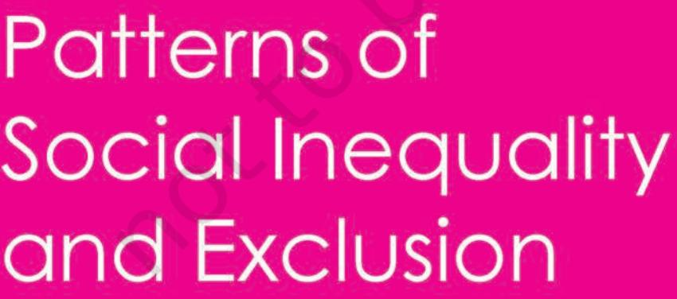
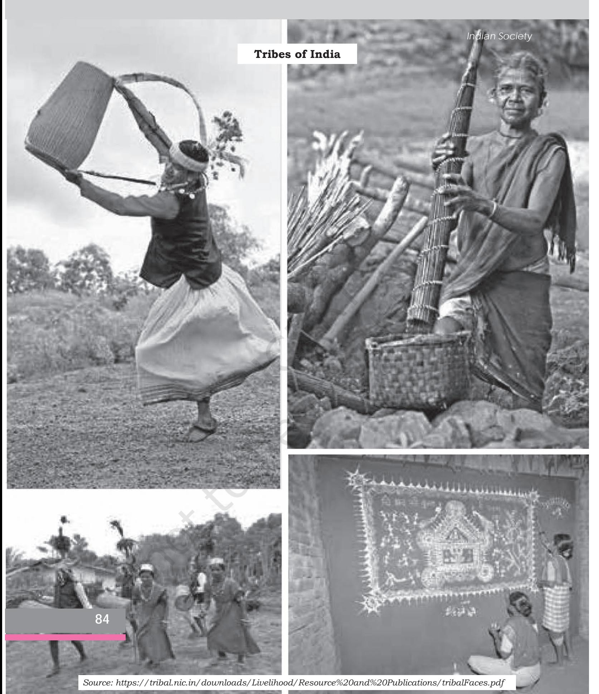
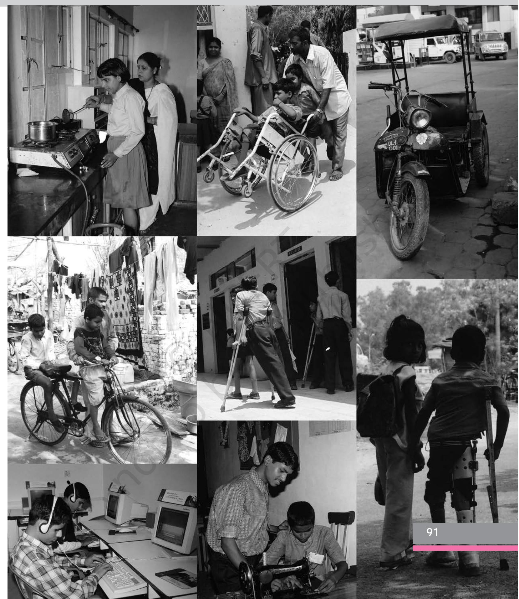

Chapter 5.indd 69 9/1/2022 5:09:07 PM

*T*he family, caste, tribe and the market – these are the social institutions that have been considered in the last two chapters. These institutions were seen from the point of view of their role in forming communities and sustaining society. In this chapter we consider an equally important aspect of such institutions, namely their role in creating and sustaining patterns of inequality and exclusion.

For most of us who are born and live in India, social inequality and exclusion are facts of life. We see beggars in the streets and on railway platforms. We see young children labouring as domestic workers, construction helpers, cleaners and helpers in streetside restaurants (*dhabas*) and tea-shops. We are not surprised at the sight of small children, who work as domestic workers in middle class urban homes, carrying the school bags of older children to school. It does not immediately strike us as unjust that some children are denied schooling. Some of us read about caste discrimination against children in schools; some of us face it. Likewise, news reports about violence against women and prejudice against minority groups and the differently abled are part of our everyday lives.

This everydayness of social inequality and exclusion often make them appear inevitable, almost natural. If we do sometimes recognise that inequality and exclusion are not inevitable, we often think of them as being 'deserved' or 'justified' in some sense. Perhaps the poor and marginalised are where they are because they are lacking in ability, or haven't tried hard enough to improve their situation? We thus tend to blame them for their own plight – if only they worked harder or were more intelligent, they wouldn't be where they are.

A closer examination will show that few work harder than those who are located at the lower ranks of society. As a South American proverb says – "If hard labour were really such a good thing, the rich would keep it all for themselves!" All over the world, back-breaking work like stone breaking, digging, carrying heavy weights, pulling rickshaws or carts is invariably done by the poor. And yet they rarely improve their life chances. How often do we come across a poor construction worker who rises to become even a petty construction contractor? It is only in films that a street child may become an industrialist, but even in films it is often shown that such a dramatic rise requires illegal or unscrupulous methods.

#### **Activity 5.1**

Identify some of the richest and some of the poorest people in your neigbourhood, people that you or your family are acquainted with. (For instance a rickshawpuller or a porter or a domestic worker and a cinema hall owner or a construction contractor or hotel owner, or doctor… It could be something else in your context). Try to talk to one person from each group to find out about their daily routines. For each person, organise the information in the form of an imaginary diary detailing the activities of the person from the time they get up to the time they go to sleep on a typical (or average) working day. Based on these diaries, try to answer the following questions and discuss them with your classmates.

Chapter 5.indd 70 10/6/2022 12:53:33 PM

- How many hours a day do each of these persons spend at work? What kind of work do they do – in what ways is their work tiring, stressful, pleasant or unpleasant? What kinds of relationship does it involve with other people – do they have to take orders, give orders, seek cooperation, enforce discipline….? Are they treated with respect by the people they have to deal with in their work, or do they themselves have to show respect for others?
It may be that the poorest, and in some cases even the richest, person you know actually has no real 'job' or is currently 'not working'. If this is so, do go ahead and find out about their daily routine anyway. But in addition, try to answer the following questions.

- Why is the person 'unemployed'? Has he/she been looking for work? How is he/she supporting herself/himself? In what ways are they affected by the fact of not having any work? Is their lifestyle any different from when they were working?
Activity 5.1 invites you to rethink the widely held commonsense view that hard work alone can improve an individual's life chances. It is true that hard work matters, and so does individual ability. If all other things were equal, then personal effort, talent and luck would surely account for all the differences between individuals. But, as is almost always the case, all other things are not equal. It is these non-individual or group differences that explain social inequality and exclusion.

# 5.1 What Is *Social* About Social Inequality and Exclusion?

The question being asked in this section has three broad answers which may be stated briefly as follows. First, social inequality and exclusion are social because they are not about individuals but about groups. Second, they are social in the sense that they are not economic, although there is usually a strong link between social and economic inequality. Third, they are systematic and structured – there is a definite pattern to social inqualities. These three broad senses of the 'social' will be explored briefly below.

### **Social Inequality**

In every society, some people have a greater share of valued resources – money, property, education, health, and power – than others. These *social resources* can be divided into three forms of capital – *economic capital* in the form of material assets and income; *cultural capital* such as educational qualifications and status; and *social capital* in the form of networks of contacts and social associations (Bourdieu 1986). Often, these three forms of capital overlap and one can be converted into the other. For example, a person from a well-off

**71**

Chapter 5.indd 71 9/1/2022 5:09:09 PM

family (economic capital) can afford expensive higher education, and so can acquire cultural or educational capital. Someone with influential relatives and friends (social capital) may – through access to good advice, recommendations or information – manage to get a well-paid job.

Patterns of unequal access to social resources are commonly called *social inequality*. Some social inequality reflects innate differences between individuals for example, their varying abilities and efforts. Someone may be endowed with exceptional intelligence or talent, or may have worked very hard to achieve their wealth and status. However, by and large, social inequality is not the outcome of innate or 'natural' differences between people, but is produced by the society in which they live. Sociologists use the term *social stratification* to refer to a system by which categories of people in a society are ranked in a hierarchy. This hierarchy then shapes people's identity and experiences, their relations with others, as well as their access to resources and opportunities. Three key principles help explain social stratification:

- 1. *Social stratification is a characteristic of society, not simply a function of individual differences.* Social stratification is a society-wide system that unequally distributes social resources among categories of people. In the most technologically primitive societies – hunting and gathering societies, for instance – little was produced so only rudimentary social stratification could exist. In more technologically advanced societies where people produce a surplus over and above their basic needs, however, social resources are unequally distributed to various social categories regardless of people's innate individual abilities.
- 2. *Social stratification persists over generations.* It is closely linked to the family and to the inheritance of social resources from one generation to the next. A person's social position is *ascribed*. That is, children assume the social positions of their parents. Within the caste system, birth dictates occupational opportunities. The ascribed aspect of social inequality is reinforced by the practice of *endogamy*. That is, marriage is usually restricted to members of the same caste, ruling out the potential for blurring caste lines through inter-caste marriage.
- 3. *Social stratification is supported by patterns of belief, or ideology.* No system of social stratification is likely to persist over generations unless it is widely viewed as being either fair or inevitable. The caste system, for example, is justified in terms of the opposition of purity and pollution, with the Brahmins designated as the most superior and Dalits as the most inferior by virtue of their birth and occupation. Not everyone, though, thinks of a system of inequality as legitimate. Typically, people with the greatest social privileges express the strongest support for systems of stratification such as caste and race. Those who have experienced the exploitation and humiliation of being at the bottom of the hierarchy are most likely to challenge it.

Chapter 5.indd 72 9/1/2022 5:09:09 PM

Often we discuss social exclusion and discrimination as though they pertain to differential economic resources alone. This however is only partially true. People often face discrimination and exclusion because of their gender, religion, ethnicity, language, caste and disability. Thus, women from a privileged background may face sexual harassment in public places. A middle class professional from a minority religious or ethnic group may find it difficult to get accommodation in a middle class colony even in a metropolitan city. People often harbour prejudices about other social groups. Each of us grows up as a member of a community from which we acquire ideas not just about our 'community', our 'caste' or 'class' our 'gender' but also about others. Often these ideas reflect prejudices.

Prejudices refer to pre-conceived opinions or attitudes held by members of one group towards another. The word literally means 'pre-judgement', that is, an opinion formed in advance of any familiarity with the subject, before considering any available evidence. A prejudiced person's preconceived views are often based on hearsay rather than on direct evidence, and are resistant to change even in the face of new information. Prejudice may be either positive or negative. Although the word is generally used for negative pre-judgements, it can also apply to favourable pre-judgement. For example, a person may be prejudiced in favour of members of his/her own caste or group and – without any evidence – believe them to be superior to members of other castes or groups.

Prejudices are often grounded in stereotypes, fixed and inflexible characterisations of a group of people. Stereotypes are often applied to ethnic and racial groups and to women. In a country such as India, which was colonised for a long time, many of these stereotypes are partly colonial creations. Some communities were characterised as 'martial races', some others as effeminate or cowardly, yet others as untrustworthy. In both English and Indian fictional writings we often encounter an entire group of people classified as 'lazy' or 'cunning'. It may indeed be true that some individuals are sometimes lazy or cunning, brave or cowardly. But such a general statement is true of individuals in every group. Even for such individuals, it is not true all the time – the same individual may be both lazy and hardworking at different times. Stereotypes fix whole groups into single, homogenous categories; they refuse to recognise the variation across individuals and across contexts or across time. They treat an entire community as though it were a single person with a single all-encompassing trait or characteristic.

If prejudice describes attitudes and opinions, discrimination refers to actual behaviour towards another group or individual. Discrimination can be seen in practices that disqualify members of one group from opportunities open to others, as when a person is refused a job because of their gender or religion. Discrimination can be very hard to prove because it may not be open or explicitly stated. Discriminatory behaviour or practices may be presented as motivated by other, more justifiable, reasons rather than prejudice. For

Chapter 5.indd 73 9/1/2022 5:09:09 PM

## **Activity 5.2**

 Collect examples of prejudiced behaviour from films or novels.

- Discuss the examples you and your classmates have gathered. How are prejudices reflected in the manner a social group is depicted? How do we decide whether a certain kind of portrayal is prejudiced or not?
- Can you distinguish between instances of prejudice that were intentional – i.e., the film maker or writer *wanted* to show it as prejudiced– and unintentional or unconscious prejudice?

example, the person who is refused a job because of his or her caste may be told that he or she was less qualified than others, and that the selection was done purely on merit.

### **Social Exclusion**

Social exclusion refers to ways in which individuals may become cut off from full involvement in the wider society. It focuses attention on a broad range of factors that prevent individuals or groups from having opportunities open to the majority of the population. In order to live a full and active life, individuals must not only be able to feed, clothe and house themselves, but should also have access to essential goods and services such as education, health, transportation,

insurance, social security, banking and even access to the police or judiciary. Social exclusion is not accidental but systematic – it is the result of structural features of society.

India like most societies has been marked by acute practices of social discrimination and exclusion. At different periods of history protest movements arose against caste, gender and religious discrimination. Yet prejudices remain and often, new ones emerge. Thus, legislation alone is unable to transform society or produce lasting social change. A constant social campaign to change awareness and sensitivity is required to break them.

You have already read about the impact of colonialism on Indian society. What discrimination and exclusion mean was brought home to even the most privileged Indians at the hands of the British colonial state. Such experiences were, of course, common to the various socially discriminated groups such as women, *dalits* and other oppressed castes and tribes. Faced with the humiliation of colonial rule and simultaneously exposed to ideas of democracy and justice, many Indians initiated and participated in a large number of social reform movements.

In this chapter we focus on four such groups who have suffered from serious social inequality and exclusion, namely Dalits or the ex-untouchable castes; adivasis or communities refered to as 'tribal'; women, and the differently abled. We attempt to look at each of their stories of struggles and achievements in the following sections.

Apart from these four groups, there are two more groups included in this category like transgender and people of third gender group. Information about these groups are given in Box 5.1a.

Chapter 5.indd 74 9/1/2022 5:09:09 PM

**Trans Gender –** In general 'male body' and 'female body' as social unit are unchanging identity but due to so many researches in the field of physiology, the notion of the body is now linked with 'choice structure'. By

#### **Box 5.1a**

using surgical procedures male body can be converted into female body or female body into male body. It means gender indentities can be chosen willingly. Transgender as concept, thus, refers to conversions of gender status of body into opposite gender by using choice or certain compulsions.

**Third Gender –** Third gender refers to that social category of persons who are neither male nor female. In fact this category presents the persons having alternates of both genders–male and female. The identification of our self as third gender is based on self‑understanding; however, in various situations, this identification is made by group, family and society. Now the third gender persons get the legal recognition. In India a third gender person can nominate themselves to contest in elections (Parliament/ Assembly/Local government).

# 5.2 Caste and Tribe – Systems Justifying and Perpetuating Inequality

### **The Caste System as a Discriminatory System**

The caste system is a distinct Indian social institution that legitimises and enforces practices of discrimination against people born into particular castes. These practices of discrimination are humiliating, exclusionary and exploitative.

Historically, the caste system classified people by their occupation and status. Every caste was associated with an occupation, which meant that persons born into a particular caste were also 'born into' the occupation associated with their caste – they had no choice. Moreover, and perhaps more importantly, each caste also had a specific place in the hierarchy of social status, so that, roughly speaking, not only were occupational categories ranked by social status, but there could be a further ranking within each broad occupational category. In strict scriptural terms, social and economic status were supposed to be sharply separated. For example, the ritually highest caste – the Brahmins – were not supposed to amass wealth, and were subordinated to the secular power of kings and rulers belonging to the Kshatriya castes. On the other hand, despite having the highest secular status and power, the king was subordinated to the Brahmin in the ritual-religious sphere. (Compare this to the *'apartheid'* system described in Box 5.1b)

However, in actual historical practice economic and social status tended to coincide. There was thus a fairly close correlation between social (i.e. caste) status and economic status – the 'high' castes were almost invariably of high economic status, while the 'low' castes were almost always of low economic

Chapter 5.indd 75 9/8/2022 4:17:31 PM

status. In modern times, and particularly since the nineteenth century, the link between caste and occupation has become much less rigid. Ritual-religious prohibitions on occupational change are not easily imposed today, and it is easier than before to change one's occupation. Moreover, compared to a hundred or fifty years ago, the correlation between caste and economic status is also weaker – rich and poor people are to be found in every caste. But – and this is the key point – the caste-class correlation is still remarkably stable at the macro level. As the system has become less rigid, the distinctions between castes of broadly similar social and economic status have weakened. Yet, between different socio-economic groupings, the distinctions continue to be maintained.

Although things have certainly changed, they have not changed much at the macro level – it is still true that the privileged (and high economic status) sections of society tend to be overwhelmingly 'upper' caste while the disadvantaged (and low economic status) sections are dominated by the so called 'lower' castes. Moreover, the proportion of population that lives in poverty or affluence differs greatly across caste groups. (See Tables 1 and 2) In short, even though there have been major changes brought about by social movements over more than a century, and despite changed modes of production as well as concerted attempts by the state to suppress its public role in independent India, caste continues to affect the life chances of Indians in the twenty-first century.

### **Untouchability**

'Untouchability' is an extreme and particularly vicious aspect of the caste system that prescribes stringent social sanctions against members of castes located at the bottom of the purity-pollution scale. Strictly speaking, the 'untouchable' castes are outside the caste hierarchy – they are considered to be so 'impure'

#### **Race and Caste – A Cross-Cultural Comparison**

#### **Box 5.1b**

Just like caste in India, race in South Africa stratifies society into a hierarchy. About one South African in seven is of European ancestry, yet South Africa's White minority holds the dominant share of power and wealth. Dutch traders settled in South Africa in the mid-seventeenth century; early in the nineteenth century, their descendants were pushed inland by British colonisation. At the beginning of the twentieth century, the British gained control of what became the Union and then the Republic of South Africa.

To ensure their political control, the White European minority developed the policy of **apartheid**, or separation of the races. An informal practice for many years, apartheid became law in 1948 and was used to deny the Black majority South African citizenship, ownership of land, and a formal voice in government. Every individual was classified by race and mixed marriages were prohibited. As

a racial caste, Blacks held low-paying jobs; on average, they earned only onefourth of what whites did. In the latter half of the twentieth century, millions of Blacks were forcibly relocated to 'Bantustans' or 'homelands' – dirt-poor districts with no infrastructure or industry or jobs. All the homelands together constituted

**76**

76

Chapter 5.indd 76 9/1/2022 5:09:10 PM

only 14 per cent of South Africa's land, while Blacks made up close to 80 per cent of the country's population. The resulting starvation and suffering was intense and widespread. In short, in a land with extensive natural resources, including diamonds and precious minerals, the majority of people lived in abject poverty. The prosperous White minority defended its privileges by viewing Blacks as social inferiors. However, they also relied on a powerful system of military repression to maintain their power. Black protestors were routinely jailed, tortured and killed. Despite this reign of terror, Blacks collectively struggled for decades under the leadership of the African National Congress and Nelson Mandela, and finally succeeded in coming to power and forming the government in 1994. Although the Constitution of post-apartheid South Africa has banned racial discrimination, economic capital still remains concentrated in White's hands. Empowering the Black majority represents a continuing challenge for the new society.

"I have fought against White domination and I have fought against Black domination. I have cherished the ideal of a democratic and free society in which all persons live together in harmony and with equal opportunities. It is an ideal which I hope to live for and to achieve. But if needs be, it is an ideal for which I am prepared to die."

*Nelson Mandela, 20 April 1964, Rivonia Trial.* 

|  | Table 1: PERCENTAGE OF POPULATION LIVING BEL THE POVERTY LINE, 2011–12 | OW |  |
| --- | --- | --- | --- |
| CASTE and | RURAL INDIA | URBAN INDIA |  |
| COMMUNITY GROUPS | Spending Rs.816 or less per person per month | Spending Rs.1000 or less per person per month |  |
| Scheduled Tribes | 45.3 | 24.1 |  |
| Scheduled Castes | 31.5 | 21.7 |  |
| FC | 15.5 | 8.1 |  |
| OBCs | 22.7 | 15.4 |  |
| Muslims | 26.9 | 22.7 |  |
| Hindus | 25.6 | 12.1 |  |
| Christians | 22.2 | 05.5 |  |
| Sikhs | 06.2 | 05.0 |  |
| ALL GROUPS | 25.4 | 13.7 | 77 77 |
| Source: Report of NITI Aayog, 2014; Panagariya and More, 2013 | Note: OBC = Other Backward Classes; UC = 'Upper Castes', i.e., not SC/ST/OBC |  |  |

Chapter 5.indd 77 9/8/2022 4:24:23 PM

| Ta ble 2: PERCENT | AGE OF POPULATION AFFLUENT , 1999–2000 | THAT IS |
| --- | --- | --- |
| CASTE AND | RURAL INDIA | URBAN INDIA |
| COMMUNITY GROUPS | Spending Rs.1000 or more per person per month | Spending Rs. 2000 or more per person per month |
| Scheduled Tribes | 1.4 | 1.8 |
| Scheduled Castes | 1.7 | 0.8 |
| OBCs | 3.3 | 2.0 |
| Muslim | 2.0 | 1.6 |
| Hindu | 8.6 | 8.2 |
| Christian | 18.9 | 17.0 |
| Sikh | 31.7 | 15.1 |
| Others | 17.9 | 14.4 |
| ALL GROUPS | 4.3 | 4.5 |
| Note: OBC = Other Backward Classes |  |  |

#### **Exercise for Tables 1 and 2**

Table 1 shows the percentage of the population of each caste/ community that lives below the official 'Poverty Line' for 2011–2012. There are separate columns for rural and urban India.

Table 2 is organised in exactly the same way except that it shows the percentage of population living in affluence rather than in poverty. 'Affluence' is here defined as a monthly per person expenditure of Rs.1000 for rural India and Rs.2000 for urban India. This is equivalent to a family of five spending Rs.5000 per month in rural India and Rs.10,000 per month in urban India. Please take some time to study the tables carefully before you answer the questions below.

- 1. What is the percentage of the Indian population that was living below the poverty line in (a) Rural India and (b) Urban India?
- 2. Which caste/community group has the highest proportion of its members living in extreme poverty in a) rural and b) urban India? Which caste/community has the lowest percentage of population living in poverty?

Chapter 5.indd 78 9/1/2022 5:09:10 PM

- 3. Approximately how many times higher than the national average is the poverty percentage for each of the lower castes (ST, SC, OBC)? Is there a significant rural-urban difference?
- 4. Which caste/community has the lowest percentage of population living in affluence in rural and urban India respectively? How does this compare with the national average?
- 5. The affluent population of 'Upper' caste Hindus is roughly how many times larger than the percentage for the 'lower' castes (ST, SC, OBC)?
- 6. What do these tables tell you about the relative position of the OBCs? Is there a significant rural-urban difference?

that their mere touch severely pollutes members of all other castes, bringing terrible punishment for the former and forcing the latter to perform elaborate purification rituals. In fact, notions of 'distance pollution' existed in many regions of India (particularly in the south) such that even the mere presence or the shadow of an 'untouchable' person is considered polluting. Despite the limited literal meaning of the word, the institution of 'untouchability' refers not just to the avoidance or prohibition of physical contact but to a much broader set of social sanctions.

It is important to emphasise that the three main dimensions of untouchability – namely, exclusion, humiliation-subordination and exploitation – are all equally important in defining the phenomenon. Although other (i.e., 'touchable') low castes are also subjected to subordination and exploitation to some degree, they do not suffer the extreme forms of exclusion reserved for 'untouchables.' Dalits experience forms of exclusion that are unique and not practised against other groups – for instance, being prohibited from sharing drinking water sources or participating in collective religious worship, social ceremonies and festivals. Moreover, untouchability is almost always associated with economic exploitation of various kinds, most commonly through the imposition of forced, unpaid (or under-paid) labour, or the confiscation of property. Finally, untouchability is a pan-Indian phenomenon, although its specific forms and intensity vary considerably across regions and socio-historical contexts.

The so-called 'untouchables' have been referred to collectively by many names over the centuries. Whatever the specific etymology of these names, they are all derogatory and carry a strongly pejorative charge. In fact, many of them continue to be used as forms of abuse even today, although their use is now a criminal offence. Mahatma Gandhi had popularised the term 'Harijan' (literally, children of God) in the 1930s to counter the pejorative charge carried by caste names.

**79**

Chapter 5.indd 79 9/1/2022 5:09:10 PM

However, the ex-untouchable communities and their leaders have coined another term, 'Dalit', which is now the generally accepted term for referring to these groups. In Indian languages, the term Dalit literally means 'downtrodden' and conveys the sense of an oppressed people. Though it was neither coined by Dr. Ambedkar nor frequently used by him, the term certainly resonates with his philosophy and the movement for empowerment that he led. It received wide currency during the caste riots in Mumbai in the early 1970s. The Dalit Panthers, a radical group that emerged in western India during that time, used the term to assert their identity as part of their struggle for rights and dignity.

### **State and Non-State Initiatives Addressing Caste and Tribe Discrimination**

The Indian state has had special programmes for the Scheduled Tribes and Scheduled Castes since even before Independence. The 'Schedules' listing the castes and tribes recognised as deserving of special treatment because of the massive discrimination practiced against them were drawn up in 1935, by the British Indian government. After Independence, the same policies have been continued and many new ones added. Among the most significant additions is the extension of special programmes to the Other Backward Classes (OBCs) since the early 1990s.

The most important state initiative attempting to compensate for past and present caste discrimination is the one popularly known as 'reservations'. This involves the setting aside of some places or 'seats' for members of the Scheduled Castes and Tribes in different spheres of public life. These include reservation of seats in the State and Central legislatures (i.e., state assemblies, Lok Sabha and Rajya Sabha); reservation of jobs in government service across all departments and public sector companies; and reservation of seats in educational institutions. The proportion of reserved seats is equal to the percentage share of the Scheduled Castes and Tribes in the total population. But for the OBCs this proportion is decided differently. The same principle is extended to other developmental programmes of the government, some of which are exclusively for the Scheduled Castes or Tribes, while others give them preference.

In addition to reservations, there have been a number of laws passed to end, prohibit and punish caste discrimination, specially untouchability. One of the earliest such laws was the Caste Disabilities Removal Act of 1850, which disallowed the curtailment of rights of citizens due solely to change of religion or caste. The most recent such law was the Constitution Amendment (Ninety Third Amendment) Act of 2005, which became law on 23rd January 2006. Coincidentally, both the 1850 law and the 2006 amendment related to education. The 93rd Amendment is for introducing reservation for the Other Backward Classes in institutions of higher education, while the 1850 Act was used to allow entry of Dalits to government schools. In between, there have been numerous laws, of which the important ones are, of course, the Constitution of

80

Chapter 5.indd 80 9/1/2022 5:09:10 PM

India itself, passed in 1950; and the Scheduled Castes and Scheduled Tribes (Prevention of Atrocities) Act of 1989. The Constitution abolished untouchability (Article 17) and introduced the reservation provisions mentioned above. The 1989 Prevention of Atrocities Act revised and strengthened the legal provisions punishing acts of violence or humiliation against Dalits and adivasis. The fact that legislation was passed repeatedly on this subject is proof of the fact that the law alone cannot end a social practice. In fact, as you will have seen from newspapers and the media, cases of discrimination including atrocities against Dalits and adivasis, continue to take place all over India today.

State action alone cannot ensure social change. In any case, no social group howsoever weak or oppressed is only a victim. Human beings are always capable of organising and acting on their own – often against very heavy odds–to struggle for justice and dignity. Dalits too have been increasingly active on the political, agitational, and cultural fronts. From the pre-Independence struggles and movements launched by people like Jyotiba Phule, Iyotheedas, Periyar, Ambedkar and others (See Chapter 3) to contemporary

political organisations like the Bahujan Samaj Party in Uttar Pradesh or the Dalit Sangharsh Samiti of Karnataka, Dalit political assertion has come a long way. Dalits have also made significant contributions to literature in several Indian languages, specially Marathi, Kannada, Tamil, Telugu and Hindi. (See Box 5.4 which features a short poem by the well known Marathi Dalit poet, Daya Pawar.)

# **The Other Backward Classes**

Untouchability was the most visible and comprehensive form of social discrimination. However, there were a large group of castes that were of low status and were also subjected to varying levels of discrimination short of untouchability. These were the service and artisanal castes who occupied the lower rungs of the caste hierarchy. The Constitution of India recognises the possibility that there may be groups other than the Scheduled Tribes and Scheduled Castes who suffer from social disadvantages. These groups – which need not be based on caste alone, but generally are identified by caste – were described as the 'socially and educationally backward classes'. This is the constitutional basis of the popular term 'Other Backward Classes' (OBCs), which is in common use today.

Obtain a copy of the Constitution of India. You can get it from your school library, from a bookshop, or from the Internet (web address: http:// indiacode.nic.in/). Find and list all the articles and sections (laws) that deal with the Scheduled Castes and Tribes, or with caste-related problems like Untouchability. You can make a chart of the most important laws and put them up in your class.

Chapter 5.indd 81 9/8/2022 4:25:47 PM

#### **The City**  *by Daya Pawar*

**Box 5.2**

One day someone digs up a twentieth century city and ends on this observation.

Here's an interesting inscription:

'This water tap is open to all castes and religions'. What could it have meant:

That this society was divided?

That some were high while others were low?

Well, all right, then this city deserved burying—

Why did they call it the machine age?

Seems like the Stone Age in the twentieth century.

Like the category of the 'tribe' (see Chapter 3), the OBCs are defined negatively, by what they are not. They are neither part of the 'forward' castes at the upper end of the status spectrum, nor of the Dalits at the lower end. But since caste has entered all the major Indian religions and is not confined to Hinduism alone, there are also members of other religions who belong to the backward castes and share the same traditional occupational identification and similar or worse socio-economic status.

For these reasons, the OBCs are a much more diverse group than the Dalits or adivasis. The first government

of independent India under Jawaharlal Nehru appointed a commission to look into measures for the welfare of the OBCs. The First Backward Classes Commission headed by Kaka Kalelkar submitted its report in 1953. But the political climate at the time led to the report being sidelined. From the midfifties, the OBC issue became a regional affair pursued at the state rather than the central level.

The southern states had a long history of backward caste political agitation that had started in the early twentieth century. Because of these powerful social movements, policies to address the problems of the OBCs were in place long before they were discussed in most northern states. The OBC issue returned to the central level in the late 1970s after the Emergency when the Janata Party came to power. The Second Backward Classes Commission headed by B.P. Mandal was appointed at this time. However, it was only in 1990, when the central government decided to implement the ten-year old Mandal Commission report, that the OBC issue became a major one in national politics.

Since the 1990s we have seen the resurgence of lower caste movements in north India, among both the OBCs and Dalits. The politicisation of the OBCs allows them to convert their large numbers – recent surveys show that they are about 41% of the national population – into political influence. This was not possible at the national level before, as shown by the sidelining of the Kalelkar Commission report, and the neglect of the Mandal Commission report.

The large disparities between the upper OBCs (who are largely landed castes and enjoy dominance in rural society in many regions of India) and the lower OBCs (who are very poor and disadvantaged, and are often not very different from Dalits in socio-economic terms) make this a difficult political category to work with. However, the OBCs are severely under-represented in all spheres

**82**

Chapter 5.indd 82 9/8/2022 4:25:47 PM

except landholding and political representation (they have a large number of MLAs and MPs). Although the upper OBCs are dominant in the rural sector, the situation of urban OBCs is much worse, being much closer to that of the Scheduled Castes and Tribes than to the upper castes.

### **Adivasi Struggles**

Like the Scheduled Castes, the Scheduled Tribes are also social groups that are duly recognised by the Constitution of India. The *jana* or tribes were believed to be 'people of the forest' whose distinctive habitat in the hill and forest areas shaped their economic, social and political attributes. However, ecological isolation was nowhere absolute. Tribal groups have had long and close association with Hindu society and culture, making the boundaries between 'tribe' and 'caste' quite porous. (Recall the discussion of the concept of tribe in Chapter 3).

In the case of adivasis, the movement of populations from one area to another further complicates the picture. Today, barring the North-Eastern states, there are no areas of the country that are inhabited exclusively by tribal people; there are only areas of tribal *concentration*. Since the middle of the nineteenth century, non-tribals have moved into the tribal districts of central India, while tribal people from the same districts have migrated to plantations, mines, factories and other places of employment.

In the areas where tribal populations are concentrated, their economic and social conditions are usually much worse than those of non-tribals. The impoverished and exploited circumstances under which adivasis live can be traced historically to the pattern of accelerated resource extraction started by the colonial British government and continued by the government of independent India. From the late nineteenth century onwards, the colonial government reserved most forest tracts for its own use, severing the rights that adivasis had long exercised to use the forest for gathering produce and for shifting cultivation. Forests were now to be protected for maximising timber production. With this policy, the mainstay of their livelihoods was taken away from adivasis, rendering their lives poorer and more insecure. Denied access to forests and land for cultivation, adivasis were forced to either use the forests illegally (and be harassed and prosecuted as 'encroachers' and thieves) or migrate in search of wage labour.

After the Independence of India in 1947 the government's monopoly over forests continued. The policy of capital-intensive industrialisation adopted by the Indian government required mineral resources and power-generation capacities which were concentrated in Adivasi areas. Adivasi lands were rapidly acquired for new mining and dam projects. In the process, millions of adivasis were displaced without any appropriate compensation or rehabilitation. Justified in the name of 'national development' and 'economic growth', these policies

**83**

Chapter 5.indd 83 19-03-2024 12:05:13

Chapter 5.indd 84 19-03-2024 12:08:24

were also a form of internal colonialism, subjugating adivasis and alienating the resources upon which they depended. Projects such as the Sardar Sarovar dam on the river Narmada in Western India and the Polavaram dam on the river Godavari in Andhra Pradesh displaced hundreds of thousands of adivasis from their original habitats. These processes continue to prevail and have become even more powerful since the 1990s when economic liberalisation policies were officially adopted by the Indian government. It is now easier for corporate firms to acquire large areas of land by displacing adivasis.

Like the term Dalit, the term Adivasi connotes political awareness and the assertion of rights. Literally meaning 'original inhabitants', the term was coined in the 1930s as part of the struggle against the intrusion by the colonial government and outside settlers and moneylenders. Being Adivasi is about shared experiences of the loss of forests, the alienation of land, repeated displacements since Independence in the name of 'development projects' and much more.

In spite of the heavy odds against them and in the face of their marginalisation many tribal groups have been waging struggles against outsiders (called 'dikus') and the state. In post-Independence India, the most significant achievements of Adivasi movements include the attainment of statehood for Jharkhand and Chattisgarh, which were originally part of Bihar and Madhya Pradesh respectively. In this respect adivasis and their struggles are different from the Dalit struggle because, unlike Dalits, adivasis were concentrated in contiguous areas and could demand states of their own.

### 5.3 Struggle for women's equality and rights

Because of the obvious biological and physical differences between men and women, gender inequality is often treated as natural. However, despite appearances, scholars have shown that the inequalities between men and women are social rather than natural. For example, there are no biological reasons that can explain why so few women are found in positions of public power. Nor can nature explain why women generally receive a smaller or no share in family property in most societies. But the strongest argument comes from the societies that were different from the 'normal' or common pattern. If women were biologically unfit to be inheritors and heads of families, how did matrilineal societies (as the Nairs of Kerala used to be, and as the Khasis of Meghalaya still are) work for centuries? How have women managed to be successful farmers and traders in so many African societies? There is, in short, nothing biological about the inequalities that mark the relations between women and men. Gender is thus also a form of social inequality and exclusion like caste and class, but with its own specific features. In this section we will look at how gender inequality came to be recognised as inequality in the Indian context, and the kinds of responses that this recognition produced.

Chapter 5.indd 85 19-03-2024 12:09:48

The women's question arose in modern India as part of the nineteenth century middle class social reform movements. The nature of these movements varied from region to region. They are often termed as middle class reform movements because many of these reformers were from the newly emerging western educated Indian middle class. They were often at once inspired by the democratic ideals of the modern west and by a deep pride in their own democratic traditions of the past. Many used both these resources to fight for women's rights. We can only give illustrative examples here. We draw from the anti-sati campaign led by Raja Rammohun Roy in Bengal, the widow remarriage movement in the Bombay Presidency where Ranade was one of the leading reformers, from Jyotiba Phule's simultaneous attack on caste and gender oppression, and from the social reform movement in Islam led by Sir Syed Ahmed Khan.

Raja Rammohun Roy's attempts to reform society, religion and the status of women can be taken as the starting point of nineteenth century social reform in Bengal. A decade before establishing the Brahmo Samaj in 1828, Roy undertook the campaign against "sati" which was the first women's issue to receive public attention. Rammohun Roy's ideas represented a curious mixture of Western rationality and an assertion of Indian traditionality. Both trends can be located in the overarching context of a response to colonialism. Rammohun thus attacked the practice of *sati* on the basis of both appeals to humanitarian and natural rights doctrines as well as Hindu *shastras*.

### **Activity 5.4**

- Find out about a social reformer in your part of the country. Collect information about her/ him.
- Read an autobiography/ biography of any social reformer.
- Can you see any of the ideas they fought for existing today in our everyday lives or in our constitutional provisions?

The deplorable and unjust treatment of the Hindu upper caste widows was a major issue taken up by the social reformers. Ranade used the writings of scholars such as Bishop Joseph Butler whose *Analogy of Religion* and *Three Sermons on Human Nature* dominated the moral philosophy syllabus of Bombay University in the 1860s. At the same time, M.G. Ranade's writings entitled the *The Texts of the Hindu Law* on the *Lawfulness of the Remarriage of Widows* and *Vedic Authorities for Widow Marriage* elaborated the *shastric* sanction for remarriage of widows.

While Ranade and Rammohun Roy belonged to one kind of nineteenth century upper caste and middle class social reformers, Jotiba Phule came from a socially excluded caste and his attack was directed against both caste and gender discrimination. He founded the Satyashodak Samaj with its primary emphasis on "truth seeking". Phule's first practical social reform efforts were

to aid the two groups considered lowest in traditional Brahmin culture: women and untouchables. (See Chapter 3)

As in the case of other reformers, a similar trend of drawing upon both modern western ideas as well as the sacred texts characterised Sir Syed Ahmed

Chapter 5.indd 86 9/1/2022 5:09:11 PM

Khan's efforts to reform Muslim society. He wanted girls to be educated, but within the precincts of their homes. Like Dayanand Saraswati of the Arya Samaj, he stood for women's education but sought for a curriculum that included instruction in religious principles, training in the arts of housekeeping and handicrafts and rearing of children. This may appear very stereotypical today. One has to however realise that once rights such as education for women were accepted it started a process that finally made it impossible to confine women to only some kinds of education.

It is often assumed that social reform for women's rights was entirely fought for by male reformers and that ideas of women's equality are alien imports. To learn how wrong both these assumptions are, read the following extracts from two books written by women, *Stree Purush Tulana* written in 1882 and *Sultana's Dream* written in 1905.

*Stree Purush Tulana* (or Comparison of Men and Women) was written by a Maharashtrian housewife, Tarabai Shinde,

as a protest against the double standards of a male dominated society. A young Brahmin widow had been sentenced to death by the courts for killing her newborn baby because it was illegitimate, but no effort had been made to identify or punish the man who had fathered the baby. *Stree Purush Tulana* created quite a stir when it was published. Begum Rokeya Sakhawat Hossain was born in a well-to-do Bengali Muslim family, and was lucky to have a husband who was very liberal in outlook and encouraged her education first in Urdu and later in Bengali and English. She was already a successful author in Urdu

#### **From** *Stree Purush Tulana* **1882**

…Who are these women you give such names to? Whose womb did you take your birth in? Who carried the killing burden of you for nine months? Who was the saint who made you the light in her eye, …How would you feel if someone said about your mother, "That old chap's mother, you know, she's a gateway to hell'. Or your sister, "That so-and so-s' sister, she's a real storehouse of deceit'. …Would you just sit and listen to their bad words?…

…Then you get blessed with a bit of education and promoted to some important new office- and you start feeling ashamed of your first wife. Money works its influence on you and you begin to say to yourself, what does a wife matter after all? Don't we just give them a few rupees a month and keep them at home like any other servant, to do the cooking and look after the house? You begin to think of her like some female slave you've paid for….If one of your horses died it wouldn't take long to replace it, and there's no great labour needed to get another wife either. ..The problem is Yama hasn't got time to carry off wives fast enough, or you'd probably get through several different ones in one day! **87**

# **Activity 5.5**

- Make a list of professions in which women are involved today.
- Can you think of any educational field where women are barred today? Perhaps the discussion on women in the Indian armed forces may throw some light on this.

#### **Box 5.3**

Chapter 5.indd 87 9/1/2022 5:09:12 PM

**Box 5.4**

#### **From** *Sultana's Dream* **(1905)**

…"What is the matter, dear?" she said affectionately.

" I feel somewhat awkward," I said, in a rather apologising tone, "as being a purdahnishin woman I am not accustomed to walking about unveiled."

"You need not be afraid of coming across a man here. This is Ladyland, free from sin and harm…"

…I became very curious to know where the men were. I met more than a hundred women while walking there, but not a single man.

"Where are the men?" I asked her.

"In their proper places, where they ought to be."

"Pray let me know what you mean by 'their proper places."'

"Oh, I see my mistake, you cannot know our customs, as you were never here before. We shut our men indoors."

"Just as we are kept in the zenana?"

"Exactly so."

"How funny." I burst into a laugh. Sister Sara laughed too.

### **Activity 5.6**

- Find out the names of a few women's organisations that emerged both at the national level and in your part of the country.
- Find out about any woman who was part of a tribal or peasant movement, a trade union or one of the many strands of the freedom movement.
- Identify a novel, a short story or play in your region which depicted the struggle of women against discrimination.

and Bengali when she wrote *Sultana's Dream* to test her abilities in English. This remarkable short story is probably the earliest example of science fiction writing in India, and among the first by a woman author anywhere in the world. In her dream, Sultana visits a magical country where the gender roles are reversed. Men are confined to the home and observe 'purdah' while women are busy scientists vying with each other at inventing devices that will control the clouds and regulate rain, and machines that fly or 'air-cars'.

Apart from the early feminist visions there were a large number of women's organisations that arose both at the all India and local levels in the early twentieth century. And then began the participation of women in the national movement itself. Not surprisingly women's rights were part and parcel of the nationalist vision.

In 1931, the Karachi Session of the Indian National Congress issued a declaration on the Fundamental Rights of Citizenship in India whereby it committed itself to women's equality. The declaration reads as follows:

- 1. All citizens are equal before the law, irrespective of religion, caste, creed or sex.
- 2. No disability attaches to any citizen, by reason of his or her religion, caste, creed or sex, in regard to public employment, office of power or honour, and in the exercise of any trade or calling.

**88**

Chapter 5.indd 88 9/8/2022 4:26:31 PM

- 3. The franchise shall be on the basis of universal adult suffrage.
- 4. Woman shall have the right to vote, to represent and the right to hold public offices. (Report of the Sub-Committee, 'Woman's Role in Planned Economy', 1947: 37–38).

Two decades after Independence, women's issues re-emerged in the 1970s. In the nineteenth century reform movements, the emphasis had been on the backward aspects of tradition like sati, child marriage, or the ill treatment of widows. In the 1970s, the emphasis was on 'modern' issues – the representation of women in popular media, and the gendered consequences of unequal development. The law was a major site for reform in the 1980s and after, specially when it was discovered that many laws of concern to women had not been changed since the 19th century. As we enter the twenty-first century, new sites of gender injustice are emerging. You will recall the discussion of the declining sex ratio in Chapter 2. The sharp fall in the child sex ratio and the implicit social bias against the girl child represents one of the new challenges of gender inequality.

## **Activity 5.7**

Divide your class into groups. Each group can chose a topic relating to women's r i g h t s o n w h i c h t h e y must collect information from newspapers, radio, television news or other source. Discuss your findings with your classmates. Possible examples of topics could be :

- 33 per cent reservation for women in elected bodies
- Domestic violence
- Right to employment … there are many other topics of interest, choose the ones which interest you.

### 5.4 The Struggles of the Disabled

The differently abled are not 'disabled' only because they are physically or mentally 'impaired' but also because society is built in a manner that does not cater to their needs. In contrast to the struggles over Dalit, adivasi or women's rights, the rights of the disabled have been recognised only very recently. Yet in all historical periods, in all societies there have been people who are disabled. One of the leading activists and scholars of disability in the Indian context, Anita Ghai, argues that this invisibility of the disabled can be compared to the *Invisible Man* of Ralph Ellison. Ellison's novel of that name is a famous indictment of racism against African Americans in the USA.

*I am invisible, understand, simply because people refuse to see me. Like the bodiless heads you see sometimes in the circus sideshows, it is as though I have been surrounded by mirrors of hard distorting glass. When they approach me they see only my surroundings, themselves, figments of their imagination. Indeed everything and anything except me (Ellison, 1952:3).*

The very term 'disabled' is significant because it draws attention to the fact that public perception of the 'disabled' needs to be questioned.

Chapter 5.indd 89 9/1/2022 5:09:12 PM

### **Activity 5.8**

- Find out how different traditional or mythical stories depict the disabled. You can draw from any of the innumerable regional sources of folklore, mythology, and traditional storytelling in India, or from any other part of the world.
- Make a list of examples that show positive achievements of the disabled in different fields like music, art, etc.

Here are some common features central to the public perception of 'diability' all over the world —

- Disability is understood as a biological given.
- Whenever a disabled person is confronted with problems, it is taken for granted that the problems originate from her/his impairment.
- The disabled person is seen as a victim.
- Disability is supposed to be linked with the disabled individual's self perception.
- The very idea of disability suggests that they are in need of help.

In India labels such as 'disability', 'handicap', 'crippled', 'blind' and 'deaf' are used synonymously. Often these terms are hurled at people as insults. In a culture that looks up to bodily 'perfection', all deviations from the 'perfect body' signify abnormality, defect and distortion. Labels such as *bechara* (poor thing) accentuate the victim status for the disabled person. The roots of such attitudes lie in the cultural conception that views an impaired body as a result of fate. Destiny is seen

as the culprit, and disabled people are the victims. The common perception views disability as retribution for past *karma* (actions) from which there can be no reprieve. The dominant cultural construction in India therefore looks at

### **Activity 5.9**

Have you seen the film, *Iqbal*? If you have not, do try and see it. It is an exemplary story of the grit and determination of a young boy who cannot hear and speak but has a passion for cricket, and finally, excels as a bowler. The film brings alive not just Iqbal's struggles but also the many possible concrete meanings of the phrase 'differently abled'.

disability as essentially a characteristic of the individual. The popular images in mythology portray the disabled in an extremely negative fashion.

The very term 'disabled' challenges each of these assumptions. Terms such as 'mentally challenged', 'visually impaired' and 'physically impaired' came to replace the more trite negative terms such as 'retarded', 'crippled' or 'lame'. The disabled are rendered disabled not because they are biologically disabled but because society renders them so.

*We are disabled by buildings that are not designed to admit us, and this in turn leads to a range of further disablements regarding our education, our chances of gaining employment, our social lives and so on. The disablement lies in the construction of society, not in the physical condition of the individual (Brisenden 1986 :176).*

The social construction of disability has yet

another dimension. There is a close relationship between disability and poverty. Malnutrition, mothers weakened by frequent childbirth, inadequate immunisation programmes, accidents in overcrowded homes, all contribute to an incidence of disability among poor people that is higher than among people

**90**

Chapter 5.indd 90 9/1/2022 5:09:12 PM

Chapter 5.indd 91 9/1/2022 5:09:13 PM

**Box 5.5**

living in easier circumstances. Furthermore, disability creates and exacerbates poverty by increasing isolation and economic strain, not just for the individual but for the family; there is little doubt that disabled people are among the poorest in poor countries.

#### **Approach adopted for the disabled in Census 2011**

 Information on disability was collected during the Population Enumeration phase of Census 2011 through 'Household Schedule'.

- Questions on disability were asked about all persons in the household.
- Enumerators were instructed to contact the disabled person in the households, besides the respondent, to collect information.
- All types of household, i.e., 'National', 'Institutional'and 'Household', were covered.
- Questions and instructions on disability were finalised after field trial of selected questions, including disability in selected area; extensive deliberation was held with civil society organisations and nodal ministry; pre-test of all census questions covering rural/urban sample in all States was conducted.
- Aspects considered in finalising questions: simple nomenclature of the types/ categories of disability for easy comprehension by both enumerator and respondent, relevance of data for the planners and policy-makers, feasibility of canvassing the question to cover all types of disabilities as listed in the Persons with Disabilities Act, 1995, and the National Trust Act, 1999.
- A filter question to ascertain disability status was included.
- Attempt was made to collect information on eight types of disabilities as against five in Census 2001.
- The placement of the question on disability in the census Schedule was changed and the question was brought forward.
- Special efforts were made to improve the coverage, which included extensive training to the enumerators and publicity measures.

Significantly, efforts to redress the situation have come from the disabled themselves. The government has had to respond as the notification in Box 5.8 shows.

It is only recently with the efforts of the disabled themselves that some awareness is building in the society on the need to rethink 'disability'. This is illustrated by the newspaper report on the next page.

Recognition of disability is absent from the wider educational discourse. This is evident from the historical practices within the educational system that continue to marginalise the issue of disability by maintaining two separate streams – one for disabled students and one for everyone else.

**92**

In this chapter we have looked at caste, tribe, gender and disability as institutions that generate and perpetuate inequalities and exclusion. However, they also provoke struggles against these inequalities. Historically, the understanding of inequality in the social sciences has been dominated by notions of class, race and more recently, gender. It is only later that the

Chapter 5.indd 92 9/1/2022 5:09:13 PM

#### **'Disabled-unfriendly' Courts**

Describing the non-consideration of handicapped persons for Judge posts as an "exclusive" policy of the higher judiciary, a senior jurist says by continuing to ignore the handicapped, the judiciary is violating a statutory mandate. "The High Court building itself is far from disabled-friendly." All entrances to the actual court complex are preceded by staircases and none of them has a ramp. Even to access the limited elevator facility, one has to climb several steps.

The condition of the City Civil Court, where many handicapped or injured persons come to depose before courts hearing accident claims cases, is worse. One can see disabled, injured or old people being carried up the stairs by their companions, says an advocate.

*The Hindu Wednesday 2 August 2006.* 

complexities of other categories like caste and tribe have received attention. In the Indian context, caste, tribe and gender are now getting the attention they deserve. But there remain categories that are still in need of attention, such as those who are marginalised by religion or by a combination of categories. More complex formations like groups defined by religion and caste, gender and religion, or caste and region are likely to claim our attention in the near future, as shown, for example, by the Sachar Committee Report on the Muslim community.

**Box 5.7** In a country where half the children in the age group of 5-14 are out of school how can there be space for children with disabilities, especially if a segregated schooling is being advocated for them? Even if the legislation optimistically tries to make education available to every disabled child, parents in a village do not see this as instrumental in achieving any autonomy for their disabled child. What they would prefer is perhaps a better way of fetching water from the well and improved agricultural facilities. Similarly, parents in an urban slum expect education to be related to a world of work that would enhance their child's basic quality of life.

*Source: Anita Ghai 'Disability in the Indian Context', 2002:93*

**Activity 5.10**

Read the quote above and discuss the different ways in which the problems of the disabled are socially constituted.

Chapter 5.indd 93 9/1/2022 5:09:13 PM

- 1. How is social inequality different from the inequality of individuals?
- 2. What are some of the features of social stratification?
- 3. How would you distinguish prejudice from other kinds of opinion or belief?
- 4. What is social exclusion?
- 5. What is the relationship between caste and economic inequality today?
- 6. What is untouchability?
- 7. Describe some of the policies designed to address caste inequality.
- 8. How are the Other Backward Castes different from the Dalits (or Scheduled Castes)?
- 9. What are the major issues of concern to adivasis today?
- 10. What are the major issues taken up by the women's movement over its history?
- 11. In what sense can one say that 'disability' is as much a social as a physical thing?

#### **REFERENCES**

Bourdieu, Pierre. 1986. 'The Forms of Capital', in Richardson, John G. ed. *Handbook of Theory and Research in the Sociology of Education.* Greenwood Press. New York.

Brisenden, Simon. 1986. 'Independent Living and the Medical Model of Disability', in *Disability, Handicap and Society.* V.1, n.2, pp. 173–78.

Deshpande, Satish. 2003. *Contemporary India: A Sociological View.* Penguin Books. New Delhi.

Ellison, R. 1952. *Invisible Man.* Modern Library. New York.

Fernandes, Walter. 1991. 'Power and Powerlessness: Development Projects and Displacement of Tribals', in *Social Action.* 41:243–270.

Fuller. C.J. ed. 1996. *Caste Today.* Oxford University Press. New Delhi.

Ghai, Anita. 2002. 'Disability in The Indian Context', in Corker, Marian. and Shakespeare, Tom. ed. *Disability/Postmodernity: Embodying Disability Theory.* Continuum. London, pp. 88–100.

Chapter 5.indd 94 9/1/2022 5:09:13 PM

Ghai, Anita. 2002. 'Marginalisation and Disability: experiences from the third world', in Priestly, M. ed. *Disability and the Life Course: Global Perspectives.* Cambridge University Press. Cambridge.

Giddens, Anthony. 2001. *Sociology*. 4th edition, Polity Press. Cambridge.

Jeffery, Craig, Jeffery, Roger. and Jeffery, Patricia. 2005. 'Broken Trajectories: Dalit Young Men and Formal Education', in Chopra, Radhika. and Jeffery, Patricia. ed. *Educational Regimes in Contemporary India.* Sage Publications. New Delhi.

Karna, G.N. 2001. *Disability Studies in India: Retrospect and Prospects.* Gyan Publishing House. New Delhi.

Macionis, John J. 1991. *Sociology.* Prentice-Hall, Englewood Cliffs, New Jersey.

Mander, Harsh. 2001. *Unheard Voices: Stories of Forgotten Lives.* Penguin India. New Delhi.

Panagariya Arvind and More, Vishal. 2013. Poverty by Social, Religious and Economic Groups in India and its Largest States: 1993–94 to 2011–12, Working Paper no. 2013–02, Programme on Indian Economic Policies, Columbia University.

Shah, Ghanshyam. Mander, Harsh. Thorat, Sukhadeo. Deshpande, Satish. and Baviskar, Amita. 2006. *Untouchability in Rural India.* Sage Publications. New Delhi.

Sharma, Ursula. 1999. *Caste (Concepts in the Social Sciences Series).* Open University Press. Buckingham and Philadelphia.

Srinivas, M.N. ed. 1996. *Caste: Its Modern Avatar.* Viking Penguin. Delhi.

Zaidi, A.M. and Zaidi, S.G. 1984. 'A fight to Finish', in *Annual Report of the Indian National Congress 1939–1940.* Vol. 11,1936–1938; and 12, 1939–1946.

Chapter 5.indd 95 9/1/2022 5:09:13 PM

**96**

Chapter 5.indd 96 9/1/2022 5:09:13 PM

