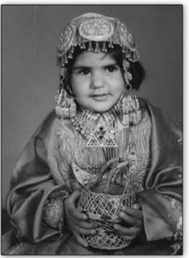

Chapter 6.indd 97 9/2/2022 12:52:44 PM

*D*ifferent kinds of social institutions, ranging from the family to the market, can bring people together, create strong collective identities and strengthen social cohesion, as you learnt in chapters 3 and 4. But, on the other hand, as chapters 4 and 5 showed, the very same institutions can also be sources of inequality and exclusion. In this chapter, you will learn about some of the tensions and difficulties associated with cultural diversity. What precisely does 'cultural diversity' mean, and why is it seen as a challenge?

The term 'diversity' emphasises *differences* rather than inequalities. When we say that India is a nation of great cultural diversity, we mean that there are many different types of social groups and communities living here. These are communities defined by cultural markers such as language, religion, sect, race or caste. When these diverse communities are also part of a larger entity like a nation, then difficulties may be created by competition or conflict between them.

This is why cultural diversity can present tough challenges. The difficulties arise from the fact that cultural identities are very powerful – they can arouse intense passions and are often able to moblise large numbers of people. Sometimes cultural differences are accompanied by economic and social inequalities, and this further complicates things. Measures to address the inequalities or injustices suffered by one community can provoke opposition from other communities. The situation is made worse when scarce resources – like river waters, jobs or government funds – have to be shared.

# 6.1 The Importance of Community Identity

Every human being needs a sense of stable identity to operate in this world. Questions like — Who am I? How am I different from others? How do others understand and comprehend me? What goals and aspirations should I have? – constantly crop up in our life right from childhood. We are able to answer many of these questions because of the way in which we are socialised, or taught how to live in society by our immediate families and our community in various senses. (Recall the discussion of socialisation in your Class XI textbooks.) The socialisation process involves a continuous dialogue, negotiation and even struggle against significant others (those directly involved in our lives) like our parents, family, kin group and our community. Our community provides us the language (our mother tongue) and the cultural values through which we comprehend the world. It also anchors our self-identity.

Community identity is based on birth and 'belonging' rather than on some form of acquired qualifications or 'accomplishment'. It is what we 'are' rather than what we have 'become'. We don't have to do anything to be born into a community – in fact, no one has any choice about which family or community or country they are born into. These kinds of identities are called 'ascriptive' – that is, they are determined by the birth and do not involve any choice on the part of the individuals concerned. It is an odd fact of social life that people feel a deep

Chapter 6.indd 98 9/2/2022 12:52:44 PM

sense of security and satisfaction in belonging to communities in which their membership is entirely accidental. We often identify so strongly with communities we have done noting to 'deserve' - passed no exam, demonstrated no skill or competence... This is very unlike belonging to, say, a profession or team. Doctors or architects have to pass exams and demonstrate their competence. Even in sports, a certain level of skill and performance are a necessary pre-condition for membership in a team. But our membership in our families or religious or regional communities is without preconditions, and yet it is total. In fact, most ascriptive identities are very hard to shake off; even if we choose to disown them, others may continue to identify us by those very markers of belonging.

Perhaps it is because of this accidental, unconditional and yet almost inescapable belonging that we can often be so emotionally attached to our community identity. Expanding and overlapping circles of community ties (family, kinship, caste, ethnicity, language, region or religion) give meaning to our world and give us a sense of identity, of who we are. That is why people often react emotionally or even violently whenever there is a perceived threat to their community identity.

A second feature of ascriptive identities and community feeling is that they are universal. Everyone has a motherland, a mother tongue, a family, a faith… This may not necessarily be strictly true of every individual, but it is true in a general sense. And we are all equally committed and loyal to our respective identities. Once again it is possible to come across people who may not be particularly committed to one or the other aspect of their identity. But the possibility of this commitment is potentially available to most people. Because of this, conflicts that involve our communities (whether of nation, language, religion, caste or region) are very hard to deal with. Each side in the conflict thinks of the other side as a hated enemy, and there is a tendency to exaggerate the virtues of one's own side as well as the vices of the other side. Thus, when two nations are at war, patriots in each nation see the other as the enemy aggressor; each side believes that God and truth are on their side. In the heat of the moment, it is very hard for people on either side to see that they are constructing matching but reversed mirror images of each other.

# **Communities, Nations and Nation-States**

At the simplest level, a nation is a sort of large-scale community – it is a community of communities. Members of a nation share the desire to be part of the same political collectivity. This desire for political unity usually expresses itself as the aspiration to form a *state*. In its most general sense, the term state refers to an abstract entity consisting of a set of political-legal institutions claiming control over a particular geographical territory and the people living in it. In Max Weber's well-known definition, a state is a "body that successfully claims a monopoly of legitimate force in a particular territory" (Weber 1970:78).

A nation is a peculiar sort of community that is easy to describe but hard to define. We know and can describe many specific nations founded on the basis of common cultural, historical and political institutions like a shared religion, **99**

Chapter 6.indd 99 9/8/2022 4:29:58 PM

language, ethnicity, history or regional culture. But it is hard to come up with any defining features, any characteristics that a nation must possess. For every possible criterion there are exceptions and counter-examples. For example, there are many nations that do not share a single common language, religion, ethnicity and so on. On the other hand, there are many languages, religions or ethnicities that are shared across nations. But this does not lead to the formation of a single unified nation of, say, all English speakers or of all Buddhists.

How, then, can we distinguish a nation from other kinds of communities, such as an ethnic group (based on common descent in addition to other commonalities of language or culture), a religious community, or a regionally-defined community? Conceptually, there seems to be no hard distinction – any of the other types of community can one day form a nation. Conversely, no particular kind of community can be guaranteed to form a nation.

The criterion that comes closest to distinguishing a nation is the state. Unlike the other kinds of communities mentioned before, nations are communities that have a state of their own. That is why the two are joined with a hyphen to form the term *nation-state*. Generally speaking, in recent times there has been a one-to-one bond between nation and state (one nation, one state; one state, one nation). But this is a new development. It was not true in the past that a single state could represent only one nation, or that every nation must have its own state. For example, when it was in existence, the Soviet Union explicitly recognised that the peoples it governed were of different 'nations' and more than one hundred such internal nationalities were recognised. Similarly, people constituting a nation may actually be citizens or residents of different states. For example, there are more Jamaicans living outside Jamaica than in Jamaica – that is, the population of 'non-resident' Jamaicans exceeds that of 'resident' Jamaicans. A different example is provided by 'dual citizenship' laws. These laws allow citizens of a particular state to also – simultaneously – be citizens of another state. Thus, to cite one instance, Jewish Americans may be citizens of Israel as well as the USA; they can even serve in the armed forces of one country without losing their citizenship in the other country.

In short, today it is hard to define a nation in any way other than to say that it is a community that has succeeded in acquiring a state of its own. Interestingly, the opposite has also become increasingly true. Just as would-be or aspiring nationalities are now more and more likely to work towards forming a state, existing states are also finding it more and more necessary to claim that they represent a nation. One of the characteristic features of the modern era (recall the discussion of modernity from Chapter 4 of your Class XI textbook, *Understanding Society)* is the establishment of democracy and nationalism as dominant sources

**100**

Chapter 6.indd 100 9/2/2022 12:52:45 PM

of political legitimacy. This means that, today, 'the nation' is the most accepted or proper justification for a state, while 'the people' are the ultimate source of legitimacy of the nation. In other words, states 'need' the nation as much or even more than nations need states.

But as we have seen in the preceding paragraphs, there is no historically fixed or logically necessary relationship between a nation-state and the varied forms of community that it could be based on. This means that there is no pre-determined answer to the question: How should the 'state' part of the nation-state treat the different kinds of community that make up the 'nation' part? As is shown in Box 6.1 (which is based on the United Nations Development Program (UNDP) report

## **Threatened by community identities, states try to eliminate cultural diversity**

**Box 6.1**

Historically, states have tried to establish and enhance their political legitimacy through nationbuilding strategies. They sought to secure … the loyalty and obedience of their citizens through policies of assimilation or integration. Attaining these objectives was not easy, especially in a context of cultural diversity where citizens, in addition to their identifications with their country, might also feel a strong sense of identity with their community – ethnic, religious, linguistic and so on. Most states feared that the recognition of such difference would lead to social fragmentation and prevent the creation of a harmonious society. In short, such identity politics was considered a threat to state unity. In addition, accommodating these differences is politically challenging, so many states have resorted to either suppressing these diverse identities or ignoring them on the political domain.

Policies of assimilation – often involving outright suppression of the identities of ethnic, religious or linguistic groups – try to erode the cultural differences between groups. Policies of integration seek to assert a single national identity by attempting to eliminate ethnonational and cultural differences from the public and political arena, while allowing them in the private domain. Both sets of policies assume a singular national identity.

Assimilationist and integrationist strategies try to establish singular national identities through various interventions like:

- Centralising all power to forums where the dominant group constitutes a majority, and eliminating the autonomy of local or minority groups;
- Imposing a unified legal and judicial system based on the dominant group's traditions and abolishing alternative systems used by other groups;
- Adopting the dominant group's language as the only official 'national' language and making its use mandatory in all public institutions;
- Promotion of the dominant group's language and culture through national institutions including state-controlled media and educational institutions;
- Adoption of state symbols celebrating the dominant group's history, heroes and culture, reflected in such things as choice of national holidays or naming of streets etc.;
- Seizure of lands, forests and fisheries from minority groups and indigenous people and declaring them 'national resources'…

**101**

*Source: Adapted from UNDP Human Development Report 2004, Ch.3, Feature 3.1*

Chapter 6.indd 101 9/8/2022 4:31:03 PM

of 2004 on Culture and Democracy), most states have generally been suspicious of cultural us cultural diversity and have tried to reduce or eliminate it. However, there are many successful examples – including India – which show that it is perfectly possible to have a strong nation-state without having to 'homogenise' different types of community identities into one standard type.

Box 6.1 speaks of 'assimilationist' and 'integrationist' policies. Policies that promote assimilation are aimed at persuading, encouraging or forcing all citizens to adopt a uniform set of cultural values and norms. These values and norms are usually entirely or largely those of the dominant social group. Other, non-dominant or subordinated groups in society are expected or required to give up their own cultural values and adopt the prescribed ones. Policies promoting integration are different in style but not in overall objective: they insist that the public culture be restricted to a common national pattern, while all 'non-national' cultures are to be relegated to the private sphere. In this case too, there is the danger of the dominant group's culture being treated as 'national' culture.

You can probably see what the problem is by now. There is no necessary relationship between any specific form of community and the modern form of the state. Any of the many bases of community identity (like language, religion, ethnicity and so on) may or may not lead to nation formation – there are no guarantees. But because community identities can act as the basis for nation-formation, already existing states see all forms of community identity as dangerous rivals. That is why states generally tend to favour a single, homogenous national identity, in the hope of being able to control and manage it. However, suppressing cultural diversity can be very costly in terms of the alienation of the minority or subordinated communities whose culture is treated as 'nonnational'. Moreover, the very act of suppression can provoke the opposite effect of intensifying community identity. So encouraging, or at least allowing, cultural diversity is good policy from both the practical and the principled point of view.

# **Cultural Diversity and India as a Nation-state**

The Indian nation-state is socially and culturally one of the most diverse countries of the world. It has a population of about 1.21 billion people, according to Census of India 2011, currently the second largest – and soon to become the largest – national population in the world. These billion-plus people speak about 1,632 different languages and dialects. As many as twenty two of these languages have been officially recognised and placed under the 8th Schedule of the Constitution, thus guaranteeing their legal status. In terms of religion, about 80% of the population are Hindus, who in turn are regionally specific, plural in beliefs and practices, and divided by castes and languages. About 14.2% of the population are Muslims, which makes India the world's second largest Muslim country after Indonesia and Pakistan. The other major religious communities are Christians (2.3%), Sikhs (1.7%), Buddhists (0.7%) and Jains (0.4%). Because of India's huge population, these small percentages can also add up to large absolute numbers.

Chapter 6.indd 102 9/2/2022 12:52:45 PM

In terms of the nation-state's relationship with community identities, the Indian case fits neither the assimilationist nor the integrationist model described in Box 6.1. From its very beginning the independent Indian state has ruled out an assimilationist model. However, the demand for such a model has been expressed by some sections of the dominant Hindu community. Although 'national integration' is a constant theme in state policy, India has not been 'integrationist' in the way that Box 6.1 describes. The Constitution declares the state to be a secular state, but religion, language and other such factors are not banished from the public sphere. In fact these communities have been explicitly

### **National unity with cultural diversity – Building a**

**Box 6.2**

### **democratic "state-nation''**

An alternative to the nation-state, then, is the "state nation", where various "nations"— be they ethnic, religious, linguistic or indigenous identities— can co-exist peacefully and cooperatively in a single state polity.

Case studies and analyses demonstrate that enduring democracies can be established in polities that are multicultural. Explicit efforts are required to end the cultural exclusion of diverse groups … and to build multiple and complementary identities. Such responsive policies provide incentives to build a feeling of unity in diversity — a "we" feeling. Citizens can find the institutional and political space to identify with both their country and their other cultural identities, to build their trust in common institutions and to participate in and support democratic politics. All of these are key factors in consolidating and deepening democracies and building enduring "state-nations".

India's constitution incorporates this notion. Although India is culturally diverse, comparative surveys of long-standing democracies including India show that it has been very cohesive, despite its diversity. But modern India is facing a grave challenge to its constitutional commitment to multiple and complementary identities with the rise of groups that seek to impose a singular Hindu identity on the country. These threats undermine the sense of inclusion and violate the rights of minorities in India today. Recent communal violence raises serious concerns for the prospects for social harmony and threatens to undermine the country's earlier achievements.

And these achievements have been considerable. Historically, India's constitutional design recognised and responded to distinct group claims and enabled the polity to hold together despite enormous regional, linguistic and cultural diversity. As evident from India's performance on indicators of identification, trust and support, its citizens are deeply committed to the country and to democracy, despite the country's diverse and highly stratified society. This performance is particularly impressive when compared with that of other long-standing—and wealthier democracies.

The challenge is in reinvigorating India's commitment to practices of pluralism, institutional accommodation and conflict resolution through democratic means. Critical for building a multicultural democracy is a recognition of the shortcomings of historical nation-building exercises and of the benefits of multiple and complementary identities. Also important are efforts to build the loyalties of all groups in society through identification, trust and support. National cohesion does not require the imposition of a single identity and the denunciation of diversity. Successful strategies to build "state-nations" can and do accommodate diversity constructively by crafting responsive policies of cultural recognition. They are effective solutions for ensuring the longer terms objectives of political stability and social harmony. **103**

*Source: Adapted from UNDP Human Development Report 2004, Ch.3, Feature 3.1*

Chapter 6.indd 103 11/18/2022 16:03:53

recognised by the state. By international standards, very strong constitutional protection is offered to minority religions. In general, India's problems have been more in the sphere of implementation and practice rather than laws or principles. But on the whole, India can be considered a good example of a 'state-nation' though it is not entirely free from the problems common to nation-states.

# 6.2 Regionalism in the Indian Context

Regionalism in India is rooted in India's diversity of languages, cultures, tribes, and religions. It is also encouraged by the geographical concentration of these identity markers in particular regions, and fuelled by a sense of regional deprivation. Indian federalism has been a means of accommodating these regional sentiments (Bhattacharyya 2005).

After Independence, initially the Indian state continued with the British-Indian arrangement dividing India into large provinces, also called 'presidencies'. (Madras, Bombay, and Calcutta were the three major presidencies; incidentally, all three cities after which the presidencies were named have changed their names recently). These were large multi-ethnic and multilingual provincial states constituting the major political-administrative units of a semi-federal state called the Union of India. Soon after the adoption of the Constitution, all these units of the colonial era had to be reorganised into ethno-linguistic States within the Indian union in response to strong popular agitations. (See Box 6.3.)

### **Linguistic States Helped Strengthen Indian Unity**

The Report of the States Reorganisation Commission (SRC) which was implemented on November 1, 1956, has helped transform the political and institutional life of the nation.

**Box 6.3**

The background to the SRC is as follows. In the 1920s, the Indian National Congress was reconstituted on lingusitic lines. Its provincial units now followed the logic of language –

one for Marathi speakers, another for Oriya speakers, etc. At the same time, Gandhi and other leaders promised their followers that when freedom came, the new nation would be based on a new set of provinces based on the principle of language. However, when India was finally freed in 1947, it was also divided. Now, when the

Chapter 6.indd 104 9/8/2022 4:31:44 PM

proponents of linguistic states asked for this promise to be redeemed, the Congress hesitated. Partition was the consequence of intense attachment to one's faith; how many more partitions would that other intense loyalty, language, lead to? So ran the thinking of the top Congress bosses including Nehru, Patel and Rajaji.

On the other side, the rank and fi le Congressmen were all for the redrawing of the map of India on the lines of language. Vigorous movements arose among Marathi and Kannada speakers, who were then spread across several different political regimes – the erstwhile Bombay and Madras presidencies, and former princely states such as Mysore and Hyderabad. However, the most militant protests ensued from the very large community of Telugu speakers. In October 1953, Potti Sriramulu, a former Gandhian, died seven weeks after beginning a fast unto death. Potti Sriramulu's martyrdom provoked violent protests and led to the creation of the state of Andhra Pradesh. It also led to the formation of the SRC, which in 1956 put the formal, fi nal seal of approval on the principle of linguistic states.

In the early 1950s, many including Prime Minister Jawaharlal Nehru feared that states based on language might hasten a further subdivision of India. In fact, something like the reverse has happened. Far from undermining Indian unity, linguistic states have helped strengthen it. It has proved to be perfectly consistent to be Kannadiga and Indian, Bengali and Indian, Tamil and Indian, Gujarati and Indian…

To be sure, these states based on language sometimes quarrel with each other. While these disputes are not pretty, they could in fact have been far worse. In the same year, 1956, that the SRC mandated the redrawing of the map of India on linguistic lines, the Parliament of Ceylon (as Sri Lanka was then known) proclaimed Sinhala the country's sole offi cial language despite protests from the Tamils of the north. One left-wing Sinhala MP issued a prophetic warning to the chauvinists. "One language, two nations", he said, adding: "Two languages, one nation".

The civil war that has raged in Sri Lanka since 1983 is partly based on the denial by the majority linguistic group of the rights of the minority. Another of India's neighbours, Pakistan, was divided in 1971 because the Punjabi and Urdu speakers of its western wing would not respect the sentiments of the Bengalis in the east.

It is the formation of linguistic states that has allowed India to escape an even worse fate. If the aspirations of the Indian language communities had been ignored, what we might have had here was – "One language, fourteen or fi fteen nations."

*Adapted from an article by* Ramachandra Guha *in the Times of India, 1 November 2006.*

Language coupled with regional and tribal identity – and not religion – has therefore provided the most powerful instrument for the formation of ethnonational identity in India. However, this does not mean that all linguistic communities have got statehood. For instance, in the creation of three new states in 2000, namely Chhatisgarh, Uttaranchal and Jharkhand, language did not play a prominent role. Rather, a combination of ethnicity based on tribal identity, language, regional deprivation and ecology provided the basis for intense regionalism resulting in statehood. Currently there are 28 States (federal units) and 8 Union territories (centrally administered) within the Indian nation-state.

**105**

105

Chapter 6.indd 105 25-01-2024 10:23:59

**Note:** In this chapter, the word "State" has a capital S when it is used to denote the federal units within the Indian nation-state; the lower case 'state' is used for the broader conceptual category.

*Couples from different regions 1880s to 1930s: Clockwise from top left corner: Gujarat; Tripura; Bombay; Aligarh; Hyderabad; Goa; Calcutta. From Malavika Karlekar, Visualising Indian Women 1875–1947,* Oxford University Press, New Delhi*.*

Respecting regional sentiments is not just a matter of creating States: this has to be backed up with an institutional structure that ensures their viability as relatively autonomous units within a larger federal structure. In India this is done by Constitutional provisions defining the powers of the States and the Centre. There are lists of 'subjects' or areas of governance which are the exclusive responsibility of either State or Centre, along with a 'Concurrent List' of areas where both are allowed to operate. The State legislatures determine the composition of the upper house of Parliament, the Rajya Sabha. In addition there are periodic committees and commissions that decide on Centre-State relations. An example is the Finance Commission which is set up every five years to decide on sharing of tax revenues between Centre and States. Upto 2017, each Five Year Plan also involved detailed State Plans prepared by the

106 **106**

Chapter 6.indd 106 08-04-2024 10:12:21

State Planning Commissions of each state. The Goods and Services Tax (GST) Council includes State members.

# 6.3 Religion-related Issues and Identities

Perhaps the most contentious of all aspects of cultural diversity are issues relating to religious communities and religion-based identities. These issues may be broadly divided into two related groups – the secularism– communalism set and the minority–majority set. Questions of secularism and communalism are about the state's relationship to religion and to political groupings that invoke religion as their primary identity. Questions about minorities and majorities involve decisions on how the state is to treat different religious, ethnic or other communities that are *unequal* in terms of numbers and/ or power (including social, economic and political power).

# **Minority Rights and Nation Building**

In Indian nationalism, the dominant trend was marked by an inclusive and democratic vision. Inclusive because

it recognised diversity and plurality. Democratic because it sought to do away with discrimination and exclusion and bring forth a just and equitable society. The term 'people' has not been seen in exclusive terms, as referring to any specific group defined by religion, ethnicity, race or caste. Ideas of humanism influenced Indian nationalists and the ugly aspects of exclusive nationalism were extensively commented upon by leading figures like Mahatma Gandhi and Rabindranath Tagore.

### **Rabindranath Tagore on the evils of exclusive nationalism**

…where the spirit of the Western nationalism prevails, the whole people is being taught from boyhood to foster hatred and ambitions by all kinds of means -- by the manufacture of half-truths and untruths in history, by persistent misrepresentation of other races and the culture of unfavourable sentiments towards them…Never think for a moment that the hurt you inflict upon other races will not infect you, or that the enemities you sow around your homes will be a wall of protection to you for all time to come? To imbue the minds of a whole people with an abnormal vanity of its own superiority, to teach it to take pride in its moral callousness and ill-begotten wealth, to perpetuate humiliation of defeated nations by exhibiting trophies won from war, and using these schools in order to breed in children's minds contempt for others, is imitating the West where she has a festering sore…

*Source: On Nationalism by* Rabindranath Tagore. First published in 1917, Reprint Edition of Macmillan, Madras 1930.

# **Activity 6.1**

Find out about the origins of your own State. When was it formed? What were the main criteria used to define it? – Was it language, ethnic/tribal identity, regional deprivation, ecological difference or other criterion? How does this compare with other States within the Indian nation-state? Try to classify all the States of India in terms of the criteria for their formation.

Are you aware of any current social movements that are demanding the creation of a State? Try to find out the criteria being used by these movements.

(Hint: Check the Vidarbha movements, and others in your region…)

**Box 6.4**

**107**

Chapter 6.indd 107 9/8/2022 4:36:11 PM

To be effective, the ideas of inclusive nationalism had to be built into the Constitution. For, as already discussed (in section 6.1), there is a very strong tendency for the dominant group to assume that their culture, language or religion is synonymous with the nation state. However, for a strong and democratic nation, special constitutional provisions are required to ensure the rights of all groups and those of minority groups in particular. A brief discussion on the definition of minorities will

A Kashmiri girl

enable us to appreciate the importance of safeguarding minority rights for a strong, united and democratic nation.

The notion of minority groups is widely used in sociology and is more than a merely numerical distinction – it usually involves some sense of relative disadvantage. Thus, privileged minorities such as extremely wealthy people are not usually referred to as minorities; if they are, the term is qualified in some way, as in the phrase 'privileged minority'. When minority is used without qualification, it generally implies a relatively small but also disadvantaged group. The sociological sense of minority also implies that the members of the minority form a collectivity – that is, they have a strong sense of group solidarity, a feeling of togetherness and belonging. This is linked to disadvantage because the experience of being subjected to prejudice and discrimination usually heightens feelings of intra-group loyalty and interests (Giddens 2001:248). Thus, groups that may be minorities in a statistical sense, such as people who are lefthanded or people born on 29th February, are not minorities in the sociological sense because they do not form a collectivity.

**108**

*Left Margin: Food from different parts of India; Right top: Child dressed in Kashmiri Clothes; Bottom: Dolls dressed in costumes of different Indian States.* 

Chapter 6.indd 108 9/2/2022 12:52:45 PM

However, it is possible to have anomalous instances where a minority group is disadvantaged in one sense but not in another. Thus, for example, religious minorities like the Parsis or Sikhs may be relatively well-off economically. But they may still be disadvantaged in a cultural sense because of their small numbers relative to the overwhelming majority of Hindus. Religious or cultural minorities need special protection because of the demographic dominance of the majority.

### **Relative size and distribution of religious minorities**

As is well known, Hindus constitute an overwhelming majority in India: they number about 966 millions and account for 80% of the total population according to the

**Box 6.5**

2011 Census. The Hindu population is *four times larger* than the combined population of all other minority religions, and about *six times larger* than the largest minority group, the Muslims. However, this can also be misleading because Hindus are not a homogenous group and are divided by caste – as indeed are all the other major religions, albeit to different extent.

The Muslims are by far the largest religious minority in India – they numbered 172 millions and were 14.2% of the population in 2011. They are scattered all over the country, constitute a majority in Jammu and Kashmir and have sizeable pockets in West Bengal, Uttar Pradesh, Kerala, Andhra Pradesh, Karnataka and Rajasthan.

Christians constitute around 2.3% of the population (27.8 million) and are scattered all over, with sizeable pockets in the north eastern and southern states. The three Christian-majority states are all in the North East – Nagaland (88%), Mizoram (87%) and Meghalaya (74%). Sizeable proportions of Christians are also found in Goa (25%) and Kerala (18.4%).

The Sikhs constitute 1.7% of the population (21 million) and although they are found scattered across the country, they are concentrated in Punjab where they are in a majority (58%).

There are also several other small religious groups – Buddhists (8 million, 0.7%), Jains (4.5 million, 0.4%), and 'Other Religions and Persuasions' (under 8 million, 0.7%). The highest proportion of Buddhists is found in Sikkim (27%) and Arunachal Pradesh (12%), while among the larger states Maharashtra has the highest share of Buddhists at 6%. The highest concentrations of Jains are found in Maharashtra (1.3%), Delhi and Gujarat nearly 1 per cent each.

In the long years of struggle against British colonialism, Indian nationalists understood the imperative need to recognise and respect India's diversity. Indeed 'unity in diversity' became a short hand to capture the plural and diverse nature of Indian society. Discussions on minority and cultural rights mark many of the deliberations of the Indian National Congress and find final expression in the Indian Constitution (Zaidi 1984).

The makers of the Indian Constitution were aware that a strong and united nation could be built only when all sections of people had the freedom to practice their religion, and to develop their culture and language. Dr. B.R. Ambedkar, the chief architect of the Constitution, made this point clear in the Constituent Assembly, as shown in Box 6.7.

In the last three decades we have witnessed how non-recognition of the rights of different groups of people in a country can have grave implications for **109**

Chapter 6.indd 109 9/2/2022 12:52:45 PM

**Box 6.6**

### **Dr. Ambedkar on protection of minorities**

To diehards who have developed a kind of fanaticism against minority protection I would like to say two things. One is that *minorities are an explosive force which,* 

*if it erupts, can blow up the whole fabric of the state.* The history of Europe bears ample and appalling testimony to this fact. The other is that the minorities in India have agreed to place their existence in the hands of the majority. In the history of negotiations for preventing the partition of Ireland, Redmond said to Carson "Ask for any safeguard you like for the Protestant minority but let us have a United Ireland." Carson's reply was "Damn your safeguards, we don't want to be ruled by you." No minority in India has taken this stand.

[John Redmond, Catholic majority leader; Sir Edward Carson, Protestant minority leader] *(Source: Constituent Assembly Debates 1950: 310-311, cited in Narang 2002:63)*

### **Bhimrao Ramji Ambedkar (1891-1956)**

Bhimrao Ramji Ambedkar Buddhist revivalist, jurist, scholar and political leader, is the chief architect of the Indian Constitution. Born in a poor untouchable community, he spent his life fighting against untouchability and the caste system.

*Old Parliament New Parliament*

national unity. One of key issues that led to the formation of Bangladesh was the unwillingness of the Pakistani state to recognise the cultural and linguistic rights of the people of Bangladesh. One of the many contentious issues that formed the backdrop of the ethnic conflict in Sri Lanka was the imposition of Sinhalese as a national language. Likewise any forcible imposition of a language or religion on any group of people in India weakens national unity which is based upon a recognition of differences. Indian nationalism recognises this, and the Indian Constitution affirms this (Box 6.8).

Finally, it is useful to note that minorities exist everywhere, not just in India. In most nation-states, there tend to be a dominant social group whether cultural, ethnic, racial or religious. Nowhere in the world is there a nation-state consisting exclusively of a single homogenous cultural group. Even where this was almost true (as in countries like Iceland, Sweden or South Korea), modern capitalism, colonialism and large scale migration have brought in a plurality of groups. Even the smallest state will have minorities, whether in religious, ethnic, linguistic or racial terms.

Chapter 6.indd 110 26-03-2024 13:48:56

### **The Indian Constitution on minorities and cultural diversity**

### **Article 29:**

- (1) Any section of the citizens residing in the territory of India or any part there of having a distinct language, script or culture of its own shall have the right to conserve the same.
- (2) No citizen shall be denied admission into any educational institution maintained by the State or received out of State funds on grounds only of religion, race, caste, language or any of them.

#### **Article 30:**

- (1) All minorities, whether based on religion or language, shall have the right to establish and administer educational institutions of their choice.
- (2) The State shall not, in granting aid to educational institutions, discriminate against any educational institution on the ground that it is under the management of a minority, whether based on religion or language.

# **Communalism, Secularism and the Nation-state**

## **Communalism**

In everyday language, the word '**communalism**' refers to aggressive chauvinism based on religious identity. Chauvinism itself is an attitude that sees one's own group as the only legitimate or worthy group, with other groups being seen – by definition – as inferior, illegitimate and opposed. Thus, to simplify further, communalism is an aggressive political ideology linked to religion. This is a peculiarly Indian, or perhaps South Asian, meaning that is different from the sense of the ordinary English word. In the English language, "communal" means something related to a community or collectivity as different from an individual. The English meaning is neutral, whereas the South Asian meaning is strongly charged. The charge may be seen as positive – if one is sympathetic to communalism – or negative, if one is opposed to it.

*Images of different religious places Source: https://incredibleindia.org/content/incredible-india-v2/en/destinations/delhi/jama-masjid.html https://www.goa.gov.in/places/rachol-seminory/, https://amritsar.nic.in/gallery/golden-temple/*

**111**

**Box 6.7**

Chapter 6.indd 111 28-03-2024 12:53:58

It is important to emphasise that communalism is about politics, not about religion. Although communalists are intensely involved with religion, there is in fact no necessary relationship between personal faith and communalism. A communalist may or may not be a devout person, and devout believers may or may not be communalists. However, all communalists do believe in a *political identity*  based on religion. The key factor is the attitude towards those who believe in other kinds of identities, including other religion-based identities. Communalists cultivate an aggressive political identity, and are prepared to condemn or attack everyone who does not share their identity.

One of the characteristic features of communalism is its claim that religious identity overrides everything else. Whether one is poor or rich, whatever one's occupation, caste or political beliefs, it is religion alone that counts. All Hindus are the same as are all Muslims, Sikhs and so on. This has the effect of constructing large and diverse groups as singular and homogenous.

Communalism is an especially important issue in India because it has been a recurrent source of tension and violence. India has had a history of communal riots from pre-Independence times, often as a result of the divide-and-rule policy adopted by the colonial rulers. But colonialism did not invent intercommunity conflicts – there is also a long history of pre-colonial conflicts – and it certainly cannot be blamed for post-independence riots and killings. Indeed, if we wish to look for instances of religious, cultural, regional or ethnic conflict they can be found in almost every phase of our history. But we should not forget that we also have a long tradition of religious pluralism, ranging from peaceful co-existence to actual inter-mixing or syncretism. This syncretic heritage is clearly evident in the devotional songs and poetry of the Bhakti and Sufi movements (Box 6.9). In short, history provides us with both good and bad examples; what we wish to learn from it is up to us.

| Kabir Das – A Lasting Symbol of Syncretic Traditions | Box 6.8 |
| --- | --- |
| The poems of Kabir, synthesising Hindu and Muslim devotion are |  |
| cherished symbols of pluralism: |  |
| Moko Kahan Dhundhe re Bande | Where do you search for me? |
| Mein To Tere Paas Mein | I am with you |
| Na Teerath Mein, Na Moorat Mein | Not in pilgrimage, nor in icons |
| Na Ekant Niwas Mein | Neither in solitude |
| Na Mandir Mein, Na Masjid Mein | Not in temples, nor in mosques |
| Na Kabe Kailas Mein | Neither in Kaaba nor in Kailash |
| Mein To Tere Paas Mein Bande | I am with you o man |
| Mein To Tere Paas Mein… | I am with you … |

Chapter 6.indd 112 13-03-2024 17:05:03

### **Secularism**

**Secularism** is among the most complex terms in social and political theory. In the western context the main sense of these terms has to do with the separation of church and state. The separation of religious and political authority marked a major turning point in the social history of the west. This separation was related to the process of "secularisation", or the progressive retreat of religion from public life, as it was converted from a mandatory obligation to a voluntary personal practice. Secularisation in turn was related to the arrival of modernity and the rise of science and rationality as alternatives to religious ways of understanding the world.

The Indian meanings of secular and secularism include the western sense but also involve others. The most common use of secular in everyday language is

# **Activity 6.2**

Talk to your parents and the elders in your family and collect from them poems, songs, short stories which highlight issues such as religious pluralism, syncretism or communal harmony. When you have collected all this material and presented them in class, you may be pleasantly surprised to learn how broad based our traditions of religious pluralism are, and how widely they are shared across different linguistic groups, regions and religions.

as the opposite of communal. So, a secular person or state is one that does not favour any particular religion over others. Secularism in this sense is the opposite of religious chauvinism and it need not necessarily imply hostility to religion as such. In terms of the state-religion relationship, this sense of secularism implies equal respect for all religions, rather than separation or distancing. For example, the secular Indian state declares public holidays to mark the festivals of all religions.

Some complications have been created by the tension between the Indian state's simultaneous commitment to secularism along with the protection of minorities. The protection of minorities requires that they be given special consideration in a context where the normal working of the political system places them at a disadvantage vis-à-vis the majority community. But providing such protection immediately invites the accusation of favouritism or 'appeasement' of minorities. Opponents argue that secularism of this sort is only an excuse to favour the minorities in return for their votes or other kinds of support. Supporters argue that without such special protection, secularism can turn into an excuse for imposing the majority community's values and norms on the minorities.

# 6.4 State and Civil Society

You may have noticed that much of this chapter has been concerned with the state. The **state** is indeed a very crucial institution when it comes to the management of cultural diversity in a nation. Although it claims to represent the nation, the state can also become somewhat independent of the nation and its people. To the extent that the state structure – the legislature, bureaucracy, judiciary, armed forces, police and other arms of the state – becomes insulated from the people, it also has the potential of

**113**

Chapter 6.indd 113 9/2/2022 12:52:46 PM

turning authoritarian. An authoritarian state is the opposite of a democratic state. It is a state in which the people have no voice and those in power are not accountable to anyone. Authoritarian states often limit or abolish civil liberties like freedom of speech, freedom of the press, freedom of political activity, right to protection from wrongful use of authority, right to the due processes of the law, and so on. Apart from **authoritarianism**, there is also the possibility that state institutions become unable or unwilling to respond to the needs of the people because of corruption, inefficiency, or lack of resources. In short, there are many reasons why a state may not be all that it should be. Non-state actors and institutions become important in this context, for they can keep a watch on the state, protest against its injustices or supplement its efforts.

Civil society is the name given to the broad arena which lies beyond the private domain of the family, but outside the domain of both state and market. Civil society is the non-state and non-market part of the public domain in which individuals get together voluntarily to create institutions and organisations. It is the sphere of active citizenship: here, individuals take up social issues, try to influence the state or make demands on it, pursue their collective interests or seek support for a variety of causes. It consists

### **Forcing the State to Respond to the People:**

**Box 6.9**

**The Right to Information Act**

The Right to Information Act 2005 (Act No. 22/2005) is a law enacted by the Parliament of India giving Indians access to Government records. Under the terms of the Act, any person may request information from a "public authority" (a body of Government or instrumentality of State) which is expected to reply expeditiously or within thirty days. The Act also requires every public authority to computerise their records for wide dissemination and to proactively publish certain categories of information so that the

citizens need minimum recourse to request for information formally.

This law was passed by Parliament on 15 June 2005 and came into force on 13 October 2005. Information disclosure in India was hitherto restricted by the Official Secrets Act 1923 and various other special laws, which the new RTI Act now overrides.

The Act specifies that citizens have a right to:

- request any information (as defined)
- take copies of documents

**114**

- inspect documents, works and records
	- take certified samples of materials of work.
	- obtain information in the form of printouts, diskettes, floppies, tapes, video cassettes or in any other electronic mode.

Chapter 6.indd 114 9/2/2022 12:52:46 PM

of voluntary associations, organisations or institutions formed by groups of citizens. It includes political parties, media institutions, trade unions, non-governmental organisations (NGOs), religious organisations, and other kinds of collective entities. The main criteria for inclusion in civil society are that the organisation should not be state-controlled, and it should not be a purely commercial profit-making entity.

Today the activities of civil society organisations have an even wider range, including advocacy and lobbying activity with national and international agencies as well as active participation in various movements. The issues taken up are diverse, ranging from tribal struggles for land rights, devolution in urban governance, campaigns against rape and violence against women, rehabilitation of those displaced by dams and other developmental projects, fishermen's struggles against mechanised fishing,

# **Activity 6.3**

Find out about the civil society organisations or NGOs that are active in your neighbourhood. What sorts of issues do they take up? What sort of people work in them? How and to what extent are these organisations different from a) government

- organisations; b) commercial
	- organisations?

rehabilitation of hawkers and pavement dwellers, campaigns against slum demolitions and for housing rights, primary education reform, distribution of land to dalits, and so on. Civil liberties organisations have been particularly important in keeping a watch on the state and forcing it to obey the law. The media, too, has taken an increasingly active role, specially its emergent visual and electronic segments.

Among the most significant recent initiatives is the campaign for the Right to Information. Beginning with an agitation in rural Rajasthan for the release of information on government funds spent on village development, this effort grew into a nation-wide campaign. Despite the resistance of the bureaucracy, the government was forced to respond to the campaign and pass a new law formally acknowledging the citizens' right to information (Box 6.9). Examples of this sort illustrate the crucial importance of civil society in ensuring that the state is accountable to the nation and its people.

- 1. What is meant by cultural diversity? Why is India considered to be a very diverse country?
- 2. What is community identity and how is it formed?
- 3. Why is it difficult to define the nation? How are nation and state related in modern society?
	- 4. Why are states often suspicious of cultural diversity?
	- 5. What is regionalism? What factors is it usually based on?

Questions **115**

Chapter 6.indd 115 9/8/2022 4:38:31 PM

- 6. In your opinion, has the linguistic reorganisation of states helped or harmed India?
- 7. What is a 'minority'? Why do minorities need protection from the state?
- 8. What is communalism?
- 9. What are the different senses in which 'secularism' has been understood in India?
- 10. What is the relevance of civil society organisations today?

#### **REFERENCES**

Bhargava, Rajeev. 1998. 'What is Secularism for?', in Bhargava, Rajeev. ed. *Secularism and its Critics*. Oxford University Press. New Delhi.

Bhargava, Rajeev. 2005. *Civil Society, Public Sphere and Citizenship*. Sage Publications. New Delhi.

Bhattacharyya, Harihar. 2005. *Federalism and Regionalism in India: Institutional Strategies and Political Accommodation of Identities.* working paper No. 27, South Asia Institute, Dept of Political Science. University of Heidelberg, Heidelberg.

Brass, Paul. 1974. *Language, Religion and Politics in North India*. Vikas Publishing House. Delhi.

Chandra, Bipan. 1987. *Communalism in Modern India.* Vikas Publishing House. New Delhi.

Miller, David. 1995. *On Nationality.* Clarendon Press. Oxford.

Sheth, D.L. 1999. 'The Nation-State and Minority Rights', in Sheth, D.L. and Mahajan, Gurpreet. ed. *Minority Identities and the Nation-State*. Oxford University Press. New Delhi.

Chapter 6.indd 116 9/2/2022 12:52:46 PM

