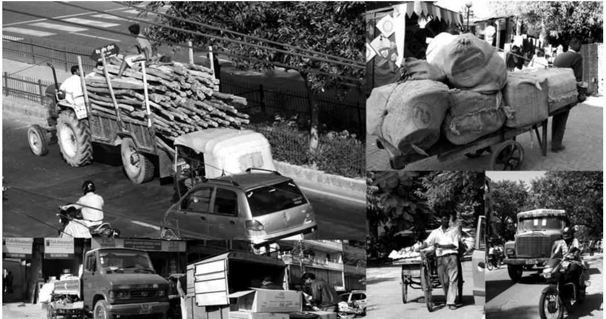
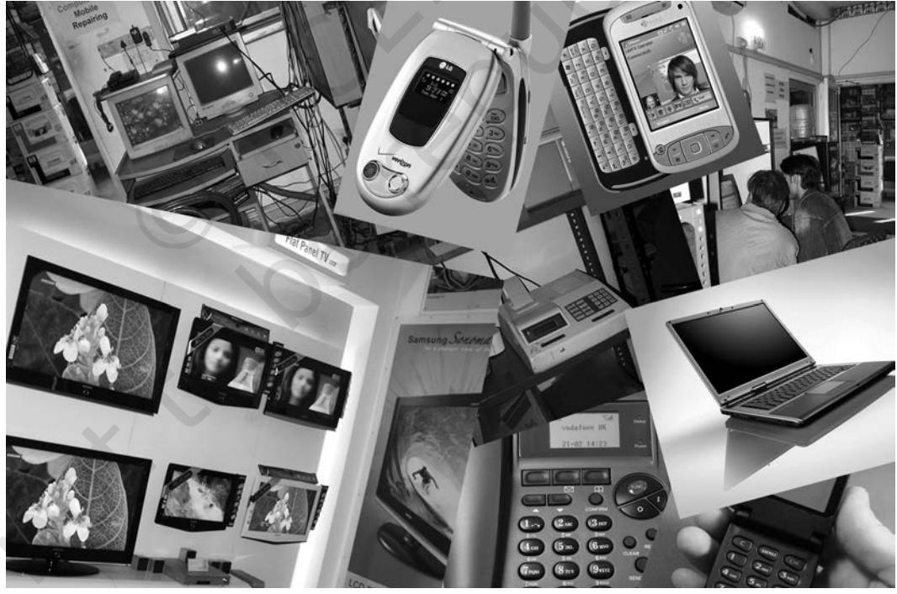
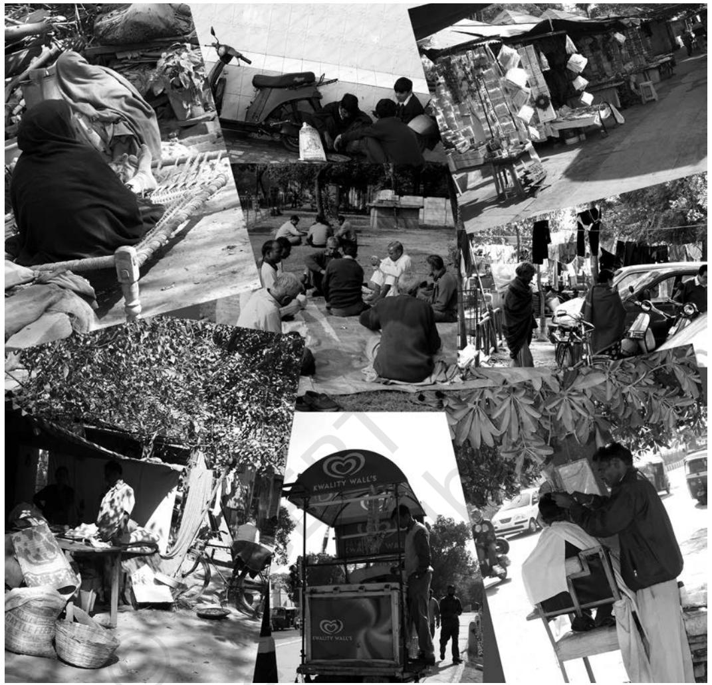
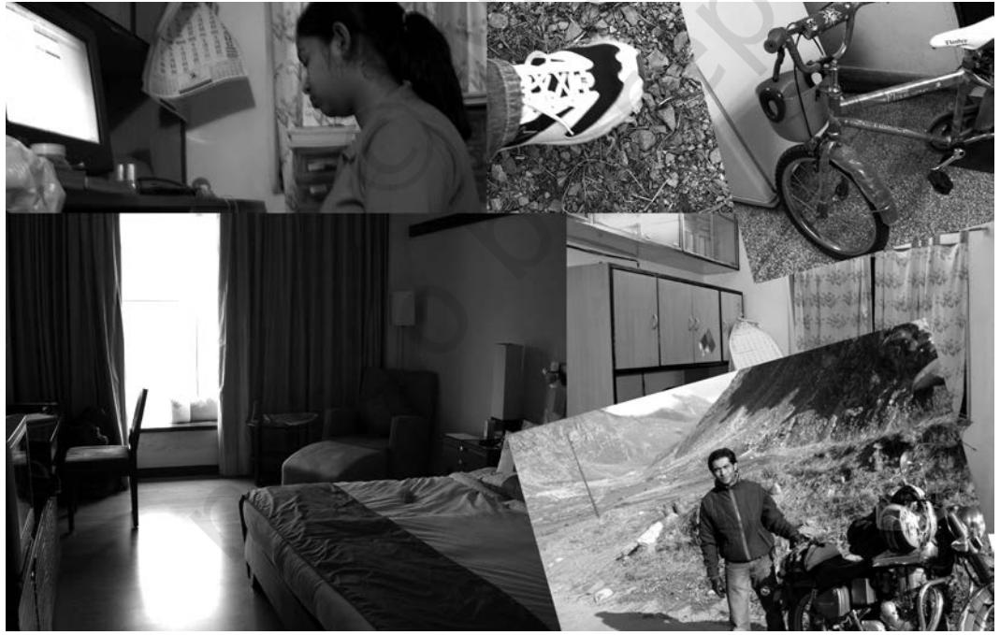

**117**

Chapter 7.indd 117 9/2/2022 2:39:23 PM

*T*his chapter suggests some small practical research projects that you can try out. There is a big difference between reading about research and actually doing it. Practical experience of trying to answer a question and collecting evidence systematically is a very valuable experience. This experience will hopefully introduce you to the excitement and also some of the difficulties of sociological research. Before you read this chapter, please refer once again to Chapter 5 ("Doing Sociology: Research Methods") in the Class XI textbook, *Introducing Sociology*.

The projects suggested here have tried to anticipate the potential problems of organising this kind of activity for large number of students in different kinds of schools located in different kinds of contexts. These are intended just to give you a feel for research. A "real" research project would obviously be more elaborate and involve much more time and effort than is possible in your setting. These are meant as suggestions; feel free to think up ideas of your own in consultation with your teachers.

Every research question needs an appropriate or suitable research method. A given question may be answered with more than one method, but a given research method is not necessarily appropriate for all questions. In other words, for most research questions one has a choice of possible methods but this choice is usually limited. One of the first tasks of the researcher – after carefully specifying the research question – is to select a suitable method. This selection must be done not only according to technical criteria (i.e., the degree of compatibility between question and method), but also practical considerations. These latter might include the amount of time available to do the research; the resources available in terms of both people and materials; the circumstances or situations in which it has to be done, and so on.

For example, let us suppose you are interested in comparing co-educational schools with 'boys only' or 'girls only' schools. This, of course, is a broad topic. You must first formulate a specific question that you want to answer. Examples could be: Do students in co-educational schools do better in studies than students in boys/girls only schools? Are boys only schools always better than co-educational schools in sports? Are children in single sex schools happier than children in co-educational schools, or some other such question. Having decided on a specific question, the next step is to choose the appropriate method.

For the last question, 'Are school children in single sex schools happier?', for example, you could choose to interview students of different kinds of schools. In the interview you could ask them directly how they felt about their school. You could then analyse the answers you collect to see if there is any difference between those who attend different kinds of schools. As an alternative, you could try to use a different method – say that of direct observation – to answer the research question. This means that you would have to spend time in co-educational and boys/girls schools, observing how students behave. You would have to decide on some criteria by which you could say if students are

**118**

Chapter 7.indd 118 9/2/2022 2:39:23 PM

more or less happy with their school. So, after observing different kinds of schools for sufficient time, you could hope to answer your question. A third method you could use is the survey method. This would involve preparing a questionnaire designed to get information on how students felt about their schools. You would then distribute the questionnaire to an equal number of students in each kind of school. You would then collect the filled-in questionnaires and analyse the results.

Here are some examples of some practical difficulties that you might face when doing research of this kind. Suppose you decide to do a survey. You must first make enough copies of the questionnaire. This involves time, effort and money. Next, you may need permission from teachers to distribute the questionnaire to students in their classrooms. You may not get permission the first time, or you may be asked to come back later….. After you have distributed the questionnaire you may find that many people have not bothered to return it to you or have not answered all questions, or other such problems. You then have to decide how to deal with this – go back to your respondents and ask them to complete the questionnaires; or ignore the incomplete questionnaires and consider only the complete ones; consider only the completed answers, and so on. You must be prepared to deal with such problems during research work.

### 7.1 Variety of Methods

You may remember the discussion of research methods in Chapter 5 of the Class XI textbook, *Introducing Sociology*. This may be a good time to revisit this chapter and refresh your memory.

### **Survey Method**

A survey usually involves asking a relatively large number of people (such as 30, 100, 2000, and so on; what is considered 'large' depends on the context and the kind of topic) the same fixed set of questions. The questions may be asked by an investigator in person where they are read out to the respondent, and his/her answers are noted down by the investigator. Or the questionnaire may be handed over to the respondents who then fill it up themselves and give it back. The main advantage of the survey is that it can cover a lot of people, so that the results are truly representative of the relevant group or population. The disadvantage is that the questions to be asked are already fixed. No on-the-spot adjustments are possible. So, if a question is misunderstood by the respondents, then wrong or misleading results can be produced. If a respondent says something interesting then this cannot be followed up with further questions on the subject because you have to stick to the questionnaire format. Moreover, questionnaires are like a snapshot taken at one particular moment. The situation may change later or may have been different before, but the survey wouldn't capture this.

Chapter 7.indd 119 9/2/2022 2:39:23 PM

#### **Interviews**

An interview is different from a survey in that it is always conducted in person and usually involves much fewer persons (as few as 5, 20, or 40, usually not much more than that). Interviews may be *structured*, that is, follow a pre-determined pattern of questions or *unstructured*, where only a set of topics is pre-decided, and the actual questions emerge as part of a conversation. Interviews may be more or less *intensive*, in the sense that one may interview a person for a long time (2–3 hours) or in repeated visits to get a really detailed version of their story.

Interviews have the advantage of being flexible in that promising topics may be pursued in greater detail, questions may be refined or modified along the way, and clarifications may be sought. The disadvantage of the interview method is that it cannot cover a large number of people and is limited to presenting the views of a select group of individuals.

#### **Observation**

Observation is a method where the researcher must systematically watch and record what is happening in whatever context or situation that has been chosen for the research. This sounds simple but may not always be easy to do in practice. Careful attention has to be paid to what is happening without pre-judging what is relevant to the study and what is not. Sometimes, what is *not* happening is as important or interesting as what does actually happen. For example, if your research question is about how different classes of people use specific open spaces, then it is significant that a given class or group of people (say poor people, or middle class people for example) never enter the space, or are never seen in it.

#### **Combinations of More Than One Method**

You can also try to combine methods to approach the same research question from different angles. In fact, this is often highly recommended. For example, if you are researching the changing place of mass media sources like newspapers and television in social life, you could combine a survey with archival methods. The survey will tell you about what is happening today, while the archival methods might tell you about what magazines, newspapers or television programmes were like in the past.

# 7.2 Possible themes and subjects for small

#### research projects

Here are some suggestions about possible research topics; you can always choose other topics in consultation with your teachers. Remember that these

**120**

Chapter 7.indd 120 9/2/2022 2:39:23 PM

are only topics – you need to select specific *questions* based on these topics. Remember also that most methods can be used with most of these topics, but that the specific question chosen must be suitable for the method chosen. You can also use combinations of methods. The topics are in no particular order. Topics that are not obviously or directly derived from your textbooks have been emphasised because it will be easier for you and your teachers to think of your own project related to the texts.

## **1. Public Transport**

What part does it play in people's lives? Who needs it? Why do they need it? To what degree are different types of people dependent on public transport? What sorts of problems and issues are associated with public transport? How have forms of public transport been changing over time? Does differential access to public transport cause social problems? Are there groups who do not need public transport? What is their attitude towards it? You could also take up the case of a particular form of transport – say the tonga, or the rickshaw, or the train – and write about its history in relation to your town or city. What are the changes this mode of transport has gone through? Who have been its main rivals? Is the competition with rivals being lost or won? For what reasons? What is the likely future of this mode of transport? Will anyone miss it?

If you live in Delhi, try to find out more about the Delhi Metro. Could you write a science-fiction like account of what the Metro would be like fifty years from now, in, say 2050 or 2060? (Remember, it is not easy to write good science fiction! You must give reasons for the things you imagine; these future things must be related in some coherent fashion to things/relations/situations that exist in the present. So you would have to imagine how public transport will evolve given present conditions, and what the role of the Metro would be in future compared to what it is now.)

**121**

Chapter 7.indd 121 9/2/2022 2:39:24 PM

### **2. Role of Communication Media in Social Life**

Communication media could include the mass media, like newspapers, television, films, internet and so on – i.e., media which convey information and are seen/accessed by large numbers of people. It could also include the media that people use for communicating with each other, such as the telephone, letters, mobile phones, email and internet. In these areas, you could try to investigate, for example, the changing place of mass media in social life and the shifts within major formats like print, radio, television, and so on. At a different level, you could try to ask a different sort of question about the likes and dislikes of particular groups (classes, age groups and genders) regarding films, books etc. How do people perceive the new communication media (like mobile phones, or internet) and their impact? What can we learn through observation and inquiry about their place in people's lives? Observation allows you to capture the divergence (if any) between stated views and actual behaviour. (How many hours do people really watch television, as different from how many hours they feel they watch, or feel is appropriate to watch etc..) What are some of the consequences of shift in format? (For example, has TV really reduced the importance of radio and newspapers, or does each format still have its own special niche?) What are the reasons why people prefer one or the other format?

Alternatively, you could think of doing any number of projects based on a content analysis of the media (newspapers, magazines, television etc.) and how they have treated particular themes or subjects, such as, for example, schools and school education, the environment, caste, religious conflicts, sports events, local versus national or regional news, etc.

**122**

Chapter 7.indd 122 9/2/2022 2:39:24 PM

### **3. Household Appliances and Domestic Work**

This refers to all the devices used to do work in the household, such as gas, kerosene or other type of stoves; mixies, grinders and food processors of various kinds; the electric or other kind of iron for ironing clothes; washing machines; ovens; toaster; pressure cooker, and so on. How has work within the household changed over time? Has the coming of these devices changed the nature of work and specially the intra-household division of labour? Who are the people who use these devices? Are they mostly men or women, young or old, paid or unpaid workers? How do the users feel about them? Have they really made work easier? Have there been any changes in the age-related jobs done within the household? (i.e., do younger/older people do different kinds of jobs now as compared to earlier?)

Alternatively, you could simply concentrate on how the domestic tasks are distributed within the household – who does what, and whether there have been changes lately.

**123**

Chapter 7.indd 123 9/2/2022 2:39:24 PM

#### **4. The Use of Public Space**

This research topic is about the different uses to which public space (such as an open field, the roadside or footpath, empty plots in housing colonies, space outside public offices, and the like) is put. For example, some spaces support a lot of small scale commercial activity like roadside vendors, small temporary shops and parking lots etc. Other spaces seem empty but get used in different ways – to hold marriage or religious functions, for public meetings, as a dumping ground for various kinds of things… Many spaces are occupied by poor homeless people and become in effect their homes. Try to think of research questions in this general area: What do people from different classes (e.g., the poor, middle classes, affluent people etc.) feel about the use of public space? What kind of a resource do they represent for these groups? How has the use of a particular open space in your neighbourhood been changing over time? Has it generated any conflicts or frictions? What are the reasons for this conflict?

**124**

Chapter 7.indd 124 9/2/2022 2:39:24 PM

### **5. Changing Aspirations of Different Age Groups**

Did you always have the same ambitions throughout your life? Most people change their goals, specially at young ages. This research topic tries to discover what these changes are and whether there are any patterns to the changes across different groups. You could try choosing research groups such as different age groups (e.g., Classes V, VIII and XI) in different kinds of schools; different genders; different parental backgrounds, etc., and see if any patterns emerge. You could also include adults in your research design and see what they remember about these sorts of changes, and whether there is any pattern to changes after school as compared to changes within the school-going age.

#### **6. The 'Biography' of a Commodity**

Think of a particular consumption item in your own home, such as a television set, a motor cycle, a carpet or a piece of furniture. Try to imagine what the life-history of that commodity would be. Write about it as though you were that commodity and were writing an 'autobiography'. What are the circuits of exchange through which it has moved to get to where it is now? Can you trace the social relations through which the item was produced, traded, and purchased? What is its symbolic significance, for its owners – i.e. for you, your family, for the community?

If it could think and talk, what would your television set (or sofa set, or motorcyle…) have to say about the people it meets or sees (like your family or other families or households that you can imagine)?

**125**

Chapter 7.indd 125 9/8/2022 4:41:18 PM

| RESEARCH |  | TYPE OF RESEARCH METHOD / TECHNIQUE |
| --- | --- | --- |
| TOPIC / AREA |  |  |
|  | OBSERVATION | SURVEY |
| Modes of Public | Modes of behaviour, | Opinions on |
| Transport; Local | expected etiquette, | changes over |
| Railway or Bus Station | space sharing | time; experiences, |
|  |  | difficulties etc. |
| Domestic Appliances | Patterns of use; | Attitudes/memories |
| (Use of cooking fuel/ | domestic division | relating to different |
| mode; fan, cooler, ac; | of labour; gender | type of appliances |
| iron; fridge; mixie...) | aspects |  |
| Use of Public Spaces | Observe how | Opinions of a cross |
| (roadside, empty land, | comparable open | section of people |
| etc) | spaces are used in | on different uses |
|  | different localities | of specific public |
|  |  | spaces |
| Changing Aspirations | Not suitable | Boys and Girls |
| of School Children |  | Adults of different |
| at different ages (e.g. |  | generations (from |
| Classes 5, 8, 11) |  | memory) |
| Place of the means | Watch how people | How much TV |
| of communication in | use mobile phones in | do different kind |
| social life (from mobile | public – what place | of people watch, |
| phones to satellite TV) | do these devices have | and what are |
|  | in their lives? | their preferred |
|  |  | programmes? |

Chapter 7.indd 126 9/2/2022 2:39:24 PM

| TYPE OF RESEARCH METHOD / TECHNIQUE |  |  |
| --- | --- | --- |
| ARCHIVAL | INTERVIEWS | COMMENTS / SUGGESTIONS |
| Newspaper and other sources for history of | Views of regular vs. occasional users; | Suitable only for biggish cities? |
| change | men vs. women, etc. |  |
| Advertisement | How do different type | Boys to be |
| patterns for different | of people respond to | encouraged to do |
| kinds of appliances | specific appliances? | this; should not |
|  |  | become a 'girl's topic' |
| What were the | Do people of different | Best to take familiar, |
| different uses to | social classes, groups | specific places that |
| which a particular | have different views | people know about |
| space was put over | on use of space? | and relate to |
| the years? |  |  |
| Depends on | Talk to one group | Interviewees should |
| availability of | about their own | not be from own |
| material from the | evolution; or talk to | school |
| past (such as school | different age groups |  |
| essays on this |  |  |
| subject) |  |  |
| Analysis of media | What do people feel | Try not to pre-judge |
| coverage and content | about the decline of | the issue (e.g. it is so |
| on any current issue | letter writing after the | sad that letter writing |
| of interest | coming of phones? | has declined) – ask, |
|  |  | don't tell. |

**127**

Chapter 7.indd 127 9/8/2022 4:41:45 PM

**128**

Chapter 7.indd 128 9/2/2022 2:39:24 PM

#### **Glossary**

**Arithmetic progression:** See 'progression - arithmetic'

- **Assimilation:** A process of cultural unification and homogenisation by which newly entering or subordinate groups lose their distinctive culture and adopt the culture of the dominant majority. Assimilation may be forced or voluntary, and usually remains incomplete or blocked where the subordinate or entering group is not accorded full membership on equal terms. For example, if an immigrant community is discriminated against by the dominant majority, and is not allowed to intermarry.
- **Authoritarianism:** A system of government that does not derive its legitimacy from the people. Not a democratic or republican form of government.
- **Birth Control:** The use of techniques of contraception to prevent conception and birth.
- **BPO (Business Process Outsourcing):** A practice whereby a particular part of the production process or component of a service industry is contracted out to be performed by a third party. For example, a telephone company that provides phone lines and services, may outsource its customer service division, i.e., get another smaller company to handle all calls and complaints by customers.
- **Capital:** An accumulated fund of investible resources. Usually used for 'active' funds, i.e., funds that are not just being hoarded or saved, but are being held for investment. Capital seeks to grow, to add to itself – this is the process of accumulation.
- **Capitalism:** A mode of production based on generalised commodity production, or a social system where (a) private property and the market have penetrated all sectors, converting everything including labour power into a saleable commodity; (b) two main classes exist – a mass of wage labourers who own nothing but their labour power (their capacity to perform labour), and a class of capitalists who, in order to survive as capitalists, must invest their capital and earn ever increasing profits in a competitive market economy.
- **Checks positive:** A term used by T.R. Malthus to refer to constraints on the rate of population growth that are imposed by nature regardless of the wishes of human beings. Examples of such checks include – famines, epidemics and other natural disasters.
- **Checks preventive:** A term used by T.R. Malthus to refer to constraints on the rate of population growth that are voluntarily imposed on themselves by human beings. Examples of such checks include – postponing marriage; and practicing celibacy or birth control.
- **Civil Society:** The sphere of society that lies beyond the family but is not part of either state or market. The arena of voluntary associations and organisations formed for cultural, social, religious or other non-commercial and non-state collective pursuits.
- **Class:** An economic grouping based on common or similar position in the social relations of production, levels of income and wealth, life style and political preferences.

**129**

Glossary.indd 129 9/6/2022 3:06:29 PM

- **Colonialism:** The ideology by which a country seeks to conquer and colonise (forcibly settle, rule over) another. The colony becomes a subordinate part of the coloniser's country, and is exploited in various ways for the colonising country's gain. Related to imperialism, but involves a more sustained interest in settling down to live in and govern the colony (i.e., exercising detailed and local control) rather than (as with imperialism) plundering and departing, or ruling from a distance.
- **Commodification (or commoditisation):** The transformation of a non-commodity (i.e., something that is not bought and sold for money in a market) into a commodity.
- **Commodity:** A good or service that may be bought or sold in the market.
- **Commodity fetishism:** A condition under capitalism under which social relations become expressed as relations between things.
- **Communalism:** Chauvinism based on religious identity. The belief that religion supersedes all other aspects of a person's or group's identity. Usually accompanied by an aggressive and hostile attitude towards persons and groups of other religious (or non-religious) identities.
- **Community:** A general term for any disctinctive group whose members are connected to each other by consciously recognised commonalities and bonds of kinship, language, culture and so on. Belief in these commonalities is more important than actual proof of their existence.
- **Consumption:** Final use of goods and services by people who have purchased them (consumers).
- **Democracy:** A form of government which derives its legitimacy from the people, and relies on explicit popular endorsement through elections or other method of ascertaining the people's opinion.
- **Discourse:** The framework of thinking in a particular area of social life. For instance, the discourse of criminality means how people in a given society think about criminality.
- **Discrimination:** Practices, acts or activities resulting in the unjustified exclusion of the members of a particular group from access to goods, services, jobs, resources, etc., that are normally accessible to others. Discrimination has to be distinguished from prejudice, although the two are usually quite closely associated.
- **Diversity (Cultural Diversity):** The presence within the larger national, regional or other context of many different kinds of cultural communities such as those defined by language, religion, region, ethnicity and so on. A multiplicity or plurality of identities.

**Dominant Caste:** A middle or upper-middle ranking caste with a large population and newly acquired land ownership rights. This combination makes these castes politically, economically and therefore socially dominant in the countryside in many regions of India. Dominant castes replace the older castes which exercised dominance; unlike these earlier castes, these are not 'twice born' castes (i.e., not from the brahmin, kshatriya or vaishya varnas.

**130**

Glossary.indd 130 9/6/2022 3:06:30 PM

#### Glossary

- **Economic anthropology:** A subfield of socio-cultural anthropology that studies the entire range of economies and cultures found in the prehistoric, historic and ethnographic records, especially non-market economic systems.
- **Embedded:** (As in 'socially embedded') Existing within a larger context of society or culture which 'frame' or contextualise the process or phenomenon in question. To say that the economic institutions are embedded in society is to say that they exist within society and are able to function because of the background rules and arrangements made possible by society.
- **Endogamy:** Requires an individual to marry within a culturally defined group of which he or she is already a member, as for example, caste.
- **Enumeration:** Literally, 'numbering'; refers to processes of counting and measurement, specially those relating to people, such as a census or survey.
- **Epidemic and Pandemic:** Derived from the Greek (epi = upon; demos = the people). Refers to a sudden increase in the rate at which a disease affects the people of a given geographic area at a specific time. The key factor here is that the rate of incidence (the number of fresh cases reported per unit of time, such as a day, week, or month) has to be substantially higher than the 'normal' rate. This can be a partly subjective judgement. If a disease has a high but constant rate of incidence in a specific geographical area (i.e., there is no sudden increase) it is called an *endemic* disease. An epidemic that is not restricted to a given geographical area but is more widespread (i.e., it is at a national, international or even global level) is called a *pandemic*.
- **Ethnic cleansing:** The creation of ethnically homogenous territories through the mass expulsion of other ethnic populations.
- **Ethnicity:** An ethnic group is one whose members share a distinct awareness of a common cultural identity, separating them from other groups around them.
- **Exogamy:** Requires the individual to marry outside of his/her own group.
- **Family:** Is a group of persons directly linked by kin connections, the adult members of which assume responsibility of caring for children.
- **Fertility:** In the context of human population, this refers to the ability of human beings to reproduce. Since reproduction is primarily a female-centred process, fertility is calculated with reference to the female population, that is, in the child-bearing age group.
- **Gender:** In social theory, the term reserved for the socially and culturally produced differences between men and women. (As different from 'sex' which refers to the physical-biological differences between men and women) Nature creates sexes, society creates genders.
- **Geometric progression:** See 'progression geometric'
- **Globalisation:** A complex series of economic, social, technological, cultural and political changes that have increased the interdependence, integration, and interaction among people and economic actors (companies) in disparate locations.

**131**

Glossary.indd 131 9/6/2022 3:06:30 PM

- **Integration:** A process of cultural unification whereby cultural distinctions are relegated to the private domain and a common public culture is adopted for all groups. This usually involves the adoption of the dominant culture as the official culture. Expressions of cultural difference or distinctiveness are not encouraged or sometimes even prohibited in the public domain.
- *Jajmani* **system:** Non-market exchange of produce, goods, and services within the (north) Indian village, without the use of money, based on the caste system and customary practices.
- *Jati***:** The word for caste; a region-specific hierarchical ordering of castes that marry within their boundaries, pursue hereditary occupations and are fixed by birth. This is the traditional system, but it has undergone many changes over time.
- **Kinship:** Ties are connections between individuals, established either through marriage or through the lines of descent that connect blood relatives (mothers, fathers, siblings, offspring, etc.)
- **Labour power:** Capacity for labour; the mental and physical capabilities of human beings that are used in the process of production. (As different from labour, which is work performed)
- *Laissez-faire***:** (French; literally, 'let be' or 'leave alone') an economic philosophy that advocates free market system and minimal government intervention in economic matters.
- **Liberalisation:** The process whereby state controls over economic activity are relaxed and left to the market forces to decide. In general, a process of making laws more liberal or permissive.
- **Life chances:** The potential opportunities or possible achievements available to a person during their life.
- **Lifestyle:** A way of life; more concretely, the specific kinds and levels of consumption that define the everyday life of particular social groups.
- **Marketisation:** The use of market based solutions to solve social, political, or economic problems.
- **Marriage:** A socially acknowledged and approved sexual union between two adult individuals. When two people marry, they become *kin* to one another.
- **Minority groups:** A group of people in a minority in a given society who, because of their distinct physical or cultural characteristics, find themselves in situations of inequality within that society. Such groups include ethnic minorities.
- **Mode of production:** In Marx's historical materialism, a specific combination of forces of production and relations of production that create a historically distinct social formation.
- **Reciprocity:** Informal, culturally regulated exchange (trade) of goods and services in a non-market economy.
- **Role Conflict:** Conflict between the different social roles that the same individual is expected to play. For example, a working father may experience a role conflict between his role as a worker and his role as a father or husband.

Glossary.indd 132 9/6/2022 3:06:30 PM

#### Glossary

- **Monogamy:** Restricts the individual to one spouse at a time. Under this system, at any given time a man can have only one wife and a woman can have only one husband.
- **Natal family:** The family into which one is born, family of birth. (As different from the family into which one is married.)
- **Nation:** A community that believes itself to be a community, based on several shared characteristics such as: common language, geographical location, history, religion, race, ethnicity, political aspirations, etc. However, nations may exist without one or more of such characteristics. A nation is comprised of its people, who are the ultimate guarantors of its existence, meaning and powers.
- **Nation state:** A particular type of state, characteristic of the modern world, in which a government has sovereign power within a defined territorial area, and the mass of the population are citizens who know themselves to be part of a single nation. Nation-states are closely associated with the rise of nationalism, although nationalist loyalties do not always conform to the boundaries of specific states that exist today. Nation-states developed as part of an emerging nation-state system, originating in Europe, but in current times spanning the whole globe.
- **Nationalism:** Commitment, usually passionate commitment, to one's nation and everything related to it. Putting the nation first, being biased in its favour, etc. The ideology that commonalities of language, religion, history, race, ethnicity, etc., make the community distinctive and unique.
- **Prejudice:** The holding of preconceived ideas about an individual or group, ideas that are resistant to change even in the face of new information. Prejudice may be either positive or negative, but the common usage is for negative or derogatory preconceptions.
- **Preventive checks:** See 'checks preventive'
- **Productivity of agriculture:** The amount of agricultural output (i.e., quantity of foodgrains or other crops) produced per unit area (e.g., acre, hectare, bigha, etc.). Increases in productivity refer to increases in agricultural output obtained solely through changes in the methods of farming and the quality of inputs, but without any expansion of the cultivated area. Examples of such changes include use of tractors, fertilisers, improved seeds, etc.
- **Progression arithmetic:** A series or sequence of numbers that may start with any number, but where each succeeding number is obtained by *adding* a fixed amount (number) to the preceding number. For example: 6, 10, 14, 18 and so on, where 6 is an arbitrary starting point, but 10 = 6 + 4; 14 = 10 + 4; 18 = 14 + 4; and so on.
- **Progression geometric:** A series or sequence of numbers that may start with any number, but where each succeeding number is obtained by *multiplying* the preceding number by a constant multiple. For example: 4, 20, 100, 500 and so on, where 4 is an arbitrary starting point, but 20 = 4 x 5; 100 = 20 x 5; 500 = 100 x 5; and so on.

Glossary.indd 133 9/6/2022 3:06:30 PM

- **Reflexive:** Literally, turning back on oneself. A reflexive (or self-reflexive) theory is one that seeks to explain not only the world but also its own operations within the world. Thus, a reflexive sociology will try to explain sociology itself as a social phenomenon, along with the other things it seeks to explain. Normally, theories seek to explain their object, not themselves.
- **Regionalism:** The ideology of commitment to a particular regional identity which could be based on language, ethnicity and other characteristics in addition to geography.
- **Relations of production:** Relations between people and groups with regard to production, especially those related to property and labour.
- **Replacement level:** The level of fertility at which the existing generation produces just enough children to replace itself , so that the next generation is of the same size (total population) as the current one. This translates to the rule of thumb that a woman needs to have approximately 2.1 children to ensure that she and her spouse are 'replaced' (the extra 0.1 is required to compensate for the risk of unforeseen or accidental deaths). In other words, the replacement level of the total fertility rate is usually said to be 2.1.
- **Sanskritisation:** A term invented by M.N. Srinivas to refer to the process by which middle or lower castes seek upward social mobility by imitating the ritual and social behaviour/practices of castes above themselves, usually brahmins or kshatriyas, also known as *Dwija*.
- **Scavenging:** The practice of manual cleaning of human excreta and other garbage and waste products. Still practiced where sewerage systems are not in place. This can also be a service that the untouchable castes are forced to perform.
- **Secularism:** There are different versions: (a) The doctrine by which the state is kept strictly separate from religion, i.e., separation of 'church and state' as in western societies. (b) The doctrine by which the state does not discriminate between different religions and shows equal respect to all. (c) The popular sense of the anti-thesis of communalism, i.e., an attitude that is not biased in favour of or against any religion.
- **Social constructionism:** The perspective that emphasises society over nature in explaining reality. It views social relations, values and interactions – rather than biology or nature – as being decisive in determining the meaning and content of reality. (For example, social constructionism believes that things like gender, old age, famine, etc., are more social than physical or natural.)
- **Social exclusion:** The combined outcome of deprivation and discrimination, which prevent individuals or groups from participating fully in the economic, social and political life of the society in which they live. Social exclusion is structural, i.e., the result of social processes and institutions rather than individual action.
- **Son preference:** The social phenomenon where members of a community prefer to have sons rather than daughters, i.e., they value sons more than daughters. The existence of son preference can be established by observing social behaviour towards sons and daughters, or by asking people directly about their preferences and perceptions.

**134**

Glossary.indd 134 9/6/2022 3:06:30 PM

#### Glossary

- **State:** An abstract entity consisting of a set of political-legal institutions claiming control over a particular geographical territory and the people living in it. A set of interlinked institutions for maintaining a monopoly over the use of legitimate violence in a specified territorial area. Includes institutions like the legislature, judiciary, executive, the army, policy and administration. In another sense, the name given to a regional government within a larger national structure, as in state government of Tamil Nadu, etc.
**Stereotype:** A fixed and inflexible characterisation of a group of people.

- **Stratification:** The hierarchical arrangement of different segments of society into 'strata' or sub-groups whose members share the same general position in the hierarchy. Stratification implies inequality; egalitarian societies are in theory lacking in strata, though they may have other forms of sub-grouping which are not arranged in hierarchical terms.
- **Stock Market:** A market for 'stocks' or shares in companies. Joint stock companies raise capital by selling shares – a share is a specified portion of the company's assets. Share holders pay money to own shares in a company, and the company uses this money to conduct its business. The shareholders are paid dividends, or a share of the profits made by the company that is distributed according to the number of shares held by each shareholder. A stock market is the place or mechanism for the buying and selling of such shares.
- **Surplus value:** Increase in the value of investment, or return to capital; under capitalism, surplus value is derived from surplus labour, or labour performed that is in excess of what is needed to equal the wage paid to the labourer.
- **Syncretism:** A cultural phenomenon characterised by the inter-mingling or mixing of different religions or traditions. A hybrid of two distinct religious or cultural traditions.
- **Transgression:** The violation of some rule or norm; going beyond socially or culturally determined rules and customs; breaking a social or cultural 'law' (which may not be a legal or formally written law).
- **Tribe:** A social group consisting of collections of families and lineages (or clans) based on shared ties of kinship, ethnicity, common history or territorial-political organisation. Distinguished from a caste in that caste is a hierarchical system of mutually exclusive castes whereas a tribe is a single inclusive grouping (though it may have divisions based on clans or lineages).
- **Untouchability:** A social practice within the caste system whereby members of the lowest castes are considered to be ritually impure to such an extent that they cause pollution by mere touch. Untouchable castes are at the bottom of the social scale and are excluded from most social institutions.
- **Varna:** Literally, 'colour'; a nation-wide version of the caste system dividing society into four hierarchically ordered varnas or caste groups named – brahmin, kshatriya, vaishya and shudra.

**135**

Glossary.indd 135 9/6/2022 3:06:30 PM

- **Virtual market:** A market that exists only electronically, and conducts transactions via computers and telecommunication media. The market does not exist in a physical sense, but only in terms of data that are stored electronically.
- **Will:** Literally, volition or desire (the will to live, etc.). But as a noun, refers to a legal document specifying the wishes of person as to what should be done with her/his property after death. Usually involves inheritance – specification of the person to whom ownership of the dead person's assets are to be transferred.

**136**

Glossary.indd 136 9/6/2022 3:06:30 PM

Glossary.indd 137 9/6/2022 3:06:30 PM

