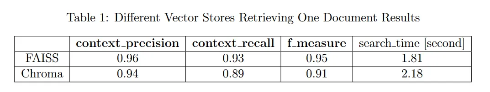

# Converting PDFS to Markdown

We used marker, which is the best in class converter that converts PDFs to text. Marker on a directory does not work as intended so we ended up running marker-single on each PDF and a for loop to go through all the PDFs. Markdown files can be found in /extracted_text directory

# Create VectorStore using Markdown

We tried multiple versions for thie the work can be found in /vectorizing_text folder.

## For embedding models:
We opened the MTEB leaderboard (embedding model leaderboard). Because most of the best models were >= 1B parameters we decided to not use them as they were unreasonably slow for the huge number of files we had (790) and used up RAM/VRAM that the client need not have in their instance. 
Then we moved to smaller models like Snowflake/snowflake-arctic-embed-l, BAAI/bge-m3 and nomic-ai/nomic-embed-text-v1. All these models had a max context size window of 8192. Both the snowflak and bge-m3 were 560M parameter models. Even though they were loading and running after we ran for considerably long they would end up showing CUDA memory limit error or just crash. They were also very slow to finidh their embeddings.

Nomic is a smaller embedding model. It was able to finish the vecotrization of all the documents very fast. We did not notice any performance decrease when retrieving the data later. All three have very close Retrieval Score in MTEB leaderboard.

So we decided to go with Nomic for embedding our markdown folder.

## For vectorstore:
The main optioned were FAISS or Chroma  were the competing Open Source vector dbs.

FAISS uses a bit more compute but has overall better results as you can see in the image below
 

## Models

Given the current state, the cheapest models that can be run on our laptops locally are from Ollama. Gemma3 is a new alternative we are considering but it released just this week so we are waiting for the Langchain/Ollama functions for it to be completely and properly implemented.

Currently we are using ollama for the llama3.1 7B model. So as a prerequisite ollama has to be installed in your computer.

## RAG Testing:

### TC1
    grade = "11"
    subjects = ["bio", "chem", "phy", "math"]
    query = "What is differentiation"

    for chunk in generate(template, grade, subjects, query):
        print(chunk, end="", flush=True)

### TC2
    grade = "11"
    subjects = ["chem", "phy", "math", "comp"]
    query = "What is differentiation"

    for chunk in generate(template, grade, subjects, query):
        print(chunk, end="", flush=True)

### TC3
    grade = "10"
    subjects = ["english", "english2", "history", "math"]
    query = "What did Lencho ask God"

    for chunk in generate(template, grade, subjects, query):
        print(chunk, end="", flush=True)

### Result
Test case 1  
Differentiation is the process by which cells derived from root apical and shoot-apical meristems and cambium mature and perform specific functions, involving structural changes both in their cell walls and protoplasm.

Test case 2  
Differentiation is a fundamental concept in calculus that deals with the study of rates of change and slopes of curves. It is a mathematical operation that finds the derivative of a function, which represents the rate at which the function changes as its input changes.

In other words, differentiation measures how fast a function changes when its input changes. It is used to find the slope of a curve at a given point, which can be thought of as the rate at which the function increases or decreases at that point.

There are several types of differentiation, including:

1. **First derivative**: This represents the rate of change of a function with respect to its input.
2. **Second derivative**: This represents the rate of change of the first derivative with respect to the input.
3. **Higher-order derivatives**: These represent the rate of change of higher-order derivatives with respect to the input.

Differentiation has numerous applications in various fields, including:

1. **Physics and engineering**: Differentiation is used to describe the motion of objects, forces, and energies.
2. **Economics**: Differentiation is used to model economic systems, understand consumer behavior, and analyze market trends.
3. **Biology**: Differentiation is used to study population growth, disease spread, and genetic variation.
4. **Computer science**: Differentiation is used in machine learning, optimization algorithms, and data analysis.

Some common differentiation rules include:

1. **Power rule**: If f(x) = x^n, then f'(x) = nx^(n-1)
2. **Product rule**: If f(x) = u(x)v(x), then f'(x) = u'(x)v(x) + u(x)v'(x)
3. **Quotient rule**: If f(x) = u(x)/v(x), then f'(x) = (u'(x)v(x) - u(x)v'(x)) / v(x)^2
4. **Chain rule**: If f(x) = g(h(x)), then f'(x) = g'(h(x)) \* h'(x)

These rules are used to differentiate various types of functions, including polynomial, rational, trigonometric, and exponential functions.

In summary, differentiation is a fundamental concept in calculus that measures the rate of change of a function with respect to its input. It has numerous applications in various fields and is used to describe rates of change, slopes of curves, and optimization problems.

Test case 3  
Lencho asked God for a hundred pesos.